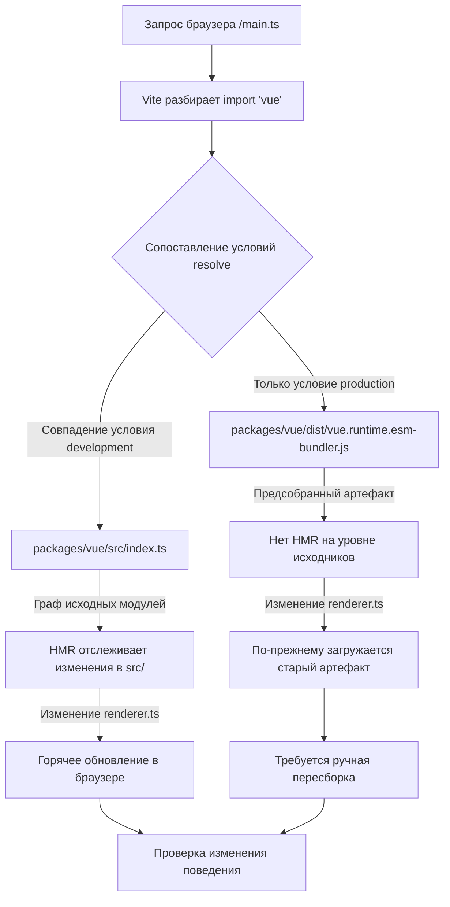

# Глава 12: Минимальная песочница отладки: vite-debug и локальный цикл разработки

В предыдущей главе мы завершили цикл измерения бюджета размера: size-report.js отвечает на вопрос «насколько больше», usage-size.js отвечает на вопрос «где больше», а уровень рабочего процесса отвечает за пороговый контроль. Но у этого механизма есть неявная предпосылка — сами артефакты сборки воспроизводимы. Когда вы обнаруживаете, что размер какого-то пакета аномально разросся, или какое-то поведение во время выполнения не соответствует ожиданиям, вам нужна минимальная среда, способная быстро загрузить локальный исходный код и сразу увидеть эффект после изменения. packages-private/vite-debug — это и есть такая среда. В ней всего четыре файла и менее 40 строк кода, но она образует вход в повседневную практику «минимального воспроизведения на реальном исходном коде» в репозитории Vue core. В этой главе мы разберём логику построения этой песочницы по файлам и объясним, почему она размещена в packages-private, а не в каталоге packages.

# I. Каркас песочницы:`main.ts`и`App.vue`минимальная цепочка монтирования

## Интуитивная модель

Если представить весь runtime Vue как двигатель, то`vite-debug`— это «испытательный стенд на голом железе» — без корпуса, без приборной панели, только минимальные соединения, чтобы двигатель заработал. Его ценность не в полноте функций, а в**исключении всех мешающих переменных**: когда вы подозреваете, что какой-то баг находится в системе реактивности или внутри рендерера, вы не хотите, чтобы сложность самой среды отладки стала источником шума.

## Структуры данных и макет файлов

Сначала посмотрим на`main.ts`всё содержимое:

[FACT:packages-private/vite-debug/main.ts:4-4]

```ts
import { createApp } from 'vue'
import App from './App.vue'

const app = createApp(App)

app.mount('#app')
```

Эти шесть строк кода — стандартная парадигма запуска приложения Vue, но каждая строка в сценарии отладки имеет точное инженерное значение:

- **L1**В`import { createApp } from 'vue'`из`'vue'`, к какому модулю в конечном итоге разрешится этот идентификатор модуля, полностью определяется объявлениями зависимостей`vite.config.ts`и`package.json`. Это самое ключевое звено всей песочницы — позже мы увидим, как он указывается на локальный исходный код.
- **L2**В`import App from './App.vue'`из`@vitejs/plugin-vue`запускает конвейер компиляции SFC в`App.vue`: Vite регистрирует этот плагин при запуске dev server, и когда браузер запрашивает`<script>`、`<template>`、`<style>`, плагин разбирает его на
- **L4**три виртуальных модуля и компилирует их по отдельности.`createApp(App)`В`app._context`、`app._instance`из
- **L6**создаёт экземпляр приложения; в этот момент Vue внутренне инициализирует`app.mount('#app')`и другие ключевые поля, но ещё не запускает никакой рендеринг.`app`В

из`index.html`— это настоящий переключатель запуска: он находит в DOM элемент-контейнер с id`index.html`, создаёт экземпляр корневого компонента и запускает первый рендеринг.`<div id="app"></div>`Обратите внимание, что здесь нет ссылки на`<script type="module" src="/main.ts"></script>`— соглашение Vite состоит в том, что`app.mount('#app')`в корневом каталоге проекта служит входным HTML, который содержит

## и

. Хотя этого файла нет в keyFiles этой главы, он является предпосылкой успешной работы`App.vue`.

[FACT:packages-private/vite-debug/App.vue:4-8]

```vue

import { ref } from 'vue'

const count = ref(0)

  {{ count }}

button {
  color: red;
}

```

Теперь посмотрим на**, это «носитель эксперимента» данной песочницы:**

**Копировать**

`@vitejs/plugin-vue`Подставим конкретный сценарий:`App.vue`Что происходит, когда пользователь нажимает кнопку в браузере?

- `<script setup>`Шаг первый: этап компиляции SFC (при запуске dev server)`setup()`компилирует`ref(0)`на три части:`RefImpl`Блок`.value`компилируется в`0`。
- `<template>`функцию компонента,`{{ count }}`вызов возвращает`_toDisplayString(count.value)`，`@click="count++"`объект, чей`onClick: $event => (count.value++)`。
- `<style>`изначально равен`<style>`Блок

**компилируется в функцию рендеринга,`app.mount`преобразуется в**

`createApp(App)`преобразуется в`mount('#app')`, создаётся корневой компонент`ComponentInternalInstance`, выполняется`setup()`, получается`count`RefImpl, затем вызывается функция рендеринга для генерации дерева VNode. В функции рендеринга чтение`count.value`вызывает`track`сбор зависимостей — текущий активный эффект рендеринга (`ReactiveEffect`) записывается в`count`в`dep`.

**Шаг третий: событие клика (при взаимодействии пользователя)**

Браузер вызывает событие`click`, обработчик событий Vue выполняет`count.value++`. Это операция setter, которая вызывает`trigger`: обход эффектов, собранных в`count.dep`, и планирование повторного рендеринга. Поскольку обновление синхронное и не находится в очереди пакетной обработки, эффект рендеринга выполняется немедленно, функция рендеринга вызывается повторно, генерируется новый VNode, выполняется diff со старым VNode, обнаруживается изменение текстового содержимого с`0`на`1`, обновляется реальный DOM`textContent`。

Весь этот процесс можно представить следующей диаграммой потока данных:

```mermaid
flowchart LR
    subgraph compile["编译期 (Vite Dev Server)"]
        sfc["App.vue"] -->|"@vitejs/plugin-vue"| script["setup() 函数"]
        sfc -->|"@vitejs/plugin-vue"| render["渲染函数"]
        sfc -->|"@vitejs/plugin-vue"| style["CSS 模块"]
    end
    subgraph runtime["运行时 (浏览器)"]
        script -->|"ref(0)"| refimpl["RefImpl { value: 0 }"]
        render -->|"读取 count.value"| track["track() 收集依赖"]
        click["用户点击"] -->|"count.value++"| trigger["trigger() 触发更新"]
        trigger -->|"调度渲染副作用"| rerender["重新执行渲染函数"]
        rerender -->|"diff + patch"| dom["更新真实 DOM"]
    end
    track -.->|"dep 记录 ReactiveEffect"| trigger
```

Ключевой момент этой диаграммы:**Между артефактами этапа компиляции и поведением во время выполнения существует только две точки связи**——`ref(0)`возвращаемый объект RefImpl, а также чтение и запись`count.value`в функции рендеринга. Это означает, что если вы хотите отладить какую-либо ветвь системы реактивности (например,`trigger`логику планирования в`App.vue`), вам достаточно в этом

## сконструировать соответствующий шаблон чтения-записи.`ref`Размышления о дизайне: почему`reactive`？

> **[Design Inference & Architectural Trade-offs]**
> 〔Предположения о дизайне и архитектурные компромиссы〕`ref(0)`Выбор`reactive({ count: 0 })`вместо`ref`в качестве примера по умолчанию подразумевает приоритет отладки:`.value`путь доступа к`RefImpl`короче, при раскрытии`_value`、`dep`、`__v_isRef`объекта в отладчике можно напрямую увидеть`reactive`и другие внутренние поля, тогда как раскрытие Proxy-объекта, возвращаемого

---

# , в консоли вызовет getter, что может помешать наблюдению за исходным состоянием. Для сценария «минимального воспроизведения» уменьшение одного уровня косвенности Proxy означает меньше переменных.`vite.config.ts`Два: разрешение псевдонимов:`package.json`и`'vue'`как направить

## на локальный исходный код

`vite.config.ts`Интуитивная модель`import { createApp } from 'vue'`содержит всего шесть строк, но это «маршрутизационный центр» всей песочницы — он определяет,`'vue'`в`App.vue`в конечном итоге загружает опубликованную версию из npm или исходный код, находящийся в разработке в репозитории. Без правильной конфигурации псевдонимов код, который вы изменяете в

## , может вообще не затронуть ту версию исходного кода Vue, которую вы отлаживаете, и отладка превращается в «стрельбу по неправильной мишени».

Структура данных и цепочка разрешения`vite.config.ts`：

[FACT:packages-private/vite-debug/vite.config.ts:4-6]

```ts
import { defineConfig } from 'vite'
import vue from '@vitejs/plugin-vue'

export default defineConfig({
  plugins: [vue()],
})
```

Копировать**Здесь`resolve.alias`нет явной конфигурации**. Тогда как`'vue'`разрешается в локальный исходный код? Ответ находится в`package.json`:

[FACT:packages-private/vite-debug/package.json:1-15]

```json
{
  "name": "vite-debug",
  "private": true,
  "type": "module",
  "scripts": {
    "dev": "vite",
    "build": "vite build",
    "serve": "vite preview"
  },
  "devDependencies": {
    "@vitejs/plugin-vue": "catalog:",
    "vite": "catalog:",
    "vue": "workspace:*"
  }
}
```

Ключ в**L13**：`"vue": "workspace:*"`. Это объявление протокола pnpm workspace, означающее, что`vite-debug`зависит от локального пакета с именем`vue`в monorepo, а не от версии в npm registry. pnpm создаст символическую ссылку в`node_modules/vue`, указывающую на`packages/vue`(главный каталог пакета Vue).

Но этого недостаточно —`packages/vue`в`package.json`поле`main`/`module`/`exports`обычно указывает на**артефакты сборки**(например,`dist/vue.runtime.esm-bundler.js`), а не на исходный код в`src/`. Если вы изменили`packages/runtime-core/src/renderer.ts`, но не пересобрали проект, Vite всё равно загрузит старый файл`dist`.

> **[Design Inference & Architectural Trade-offs]**
> Именно поэтому в`packages/vue/package.json`репозитория Vue core обычно настраивается`"development"`условный экспорт или аналогичное сопоставление входных точек исходного кода — в режиме dev`resolve.conditions`Vite в первую очередь сопоставляет условие`development`, тем самым загружая`src/index.ts`вместо`dist`. Этот механизм позволяет`vite-debug`без явной настройки alias сразу видеть эффект через HMR после изменения исходного кода.

## Сценарный Walkthrough: один процесс разрешения`import 'vue'`

Погружение в сценарий:**Когда Vite dev server получает запрос браузера к`main.ts`и встречает`import { createApp } from 'vue'`, какова цепочка разрешения?**



Эта блок-схема выявляет ключевое ветвление:**Если условие`development`настроено неправильно, после изменения исходного кода браузер не выполнит горячее обновление**, и вы попадёте в замешательство «код изменён, но поведение не изменилось». Метод диагностики — посмотреть фактический путь загрузки модуля`vue`на панели Network в браузерных DevTools — если вы видите путь`dist/`, значит сопоставление входных точек исходного кода не сработало.

## Размышления о дизайне: почему бы не написать alias явно в`vite.config.ts`?

> **[Design Inference & Architectural Trade-offs]**
> Естественный вопрос: почему бы просто не написать`vite.config.ts`в`resolve: { alias: { vue: '../../packages/vue/src/index.ts' } }`? Хотя это интуитивно понятно, есть две проблемы:

1. **Нарушение импорта подпутей**: публичный API Vue включает`vue/server-renderer`、`vue/compiler-sfc`и другие подпути. Если создать alias только для`'vue'`самого по себе, импорт подпутей всё равно пойдёт через`dist`, что приведёт к тому, что часть модулей будет из исходного кода, а часть — из артефактов сборки, и поведение станет несогласованным.

2. **Обход механизма условного экспорта**: в`package.json`Vue поле`exports`уже определяет полное сопоставление условного экспорта (`development`/`production`/`browser`/`node`и т.д.), alias перекроет этот механизм, что приведёт к расхождению в поведении разрешения между средой отладки и реальной средой пользователя.

Поэтому`vite-debug`выбирает комбинацию «доверие к протоколу workspace + условный экспорт», чтобы цепочка разрешения была как можно ближе к реальному сценарию использования. Это также объясняет, почему`package.json`в`"vue": "workspace:*"`обязательно — это предпосылка для срабатывания символической ссылки pnpm и, следовательно, для того, чтобы Vite мог через`node_modules/vue`найти`packages/vue`.

## Производственные подводные камни:`catalog:`протокол и дрейф версий

Обратите внимание, что`package.json`в**L11-L12**использует протокол`"catalog:"`:

```json
"@vitejs/plugin-vue": "catalog:",
"vite": "catalog:",
```

Это функция catalog в pnpm, означающая, что номер версии централизованно управляется полем`pnpm-workspace.yaml`в`catalog`. Её назначение —**избежать дрейфа версий, когда несколько пакетов в monorepo ссылаются на одну и ту же зависимость**。

> **[Design Inference & Architectural Trade-offs]**
> В сценарии отладки это создаёт скрытую ловушку: если вы в`vite-debug`Если вы столкнулись с предполагаемым багом Vite или plugin-vue и хотите временно обновить версию для проверки, прямое изменение`package.json`в`catalog:`неэффективно — вам нужно изменить`pnpm-workspace.yaml`определение catalog в, что повлияет на все пакеты, использующие этот catalog. Правильный подход — временно указать явный номер версии (например,`"vite": "5.0.0"`), а после завершения проверки вернуть обратно`catalog:`。

---

# Три,`packages-private`Изолированный дизайн: почему отладочная песочница не публикуется наружу

## Интуитивная модель

`packages-private`Каталог подобен «внутренней лаборатории» компании — образцы внутри не продаются наружу, а используются только для тестирования и демонстрации. Он физически изолирован от`packages`каталога, чтобы отладочный код случайно не был опубликован в npm.

## Три уровня защиты механизма изоляции

**Первый уровень: изоляция каталогов**

`packages-private/vite-debug`Не в`packages/`ниже, а`pnpm-workspace.yaml`обычно объявляют`packages/*`и`packages-private/*`как члены workspace, но скрипт публикации (например,`scripts/release.js`) перебирает только пакеты в`packages/`.

**Второй уровень:`private: true`**

[FACT:packages-private/vite-debug/package.json:3]

```json
"private": true,
```

Эта строка является жёстким ограничением npm/pnpm: пакеты, помеченные как`private`пакета**никогда не могут быть опубликованы через`npm publish`Опубликовать**, даже при ручном выполнении будет отказ. Это последняя линия защиты от случайной публикации.

**Третий уровень: отсутствие`version`поля**

Внимание`package.json`отсутствует`version`поле. Спецификация npm требует, чтобы публикуемый пакет обязательно имел`version`, и пакеты без этого поля при`npm publish`выдают ошибку. Это «двойная страховка» — даже если`private`был случайно удалён, отсутствие`version`всё равно заблокирует публикацию.

## Проектное размышление: разделение обязанностей между отладочной песочницей и Playground

В репозитории Vue core уже есть полнофункциональный`SFC Playground`(обсуждался в главе 7), зачем ещё нужен`vite-debug`？

> **[Design Inference & Architectural Trade-offs]**
> Их назначение совершенно различно:

| Измерение | SFC Playground | vite-debug |
| --- | --- | --- |
| Среда выполнения | В браузере (компиляция также в браузере) | Node.js + браузер |
| Загрузка исходного кода | Через CDN или предварительно собранные артефакты | Прямая загрузка локального исходного кода |
| Возможности отладки | Ограничены песочницей браузера | Доступны отладчик Node.js, точки останова |
| Изменение исходного кода | Не поддерживается | Поддерживается HMR |
| Сценарии применения | Проверка результатов компиляции, воспроизведение при совместном использовании | Отладка внутреннего поведения во время выполнения |

`vite-debug`Основная ценность заключается в**Он работает в реальной среде Node.js**, вы можете использовать`node --inspect`подключить отладчик и установить точку останова в`packages/reactivity/src/effect.ts`, чтобы наблюдать`ReactiveEffect`за процессом создания и планирования. Это то, что Playground не может предоставить.

## Производственные подводные камни: границы HMR и потеря состояния

> **[Design Inference & Architectural Trade-offs]**
> При использовании`vite-debug`для отладки частое недоумение вызывает следующее: после изменения`App.vue`начального значения`count`счётчик в браузере не сбрасывается. Это происходит потому, что HMR в Vite обрабатывает блок`<script setup>`следующим образом:**сохраняет состояние компонента и заменяет только функцию рендеринга**. Если вам нужно полностью сбросить состояние, необходимо вручную обновить страницу или добавить в`App.vue`добавить в`import.meta.hot?.invalidate()`принудительное обновление всей страницы.

Ещё одна ловушка: когда вы изменяете`packages/runtime-core/src/`исходный код в директории, цепочка распространения HMR может не сработать автоматически — потому что`vite-debug`граница HMR определена на уровне`App.vue`, а`packages/`изменения исходного кода в директории должны распространяться через граф модулей Vite. Если после изменения исходного кода браузер не реагирует, проверьте, есть ли в выводе терминала Vite`hmr update`логи; если их нет, возможно, потребуется перезапустить dev server.

---

# Краткое содержание главы

`packages-private/vite-debug`С помощью четырёх файлов и менее 40 строк кода построен полноценный цикл отладки:

1. **`main.ts`**обеспечивает минимальную цепочку монтирования:`createApp(App).mount('#app')`, исключая всю необязательную логику инициализации.

2. **`App.vue`**В качестве экспериментального носителя:`ref`+ интерполяция шаблонов + обработка событий, охватывающие основной путь системы реактивности.

3. **`vite.config.ts` + `package.json`**Через`workspace:*`протокол и условный экспорт,`'vue'`разрешается на локальный исходный код, реализуя принцип «изменил исходник — сразу вступило в силу».

4. **`packages-private` + `private: true`+ нет`version`**Трёхуровневая изоляция гарантирует, что отладочный код не будет случайно опубликован.

Инженерная философия этой песочницы такова:**сложность самой среды отладки должна стремиться к нулю, а вся сложность должна оставаться в отлаживаемом исходном коде**. Когда вы в`packages/reactivity`сталкиваетесь с трудно воспроизводимым багом,`vite-debug`предоставляет экспериментальную площадку, которую можно свободно изменять и немедленно проверять.

# Вопросы для размышления и самопроверки в этой главе

Q1: Если в`package.json`изменить`"vue": "workspace:*"`на`"vue": "^3.4.0"`, то после изменения`vite-debug`в`packages/reactivity/src/ref.ts`что изменится в поведении в браузере? Почему?

**Справочный разбор**: изменено на`"^3.4.0"`после этого pnpm загрузит из npm registry опубликованную версию Vue 3.4.x, а не будет ссылаться на локальную`packages/vue` [FACT:packages-private/vite-debug/package.json:13]. В это время`import { createApp } from 'vue'`разрешается в`node_modules/.pnpm/vue@3.4.x/node_modules/vue/dist/vue.runtime.esm-bundler.js`, то есть в предварительно собранный артефакт. Изменение`packages/reactivity/src/ref.ts`не вызовет никакого HMR, поскольку граф модулей Vite вообще не содержит этот файл. В браузере по-прежнему выполняется реализация`ref`из npm-версии. Этот эксперимент обратно подтверждает, что`workspace:*`является необходимым условием для отладки на уровне исходного кода.

Q2: `App.vue`в`<style>`блок не добавлен`scoped`, если в этой песочнице одновременно смонтировать два экземпляра компонента, что произойдёт со стилями? Как это связано с целью отладки`vite-debug`?

**Справочный разбор**: без`scoped`,`button { color: red }`Это глобальный стиль[FACT:packages-private/vite-debug/App.vue:4-8], который воздействует на все`<button>`элементы на странице. Если смонтировать два экземпляра компонента, кнопки в обоих экземплярах станут красными. Связь с целью отладки заключается в следующем:`vite-debug`позиционируется как «минимальное воспроизведение», а не «проверка изоляции стилей». Пропуск`scoped`уменьшает количество переменных`data-v-xxx`, внедряемых на этапе компиляции, что делает структуру DOM в отладчике более чистой. Если вам нужно отладить логику компиляции стилей`scoped`, следует явно добавить`scoped`и наблюдать за сгенерированным кодом внедрения атрибутов`@vitejs/plugin-vue`.

Вопрос 3: Предположим, вы добавили строку`packages/runtime-core/src/renderer.ts`в функцию`patch`, но в консоли браузера нет вывода. Перечислите как минимум три возможные причины и объясните, как проверить каждую из них.`console.log`Справочный разбор

**Причина первая:**：

Причина первая:**Точка входа исходного кода не сработала**。`'vue'`Разобрано в`dist`артефакт, а не`src`. Диагностика: в панели DevTools Network проверьте`vue`путь загрузки модуля, если он начинается с`dist/`, это означает, что условный экспорт не сработал`development`условие[FACT:packages-private/vite-debug/package.json:13]。

Причина вторая:**HMR не распространяется**. Граф модулей Vite не передал изменения`packages/runtime-core/src/renderer.ts`в`vite-debug`. Диагностика: проверьте, есть ли в терминале Vite`hmr update`логи; если нет, перезапустите dev server.

Причина третья:**`patch`функция не вызывается**. Если текущая страница не вызывает никаких обновлений DOM (например, нет нажатия кнопки),`patch`может выполняться только один раз при первом монтировании, а первое монтирование произошло до того, как вы добавили`console.log`. Диагностика: обновите страницу или добавьте в`App.vue`действие, вызывающее обновление.

Причина четвёртая (дополнительно):**кэш сборки**. Кэш предварительной сборки зависимостей Vite (`node_modules/.vite`) может всё ещё использовать старую версию. Диагностика: удалите`node_modules/.vite`и перезапустите.

---

Бюджет размера говорит вам «проблема существует»,`vite-debug`позволяет вам «воспроизвести проблему своими руками». Но когда вы пытаетесь распространить этот режим песочницы на весь monorepo, вы сталкиваетесь с рядом граничных условий: различия в разрешении протокола workspace в среде CI,`catalog:`трудности обновления при фиксации версий,`packages-private`и`packages`ограничения направления зависимостей между... Следующая глава перейдёт к архитектурным компромиссам и руководству по избеганию ошибок, системно разбирая граничные условия, которые инженерия monorepo проявляет в реальных проектах.

На этом мы завершили инженерный цикл от измерения размера до минимального воспроизведения: vite-debug с помощью минималистичных четырёх файлов превратил «быструю проверку на реальном исходном коде» в повседневно применимую практику. Но когда вы действительно начнёте воспроизводить эту систему, вы обнаружите больше скрытых компромиссов — почему packages-private должен быть физически изолирован от packages? Почему встраивание перечислений должно быть завершено до Rollup? Следующая глава обобщит ключевые точки принятия решений и записи о производственных ошибках, выявленные в предыдущих двенадцати главах, предоставив вам полный список по избеганию ошибок и основания для решений.
