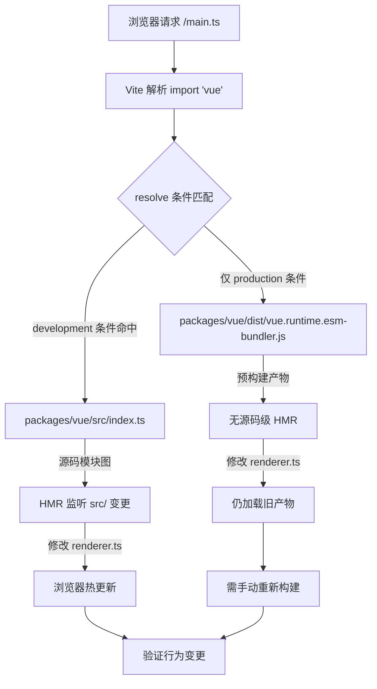

# Глава 12: Минимальная песочница отладки: vite-debug и локальный цикл разработки

В предыдущей главе мы завершили цикл измерения бюджета размера: size-report.js отвечает на вопрос «насколько больше», usage-size.js отвечает на вопрос «где больше», а уровень рабочего процесса отвечает за пороговый контроль. Но у этого механизма есть неявная предпосылка — сами артефакты сборки воспроизводимы. Когда вы обнаруживаете, что размер какого-то пакета аномально разросся, или какое-то поведение во время выполнения не соответствует ожиданиям, вам нужна минимальная среда, способная быстро загрузить локальный исходный код и сразу увидеть эффект после изменения. packages-private/vite-debug — это и есть такая среда. В ней всего четыре файла и менее 40 строк кода, но она образует вход в повседневную практику «минимального воспроизведения на реальном исходном коде» в репозитории Vue core. В этой главе мы разберём логику построения этой песочницы по файлам и объясним, почему она размещена в packages-private, а не в каталоге packages.

# I. Каркас песочницы:`main.ts`и`App.vue`минимальная цепочка монтирования

## Интуитивная модель

Если представить весь runtime Vue как двигатель, то`vite-debug`— это «испытательный стенд на голом железе» — без корпуса, без приборной панели, только минимальные соединения, чтобы двигатель заработал. Его ценность не в полноте функций, а в**исключении всех мешающих переменных**: когда вы подозреваете, что какой-то баг находится в системе реактивности или внутри рендерера, вы не хотите, чтобы сложность самой среды отладки стала источником шума.

## Структуры данных и布局 файлов

Сначала посмотрим на`main.ts`всё содержимое:

[FACT:packages-private/vite-debug/main.ts:4-4]

```ts
import { createApp } from 'vue'
import App from './App.vue'

const app = createApp(App)

app.mount('#app')
```

Эти шесть строк кода — стандартная парадигма запуска приложения Vue, но каждая строка в сценарии отладки имеет точное инженерное значение:

- **L1**В`import { createApp } from 'vue'`из`'vue'`, к какому модулю в конечном итоге разрешится этот идентификатор модуля, полностью определяется объявлениями зависимостей`vite.config.ts`и`package.json`. Это самое ключевое звено всей песочницы — позже мы увидим, как он указывается на локальный исходный код.
- **L2**В`import App from './App.vue'`из`@vitejs/plugin-vue`запускает конвейер компиляции SFC в`App.vue`: Vite регистрирует этот плагин при запуске dev server, и когда браузер запрашивает`<script>`、`<template>`、`<style>`, плагин разбирает его на
- **L4**три виртуальных модуля и компилирует их по отдельности.`createApp(App)`В`app._context`、`app._instance`из
- **L6**создаёт экземпляр приложения; в этот момент Vue внутренне инициализирует`app.mount('#app')`и другие ключевые поля, но ещё не запускает никакой рендеринг.`app`В

из`index.html`— это настоящий переключатель запуска: он находит в DOM элемент-контейнер с id`index.html`, создаёт экземпляр корневого компонента и запускает первый рендеринг.`<div id="app"></div>`Обратите внимание, что здесь нет ссылки на`<script type="module" src="/main.ts"></script>`— соглашение Vite состоит в том, что`app.mount('#app')`в корневом каталоге проекта служит входным HTML, который содержит

## и

. Хотя этого файла нет в keyFiles этой главы, он является предпосылкой успешной работы`App.vue`.

[FACT:packages-private/vite-debug/App.vue:4-8]

```vue

import { ref } from 'vue'

const count = ref(0)

  {{ count }}

button {
  color: red;
}

```

Теперь посмотрим на**, это «носитель эксперимента» данной песочницы:**

**Копировать**

`@vitejs/plugin-vue`Подставим конкретный сценарий:`App.vue`Что происходит, когда пользователь нажимает кнопку в браузере?

- `<script setup>`Шаг первый: этап компиляции SFC (при запуске dev server)`setup()`компилирует`ref(0)`на три части:`RefImpl`Блок`.value`компилируется в`0`。
- `<template>`функцию компонента,`{{ count }}`вызов возвращает`_toDisplayString(count.value)`，`@click="count++"`объект, чей`onClick: $event => (count.value++)`。
- `<style>`изначально равен`<style>`Блок

**компилируется в функцию рендеринга,`app.mount`преобразуется в**

`createApp(App)`преобразуется в`mount('#app')`, создаётся корневой компонент`ComponentInternalInstance`, выполняется`setup()`, получается`count`RefImpl, затем вызывается функция рендеринга для генерации дерева VNode. В функции рендеринга чтение`count.value`вызывает`track`сбор зависимостей — текущий активный эффект рендеринга (`ReactiveEffect`) записывается в`count`в`dep`.

**Шаг третий: событие клика (при взаимодействии пользователя)**

Браузер вызывает событие`click`, обработчик событий Vue выполняет`count.value++`. Это операция setter, которая вызывает`trigger`: обход эффектов, собранных в`count.dep`, и планирование повторного рендеринга. Поскольку обновление синхронное и не находится в очереди пакетной обработки, эффект рендеринга выполняется немедленно, функция рендеринга вызывается повторно, генерируется новый VNode, выполняется diff со старым VNode, обнаруживается изменение текстового содержимого с`0`на`1`, обновляется реальный DOM`textContent`。

Весь этот процесс можно представить следующей диаграммой потока данных:

```mermaid
flowchart LR
    subgraph compile["编译期 (Vite Dev Server)"]
        sfc["App.vue"] -->|"@vitejs/plugin-vue"| script["setup() 函数"]
        sfc -->|"@vitejs/plugin-vue"| render["渲染函数"]
        sfc -->|"@vitejs/plugin-vue"| style["CSS 模块"]
    end
    subgraph runtime["运行时 (浏览器)"]
        script -->|"ref(0)"| refimpl["RefImpl { value: 0 }"]
        render -->|"读取 count.value"| track["track() 收集依赖"]
        click["用户点击"] -->|"count.value++"| trigger["trigger() 触发更新"]
        trigger -->|"调度渲染副作用"| rerender["重新执行渲染函数"]
        rerender -->|"diff + patch"| dom["更新真实 DOM"]
    end
    track -.->|"dep 记录 ReactiveEffect"| trigger
```

Ключевой момент этой диаграммы:**Между产物 этапа компиляции и поведением во время выполнения существует только две точки связи**——`ref(0)`возвращаемый объект RefImpl, а также чтение и запись`count.value`в функции рендеринга. Это означает, что если вы хотите отладить какую-либо ветвь системы реактивности (например,`trigger`логику планирования в`App.vue`), вам достаточно в этом

## сконструировать соответствующий шаблон чтения-записи.`ref`Размышления о дизайне: почему`reactive`？

> **[Design Inference & Architectural Trade-offs]**
> 〔Предположения о дизайне и архитектурные компромиссы〕`ref(0)`Выбор`reactive({ count: 0 })`вместо`ref`в качестве примера по умолчанию подразумевает приоритет отладки:`.value`путь доступа к`RefImpl`короче, при раскрытии`_value`、`dep`、`__v_isRef`объекта в отладчике можно напрямую увидеть`reactive`и другие внутренние поля, тогда как раскрытие Proxy-объекта, возвращаемого

---

# , в консоли вызовет getter, что может помешать наблюдению за исходным состоянием. Для сценария «минимального воспроизведения» уменьшение одного уровня косвенности Proxy означает меньше переменных.`vite.config.ts`Два: разрешение псевдонимов:`package.json`и`'vue'`как направить

## на локальный исходный код

`vite.config.ts`Интуитивная модель`import { createApp } from 'vue'`содержит всего шесть строк, но это «маршрутизационный центр» всей песочницы — он определяет,`'vue'`в`App.vue`в конечном итоге загружает опубликованную версию из npm или исходный код, находящийся в разработке в репозитории. Без правильной конфигурации псевдонимов код, который вы изменяете в

## , может вообще не затронуть ту версию исходного кода Vue, которую вы отлаживаете, и отладка превращается в «стрельбу по неправильной мишени».

Структура данных и цепочка разрешения`vite.config.ts`：

[FACT:packages-private/vite-debug/vite.config.ts:4-6]

```ts
import { defineConfig } from 'vite'
import vue from '@vitejs/plugin-vue'

export default defineConfig({
  plugins: [vue()],
})
```

Копировать**Здесь`resolve.alias`нет явной конфигурации**. Тогда как`'vue'`разрешается в локальный исходный код? Ответ находится в`package.json`:

[FACT:packages-private/vite-debug/package.json:1-15]

```json
{
  "name": "vite-debug",
  "private": true,
  "type": "module",
  "scripts": {
    "dev": "vite",
    "build": "vite build",
    "serve": "vite preview"
  },
  "devDependencies": {
    "@vitejs/plugin-vue": "catalog:",
    "vite": "catalog:",
    "vue": "workspace:*"
  }
}
```

Ключ в**L13**：`"vue": "workspace:*"`. Это объявление протокола pnpm workspace, означающее, что`vite-debug`зависит от локального пакета с именем`vue`в monorepo, а не от версии в npm registry. pnpm создаст символическую ссылку в`node_modules/vue`, указывающую на`packages/vue`(главный каталог пакета Vue).

Но этого недостаточно —`packages/vue`в`package.json`поле`main`/`module`/`exports`обычно указывает на**артефакты сборки**(например,`dist/vue.runtime.esm-bundler.js`), а не на исходный код в`src/`. Если вы изменили`packages/runtime-core/src/renderer.ts`, но не пересобрали проект, Vite всё равно загрузит старый файл`dist`.

> **[Design Inference & Architectural Trade-offs]**
> Именно поэтому в`packages/vue/package.json`репозитория Vue core обычно настраивается`"development"`условный экспорт или аналогичное сопоставление входных точек исходного кода — в режиме dev`resolve.conditions`Vite в первую очередь сопоставляет условие`development`, тем самым загружая`src/index.ts`вместо`dist`. Этот механизм позволяет`vite-debug`без явной настройки alias сразу видеть эффект через HMR после изменения исходного кода.

## Сценарный Walkthrough: один процесс разрешения`import 'vue'`

Погружение в сценарий:**Когда Vite dev server получает запрос браузера к`main.ts`и встречает`import { createApp } from 'vue'`, какова цепочка разрешения?**



Эта блок-схема выявляет ключевое ветвление:**Если условие`development`настроено неправильно, после изменения исходного кода браузер не выполнит горячее обновление**, и вы попадёте в замешательство «код изменён, но поведение не изменилось». Метод диагностики — посмотреть фактический путь загрузки модуля`vue`на панели Network в браузерных DevTools — если вы видите путь`dist/`, значит сопоставление входных точек исходного кода не сработало.

## Размышления о дизайне: почему бы не написать alias явно в`vite.config.ts`?

> **[Design Inference & Architectural Trade-offs]**
> Естественный вопрос: почему бы просто не написать`vite.config.ts`в`resolve: { alias: { vue: '../../packages/vue/src/index.ts' } }`? Хотя это интуитивно понятно, есть две проблемы:

1. **Нарушение импорта подпутей**: публичный API Vue включает`vue/server-renderer`、`vue/compiler-sfc`и другие подпути. Если создать alias только для`'vue'`самого по себе, импорт подпутей всё равно пойдёт через`dist`, что приведёт к тому, что часть модулей будет из исходного кода, а часть — из артефактов сборки, и поведение станет несогласованным.

2. **Обход механизма условного экспорта**: в`package.json`Vue поле`exports`уже определяет полное сопоставление условного экспорта (`development`/`production`/`browser`/`node`и т.д.), alias перекроет этот механизм, что приведёт к расхождению в поведении разрешения между средой отладки и реальной средой пользователя.

Поэтому`vite-debug`выбирает комбинацию «доверие к протоколу workspace + условный экспорт», чтобы цепочка разрешения была как можно ближе к реальному сценарию использования. Это также объясняет, почему`package.json`в`"vue": "workspace:*"`обязательно — это предпосылка для срабатывания символической ссылки pnpm и, следовательно, для того, чтобы Vite мог через`node_modules/vue`найти`packages/vue`.

## Производственные подводные камни:`catalog:`протокол и дрейф версий

Обратите внимание, что`package.json`в**L11-L12**использует протокол`"catalog:"`:

```json
"@vitejs/plugin-vue": "catalog:",
"vite": "catalog:",
```

Это функция catalog в pnpm, означающая, что номер версии централизованно управляется полем`pnpm-workspace.yaml`в`catalog`. Её назначение —**избежать дрейфа версий, когда несколько пакетов в monorepo ссылаются на одну и ту же зависимость**。

> **[Design Inference & Architectural Trade-offs]**
> В сценарии отладки это создаёт скрытую ловушку: если вы в`vite-debug`中遇到一个疑似 Vite 或 plugin-vue 的 bug，想临时升级版本验证，直接修改`package.json`中的`catalog:`是无效的——你需要修改`pnpm-workspace.yaml`中的 catalog 定义，这会影响所有使用该 catalog 的包。正确的做法是临时改为显式版本号（如`"vite": "5.0.0"`），验证完毕后再改回`catalog:`。

---

# 三、`packages-private`的隔离设计：为什么调试沙盒不对外发布

## 直觉模型

`packages-private`目录就像公司的「内部试验室」——里面的样品不对外销售，只用于测试和演示。它与`packages`目录物理隔离，避免调试代码被误发布到 npm。

## 隔离机制的三层保障

**第一层：目录隔离**

`packages-private/vite-debug`不在`packages/`下，而`pnpm-workspace.yaml`通常会将`packages/*`和`packages-private/*`都声明为 workspace 成员，但发布脚本（如`scripts/release.js`）只会遍历`packages/`下的包。

**第二层：`private: true`**

[FACT:packages-private/vite-debug/package.json:3]

```json
"private": true,
```

这一行是 npm/pnpm 的硬性约束：标记为`private`的包**永远无法被`npm publish`发布**，即使手动执行也会被拒绝。这是防止误发布的最后一道防线。

**第三层：无`version`字段**

注意`package.json`中没有`version`字段。npm 规范要求可发布的包必须有`version`，缺少该字段的包在`npm publish`时会报错。这是「双重保险」——即使`private`被误删，缺少`version`仍会阻止发布。

## 设计思考：调试沙盒与 Playground 的分工

Vue core 仓库中已经有一个功能完整的`SFC Playground`（第 7 章讨论过），为什么还需要`vite-debug`？

> **[Design Inference & Architectural Trade-offs]**
> 两者的定位截然不同：

| 维度 | SFC Playground | vite-debug |
| --- | --- | --- |
| 运行环境 | 浏览器内（编译也在浏览器） | Node.js + 浏览器 |
| 源码加载 | 通过 CDN 或预构建产物 | 直接加载本地源码 |
| 调试能力 | 受限于浏览器沙盒 | 可用 Node.js 调试器、断点 |
| 修改源码 | 不支持 | 支持 HMR |
| 适用场景 | 验证编译输出、分享复现 | 调试运行时内部行为 |

`vite-debug`的核心价值在于**它运行在真实的 Node.js 环境中**，你可以用`node --inspect`附加调试器，在`packages/reactivity/src/effect.ts`中打断点，观察`ReactiveEffect`的创建和调度过程。这是 Playground 无法提供的。

## 生产踩坑：HMR 边界与状态丢失

> **[Design Inference & Architectural Trade-offs]**
> 使用`vite-debug`调试时，一个常见的困惑是：修改`App.vue`中的`count`初始值后，浏览器中的计数没有重置。这是因为 Vite 的 HMR 对`<script setup>`块的处理是**保留组件状态、只替换渲染函数**。如果你需要完全重置状态，需要手动刷新页面，或者在`App.vue`中添加`import.meta.hot?.invalidate()`强制整页刷新。

另一个陷阱是：当你修改`packages/runtime-core/src/`下的源码时，HMR 的传播链路可能不会自动触发——因为`vite-debug`的 HMR 边界定义在`App.vue`层面，而`packages/`下的源码变更需要通过 Vite 的模块图传播。如果发现修改源码后浏览器无反应，检查 Vite 终端输出是否有`hmr update`日志；如果没有，可能需要重启 dev server。

---

# 本章小结

`packages-private/vite-debug`用四个文件、不到 40 行代码，构建了一个完整的调试闭环：

1. **`main.ts`**提供最小挂载链路：`createApp(App).mount('#app')`，排除一切非必要初始化逻辑。

2. **`App.vue`**作为实验载体：`ref`+ 模板插值 + 事件处理，覆盖响应式系统的主路径。

3. **`vite.config.ts` + `package.json`**通过`workspace:*`协议和条件导出，将`'vue'`解析到本地源码，实现「改源码即生效」。

4. **`packages-private` + `private: true`+ 无`version`**三层隔离，确保调试代码不会被误发布。

这个沙盒的工程哲学是：**调试环境本身的复杂度应该趋近于零，把所有的复杂度留给被调试的源码**。当你在`packages/reactivity`中遇到一个难以复现的 bug 时，`vite-debug`提供了一个可以随意修改、立即验证的实验台。

# 本章思考与自测

Q1: 如果将`package.json`中的`"vue": "workspace:*"`改为`"vue": "^3.4.0"`，在`vite-debug`中修改`packages/reactivity/src/ref.ts`后，浏览器中的行为会发生什么变化？为什么？

**参考解析**：改为`"^3.4.0"`后，pnpm 会从 npm registry 下载 Vue 3.4.x 的发布版本，而非链接到本地`packages/vue` [FACT:packages-private/vite-debug/package.json:13]。此时`import { createApp } from 'vue'`解析到的是`node_modules/.pnpm/vue@3.4.x/node_modules/vue/dist/vue.runtime.esm-bundler.js`，即预构建产物。修改`packages/reactivity/src/ref.ts`不会触发任何 HMR，因为 Vite 的模块图中根本不包含这个文件。浏览器中运行的仍然是 npm 版本的`ref`实现。这个实验反向验证了`workspace:*`是源码级调试的必要条件。

Q2: `App.vue`中`<style>`块没有加`scoped`，如果在这个沙盒中同时挂载两个组件实例，样式会发生什么？这与`vite-debug`的调试目标有何关系？

**参考解析**：没有`scoped`时，`button { color: red }`是全局样式[FACT:packages-private/vite-debug/App.vue:4-8]，会作用于页面中所有`<button>`元素。如果挂载两个组件实例，两个实例的按钮都会变红。这与调试目标的关系在于：`vite-debug`的定位是「最小复现」，而非「样式隔离验证」。省略`scoped`减少了编译期注入`data-v-xxx`属性的变量，使得调试器中的 DOM 结构更干净。如果你需要调试`scoped`样式的编译逻辑，应该显式添加`scoped`并观察`@vitejs/plugin-vue`生成的属性注入代码。

Q3: 假设你在`packages/runtime-core/src/renderer.ts`的`patch`函数中加了一行`console.log`，但浏览器控制台没有输出。请列出至少三种可能的原因，并说明如何逐一排查。

**参考解析**：

原因一：**源码入口未生效**。`'vue'`解析到了`dist`产物而非`src`. Диагностика: в панели DevTools Network проверьте`vue`путь загрузки модуля, если он начинается с`dist/`, это означает, что условный экспорт не сработал`development`условие[FACT:packages-private/vite-debug/package.json:13]。

Причина вторая:**HMR не распространяется**. Граф модулей Vite не передал изменения`packages/runtime-core/src/renderer.ts`в`vite-debug`. Диагностика: проверьте, есть ли в терминале Vite`hmr update`логи; если нет, перезапустите dev server.

Причина третья:**`patch`функция не вызывается**. Если текущая страница не вызывает никаких обновлений DOM (например, нет нажатия кнопки),`patch`может выполняться только один раз при первом монтировании, а первое монтирование произошло до того, как вы добавили`console.log`. Диагностика: обновите страницу или добавьте в`App.vue`действие, вызывающее обновление.

Причина четвёртая (дополнительно):**кэш сборки**. Кэш предварительной сборки зависимостей Vite (`node_modules/.vite`) может всё ещё использовать старую версию. Диагностика: удалите`node_modules/.vite`и перезапустите.

---

Бюджет размера говорит вам «проблема существует»,`vite-debug`позволяет вам «воспроизвести проблему своими руками». Но когда вы пытаетесь распространить этот режим песочницы на весь monorepo, вы сталкиваетесь с рядом граничных условий: различия в разрешении протокола workspace в среде CI,`catalog:`трудности обновления при фиксации версий,`packages-private`и`packages`ограничения направления зависимостей между... Следующая глава перейдёт к архитектурным компромиссам и руководству по избеганию ошибок, системно разбирая граничные условия, которые инженерия monorepo проявляет в реальных проектах.

На этом мы завершили инженерный цикл от измерения размера до минимального воспроизведения: vite-debug с помощью минималистичных четырёх файлов превратил «быструю проверку на реальном исходном коде» в повседневно применимую практику. Но когда вы действительно начнёте воспроизводить эту систему, вы обнаружите больше скрытых компромиссов — почему packages-private должен быть физически изолирован от packages? Почему встраивание перечислений должно быть завершено до Rollup? Следующая глава обобщит ключевые точки принятия решений и записи о производственных ошибках, выявленные в предыдущих двенадцати главах, предоставив вам полный список по избеганию ошибок и основания для решений.
