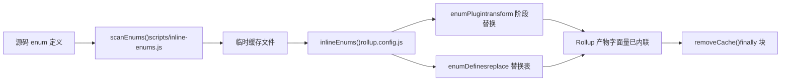
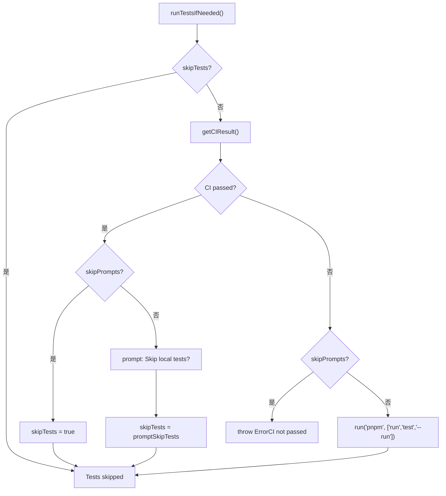

# Глава 13: Архитектурные компромиссы и руководство по избеганию ошибок: граничные условия инженерии monorepo

В предыдущей главе мы, используя`packages-private/vite-debug`в качестве отправной точки, освоили парадигму отладки для минимального воспроизведения на реальном исходном коде. Когда таких внутренних отладочных пакетов становится всё больше, всплывает практический вопрос: они сосуществуют в одном workspace с официальными публикуемыми пакетами, как гарантировать, что процесс публикации не заденет их по ошибке? В этой главе мы углубимся в граничные условия инженерии monorepo, начиная с двойного контракта каталогов`packages`и`packages-private`, проанализируем защитный дизайн, стоящий за архитектурными компромиссами, и дадим практическое руководство по избеганию ошибок.

# 13.2 Железный закон последовательности: встраивание перечислений должно выполняться до Rollup

## Интуитивная модель

Встраивание перечислений похоже на «замену меток на деталях цифрами перед упаковкой». Если упаковщик (Rollup) уже начал упаковывать, а вы затем меняете метки, детали и метки в коробке не совпадут.`build.js`использует`scanEnums()` / `removeCache()`эту пару функций, чтобы строго ограничить встраивание перед Rollup.

## Структуры данных и жизненный цикл

`inline-enums.js`экспортируемый`scanEnums()`возвращает замыкание`removeCache`, которое сканирует определения enum в исходном коде и генерирует временные файлы для потребления Rollup[FACT:scripts/build.js:30-34]。`build.js`из`run()`использует`try/finally`для гарантии очистки кэша[FACT:scripts/build.js:81-112]：

```js
const removeCache = scanEnums()
try {
  // ... buildAll / checkAllSizes / build-dts
} finally {
  removeCache()
}
```

`rollup.config.js`на верхнем уровне модуля вызывает`inlineEnums()`получает`[enumPlugin, enumDefines]` [FACT:rollup.config.js:47-50], где`enumPlugin`вставляется в массив plugins[FACT:rollup.config.js:331-331]，`enumDefines`и включается в таблицу замен плагина replace[FACT:rollup.config.js:222-223]。

## Пошагово: полный жизненный цикл перечисления в одной сборке

1. `build.js`из`run()`сначала вызывает`scanEnums()`, сканирует определения enum всех пакетов и записывает во временный кэш, возвращает`removeCache` [FACT:scripts/build.js:87-87]。

2. `buildAll`параллельно запускает несколько процессов Rollup[FACT:scripts/build.js:119-121]。

3. Каждый процесс Rollup на этапе загрузки конфигурации выполняет`inlineEnums()`, читает кэш, сгенерированный на предыдущем шаге, получает`enumPlugin`и`enumDefines` [FACT:rollup.config.js:47-50]。

4. `enumPlugin`на этапе transform заменяет ссылки на enum в исходном коде на литералы;`enumDefines`как дополнение к replace обрабатывает замену констант между модулями[FACT:rollup.config.js:222-223]。

5. По завершении сборки`finally`блок вызывает`removeCache()`очищает временные файлы[FACT:scripts/build.js:119-121]。



## Размышления о дизайне и подводные камни

> **[Design Inference & Architectural Trade-offs]**
> Почему бы не использовать плагин Rollup для сканирования и использования на месте на этапе transform? Потому что встраивание перечислений требует**глобального представления между пакетами**：`runtime-core`: enum, на который ссылаются, может быть определён в`shared`, а отдельный процесс Rollup видит только дерево исходного кода своего пакета и не может выполнить замену между пакетами.`scanEnums()`создание глобального кэша перед сборкой как раз и решает эту проблему видимости.

Производственные подводные камни:`removeCache()`размещение в`finally`означает, что очистка произойдёт даже при ошибке в середине сборки. Но если вы вручную прервёте процесс при отладке (Ctrl+C),`finally`может не выполниться, и остаточные файлы кэша приведут к чтению устаревших перечислений при следующей сборке. Метод диагностики: проверьте, нет ли в каталоге`temp/`остаточных файлов кэша enum, удалите их вручную и повторите попытку.

---

# 13.3 Оркестратор публикации:`release.js`матрица флагов skip

## Интуитивная модель

`release.js`похож на главного режиссёра свадьбы,`skipBuild` / `skipTests` / `skipGit` / `skipPrompts`четыре переключателя — это кнопки «пропустить репетицию», «пропустить клятву», «пропустить фото», «пропустить подтверждение». Наличие каждой кнопки соответствует реальному сценарию: в среде CI нужен`skipPrompts`, при локальной отладке нужен`skipGit`, при экстренном хотфиксе нужен`skipTests`。

## Структура данных и значения по умолчанию для флагов

четыре флага skip объявлены в`parseArgs`, затем деструктурированы в локальные переменные[FACT:scripts/release.js:39-50]Копировать[FACT:scripts/release.js:64-66]：

```js
let skipTests = args.skipTests
const skipBuild = args.skipBuild
const skipPrompts = args.skipPrompts
const skipGit = args.skipGit
```

использует`skipTests` 用 `let`声明，因为它在`runTestsIfNeeded()`中会被动态改写[FACT:scripts/release.js:281-317]。

## Step-by-Step：一次 release 的完整决策流

`main()`的执行顺序[FACT:scripts/release.js:143-279]：

1. **远程同步检查**：`isInSyncWithRemote()`比对本地 HEAD 与远程分支 SHA，不一致时弹确认框[FACT:scripts/release.js:337-363]。

2. **版本选择**：无位置参数时弹出`versionIncrements`选择菜单[FACT:scripts/release.js:152-176]。

3. **测试决策**：`runTestsIfNeeded()`是 skip 逻辑最密集的地方[FACT:scripts/release.js:281-317]。

4. **版本更新**：`updateVersions()`遍历所有包改写`package.json` [FACT:scripts/release.js:377-398]。

5. **Changelog 生成**：调用`pnpm run changelog` [FACT:scripts/release.js:211-212]。

6. **Git 提交**：`skipGit`为真时整段跳过[FACT:scripts/release.js:231-240]。

7. **发布**：仅当`args.publish`为真时执行`buildPackages()` + `publishPackages()` [FACT:scripts/release.js:243-246]。

`runTestsIfNeeded()`的分支逻辑值得单独展开：



## 设计思考与踩坑

> **[Design Inference & Architectural Trade-offs]**
> `skipTests`用`let`而非`const`的设计，是为了支持「CI 已通过则自动跳过本地测试」的优化路径。这在 CI 发布场景下节省了大量时间——GitHub Actions 的`release.yml`已经跑过完整测试，本地再跑一遍纯属浪费。

**发布顺序的隐藏契约**：`sortPackagesForPublishing`把`vue`排到最后[FACT:scripts/release.js:85-85]，注释明确说明「用户不能在内部包可用之前安装新的入口包」。如果你修改了这个排序，用户`npm install vue@next`时可能拉到依赖尚未发布的版本，导致`ERR_MODULE_NOT_FOUND`。

**幂等性保护**：`publishPackage`在发布前调用`isPackagePublished`检查 registry[FACT:scripts/release.js:453-458]，发布失败时捕获`previously published`错误并降级为跳过[FACT:scripts/release.js:480-488]。这让 release 脚本可以安全重试——网络中断后重新执行不会因为「包已存在」而整体失败。

**失败回滚**：`fnToRun().catch()`在`versionUpdated`为真时调用`updateVersions(currentVersion)`回滚版本号[FACT:scripts/release.js:528-537]。但注意：这只回滚`package.json`中的版本字段，**不会回滚已经`git commit`的提交**。如果你在`skipGit`为假的情况下发布失败，需要手动`git reset`。

---

# 设计思考：三个权衡的共性模式

回顾本章三个核心权衡，它们共享同一个设计哲学：**把「容易忘记的运行时检查」转化为「不可能绕过的结构性约束」**。

- `packages-private`物理隔离：不依赖脚本作者记得检查`private`字段，而是让扫描范围天然排除。
- 枚举内联前置：不依赖 Rollup 插件在 transform 时「碰巧」能看到跨包 enum，而是构建前建立全局缓存。
- `release.js`的 skip 矩阵：不依赖发布者记得「CI 已过就不用本地跑测试」，而是让脚本自动查询 CI 状态并改写`skipTests`。

> **[Design Inference & Architectural Trade-offs]**
> 这种模式的代价是**脚本复杂度上升**：`build.js`需要维护`privatePackages`列表，`rollup.config.js`需要重复目录探测逻辑，`release.js`需要处理四个 skip 标志的交叉组合。但对于 Vue 这种每周多次发布的仓库，结构性约束带来的可靠性收益远超复杂度成本。

---

# 本章小结

本章从源码出发，拆解了 Vue core 工程化体系的三个关键边界条件：

1. **`packages-private`与`packages`的物理隔离**由 workspace glob、`build.js`目录探测、`release.js`过滤三处共同保证[FACT:pnpm-workspace.yaml:1-3][FACT:scripts/build.js:153-170][FACT:scripts/release.js:68-83]。

2. **枚举内联的时序约束**由`scanEnums()` / `removeCache()`的`try/finally`结构强制保证，Rollup 配置在模块顶层消费缓存[FACT:scripts/build.js:81-112][FACT:rollup.config.js:47-50]。

3. **`release.js`的 skip 标志位矩阵**服务于 CI 发布、本地调试、紧急热修三种场景，`skipTests`的动态改写和发布顺序排序是两个最容易被忽略的隐藏契约[FACT:scripts/release.js:281-317][FACT:scripts/release.js:85-85]。

# 本章思考与自测

Q1: 如果把`build.js`中`build(target)`函数里的`privatePackages.includes(target)`判断去掉，统一用`packages`作为`pkgBase`，在什么场景下会出问题？

**参考解析**：`build.js:160-164`的目录探测是私有包能被构建的唯一入口。去掉后，`nr build vite-debug`会在`packages/vite-debug`下查找`package.json`，而该目录不存在，`fs.readFileSync`直接抛`ENOENT`。更隐蔽的问题是：如果未来有人在`packages/`下创建了同名目录，构建会静默使用错误目录的配置，产物路径和`buildOptions`全部错位。此外，`rollup.config.js:37-42`有独立的目录探测逻辑，两处必须同步修改，否则会出现「`build.js`找到了包但 Rollup 找不到」的不一致状态。

Q2: `release.js`的`runTestsIfNeeded()`中，`skipTests ||= isCIPassed`这行代码（`release.js:285`）在`skipPrompts`为真且 CI 未通过时会走哪条分支？如果去掉`else if (skipPrompts)`分支的`throw`，会有什么后果？

**参考解析**：当`skipPrompts`为真且 CI 未通过时，`skipTests ||= isCIPassed`中`isCIPassed`为`false`，`skipTests`保持原值（通常为`false`）。随后进入`else if (skipPrompts)`分支，抛出`Error`（`release.js:299-304`）。如果去掉这个`throw`，代码会继续执行到`if (!skipTests)`分支，在无交互环境下运行`pnpm run test --run`。这在 CI 中可能导致测试因环境差异而失败，或者更糟——测试通过但 CI 实际未通过（比如 CI 跑的是不同的测试子集），发布出未经完整验证的版本。

Q3: `rollup.config.js:55`的`inlineEnums()`在模块顶层调用，而`build.js:87`的`scanEnums()`在`run()`函数内调用。如果交换这两者的执行时机（即让`inlineEnums()`在 Rollup 的`buildStart`钩子中调用），会破坏什么？

**参考解析**：`scanEnums()`必须在所有 Rollup 进程启动之前完成，因为它需要扫描**所有包**的源码来建立全局 enum 缓存。`inlineEnums()`在`rollup.config.js`模块顶层调用，此时 Rollup 尚未开始任何构建，缓存已经就绪。如果改为在`buildStart`中调用，每个 Rollup 进程会独立扫描——但`buildAll`是并发执行的（`build.js:119-121`），多个进程同时扫描同一批文件会产生竞态：进程 A 可能读到进程 B 尚未写完的缓存文件，导致 enum 替换不完整。更严重的是，`scanEnums()`返回的`removeCache`闭包依赖扫描时的文件句柄状态，并发场景下清理时机无法协调。

Двойной каталог-контракт, определение принадлежности сборочных скриптов, вторичная фильтрация скриптов публикации — эти механизмы совместно очерчивают границы безопасности инженерии monorepo. Но границы не являются неизменными: по мере миграции инструментов сборки с Rollup на Rolldown и сближения типовых и runtime-тестов существующие стратегии компромиссов столкнутся с новыми вызовами. В следующей главе мы, опираясь на траекторию изменений с 3.0 по 3.4, рассмотрим направления эволюции инженерной системы следующего поколения.
