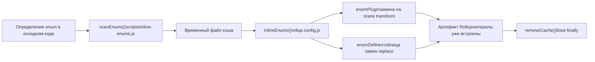
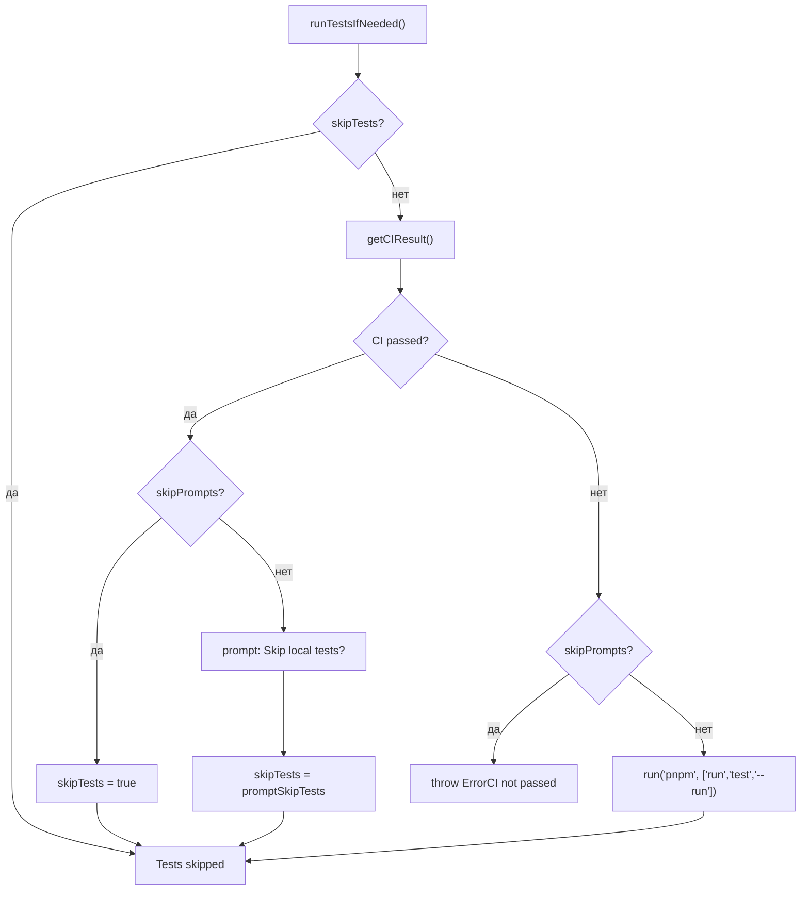

# Глава 13: Архитектурные компромиссы и руководство по избеганию ошибок в monorepo

В предыдущей главе мы, используя`packages-private/vite-debug`в качестве отправной точки, освоили парадигму отладки для минимального воспроизведения на реальном исходном коде. Когда таких внутренних отладочных пакетов становится всё больше, всплывает практический вопрос: они сосуществуют в одном workspace с официальными публикуемыми пакетами, как гарантировать, что процесс публикации не заденет их по ошибке? В этой главе мы углубимся в граничные условия инженерии monorepo, начиная с двойного контракта каталогов`packages`и`packages-private`, проанализируем защитный дизайн, стоящий за архитектурными компромиссами, и дадим практическое руководство по избеганию ошибок.

# 13.2 Железный закон последовательности: встраивание перечислений должно выполняться до Rollup

## Интуитивная модель

Встраивание перечислений похоже на «замену меток на деталях цифрами перед упаковкой». Если упаковщик (Rollup) уже начал упаковывать, а вы затем меняете метки, детали и метки в коробке не совпадут.`build.js`использует`scanEnums()` / `removeCache()`эту пару функций, чтобы строго ограничить встраивание перед Rollup.

## Структуры данных и жизненный цикл

`inline-enums.js`экспортируемый`scanEnums()`возвращает замыкание`removeCache`, которое сканирует определения enum в исходном коде и генерирует временные файлы для потребления Rollup[FACT:scripts/build.js:30-34]。`build.js`из`run()`использует`try/finally`для гарантии очистки кэша[FACT:scripts/build.js:81-112]：

```js
const removeCache = scanEnums()
try {
  // ... buildAll / checkAllSizes / build-dts
} finally {
  removeCache()
}
```

`rollup.config.js`на верхнем уровне модуля вызывает`inlineEnums()`получает`[enumPlugin, enumDefines]` [FACT:rollup.config.js:47-50], где`enumPlugin`вставляется в массив plugins[FACT:rollup.config.js:331-331]，`enumDefines`и включается в таблицу замен плагина replace[FACT:rollup.config.js:222-223]。

## Пошагово: полный жизненный цикл перечисления в одной сборке

1. `build.js`из`run()`сначала вызывает`scanEnums()`, сканирует определения enum всех пакетов и записывает во временный кэш, возвращает`removeCache` [FACT:scripts/build.js:87-87]。

2. `buildAll`параллельно запускает несколько процессов Rollup[FACT:scripts/build.js:119-121]。

3. Каждый процесс Rollup на этапе загрузки конфигурации выполняет`inlineEnums()`, читает кэш, сгенерированный на предыдущем шаге, получает`enumPlugin`и`enumDefines` [FACT:rollup.config.js:47-50]。

4. `enumPlugin`на этапе transform заменяет ссылки на enum в исходном коде на литералы;`enumDefines`как дополнение к replace обрабатывает замену констант между модулями[FACT:rollup.config.js:222-223]。

5. По завершении сборки`finally`блок вызывает`removeCache()`очищает временные файлы[FACT:scripts/build.js:119-121]。



## Размышления о дизайне и подводные камни

> **[Design Inference & Architectural Trade-offs]**
> Почему бы не использовать плагин Rollup для сканирования и использования на месте на этапе transform? Потому что встраивание перечислений требует**глобального представления между пакетами**：`runtime-core`: enum, на который ссылаются, может быть определён в`shared`, а отдельный процесс Rollup видит только дерево исходного кода своего пакета и не может выполнить замену между пакетами.`scanEnums()`создание глобального кэша перед сборкой как раз и решает эту проблему видимости.

Производственные подводные камни:`removeCache()`размещение в`finally`означает, что очистка произойдёт даже при ошибке в середине сборки. Но если вы вручную прервёте процесс при отладке (Ctrl+C),`finally`может не выполниться, и остаточные файлы кэша приведут к чтению устаревших перечислений при следующей сборке. Метод диагностики: проверьте, нет ли в каталоге`temp/`остаточных файлов кэша enum, удалите их вручную и повторите попытку.

---

# 13.3 Оркестратор публикации:`release.js`матрица флагов skip

## Интуитивная модель

`release.js`похож на главного режиссёра свадьбы,`skipBuild` / `skipTests` / `skipGit` / `skipPrompts`четыре переключателя — это кнопки «пропустить репетицию», «пропустить клятву», «пропустить фото», «пропустить подтверждение». Наличие каждой кнопки соответствует реальному сценарию: в среде CI нужен`skipPrompts`, при локальной отладке нужен`skipGit`, при экстренном хотфиксе нужен`skipTests`。

## Структура данных и значения по умолчанию для флагов

четыре флага skip объявлены в`parseArgs`, затем деструктурированы в локальные переменные[FACT:scripts/release.js:39-50]Копировать[FACT:scripts/release.js:64-66]：

```js
let skipTests = args.skipTests
const skipBuild = args.skipBuild
const skipPrompts = args.skipPrompts
const skipGit = args.skipGit
```

использует`skipTests`Использовать`let`объявление, поскольку оно в`runTestsIfNeeded()`будет динамически перезаписано[FACT:scripts/release.js:281-317]。

## Пошагово: полный поток принятия решений для одного release

`main()`порядок выполнения[FACT:scripts/release.js:143-279]：

1. **Проверка удалённой синхронизации**：`isInSyncWithRemote()`Сравнение локального HEAD с SHA удалённой ветки, при несовпадении выводится диалог подтверждения[FACT:scripts/release.js:337-363]。

2. **Выбор версии**: при отсутствии позиционных аргументов появляется`versionIncrements`меню выбора[FACT:scripts/release.js:152-176]。

3. **Решение о тестировании**：`runTestsIfNeeded()`Здесь наиболее плотно сосредоточена логика skip[FACT:scripts/release.js:281-317]。

4. **Обновление версии**：`updateVersions()`Обход и перезапись всех пакетов`package.json` [FACT:scripts/release.js:377-398]。

5. **Генерация Changelog**: вызов`pnpm run changelog` [FACT:scripts/release.js:211-212]。

6. **Git-коммит**：`skipGit`При значении true весь блок пропускается[FACT:scripts/release.js:231-240]。

7. **Публикация**: только когда`args.publish`выполняется при значении true`buildPackages()` + `publishPackages()` [FACT:scripts/release.js:243-246]。

`runTestsIfNeeded()`Логика ветвления заслуживает отдельного рассмотрения:



## Размышления о дизайне и подводные камни

> **[Design Inference & Architectural Trade-offs]**
> `skipTests`Использование`let`вместо`const`обусловлено оптимизацией «автоматически пропускать локальное тестирование, если CI уже пройден». Это экономит значительное время в сценариях CI-релиза — в GitHub Actions`release.yml`уже выполнил полный набор тестов, и повторный локальный запуск был бы пустой тратой ресурсов.

**Скрытый контракт порядка публикации**：`sortPackagesForPublishing`Размещение`vue`в конце[FACT:scripts/release.js:85-85]с явным комментарием «пользователи не могут установить новый входной пакет до того, как внутренние пакеты станут доступны». Если изменить этот порядок, пользователи`npm install vue@next`могут получить версию, зависимости которой ещё не опубликованы, что приведёт к`ERR_MODULE_NOT_FOUND`。

**Защита идемпотентности**：`publishPackage`Перед публикацией вызывается`isPackagePublished`для проверки registry[FACT:scripts/release.js:453-458], при неудачной публикации перехватывается ошибка`previously published`и происходит переход к пропуску[FACT:scripts/release.js:480-488]. Это позволяет скрипту release безопасно повторяться — повторный запуск после сетевого сбоя не завершится общей ошибкой из-за «пакет уже существует».

**Откат при неудаче**：`fnToRun().catch()`в`versionUpdated`вызывается, когда истинно`updateVersions(currentVersion)`Номер версии отката[FACT:scripts/release.js:528-537]. Но обратите внимание: это откатывает только`package.json`поле версии в**не откатывает уже`git commit`коммиты**. Если вы публикуете при`skipGit`равном ложно и публикация не удалась, необходимо вручную`git reset`。

---

# Размышления о дизайне: общий паттерн трёх компромиссов

Оглядываясь на три ключевых компромисса в этой главе, они разделяют одну и ту же философию проектирования:**превратить «легко забываемые проверки времени выполнения» в «структурные ограничения, которые невозможно обойти»**。

- `packages-private`Физическая изоляция: не полагаться на то, что автор скрипта не забудет проверить`private`поля, а сделать так, чтобы область сканирования естественным образом их исключала.
- Встраивание перечислений на этапе предварительной обработки: вместо того чтобы полагаться на то, что плагин Rollup при трансформации «случайно» увидит межпакетные перечисления, глобальный кэш создаётся до сборки.
- `release.js`Матрица пропусков: вместо того чтобы полагаться на то, что издатель помнит «раз CI прошёл, локально тесты можно не запускать», скрипт автоматически запрашивает статус CI и перезаписывает`skipTests`。

> **[Design Inference & Architectural Trade-offs]**
> Цена такого подхода —**рост сложности скриптов**：`build.js`необходимость поддерживать`privatePackages`список,`rollup.config.js`необходимость дублировать логику обнаружения каталогов,`release.js`необходимость обрабатывать пересекающиеся комбинации четырёх флагов пропуска. Но для такого репозитория, как Vue, выпускающего релизы несколько раз в неделю, выгода в надёжности, которую дают структурные ограничения, значительно перевешивает затраты на сложность.

---

# Краткое содержание главы

В этой главе, исходя из исходного кода, были разобраны три ключевых граничных условия инженерной системы Vue core:

1. **`packages-private`и`packages`физическое разделение**обеспечивается workspace glob,`build.js`обнаружение каталогов,`release.js`Три общих гарантии фильтрации[FACT:pnpm-workspace.yaml:1-3][FACT:scripts/build.js:153-170][FACT:scripts/release.js:68-83]。

2. **Встроенные в перечисление временные ограничения**обеспечивается`scanEnums()` / `removeCache()`из`try/finally`Структура принудительно гарантирует, что конфигурация Rollup потребляет кэш на верхнем уровне модуля[FACT:scripts/build.js:81-112][FACT:rollup.config.js:47-50]。

3. **`release.js`Матрица флагов пропуска для**Обслуживает три сценария: CI-релиз, локальная отладка и экстренное горячее исправление,`skipTests`Динамическое переписывание и сортировка порядка публикации — это два наиболее легко упускаемых скрытых контракта[FACT:scripts/release.js:281-317][FACT:scripts/release.js:85-85]。

# Вопросы для размышления и самопроверки в этой главе

Q1: Если убрать`build.js`в`build(target)`из функции`privatePackages.includes(target)`проверку и унифицированно использовать`packages`в качестве`pkgBase`, в каких сценариях возникнут проблемы?

**Справочный анализ**：`build.js:160-164`Обнаружение каталога является единственной точкой входа, через которую могут быть собраны приватные пакеты. После удаления,`nr build vite-debug`будет искать в`packages/vite-debug`каталог`package.json`, а этот каталог не существует,`fs.readFileSync`напрямую выбрасывает`ENOENT`. Более скрытая проблема: если в будущем кто-то создаст каталог с тем же именем в`packages/`, сборка будет молча использовать конфигурацию из неправильного каталога, пути к артефактам и`buildOptions`полностью сместятся. Кроме того,`rollup.config.js:37-42`имеет независимую логику обнаружения каталогов, обе точки должны изменяться синхронно, иначе возникнет несогласованное состояние «`build.js`нашёл пакет, но Rollup не может найти».

Q2: `release.js`в`runTestsIfNeeded()`,`skipTests ||= isCIPassed`эта строка кода (`release.js:285`) в`skipPrompts`Когда условие истинно и CI не пройден, в какую ветку будет выполнено переход? Если убрать`else if (skipPrompts)`ветки`throw`, какие будут последствия?

**Справочный разбор**: Когда`skipPrompts`истинно и CI не пройден,`skipTests ||= isCIPassed`в`isCIPassed`равно`false`，`skipTests`сохраняет исходное значение (обычно`false`). Затем происходит переход в ветку`else if (skipPrompts)`, выбрасывается`Error`（`release.js:299-304`). Если убрать этот`throw`, код продолжит выполнение до ветки`if (!skipTests)`, запуская в неинтерактивной среде`pnpm run test --run`. В CI это может привести к тому, что тесты упадут из-за различий в окружении, или, что ещё хуже — тесты пройдут, но CI фактически не пройден (например, CI запускает другой набор тестов), и будет выпущена версия без полной проверки.

Q3: `rollup.config.js:55`из`inlineEnums()`вызывается на верхнем уровне модуля, а`build.js:87`的`scanEnums()`в`run()`вызывается внутри функции. Что нарушится, если поменять порядок выполнения этих двух (то есть заставить`inlineEnums()`вызываться в хуке Rollup`buildStart`)?

**Справочный анализ**：`scanEnums()`должен быть завершён до запуска всех процессов Rollup, поскольку ему необходимо просканировать**все пакеты**исходный код для построения глобального кэша enum.`inlineEnums()`вызывается на верхнем уровне модуля`rollup.config.js`, в этот момент Rollup ещё не начал никаких сборок, и кэш уже готов. Если вместо этого вызвать в`buildStart`, каждый процесс Rollup будет сканировать независимо — но`buildAll`выполняются параллельно (`build.js:119-121`), одновременное сканирование одной и той же группы файлов несколькими процессами порождает состояние гонки: процесс A может прочитать файл кэша, который процесс B ещё не дописал, что приведёт к неполной замене enum. Что ещё серьёзнее,`scanEnums()`возвращаемый`removeCache`замыкание зависит от состояния файловых дескрипторов на момент сканирования, и в условиях конкурентности момент очистки невозможно согласовать.

Двойной каталог-контракт, определение принадлежности сборочных скриптов, вторичная фильтрация скриптов публикации — эти механизмы совместно очерчивают границы безопасности инженерии monorepo. Но границы не являются неизменными: по мере миграции инструментов сборки с Rollup на Rolldown и сближения типовых и runtime-тестов существующие стратегии компромиссов столкнутся с новыми вызовами. В следующей главе мы, опираясь на траекторию изменений с 3.0 по 3.4, рассмотрим направления эволюции инженерной системы следующего поколения.
