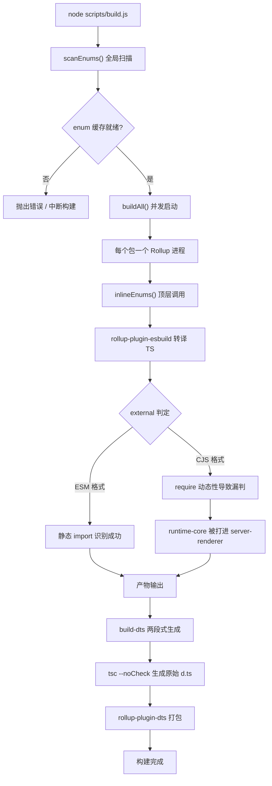
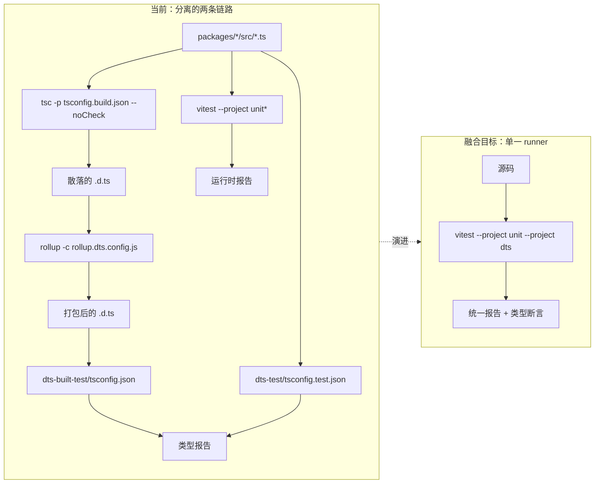
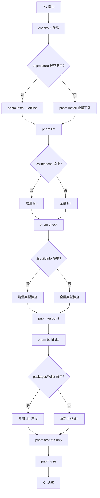

# Глава 14: Будущая эволюция: от 3.x к инженерной системе следующего поколения

В предыдущей главе мы разобрали «границы безопасности» инженерной системы Vue core — двойной каталог-контракт, определение принадлежности сборочных скриптов, вторичную фильтрацию скриптов публикации. Эти механизмы не были спроектированы за один раз, а многократно оттачивались в итерациях с 3.0 по 3.4. В этой главе мы сменим ракурс: посмотрим не на то, «как это выглядит сейчас», а на то, «как оно стало таким», и на основе этого выведем, куда движется инженерная система следующего поколения. Исходными материалами этой главы являются changelogs/CHANGELOG-3.3.md, changelogs/CHANGELOG-3.4.md и package.json в корне репозитория. Журнал изменений выглядит как простая летопись «что за баг исправили», но на самом деле это самый достоверный отчёт о состоянии инженерной системы: каждый коммит с префиксом build:, каждое изменение с префиксом types:, каждый откат версии зависимости — всё это обнажает точки напряжения текущей архитектуры. Наша задача — прочитать направление эволюции из этих точек напряжения. Рассматривать журнал изменений как «окно наблюдения за инженерной системой», а не как «список функций» — это ключевая методология данной главы. Функциональные изменения говорят нам, что умеет Vue, а изменения, связанные со сборкой, типами и CI, говорят нам, «где болит» инженерная система Vue.

# I. Точки напряжения цепочки инструментов сборки: потенциал миграции с Rollup на Rolldown

## Интуитивная модель

Представьте цепочку инструментов сборки как сборочный конвейер: Rollup — главный сборочный стол, esbuild отвечает за быструю нарезку (транспиляцию TS), terser — за финальную упаковку и сжатие. Когда продукт (runtime Vue) становится всё сложнее, операций на сборочном столе всё больше, и сам главный сборочный стол становится узким местом. Позиционирование Rolldown — это главный сборочный стол, переписанный на Rust; он призван заменить не esbuild, а сам Rollup.

Без этого давления эволюции система столкнулась бы с «катастрофой» не в виде краха, а в виде**линейного роста времени сборки с числом пакетов**: с каждым новым подпакетом приходится запускать ещё один процесс Rollup, ещё раз сканировать кэш enum, ещё раз прогонять генерацию dts.

## Структуры данных и布局 зависимостей

Сначала посмотрим на статический снимок текущей цепочки инструментов.`package.json`В`devDependencies`находится

[FACT:package.json:103-106]

```
    "rollup": "^4.63.3",
    "rollup-plugin-dts": "^6.5.1",
    "rollup-plugin-esbuild": "^6.2.1",
    "rollup-plugin-polyfill-node": "^0.13.0",
```

Копировать`^4.63.3`Здесь можно прочитать три ключевых факта. Во-первых, мажорная версия Rollup —`rollup-plugin-esbuild`, что соответствует зрелому периоду Rollup 4.x. Во-вторых,`rollup-plugin-dts`отвечает за транспиляцию TS, а значит, сам Rollup не разбирает TS, а обрабатывает только JS, выдаваемый esbuild. В-третьих,`.d.ts`независимо отвечает за упаковку`dts-built-test`, и это как раз материальная основа независимости

, обсуждавшейся в предыдущей главе.

[FACT:package.json:8-9]

```
    "build": "node scripts/build.js",
    "build-dts": "tsc -p tsconfig.build.json --noCheck && rollup -c rollup.dts.config.js",
```

`build-dts`Копировать`tsc --noCheck`является «двухэтапным»: сначала`--noCheck`генерирует исходные файлы деклараций (`rollup -c rollup.dts.config.js`пропускает проверку типов, выполняя только emit), затем`.d.ts`упаковывает разрозненные`rollup-plugin-dts`в единый файл. Этот дизайн сам по себе зависит от возможностей Rollup —

## требуется модульный граф Rollup для отслеживания зависимостей типов.`build:`Сценарий: что выявил один коммит

В журнале изменений записи с префиксом`build:`являются прямым доказательством точек напряжения цепочки инструментов сборки. Выберем три из них.

Первая — выравнивание конфигурации minify в 3.4.32:

[FACT:changelogs/CHANGELOG-3.4.md:84]

```
* **build:** use consistent minify options from previous terser config ([789675f](https://github.com/vuejs/core/commit/789675f65d2b72cf979ba6a29bd323f716154a4b))
```

Мотив этого коммита — «после миграции с terser на esbuild minify параметры сжатия не согласованы». Это выявляет промежуточное состояние миграции: Vue когда-то использовал terser для сжатия, затем перешёл на esbuild (это подтверждает`devDependencies`в`esbuild: ^0.28.2`), но параметры сжатия не были полностью выровнены, что привело к отклонениям в размере или поведении артефактов. Это типичная цена «замены деталей сборочного стола».

Вторая — откат версии entities в 3.4.38:

[FACT:changelogs/CHANGELOG-3.4.md:6]

```
* **build:** revert entities to 4.5 to avoid runtime resolution errors ([f349af7](https://github.com/vuejs/core/commit/f349af7b65b9f8605d8b7bafcc06c25ab1f2daf0)), closes [#11603](https://github.com/vuejs/core/issues/11603)
```

`entities`— это библиотека декодирования HTML-сущностей, от которой зависит`compiler-dom`. Откат до 4.5 произошёл потому, что новая версия вызвала проблемы при runtime-разборе. Этот коммит показывает:**обновление зависимостей цепочки инструментов сборки не является изолированным — скачок версии косвенной зависимости проникает в runtime-поведение**。

Третья — загрязнение cjs-сборки server-renderer в 3.4.29:

[FACT:changelogs/CHANGELOG-3.4.md:155]

```
* **build:** fix accidental inclusion of runtime-core in server-renderer cjs build ([11cc12b](https://github.com/vuejs/core/commit/11cc12b915edfe0e4d3175e57464f73bc2c1cb04)), closes [#11137](https://github.com/vuejs/core/issues/11137)
```

Это самый типичный класс багов сборки: в формате CJS`server-renderer`неожиданно включил`runtime-core`в свой артефакт. Причина обычно в том, что определение`external`в Rollup перестаёт работать в формате CJS — ESM может статически распознавать внешние зависимости по`import`-инструкциям, а CJS`require`Динамичность выше, легко пропустить. Этот коммит напрямую указывает на уязвимость логики`external`в конфигурации Rollup.

## Mermaid-визуализация движущих сил миграции

Приведённая ниже диаграмма отображает поток управления текущего конвейера сборки и отмечает узлы, которых коснётся миграция на Rolldown:



> **[Design Inference & Architectural Trade-offs]**
> Ценность миграции на Rolldown заключается в том, что он заменяет модель параллелизма «один процесс на пакет» на модель «параллелизм внутри одного процесса»,`scanEnums()`глобальное сканирование и замена`inlineEnums()`могут координироваться в рамках одной среды выполнения Rust, и проблема «гонки при параллельном сканировании», обсуждавшаяся в предыдущей главе, исчезнет в корне. Но сопротивление миграции тоже здесь —`rollup-plugin-esbuild`、`rollup-plugin-dts`этим экосистемам плагинов требуется, чтобы Rolldown предоставил слой совместимости, а`external`логику определения необходимо переписать.

## Проектные размышления и подводные камни

**Почему миграция не произойдёт в один шаг?**Посмотрите на`package.json`поле`engines`:

[FACT:package.json:61-63]

```
  "engines": {
    "node": ">=20.0.0"
  },
```

Node 20 — жёсткий минимум. Rolldown как нативный модуль Rust требует соответствующих привязок N-API и распространения предкомпилированных бинарников. Как только он будет внедрён,`pnpm install`время выполнения, кросс-платформенная (Windows/macOS/Linux) совместимость бинарников, стратегия кэширования CI — всё это придётся проектировать заново. Это не просто «замена зависимости», а**перекалибровка всей цепочки установка-сборка-кэширование**。

**Подводные камни в продакшене**：`build-dts`У`tsc --noCheck`— это палка о двух концах. Пропуск проверки типов ускоряет emit, но означает, что на этапе генерации`.d.ts`ошибки типов не будут обнаружены — ошибки типов могут быть пойманы только через`pnpm check`（`tsc --incremental --noEmit`) и`test-dts`как запасной вариант. Если после миграции на Rolldown захочется объединить эти два шага, необходимо убедиться, что проверка типов не замедлит сборку, иначе это противоречит первоначальной цели`--noCheck`.

---

# II. Тенденция слияния типовых тестов и runtime-тестов

## Интуитивная модель

Представьте типовые тесты и runtime-тесты как два независимых контрольных пункта качества: один проверяет, правильно ли написана «инструкция (`.d.ts`)», другой проверяет, правильно ли крутится «машина (runtime)». У каждого пункта — свой рабочий пост, свои инструменты, свой отчёт. Смысл тенденции слияния в следующем:**можно ли заставить один и тот же тест-кейс одновременно проверять и инструкцию, и машину?**

Если слияния не будет, система столкнётся с катастрофой —**расхождение типов и runtime-поведения**：`.d.ts`говорит, что`ref()`возвращает`Ref<T>`, но фактическая форма возвращаемого объекта во время выполнения изменилась: типовой тест проходит, runtime-тест тоже проходит, но их комбинация ошибочна.

## Структура данных: компоновка тестовых скриптов

`package.json`В`scripts`тестовые записи чётко разделены на две группы:

[FACT:package.json:19-24]

```
    "test": "vitest",
    "test-unit": "vitest --project unit*",
    "test-e2e": "node scripts/build.js vue -f global -d && vitest --project e2e --project e2e-browser",
    "test-dts": "run-s build-dts test-dts-only",
    "test-dts-only": "tsc -p packages-private/dts-built-test/tsconfig.json && tsc -p ./packages-private/dts-test/tsconfig.test.json",
    "test-coverage": "vitest run --project unit* --coverage",
```

Ключевая структура здесь —`test-dts`в`run-s build-dts test-dts-only`— она**последовательная**: сначала сборка`.d.ts`, затем запуск типовых тестов. А внутри`test-dts-only`находятся**два независимых`tsc`процесса**: один запускает`dts-built-test`(проверка артефактов сборки), другой запускает`dts-test`(проверка типов исходного кода).

Обратите внимание:`test-unit`использует`vitest --project unit*`，`test-e2e`использует`vitest --project e2e --project e2e-browser`. Это показывает, что механизм`--project`в Vitest уже разделил тесты на разные project по категориям «unit/e2e/browser».**Физическая основа для слияния уже существует**: механизм project в Vitest позволяет запускать разные типы тестов в одном runner.

## Сценарий: полный путь одного коммита`types:`В changelog плотность записей с префиксом

чрезвычайно высока — это прямое отражение сложности системы типов. Проследим типичное исправление типов.`types:`Откат типов ref в 3.4.37:

Копировать

[FACT:changelogs/CHANGELOG-3.4.md:23-24]

```
* Revert "fix(types/ref): allow getter and setter types to be unrelated ([#11442](https://github.com/vuejs/core/issues/11442))" ([b1abac0](https://github.com/vuejs/core/commit/b1abac06cdb198bd72f8e614b1f68b92e1c78339))
* Revert "fix(types/ref): correct type inference for nested refs ([#11536](https://github.com/vuejs/core/issues/11536))" ([3a56315](https://github.com/vuejs/core/commit/3a56315f94bc0e11cfbb288b65482ea8fc3a39b4))
```

Копировать

[FACT:changelogs/CHANGELOG-3.4.md:55]

```
* **types/ref:** allow getter and setter types to be unrelated ([#11442](https://github.com/vuejs/core/issues/11442)) ([e0b2975](https://github.com/vuejs/core/commit/e0b2975ef65ae6a0be0aa0a0df43fb887c665251))
```

[FACT:changelogs/CHANGELOG-3.4.md:30]

```
* **types/ref:** correct type inference for nested refs ([#11536](https://github.com/vuejs/core/issues/11536)) ([536f623](https://github.com/vuejs/core/commit/536f62332c455ba82ef2979ba634b831f91928ba)), closes [#11532](https://github.com/vuejs/core/issues/11532) [#11537](https://github.com/vuejs/core/issues/11537)
```

типовой тест может проверить, что «сигнатура типа соответствует ожиданиям», но не может проверить, «удобна ли эта сигнатура типа в реальном коде»**В типовом тесте**。`allow getter and setter types to be unrelated`может полностью проходить, но при реальном использовании вывод типов`ref`станет слишком широким, что подорвёт типобезопасность downstream-кода.

## Mermaid-визуализация слияния типовых тестов

Приведённая ниже диаграмма отображает текущую раздельную структуру типовых и runtime-тестов, а также целевую форму после слияния:



> **[Design Inference & Architectural Trade-offs]**
> Технический путь слияния, скорее всего, таков: обернуть вызовы`dts-built-test`и`dts-test`в`tsc`как пользовательский project в Vitest, чтобы типовые утверждения встраивались в тестовые файлы в форме`expectTypeOf`. Тогда один вызов`vitest`сможет одновременно запускать runtime-утверждения и типовые утверждения с единым отчётом. Но сопротивление в том, что:`tsc`проверка типов в

## — «полная», а тесты в Vitest — «пофайловые», их стратегии инкрементальности несовместимы.

**Проектные размышления и подводные камни`dts-built-test`Почему`dts-test`？**должен быть независим от`dts-built-test`Это уже обсуждалось в предыдущей главе, здесь дополним с точки зрения эволюции:**проверяет**（`rollup-plugin-dts`артефакты сборки`.d.ts`），`dts-test`упакованный**проверяет**типы исходного кода

[FACT:changelogs/CHANGELOG-3.4.md:9]

```
* **types:** add fallback stub for DOM types when DOM lib is absent ([#11598](https://github.com/vuejs/core/issues/11598)) ([4db0085](https://github.com/vuejs/core/commit/4db0085de316e1b773f474597915f9071d6ae6c6))
```

Копировать`dts-built-test`«Предоставить fallback stub при отсутствии DOM lib» — это исправление совместимости типов на уровне артефактов сборки, которое может быть обнаружено только в сценарии`.d.ts`— «потребления упакованного

**».**Подводные камни в продакшене**: цикл «влитие-откат» в типовых тестах показывает, что изменения сигнатур типов требуют проверки на**реальных downstream-проектах`packages-private/dts-test`используются внутренние тестовые примеры репозитория, которые не охватывают все downstream-сценарии. Если тенденция конвергенции сосредоточена только на «объединении двух runner», но не решает вопрос «как внедрить реальную downstream-обратную связь», это лишь формальная конвергенция.

---

# III. Направления тонкой оптимизации CI-кэша

## Интуитивная модель

Представьте CI-кэш как «зону подготовки материалов» склада: каждая сборка берёт из неё сырьё (зависимости, артефакты сборки, кэш типов). Если в зоне подготовки только один большой ящик, то для того чтобы достать любую вещь, нужно перерыть весь ящик — и даже при высоком проценте попаданий в кэш это не будет быстро. Тонкая оптимизация означает:**разбить большой ящик на маленькие ячейки, классифицированные по назначению**。

Без тонкого кэширования система сталкивается с катастрофой:**каскадное усиление инвалидации кэша**: изменение одной строки исходного кода приводит к инвалидации всего`node_modules`кэша, CI переустанавливает все зависимости, время сборки вырастает с 2 минут до 10 минут.

## Структура данных: классификация кэшируемых объектов

Из`package.json`можно выделить несколько категорий кэшируемых «материалов»:

Первая категория — артефакты установки зависимостей.`packageManager`Поле

[FACT:package.json:4]

```
  "packageManager": "pnpm@12.4.2",
```

Копировать`node_modules`pnpm использует структуру символических ссылок; кэшируется content-addressable store pnpm, а не плоский`node_modules`. Это означает, что ключ кэша должен основываться на хэше`pnpm-lock.yaml`, а не`package.json`。

Вторая категория — артефакты сборки.`clean`Скрипт

[FACT:package.json:10]

```
    "clean": "rimraf --glob packages/*/dist temp .eslintcache",
```

`packages/*/dist`、`temp`、`.eslintcache`Копировать`dist`— эти три категории артефактов можно кэшировать независимо.`temp`— это выходные данные сборки,`bench.json`），`.eslintcache`— временные файлы (например,

— кэш lint.`check`Третья категория — кэш проверки типов.`--incremental`：

[FACT:package.json:15]

```
    "check": "tsc --incremental --noEmit",
```

`--incremental`использует`.tsbuildinfo`Копировать`tsc`создаёт файл

## , который является инкрементальным кэшем проверки типов. Если в CI кэшировать этот файл,

повторный запуск`packages/reactivity/src/ref.ts`будет намного быстрее.

Сценарий: поток выполнения CI для одного PR`scripts`Рассмотрим типичный сценарий: разработчик изменил`simple-git-hooks`и отправил PR. Какие шаги нужно выполнить в CI, и какие из них могут попасть в кэш?`pre-commit`Из

[FACT:package.json:48-51]

```
  "simple-git-hooks": {
    "pre-commit": "pnpm lint-staged && pnpm check",
    "commit-msg": "node scripts/verify-commit.js"
  },
```

в`pre-commit`— это локальный хук, CI запускает более полную последовательность):`lint-staged`Копировать`check`Локальный`lint`、`check`、`test-unit`、`test-dts`、`size`запускает

- `lint`и`.eslintcache`. В CI запускаются
- `check`и т.д. Стратегия кэширования для каждого шага различается:`.tsbuildinfo`: кэшировать`tsconfig`, ключ на основе хэша файлов исходного кода.
- `test-unit`: кэшировать
- `test-dts`, ключ на основе`build-dts`и хэша исходного кода.`packages/*/dist`: у Vitest есть собственный кэш, но обычно в CI кэшируются не результаты тестов, а только зависимости.
- `size`: зависит от артефактов

## , ключ кэша на основе хэша



> **[Design Inference & Architectural Trade-offs]**
> Копировать**〔Проектные выводы и архитектурные компромиссы〕**Основное противоречие тонкого кэширования — это`packages/*`гранулярность ключа кэша`dist`，`reactivity`: слишком грубый ключ (например, только на основе commit hash) даёт низкий процент попаданий; слишком тонкий ключ (например, на основе хэша каждого файла) — затраты на вычисление ключа перекрывают выгоду от кэша. Разумная стратегия для такого monorepo, как Vue, — «шардинг по пакетам»: каждый`compiler-core`подпакет кэшируется независимо, изменение`dist`не инвалидирует

## кэш

**.`size`Проектные размышления и подводные камни**Почему скрипт

[FACT:package.json:11-14]

```
    "size": "run-s \"size-*\" && node scripts/usage-size.js",
    "size-global": "node scripts/build.js vue runtime-dom -f global -p --size",
    "size-esm-runtime": "node scripts/build.js vue -f esm-bundler-runtime",
    "size-esm": "node scripts/build.js runtime-dom runtime-core reactivity shared -f esm-bundler",
```

`size`Посмотрите на эти три:`run-s "size-*"`Копировать`size-`использует`size`для последовательного запуска всех подкоманд с префиксом

**. Этот паттерн «агрегации по префиксу» позволяет каждому измерению размера (global, esm-runtime, esm) кэшироваться и падать независимо. Если объединить в одну большую команду, превышение лимита по любому измерению приведёт к падению всего**, и невозможно будет определить, в каком измерении проблема.**Подводные камни в продакшене**: самый частый подводный камень CI-кэша — это`clean`загрязнение кэша

[FACT:package.json:10]

```
    "clean": "rimraf --glob packages/*/dist temp .eslintcache",
```

Скрипт`packages/*/dist`существует именно для борьбы с этим:`packages-private/*/dist`Копировать`packages-private`Обратите внимание, что он очищает`packages-private`, а не`clean`. Это означает, что артефакты`packages-private`не входят в обычную область очистки — если CI закэшировал артефакты

---

# , а

их не очищает, может возникнуть проблема «закэшированы артефакты старой версии playground». При проектировании тонкого кэша необходимо обрабатывать**отдельно.**。

Проектное размышление: инженерная система как жизненный цикл продукта

Связывая нити трёх разделов, можно увидеть чёткую основную линию:

Инженерная система Vue движется от «работает» к «удобно работать», от «ручного оркестрирования» к «декларативной конфигурации»

> **[Design Inference & Architectural Trade-offs]**
> Конвергенция типовых тестов — это эволюция, «движимая согласованностью»: когда частота изменений сигнатур типов превышает частоту изменений runtime-поведения, раздельные наборы тестов становятся обузой, и необходимо заставить их использовать общие тестовые примеры.**Тонкая грануляция CI-кэша — это эволюция, «движимая стоимостью»: когда минуты CI становятся узким местом, расточительность грубого кэша становится неприемлемой, и необходимо шардировать по назначению.**〔Проектные выводы и архитектурные компромиссы〕`BREAKING CHANGES`Общее ограничение этих трёх линий эволюции —

---

# обратная совместимость

. Стратегия релизов Vue (видно из раздела`package.json`в changelog) допускает «type-only breaking change» в minor-версиях, но не допускает runtime breaking change. Это означает, что эволюция инженерной системы должна гарантировать: как бы ни менялась внутренняя инструментальная цепочка, публичный API и runtime-поведение артефактов не должны меняться. Это жёсткая граница всех эволюционных решений.

1. **Резюме главы**：Текущая комбинация Rollup 4.x + esbuild + rollup-plugin-dts, её точки напряжения проявляются в`build:`коммитах с префиксом (выравнивание конфигурации minify, откат версии entities, пропуск определения CJS external). Потенциал миграции на Rolldown исходит из замены «многопроцессной конкурентности» на «однопроцессный параллелизм», сопротивление — из экосистемы плагинов и кросс-платформенного распространения бинарников.

2. **Слияние типовых тестов**：`test-dts`的`run-s build-dts test-dts-only`последовательная структура, а также`dts-built-test`и`dts-test`двойной`tsc`процесс — это физическое доказательство текущей раздельной формы. Технический путь слияния — использование механизма`--project`Vitest, сопротивление —`tsc`полная проверка несовместима с инкрементальной стратегией тестирования по файлам в Vitest.

3. **Детализация кэша CI**：`packageManager`фиксация pnpm,`clean`очистка трёх типов артефактов,`check`использование`--incremental`、`size`агрегация по префиксу — всё это критерии классификации кэшируемых объектов. Основное противоречие — гранулярность ключа кэша, разумная стратегия — «шардирование по пакетам».

Самое важное изменение в осознании:**сама система инженерии — это продукт, у неё есть свои пользователи (контрибьюторы), свои метрики производительности (время сборки, минуты CI), свои ограничения совместимости (неизменность API артефактов)**. Она требует непрерывной итерации, а не единоразового проектирования.

# Размышления и самопроверка в этой главе

Q1: `package.json:9`的`build-dts`использует`tsc -p tsconfig.build.json --noCheck`. Если убрать`--noCheck`, какие цепные реакции это вызовет после миграции на Rolldown?

**Справочный анализ**：`--noCheck`Назначение — пропустить проверку типов и выполнить только emit. После его удаления`tsc`перед генерацией`.d.ts`будет выполнять полную проверку типов. В текущей архитектуре Rollup это лишь замедлит`build-dts`; но после миграции на Rolldown проблема усилится: ключевое преимущество Rolldown — «однопроцессная параллельная сборка», и если на этапе`build-dts`вводится полная проверка`tsc`, она становится последовательным узким местом всего конвейера — сборка всех пакетов должна ждать завершения этой проверки. Что ещё серьёзнее,`tsc`проверка типов однопоточна и не может использовать параллельные возможности Rolldown. Правильный подход — сохранить`--noCheck`, передав проверку типов независимым`pnpm check`（`package.json:15`) и`test-dts`（`package.json:22`), развязав сборку и проверку.

Q2: Журнал изменений 3.4.37 последовательно откатил два`types/ref`исправления (`CHANGELOG-3.4.md:23-24`), хотя эти два исправления были только что включены в 3.4.35 (`CHANGELOG-3.4.md:30,55`). Если бы типовые тесты и runtime-тесты уже были слиты, можно ли было бы избежать этого цикла «включение-откат»? Почему?

**Справочный анализ**: Полностью избежать нельзя, но можно сократить цикл. Слитые типовые тесты по-прежнему могут проверять лишь «соответствие сигнатуры типа утверждению», а проблема таких исправлений, как`allow getter and setter types to be unrelated`, заключается в том, что «сигнатура типа слишком широка и нарушает типобезопасность downstream-кода» — это проблема**downstream-использования**, а не**самой сигнатуры**. Слияние может сократить цикл в том случае, если типовые утверждения и runtime-утверждения записаны в одном тестовом файле — разработчик быстрее обнаружит несоответствие «сигнатура типа изменилась, а runtime-поведение — нет». Но чтобы действительно избежать откатов, нужно引入 проверку типов реальных downstream-проектов (например, расширить`packages-private/dts-test`до набора тестов «имитация downstream-использования»), что выходит за рамки простого «слияния runner».

Q3: `package.json:10`的`clean`скрипт очищает`packages/*/dist`, но не очищает`packages-private/*/dist`. Если CI применяет стратегию детализированного кэширования «шардирование по пакетам», какую производственную ловушку создаст эта асимметрия?

**Справочный анализ**: Ловушка в «кэшировании старых артефактов`packages-private`».`packages-private`содержит`sfc-playground`、`template-explorer`и другие инструменты отладки, их артефакты сборки (например,`packages-private/sfc-playground/dist`) если кэшируются CI, а`clean`их не очищает, возникает ситуация: исходный код обновлён, но CI переиспользует старые артефакты playground, что приводит к искажению результатов проверки`build-sfc-playground`（`package.json:39`). Что ещё более скрыто:`dev-sfc-prepare`（`package.json:34`) проверяет, существуют ли артефакты`packages-private`, и если старые артефакты закэшированы, он пропустит пересборку, заставив разработчика думать, что окружение новое. При проектировании детализированного кэша необходимо определить отдельный ключ кэша для`packages-private`, или вообще не кэшировать его артефакты — поскольку это инструмент отладки, стоимость пересборки низка, а выгода от кэширования мала.

Через окно наблюдения журнала изменений мы выявили точки напряжения текущей системы инженерии и на их основе вывели возможные направления эволюции системы следующего поколения. Эти направления не витают в воздухе, а выросли из реальных производственных ошибок и компромиссов. На этом анализ системы инженерии Vue в книге завершается, но исследование инженерии бесконечно — следующая глава, как заключительная, отдалит перспективу от самого Vue и рассмотрит, как этот опыт переносится на более широкие инженерные сценарии.
