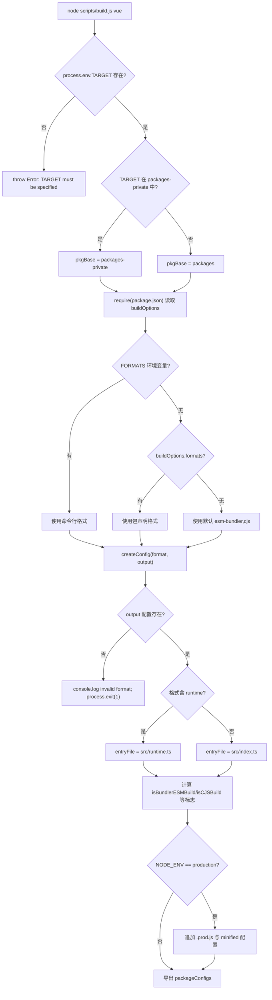

# 第 1 章：宏觀認知：core 倉庫的工程化設計哲學

在開始追蹤任何一行響應式或虛擬 DOM 的實作之前，我們首先需要理解這些程式碼賴以生存的工程化母體。打開 Vue core 倉庫，最先映入眼簾的並非框架核心邏輯，而是`package.json`與`pnpm-workspace.yaml`這類工程設定檔——它們不包含任何執行時功能，卻決定了整個框架能否被正確建置、測試與發布。本章要回答的正是這個前置問題：core 倉庫到底是什麼。它並非`@vue/runtime-core`那個 npm 套件，而是承載`runtime-core`、`reactivity`、`compiler-sfc`等十餘個公開發布套件，外加`sfc-playground`、`template-explorer`等私有實驗套件的工程化母體。理解這個母體的組織方式，是後續所有章節（建置、型別、發布、體積預算）的前提。本章將沿三條主線展開：workspace 的雙目錄結構、根級 TypeScript 與 Rollup 的統一約束，以及「原始碼倉庫」與「發布產物」的解耦哲學。

# 一、雙目錄結構：packages 與 packages-private 的物理隔離

## 直覺模型

把 core 倉庫想像成一棟研發大樓。`packages/`是正式產品線，生產出來的東西要貼上商標賣到市場上；`packages-private/`是內部試驗室，裡面的樣品只用於除錯和演示，絕不對外發貨。兩者共用同一套水電（依賴、建置工具），但門禁系統（發布流程）對它們區別對待。

若沒有這層物理隔離，一個內部除錯用的 playground 套件很容易被誤發布到 npm——這不是假設，而是 monorepo 的經典事故。

## 資料結構與記憶體佈局

workspace 的邊界由`pnpm-workspace.yaml`定義。它只有三行有效宣告：

[FACT:pnpm-workspace.yaml:1-3]

```yaml
packages:
  - 'packages/*'
  - 'packages-private/*'
```

這兩條 glob 告訴 pnpm：`packages/`和`packages-private/`下的每個子目錄都是一個獨立套件。pnpm 會為它們建立符號連結，使`@vue/runtime-core`引用`@vue/reactivity`時直接指向本地原始碼目錄，而非從 registry 下載。

緊接著的`catalog:`段是 pnpm 的**依賴版本目錄**機制：

[FACT:pnpm-workspace.yaml:5-13]

```yaml
catalog:
  '@babel/parser': ^7.29.8
  '@babel/types': ^7.29.8
  'entities': '^7.0.1'
  'estree-walker': ^2.0.2
  'magic-string': ^0.30.21
  'source-map-js': ^1.2.1
  'vite': ^8.3.0
  '@vitejs/plugin-vue': ^6.0.9
```

根`package.json`中對應寫的是`"@babel/parser": "catalog:"` [FACT:package.json:65-65]。`catalog:`是一個佔位符，pnpm 在安裝時把它替換為 catalog 段中宣告的版本。這樣做的收益是：`@babel/parser`的版本只在`pnpm-workspace.yaml`一處維護，所有引用它的套件自動對齊，杜絕了「A 套件用 7.28、B 套件用 7.29」的版本漂移。

## 場景驅動 Walkthrough：一次`pnpm install`之後發生了什麼

假設你在倉庫根目錄執行`pnpm install`。代入這個場景，逐步追蹤：

**第一步：preinstall 門禁。**pnpm 在安裝前會觸發根`package.json`的`preinstall`腳本：

[FACT:package.json:45-45]

```json
"preinstall": "npx only-allow pnpm"
```

> **[Design Inference & Architectural Trade-offs]**
> `only-allow pnpm`會檢查當前套件管理器是否為 pnpm，若不是則直接報錯退出。這行腳本的存在意味著：用 npm 或 yarn 安裝 core 倉庫會失敗。為什麼必須鎖死 pnpm？ 因為 core 倉庫依賴 pnpm 的 workspace 符號連結與 catalog 機制，npm 的 workspaces 不支援`catalog:`語法，yarn 的 PnP 模式又會改變模組解析路徑，導致建置腳本中的`createRequire`行為不一致。

**第二步：解析 workspace。**pnpm 讀取`pnpm-workspace.yaml`，掃描`packages/*`與`packages-private/*`，為每個含`package.json`的目錄建立套件記錄。

**第三步：應用 catalog 替換。**根`package.json`中所有`catalog:`佔位符被替換為 catalog 段的實際版本，隨後統一安裝。

**第四步：postinstall 鉤子。**安裝完成後觸發：

[FACT:package.json:46-46]

```json
"postinstall": "simple-git-hooks"
```

`simple-git-hooks`讀取根`package.json`中的`simple-git-hooks`欄位，把 Git 鉤子寫入`.git/hooks/`：

[FACT:package.json:48-51]

```json
"simple-git-hooks": {
  "pre-commit": "pnpm lint-staged && pnpm check",
  "commit-msg": "node scripts/verify-commit.js"
}
```

`pre-commit`鉤子在每次提交前跑 lint-staged 與型別檢查，`commit-msg`鉤子校驗提交訊息格式（Vue 使用 conventional commits）。注意`preinstall`與`postinstall`的對稱性：前者守門（只允許 pnpm），後者布防（安裝 Git 鉤子）。

## 設計思考與踩坑

> **[Design Inference & Architectural Trade-offs]**
> **為什麼用兩條 glob 而非一條`packages*/`？**顯式列出兩個目錄，是為了讓「公開」與「私有」的語意在配置層面就可見。任何新加入的開發者讀到`pnpm-workspace.yaml`第一眼就知道倉庫有兩類套件。若寫成`packages*/`，這個語意就被隱藏了。

**`allowBuilds`與供應鏈安全。**注意這段配置：

[FACT:pnpm-workspace.yaml:15-21]

```yaml
allowBuilds:
  '@parcel/watcher': true
  '@swc/core': true
  'esbuild': true
  'puppeteer': true
  'simple-git-hooks': true
  'unrs-resolver': true
```

pnpm 預設禁止依賴套件執行安裝腳本（postinstall），因為這是供應鏈攻擊的常見入口。`allowBuilds`是白名單：只有列出的套件才被允許執行建置腳本。`@swc/core`、`esbuild`需要下載平台相關的原生二進位檔，`puppeteer`需要下載 Chromium，`simple-git-hooks`需要寫 Git 鉤子——這些都是合法的建置期行為，因此被顯式放行。

**`minimumReleaseAge: 1440`的深意。**這行配置要求新發布的依賴版本必須「滿 24 小時」（1440 分鐘）才允許被安裝：

[FACT:pnpm-workspace.yaml:33-33]

```yaml
minimumReleaseAge: 1440
```

> **[Design Inference & Architectural Trade-offs]**
> 這是防禦 npm 供應鏈投毒的冷卻期機制。攻擊者劫持某個套件並發布惡意版本後，通常會在數小時內被發現並撤下。設定 24 小時冷卻期，可以讓 core 倉庫避開這個窗口。而`minimumReleaseAgeExclude`則允許對特定安全補丁破例：

[FACT:pnpm-workspace.yaml:36-38]

```yaml
minimumReleaseAgeExclude:
  # Renovate security update: vitest@4.1.11
  - vitest@4.1.11
```

註解明確說明這是 Renovate 觸發的安全更新，需要立即生效，因此豁免冷卻期。

---

# 二、根級 tsconfig：統一約束所有子套件的型別邊界

## 直覺模型

如果每個子套件各自維護一份 tsconfig，就會出現「A 套件用`strict: false`、B 套件用`strict: true`」的裂縫。根級 tsconfig 是**憲法**：它規定所有子套件共同遵守的型別規則，子套件只能在此基礎上追加，不能違背。

## 資料結構與記憶體佈局

根`tsconfig.json`的`compilerOptions`是整個倉庫型別系統的地基。挑出幾個關鍵欄位：

[FACT:tsconfig.json:5-29]

```json
"target": "es2016",
"module": "esnext",
"moduleResolution": "bundler",
"strict": true,
"noUnusedLocals": true,
"isolatedModules": true,
"isolatedDeclarations": true,
"composite": true,
"paths": {
  "@vue/compat": ["./packages/vue-compat/src"],
  "@vue/*": ["./packages/*/src"],
  "vue": ["./packages/vue/src"]
}
```

逐條解讀：

- `target: es2016`：輸出語法降級到 ES2016。這與 Rollup 配置中 esbuild 的`target`相呼應（`isServerRenderer || isCJSBuild ? 'es2019' : 'es2016'` [FACT:rollup.config.js:337-337]）。
- `moduleResolution: bundler`：採用打包器風格的模組解析，允許省略副檔名、支援`exports`欄位。
- `strict: true`：開啟全部嚴格檢查，包括`strictNullChecks`、`noImplicitAny`等。
- `noUnusedLocals: true`：未使用的區域變數直接報錯。這條規則配合 Tree-shaking 有實際意義——未使用的變數往往是死碼的訊號。
- `isolatedModules: true`：要求每個檔案可獨立轉譯。這是 esbuild/swc 這類「逐檔案轉譯、不做跨檔案型別分析」工具的前提。
- `isolatedDeclarations: true`：要求所有匯出必須顯式標註型別。這條規則直接服務於`.d.ts`生成流水線——只有顯式標註才能讓`tsc`快速生成宣告檔案而不做完整型別推斷。
- `composite: true`：開啟專案引用（project references）所需的增量建置中介資料。

`paths`欄位是 workspace 的**型別層鏡像**：`@vue/*`映射到`./packages/*/src`，讓 TypeScript 在編譯期直接解析到原始碼，而非`node_modules`中的符號連結。這與 pnpm 的執行期符號連結形成互補——執行期靠 pnpm，編譯期靠 paths。

## 場景驅動 Walkthrough：一次`pnpm check`的型別檢查

`check`腳本是`tsc --incremental --noEmit` [FACT:package.json:15-15]。代入這個場景：

**第一步：讀取 include 範圍。**tsconfig 的`include`決定了哪些檔案參與檢查：

[FACT:tsconfig.json:31-39]

```json
"include": [
  "packages/global.d.ts",
  "packages/*/src",
  "packages/*/__tests__",
  "packages/vue/jsx-runtime",
  "packages/runtime-dom/types/jsx.d.ts",
  "scripts/*",
  "rollup.*.js"
]
```

注意`scripts/*`與`rollup.*.js`也在檢查範圍內。這意味著建置腳本本身也受型別約束——`rollup.config.js`頂部的`// @ts-check` [FACT:rollup.config.js:1-1]配合 JSDoc 型別註解，讓這個純 JS 檔案也能被`tsc`檢查。

**第二步：應用 exclude 排除。**

[FACT:tsconfig.json:40-40]

```json
"exclude": ["packages-private/sfc-playground/src/vue-dev-proxy*"]
```

> **[Design Inference & Architectural Trade-offs]**
> `sfc-playground`中的`vue-dev-proxy`檔案被排除。為什麼？ 這類檔案通常是執行期動態生成的代理程式碼，其型別形狀不穩定，納入檢查會產生雜訊。

**第三步：增量檢查。** `--incremental`讓`tsc`把上次檢查結果快取到`.tsbuildinfo`，只重新檢查變更的檔案。`--noEmit`表示只檢查不輸出——型別檢查與產物生成是兩條獨立的流水線。

## 設計思考與踩坑

**`isolatedDeclarations`的代價與收益。**開啟這條規則後，任何匯出都必須顯式標註回傳型別，例如`export function foo(): number`而非`export function foo() { return 1 }`。這增加了書寫成本，但換來的是`.d.ts`生成速度的大幅提升——`tsc`無需做跨檔案推斷即可產出宣告檔案。這與`build-dts`腳本`tsc -p tsconfig.build.json --noCheck`中的`--noCheck`標誌形成呼應：既然型別已顯式標註，生成宣告檔案時甚至可以跳過檢查。

**`types`欄位的全域注入。**

[FACT:tsconfig.json:21-21]

```json
"types": ["vitest/globals", "puppeteer", "node"]
```

這三個型別套件被全域注入，意味著測試檔案可以直接使用`describe`、`it`、`expect`而無需 import，e2e 測試可以直接使用`puppeteer`的型別。這是便利性與污染性的權衡——全域型別越多，命名衝突風險越大，但測試程式碼的書寫體驗越好。

---

# 三、Rollup 配置：从 buildOptions 到多格式产物的统一工厂

## 直觉模型

Rollup 配置是 core 仓库的**总装车间**。它不关心某个包具体做什么，只关心「这个包要产出哪些格式、每种格式的入口文件在哪、哪些依赖要外部化」。每个子包的`package.json`中的`buildOptions`字段是贴在包裹上的发货单，总装车间照着单子干活。

## 数据结构与内存布局

配置文件的入口处就确立了「按包构建」的模型：

[FACT:rollup.config.js:32-44]

```js
if (!process.env.TARGET) {
  throw new Error('TARGET package must be specified via --environment flag.')
}
...
const privatePackages = fs.readdirSync('packages-private')
const pkgBase = privatePackages.includes(process.env.TARGET)
  ? `packages-private`
  : `packages`
const packagesDir = path.resolve(__dirname, pkgBase)
const packageDir = path.resolve(packagesDir, process.env.TARGET)
...
const pkg = require(resolve(`package.json`))
const packageOptions = pkg.buildOptions || {}
const name = packageOptions.filename || path.basename(packageDir)
```

关键设计：`TARGET`环境变量指定要构建哪个包。配置通过`fs.readdirSync('packages-private')`判断该包属于公开目录还是私有目录，从而决定`pkgBase`。这是一个**运行时目录探测**——不需要维护一份「哪些包是私有的」清单，目录结构本身就是真相。

`buildOptions`是子包`package.json`中的自定义字段，`packageOptions.filename`决定产物文件名前缀，`packageOptions.formats`决定默认构建格式。

格式到产物的映射由`outputConfigs`定义：

[FACT:rollup.config.js:58-88]

```js
const outputConfigs = {
  'esm-bundler': { file: resolve(`dist/${name}.esm-bundler.js`), format: 'es' },
  'esm-browser': { file: resolve(`dist/${name}.esm-browser.js`), format: 'es' },
  cjs:           { file: resolve(`dist/${name}.cjs.js`),         format: 'cjs' },
  global:        { file: resolve(`dist/${name}.global.js`),      format: 'iife' },
  'esm-bundler-runtime': { file: resolve(`dist/${name}.runtime.esm-bundler.js`), format: 'es' },
  'esm-browser-runtime': { file: resolve(`dist/${name}.runtime.esm-browser.js`), format: 'es' },
  'global-runtime':      { file: resolve(`dist/${name}.runtime.global.js`),      format: 'iife' },
}
```

七种格式，覆盖三类消费场景：`esm-bundler`给 Vite/webpack 等打包器消费，`esm-browser`给浏览器原生 ESM 消费，`global`给`<script>`标签消费。带`-runtime`后缀的是「仅运行时」构建，只对主`vue`包开放。

## 场景驱动 Walkthrough：一次`pnpm build vue`的完整决策流

代入执行`node scripts/build.js vue`的场景。`TARGET=vue`，追踪`createConfig`内部的决策：

**第一步：确定格式列表。**

[FACT:rollup.config.js:91-92]

```js
const defaultFormats = ['esm-bundler', 'cjs']
const inlineFormats = process.env.FORMATS && process.env.FORMATS.split(',')
const packageFormats = inlineFormats || packageOptions.formats || defaultFormats
const packageConfigs = process.env.PROD_ONLY
  ? []
  : packageFormats.map(format => createConfig(format, outputConfigs[format]))
```

优先级：命令行`FORMATS`> 子包`buildOptions.formats`> 默认`['esm-bundler', 'cjs']`。`PROD_ONLY`环境变量若为真，则跳过非生产构建，只保留后续追加的`.prod.js`配置。

**第二步：计算构建标志位。** `createConfig`内部根据格式字符串推导出一组布尔标志：

[FACT:rollup.config.js:131-142]

```js
const isProductionBuild = process.env.__DEV__ === 'false' || /\.prod\.js$/.test(output.file)
const isBundlerESMBuild = /esm-bundler/.test(format)
const isBrowserESMBuild = /esm-browser/.test(format)
const isServerRenderer = name === 'server-renderer'
const isCJSBuild = format === 'cjs'
const isGlobalBuild = /global/.test(format)
const isCompatPackage = pkg.name === '@vue/compat'
const isCompatBuild = !!packageOptions.compat
const isBrowserBuild =
  (isGlobalBuild || isBrowserESMBuild || isBundlerESMBuild) &&
  !packageOptions.enableNonBrowserBranches
```

这些标志位是后续所有决策的**单一真相源**：入口文件选择、define 替换、external 判定、插件装配，全部依赖它们。

**第三步：选择入口文件。**

[FACT:rollup.config.js:159-168]

```js
let entryFile = /runtime$/.test(format) ? `src/runtime.ts` : `src/index.ts`

if (isCompatPackage && (isBrowserESMBuild || isBundlerESMBuild)) {
  entryFile = /runtime$/.test(format)
    ? `src/esm-runtime.ts`
    : `src/esm-index.ts`
}
```

默认入口是`src/index.ts`，仅运行时构建用`src/runtime.ts`。compat 包（`@vue/compat`，即 Vue 2 兼容构建）需要同时提供 default 和 named 导出，这会让 Rollup 对非 ESM 目标报错，因此为 ESM 构建单独使用`esm-index.ts` / `esm-runtime.ts`入口。

**第四步：生成 define 替换表。** `resolveDefine`把源码中的`__DEV__`、`__BROWSER__`等编译期常量替换为字面量：

[FACT:rollup.config.js:170-201]

```js
const replacements = {
  __COMMIT__: `"${process.env.COMMIT}"`,
  __VERSION__: `"${masterVersion}"`,
  __TEST__: `false`,
  __BROWSER__: String(isBrowserBuild),
  __GLOBAL__: String(isGlobalBuild),
  __ESM_BUNDLER__: String(isBundlerESMBuild),
  __ESM_BROWSER__: String(isBrowserESMBuild),
  __CJS__: String(isCJSBuild),
  __SSR__: String(!isGlobalBuild),
  __COMPAT__: String(isCompatBuild),
  __FEATURE_SUSPENSE__: `true`,
  __FEATURE_OPTIONS_API__: isBundlerESMBuild ? `__VUE_OPTIONS_API__` : `true`,
  __FEATURE_PROD_DEVTOOLS__: isBundlerESMBuild ? `__VUE_PROD_DEVTOOLS__` : `false`,
  __FEATURE_PROD_HYDRATION_MISMATCH_DETAILS__: isBundlerESMBuild ? `__VUE_PROD_HYDRATION_MISMATCH_DETAILS__` : `false`,
}
```

这里有一个精妙的分层：**feature flags 在 esm-bundler 构建中不硬编码，而是保留为`__VUE_OPTIONS_API__`这样的标识符**，交给最终用户的打包器去替换。这样用户可以通过`define: { __VUE_OPTIONS_API__: false }`关闭 Options API 支持，从而 Tree-shake 掉相关代码。而在 global/esm-browser 构建中，这些 flag 被硬编码为`true`/`false`，因为浏览器直接消费的产物没有打包器介入。

**第五步：允许环境变量覆盖。**

[FACT:rollup.config.js:208-216]

```js
// allow inline overrides like
//__RUNTIME_COMPILE__=true pnpm build runtime-core
Object.keys(replacements).forEach(key => {
  if (key in process.env) {
    const value = process.env[key]
    assert(typeof value === 'string')
    replacements[key] = value
  }
})
```

任何 define 键都可以通过同名环境变量覆盖。注释给出的例子是`__RUNTIME_COMPILE__=true pnpm build runtime-core`——用于调试特定编译分支。

**第六步：装配插件链。**

[FACT:rollup.config.js:324-342]

```js
plugins: [
  json({ namedExports: false }),
  alias({ entries }),
  enumPlugin,
  ...resolveReplace(),
  esbuild({
    tsconfig: path.resolve(__dirname, 'tsconfig.json'),
    sourceMap: output.sourcemap,
    minify: false,
    target: isServerRenderer || isCJSBuild ? 'es2019' : 'es2016',
    define: resolveDefine(),
  }),
  ...resolveNodePlugins(),
  ...plugins,
],
```

插件顺序有讲究：`json`先处理 JSON 导入，`alias`把`@vue/*`映射到源码路径，`enumPlugin`做枚举内联，`replace`做字符串替换，`esbuild`做 TS 转译。注意`esbuild`的`tsconfig`指向根 tsconfig——**所有子包共用同一份类型配置**，这正是第二节讨论的「宪法」在构建期的体现。

**第七步：生产构建追加。**若`NODE_ENV=production`：

[FACT:rollup.config.js:97-114]

```js
if (process.env.NODE_ENV === 'production') {
  packageFormats.forEach(format => {
    if (packageOptions.prod === false) {
      return
    }
    if (format === 'cjs') {
      packageConfigs.push(createProductionConfig(format))
    }
    if (/^(global|esm-browser)(-runtime)?/.test(format)) {
      packageConfigs.push(createMinifiedConfig(format))
    }
  })
}
```

CJS 格式追加一个`.prod.js`版本（用`__DEV__=false`替换），global 与 esm-browser 格式追加一个压缩版本（用 swc 做 minify）。`packageOptions.prod === false`的包可以退出这个机制。

整个决策流可以用下面的控制流图概括：



## 设计思考与踩坑

**`external`的三分支策略。** `resolveExternal`根据构建类型返回不同的外部化列表：

[FACT:rollup.config.js:257-283]

```js
function resolveExternal() {
  const treeShakenDeps = ['source-map-js', '@babel/parser', 'estree-walker', 'entities/decode']

  if (isGlobalBuild || isBrowserESMBuild || isCompatPackage) {
    if (!packageOptions.enableNonBrowserBranches) {
      return treeShakenDeps
    }
  } else {
    return [
      ...Object.keys(pkg.dependencies || {}),
      ...Object.keys(pkg.peerDependencies || {}),
      ...['path', 'url', 'stream'],
      ...treeShakenDeps,
    ]
  }
}
```

浏览器构建（global/esm-browser）把所有依赖内联，只把`treeShakenDeps`列为 external 以抑制警告——这些依赖在浏览器分支中不会被实际引用，会被 Tree-shaking 移除。Node/esm-bundler 构建则把所有`dependencies`和`peerDependencies`外部化，让消费方自己管理依赖版本。

**`onwarn`过滤循环依赖。**

[FACT:rollup.config.js:344-348]

```js
onwarn: (msg, warn) => {
  if (msg.code !== 'CIRCULAR_DEPENDENCY') {
    warn(msg)
  }
},
```

循环依赖警告被静默。Vue 的`runtime-core`与`reactivity`之间存在合法的循环引用（响应式系统需要引用组件实例类型），这些循环在运行时是安全的，因此被过滤。

**`treeshake.moduleSideEffects: false`的激进假设。**

[FACT:rollup.config.js:355-355]

```js
treeshake: {
  moduleSideEffects: false,
},
```

这告诉 Rollup：所有模块都没有副作用，可以放心移除未引用的导入。这是一个**激进假设**——如果某个模块在顶层执行了副作用代码（如注册全局变量），它可能被错误移除。Vue 源码通过约定保证所有模块都是纯的，因此可以开启这个优化。

**swc-minify 的`pure_getters`陷阱。**

[FACT:rollup.config.js:373-388]

```js
async renderChunk(contents, _, { format }) {
  const { code } = await minifySwc(contents, {
    module: format === 'es',
    format: { comments: false },
    compress: { ecma: 2016, pure_getters: true },
    safari10: true,
    mangle: true,
  })
  return { code: banner + code, map: null }
}
```

`pure_getters: true`告诉压缩器「属性访问没有副作用」，可以安全移除未使用的 getter 调用。这对 Vue 的响应式代码是危险的——`obj.foo`可能触发 getter 并收集依赖。但这里只用于 global/esm-browser 的生产构建，且 Vue 源码中依赖收集通过显式函数调用（`track()`）而非隱式 getter 副作用完成，因此是安全的。`map: null`表示壓縮後不生成 sourcemap——生產產物不需要除錯映射。

---

# 設計思考：為什麼原始碼倉庫與發布產物必須解耦

回到本章的核心命題。core 倉庫的工程化設計有一條貫穿始終的主線：**原始碼倉庫的職責是「生產」，發布產物的職責是「消費」，兩者透過建置流水線解耦**。

具體體現在三個層面：

**第一，原始碼不直接發布。** `package.json`的`private: true` [FACT:package.json:2-2]表明根套件永不發布。每個子套件的`package.json`中`main`/`module`/`exports`欄位指向`dist/`下的產物，而非`src/`。使用者安裝`vue`時拿到的是建置後的`.js`與`.d.ts`，原始碼留在倉庫裡。

**第二，產物格式由消費場景決定。**七種格式不是隨意羅列，而是對應七種真實的消費路徑：Vite 使用者拿`esm-bundler`，CDN 使用者拿`global`，Node SSR 使用者拿`cjs`。格式的選擇邏輯集中在`rollup.config.js`一處，子套件只需在`buildOptions.formats`中宣告需要哪些。

**第三，型別與實作分離。** `build-dts`腳本`tsc -p tsconfig.build.json --noCheck && rollup -c rollup.dts.config.js` [FACT:package.json:9-9]表明`.d.ts`生成是獨立流水線。`isolatedDeclarations: true`讓宣告檔案生成可以跳過型別檢查（`--noCheck`），因為型別已顯式標註。

> **[Design Inference & Architectural Trade-offs]**
> 這種解耦的深層動機是：**原始碼的組織方式服務於開發者，產物的組織方式服務於消費者，兩者的最佳解不同**。原始碼需要清晰的目錄結構、完整的型別資訊、可除錯的 sourcemap；產物需要最小的體積、正確的模組格式、穩定的 API 表面。強行統一兩者（例如直接發布 TS 原始碼）會同時損害兩端的體驗。

---

# 本章小結

本章從三個維度建立了對 core 倉庫的宏觀認知：

1. **雙目錄結構**：`packages/`與`packages-private/`的物理隔離，配合 pnpm workspace 的符號連結與 catalog 版本目錄，實現了「公開套件」與「私有套件」的清晰邊界。`preinstall`門禁、`allowBuilds`白名單、`minimumReleaseAge`冷卻期共同構成供應鏈安全防線。

2. **根級 tsconfig**：作為所有子套件的型別憲法，透過`paths`映射實現編譯期的 workspace 解析，透過`isolatedDeclarations`與`composite`支撐增量建置與快速宣告檔案生成。

3. **Rollup 統一工廠**：以`TARGET`環境變數為入口，透過`buildOptions`讀取子套件元資訊，透過一組布林標誌位驅動入口選擇、define 替換、external 判定與外掛裝配，最終產出七種格式的產物。

核心哲學是**原始碼倉庫與發布產物的解耦**：倉庫負責生產，產物負責消費，建置流水線是兩者之間的唯一橋樑。

---

# 章末過渡

本章回答了「core 倉庫是什麼」。但倉庫的靜態結構只是舞台，真正的戲劇發生在一次建置請求的執行過程中：`scripts/build.js`如何解析命令列參數、如何呼叫 Rollup API、如何處理建置失敗與並行。下一章將追蹤一次建置請求從輸入到產物的端到端旅程，把本章建立的靜態認知轉化為動態的執行視圖。

# 本章思考與自測

Q1: 若把`pnpm-workspace.yaml`中的`minimumReleaseAge: 1440`改為`0`，在依賴升級場景下會引入什麼風險？為什麼`minimumReleaseAgeExclude`的存在是必要的？

**參考解析**：

`minimumReleaseAge: 1440` [FACT:pnpm-workspace.yaml:33-33]要求新發布的依賴版本必須滿 24 小時才允許安裝。若改為`0`，則任何剛發布的版本都可立即被拉入。

風險場景：攻擊者劫持某個傳遞依賴（例如`@babel/parser`的某個 patch 版本），發布含惡意 postinstall 腳本的版本。在 24 小時冷卻期內，社群通常會發現問題並撤下該版本；若冷卻期為 0，core 倉庫的 CI 可能在攻擊窗口內自動升級並執行惡意腳本。

`minimumReleaseAgeExclude` [FACT:pnpm-workspace.yaml:36-38]的存在是因為冷卻期機制會與安全補丁的緊迫性衝突。註解中的`vitest@4.1.11`是 Renovate 偵測到的安全更新——這類更新需要立即生效，等待 24 小時反而延長了暴露窗口。因此需要一個顯式的豁免清單，讓安全更新繞過冷卻期。這體現了「預設保守、例外顯式」的安全設計原則。

Q2: `rollup.config.js`中`resolveDefine`對`__FEATURE_OPTIONS_API__`的處理是`isBundlerESMBuild ? '__VUE_OPTIONS_API__' : 'true'`。如果錯誤地改成對所有格式都返回`'true'`，會對最終使用者產生什麼影響？

**參考解析**：

[FACT:rollup.config.js:192-194]

```js
__FEATURE_OPTIONS_API__: isBundlerESMBuild
  ? `__VUE_OPTIONS_API__`
  : `true`,
```

在 esm-bundler 建置中，`__FEATURE_OPTIONS_API__`被保留為識別符`__VUE_OPTIONS_API__`，交給最終使用者的打包器替換。使用者可以在自己的建置配置中設定`define: { __VUE_OPTIONS_API__: false }`，從而讓 Tree-shaking 移除所有 Options API 相關程式碼（`data`、`methods`、`computed`等選項的處理邏輯），顯著減小產物體積。

若改成對所有格式都返回`'true'`，則 esm-bundler 產物中 Options API 程式碼被硬編碼保留，使用者的`define`配置失效，無法 Tree-shake。對於一個只用 Composition API 的專案，這會白白增加數 KB 的產物體積。

這個設計的關鍵洞察是：**esm-bundler 產物的最終形態由使用者的打包器決定，因此 feature flag 必須延遲到使用者建置期才解析**。而 global/esm-browser 產物直接執行在瀏覽器中，沒有打包器介入，因此必須硬編碼。

Q3: `rollup.config.js`的`resolveExternal`中，瀏覽器建置只回傳`treeShakenDeps`作為 external，而 Node 建置回傳所有`dependencies`。假設某天有人給`runtime-core`添加了一個新的執行時依賴`foo-lib`，但忘記更新`resolveExternal`的邏輯。在瀏覽器建置中會發生什麼？

**參考解析**：

[FACT:rollup.config.js:257-283]

瀏覽器建置（`isGlobalBuild || isBrowserESMBuild`）在`!packageOptions.enableNonBrowserBranches`時只回傳`treeShakenDeps`（`source-map-js`、`@babel/parser`、`estree-walker`、`entities/decode`）。這意味著`foo-lib`不在 external 列表中，

至此，我們已經從宏觀層面看清了 core 倉庫作為工程化母體的整體設計哲學：雙目錄 workspace 結構劃定了公開包與私有實驗包的邊界，根級 TypeScript 與 Rollup 配置提供了統一約束，而原始碼倉庫與發布產物的解耦則讓多格式輸出成為可能。這些認知為後續深入具體工程鏈路鋪平了道路。下一章，我們將把視線從靜態結構轉向動態流程，以`node scripts/build.js vue`為起點，追蹤一次完整建置請求從命令列參數解析、目標包定位、Rollup 配置生成到產物落盤的端到端旅程，看看 build.js 如何透過 parseArgs 解析 formats/devOnly/release 等標誌位，如何動態 require 目標包的 package.json 並讀取 buildOptions，最終驅動 rollup.config.js 產出 esm-bundler、cjs、global 等多格式產物。
