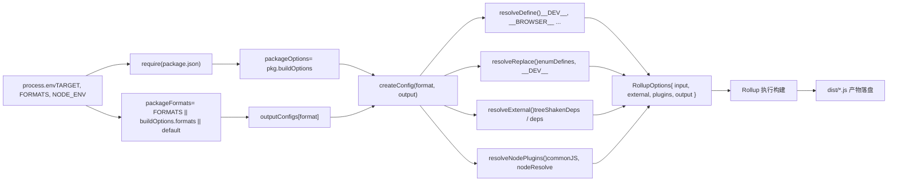

# 第 2 章：主幹生命週期：一次建置請求的端到端旅程

上一章我們釐清了 core 倉庫作為工程化母體的定位，以及 pnpm workspace 與根級配置如何統一約束所有子包。現在，我們深入建置系統的核心，追蹤一條命令如何驅動整個建置流程。`node scripts/build.js vue`看似簡單，卻是所有產物——esm-bundler、cjs、global——的唯一入口。理解它如何將使用者意圖翻譯成可執行的建置任務，是掌握 Vue 建置機制的關鍵一步。

# Rollup 配置生成：從環境變數到多格式產物

`build.js`透過`exec`啟動 Rollup 後，控制權轉移到`rollup.config.js`。這個檔案是建置系統的「大腦」——它讀取環境變數，動態生成 Rollup 配置物件陣列。

## 環境變數校驗與包定位

[FACT:rollup.config.js:27-29]

如果`TARGET`未設定，直接拋錯。這是防禦性編程：Rollup 配置可能被直接呼叫（如`rollup -c`），此時沒有`build.js`注入環境變數，必須快速失敗。

[FACT:rollup.config.js:32-44]

這裡重複了`build.js`中的私有包判斷邏輯——因為`rollup.config.js`是獨立進程，無法共享`build.js`的記憶體狀態。`resolve`函式把相對路徑解析為包目錄下的絕對路徑，`pkg`是目標包的`package.json`內容，`packageOptions`是其中的`buildOptions`欄位，`name`是產物檔案名前綴（優先使用`buildOptions.filename`，否則使用目錄名）。

## 格式映射表：`outputConfigs`

[FACT:rollup.config.js:58-88]

這張表定義了 7 種格式到輸出配置的映射。關鍵觀察：

- `esm-bundler`、`esm-browser`、`esm-bundler-runtime`、`esm-browser-runtime`都是`format: 'es'`，區別只在檔案名。
- `cjs`是`format: 'cjs'`。
- `global`和`global-runtime`是`format: 'iife'`（立即執行函式表達式），適合`<script>`標籤直接引入。
- `runtime`後綴的格式只對主`vue`包有意義——它們不包含編譯器，體積更小。

## 格式選擇：三層優先級

[FACT:rollup.config.js:91-92]

格式選擇遵循三層優先級：命令列`FORMATS`環境變數 > 包的`buildOptions.formats`> 預設`['esm-bundler', 'cjs']`。`PROD_ONLY`環境變數控制是否跳過基礎配置——如果只建置生產版本，基礎配置陣列為空，後續只推入生產配置。

## 生產配置的追加邏輯

[FACT:rollup.config.js:97-114]

當`NODE_ENV === 'production'`時，對每個格式：

- 如果`packageOptions.prod === false`，跳過（該包不需要生產版本）。
- 如果是`cjs`，追加`createProductionConfig`——生成`.prod.js`檔案。
- 如果匹配`/^(global|esm-browser)(-runtime)?/`，追加`createMinifiedConfig`——生成壓縮版。

> **[Design Inference & Architectural Trade-offs]**
> 為什麼`cjs`用`createProductionConfig`而`global`/`esm-browser`用`createMinifiedConfig`？因為 CJS 是給 Node 用的，Node 環境不需要壓縮（使用者自己會處理），但需要區分 dev/prod 分支；而瀏覽器直接引入的產物必須壓縮以減小體積。這個差異體現在兩個工廠函式的實作上。

## `createConfig`：配置生成的核心

`createConfig`是最大的函式，它接收格式和輸出配置，回傳完整的 Rollup 配置物件。

[FACT:rollup.config.js:125-142]

開頭是一系列布林標誌位的計算：

- `isProductionBuild`：透過`__DEV__`環境變數或檔案名是否含`.prod.js`判斷。
- `isBundlerESMBuild`、`isBrowserESMBuild`、`isCJSBuild`、`isGlobalBuild`：透過格式名正則匹配。
- `isServerRenderer`：包名是否為`server-renderer`。
- `isCompatPackage`、`isCompatBuild`：Vue 2 相容建置相關。
- `isBrowserBuild`：全域建置或瀏覽器 ESM 建置，且未啟用非瀏覽器分支。

這些標誌位在後續的`resolveDefine`、`resolveReplace`、`resolveExternal`中被反覆使用，是配置差異化的核心依據。

[FACT:rollup.config.js:144-157]

輸出配置的基礎設定：banner 版權頭、`exports`模式（compat 包用`auto`，其餘用`named`）、CJS 建置啟用`esModule`互操作、sourcemap 由環境變數控制、`externalLiveBindings: false`和`reexportProtoFromExternal: false`是 Rollup 4 的相容性設定。全域建置額外設定`output.name`，即掛載到`window`上的變數名。

## 入口檔案選擇

[FACT:rollup.config.js:159-168]

預設入口是`src/index.ts`，但`runtime`後綴的格式用`src/runtime.ts`。compat 套件的 ESM 建置需要同時匯出 default 和 named，所以用單獨的`esm-index.ts` / `esm-runtime.ts`進入點。

## 巨集定義：`resolveDefine`

[FACT:rollup.config.js:170-218]

`resolveDefine`回傳一個替換表，把原始碼中的`__COMMIT__`、`__VERSION__`、`__BROWSER__`等巨集替換為字面量。這些巨集在原始碼中用於條件編譯——例如`if (__DEV__) { ... }`在生產建置中會被替換為`if (false) { ... }`，進而被 Tree-shaking 移除。

關鍵設計：`__FEATURE_OPTIONS_API__`、`__FEATURE_PROD_DEVTOOLS__`等特性開關在`esm-bundler`建置中保留為`__VUE_OPTIONS_API__`這樣的識別符，讓最終使用者可以透過打包器配置覆寫；而在其他建置中直接硬編碼為`true`或`false`。

[FACT:rollup.config.js:203-206]

非`esm-bundler`建置硬編碼`__DEV__`，因為它們的 dev/prod 分支在建置時就已確定。

[FACT:rollup.config.js:210-216]

最後一步允許環境變數覆寫任何巨集定義，支援`__RUNTIME_COMPILE__=true pnpm build runtime-core`這樣的內聯覆寫。

## 替換外掛：`resolveReplace`

[FACT:rollup.config.js:222-255]

`resolveReplace`在`resolveDefine`之外處理 esbuild 無法處理的替換：

- 合併`enumDefines`（來自`inlineEnums`的列舉內聯定義）。
- 生產瀏覽器建置中，給錯誤建立函式加`/*@__PURE__*/`註解，幫助 Tree-shaking。
- `esm-bundler`建置中，`__DEV__`替換為`!!(process.env.NODE_ENV !== 'production')`，讓打包器決定。
- 瀏覽器 ESM 建置中，把`process.env`替換為空物件，避免瀏覽器報錯。

## 外部依賴：`resolveExternal`

[FACT:rollup.config.js:257-283]

這是上一章結尾思考題的核心。瀏覽器建置只回傳`treeShakenDeps`作為 external——這些依賴雖然被 import，但在瀏覽器分支中不會被實際執行，列在這裡只是為了抑制 Rollup 的警告。Node/ESM-bundler 建置則 externalize 所有`dependencies`和`peerDependencies`，以及`path`、`url`、`stream`等 Node 內建模組。

## 最終配置物件

[FACT:rollup.config.js:319-352]

回傳的配置物件包含：

- `input`：進入點檔案絕對路徑。
- `external`：外部依賴列表。
- `plugins`：外掛陣列，順序為 json → alias → enumPlugin → replace → esbuild → nodePlugins。
- `output`：輸出配置。
- `onwarn`：過濾掉`CIRCULAR_DEPENDENCY`警告（Vue 原始碼中存在循環依賴，但執行時無害）。
- `treeshake.moduleSideEffects: false`：告訴 Rollup 所有模組都沒有副作用，激進 Tree-shaking。

下圖展示了從環境變數到最終配置的資料流：

# 產物落盤與體積檢查

## `exec`的行程管理

`build.js`透過`exec`啟動 Rollup 子行程：

[FACT:scripts/utils.js:64-114]

`exec`封裝了`spawn`，回傳一個 Promise。關鍵設計：

- `stdio`預設是`['ignore', 'pipe', 'pipe']`——stdin 忽略，stdout/stderr 管道捕獲。
- `shell: process.platform === 'win32'`——Windows 上需要 shell 才能正確解析命令。
- 透過`stderrChunks`和`stdoutChunks`陣列收集輸出，在`exit`事件中拼接。
- 退出碼為 0 時 resolve，否則 reject 並附帶 stderr 內容。

> **[Design Inference & Architectural Trade-offs]**
> 注意`build.js`呼叫`exec`時傳了`{ stdio: 'inherit' }`，這會覆寫預設的管道配置，讓 Rollup 的輸出直接透傳到終端。這是建置工具的正確行為——使用者需要即時看到建置進度。

## 體積檢查：`checkAllSizes`

[FACT:scripts/build.js:206-215]

體積檢查有兩個跳過條件：`devOnly`為真，或指定了格式但不含`global`。因為體積檢查只針對全域建置產物——那是最終使用者直接引入的檔案，體積最敏感。

[FACT:scripts/build.js:222-228]

`checkSize`檢查兩個檔案：`${target}.global.prod.js`和`${target}.runtime.global.prod.js`（後者僅在未指定格式或指定了`global-runtime`時檢查）。

[FACT:scripts/build.js:235-264]

`checkFileSize`讀取檔案，用`gzipSync`和`brotliCompressSync`計算壓縮後大小，用`prettyBytes`格式化輸出。如果`writeSize`為真，把結果寫入`temp/size/${fileName}.json`——這是 CI 中體積預算檢查的資料來源。

## 型別宣告建置

[FACT:scripts/build.js:94-108]

如果`buildTypes`為真，呼叫`pnpm run build-dts`，並透過`--environment TARGETS:...`傳遞目標列表。這確保只為實際建置的套件生成型別宣告。

# 設計思考與生產踩坑

**為什麼用`--environment`而不是直接傳參？**Rollup 的`--environment`是唯一能在配置檔案中透過`process.env`讀取的傳參方式。直接傳`--config`參數需要解析`process.argv`，而`--environment`提供了結構化的鍵值對解析。

**`fuzzyMatchTarget`的正則陷阱。** `target.match(partialTarget)`中`partialTarget`是使用者輸入。如果使用者輸入`runtime-core`，`-`在正則中是字面量，沒問題；但如果輸入`runtime.core`，`.`會匹配任意字元，可能匹配到意外目標。這是模糊匹配的固有風險，但 Vue 的套件名不含正則特殊字元，實際不會觸發。

**並行建置的資源競爭。** `runParallel`用`cpus().length`作為並行上限，但每個 Rollup 行程本身也會啟動 worker。在 CI 的低核數容器中，這可能導致記憶體溢出。生產環境中如果遇到 OOM，可以透過`--max-old-space-size`或減少並行數緩解。

**`scanEnums`的快取生命週期。** `removeCache`在`finally`中呼叫，但如果`scanEnums`本身拋錯，`removeCache`不會被賦值，`finally`中的呼叫會失敗。實際上`scanEnums`回傳的函式在`try`之前就已確定，所以這個風險不存在——但這是閱讀時需要確認的時序細節。

**`resolveExternal`的遺漏風險。**上一章的思考題已經指出：如果給`runtime-core`添加新依賴但忘記更新`resolveExternal`，瀏覽器建置會把該依賴打包進去（因為不在 external 列表中），導致體積膨脹。這是「白名單 external」策略的固有代價。

# 本章小結

一次`node scripts/build.js vue`的完整旅程：

1. `parseArgs`解析命令列，`commit`同步取得。

2. `run()`呼叫`scanEnums`生成列舉快取，解析目標（`fuzzyMatchTarget`或`allTargets`）。

3. `buildAll`透過`runParallel`並行調度`build`。

4. `build`定位套件目錄、讀取`package.json`、過濾私有套件、清理`dist`、拼裝`--environment`參數、呼叫`exec`啟動 Rollup。

5. `rollup.config.js`讀取環境變數，透過`createConfig`生成配置陣列，`resolveDefine`/`resolveReplace`/`resolveExternal`分別處理巨集、替換和外部依賴。

6. Rollup 執行建置，產物落盤到`dist/`。

7. `checkAllSizes`計算 gzip/brotli 體積，可選寫入`temp/size/`。

8. 如果`--withTypes`，呼叫`build-dts`生成型別宣告。

# 本章思考與自測

Q1: 在`build.js`的`build`函式中，`if (!formats && fs.existsSync(...))`這個條件決定了是否刪除`dist`目錄。如果去掉`!formats`這個條件（即無論是否指定格式都刪除`dist`），在`pnpm build-all-cjs`這樣的腳本中會發生什麼？

**參考解析**：

[FACT:scripts/build.js:172-175]

`pnpm build-all-cjs`對應`node scripts/build.js vue runtime compiler reactivity shared -af cjs`（見[FACT:package.json:40]）。它指定了`-f cjs`，所以`formats`為`'cjs'`，`!formats`為假，當前邏輯不會刪除`dist`。

如果去掉`!formats`，每次建置都會刪除`dist`。但`build-all-cjs`只建置`cjs`格式，刪除後`dist`中只剩`cjs`產物，之前建置的`esm-bundler`、`global`等格式全部遺失。更嚴重的是，`build-runtime-esm`、`build-browser-esm`等腳本會依次執行（見[FACT:package.json:39]的`build-sfc-playground`腳本），每個腳本都會刪除前一個腳本的產物，導致最終`dist`中只有最後一個腳本的格式。這會破壞 SFC Playground 的建置——它需要同時存在多種格式的產物。

Q2: `runParallel`中`if (maxConcurrency <= source.length)`這個條件的作用是什麼？如果去掉它，在建置單個套件（`targets.length === 1`）時會發生什麼？

**參考解析**：

[FACT:scripts/build.js:131-151]

這個條件控制是否啟用並行限流。當`maxConcurrency > source.length`時，不需要限流——所有任務可以同時啟動。如果去掉這個條件，即使只有一個任務，也會建立`executing`陣列並執行`await Promise.race(executing)`。

對於單個任務，`executing`中只有一個 Promise`e`，`Promise.race`會等待它完成。這不會導致錯誤，但會引入不必要的 Promise 鏈和微任務排程開銷。更重要的是，`executing.splice(executing.indexOf(e), 1)`在單任務場景下仍然正確工作，所以功能上無差異，只是效能上的微小損失。

真正的風險在於：如果`maxConcurrency`為 0（理論上不可能，因為`cpus().length`至少為 1），`executing.length >= 0`永遠為真，`Promise.race([])`會永遠掛起。但`cpus().length`保證了這個邊界不會觸發。

Q3: `resolveExternal`中，瀏覽器建置返回`treeShakenDeps`作為 external，但這些依賴在瀏覽器分支中不會被實際執行。如果把它們從 external 列表中移除（即讓 Rollup 嘗試打包它們），會發生什麼？

**參考解析**：

[FACT:rollup.config.js:257-283]

`treeShakenDeps`包含`source-map-js`、`@babel/parser`、`estree-walker`、`entities/decode`。這些是`compiler-sfc`等套件的依賴，在瀏覽器建置中透過`__BROWSER__`巨集被條件編譯排除。

如果從 external 中移除，Rollup 會嘗試解析並打包這些依賴。由於`treeshake.moduleSideEffects: false`（[FACT:rollup.config.js:355-355]），且這些依賴的匯入語句位於`if (!__BROWSER__)`分支中，esbuild 的 define 會把`__BROWSER__`替換為`true`，導致分支被標記為死程式碼。Rollup 的 Tree-shaking 會移除這些匯入，最終產物中不會包含這些依賴的程式碼。

但問題在於：Rollup 在 Tree-shaking 之前需要先解析模組。如果這些依賴沒有安裝（例如在精簡的 CI 環境中），Rollup 會報「無法解析模組」的錯誤。把它們列為 external 是一種防禦措施——即使依賴不存在，Rollup 也不會嘗試解析，只是發出警告（而`onwarn`會過濾掉非循環依賴的警告）。

至此，我們完整走過了從命令解析到 Rollup 呼叫的建置旅程，揭示了並行排程、私有套件過濾等核心機制。然而，生產建置只是故事的一半。下一章，我們將轉向開發態鏈路，看`scripts/dev.js`如何與 SFC 預編譯協作，實現毫秒級的開發回饋循環。
