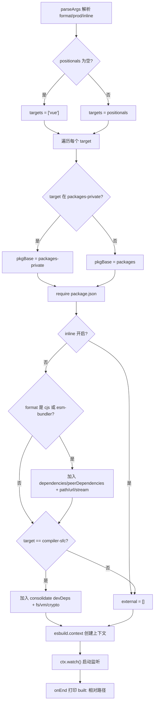
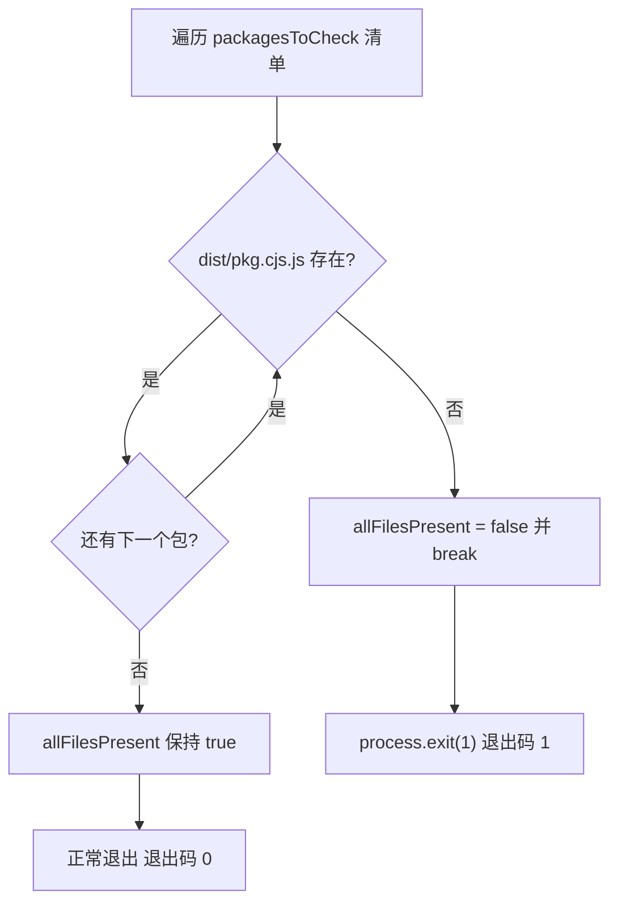
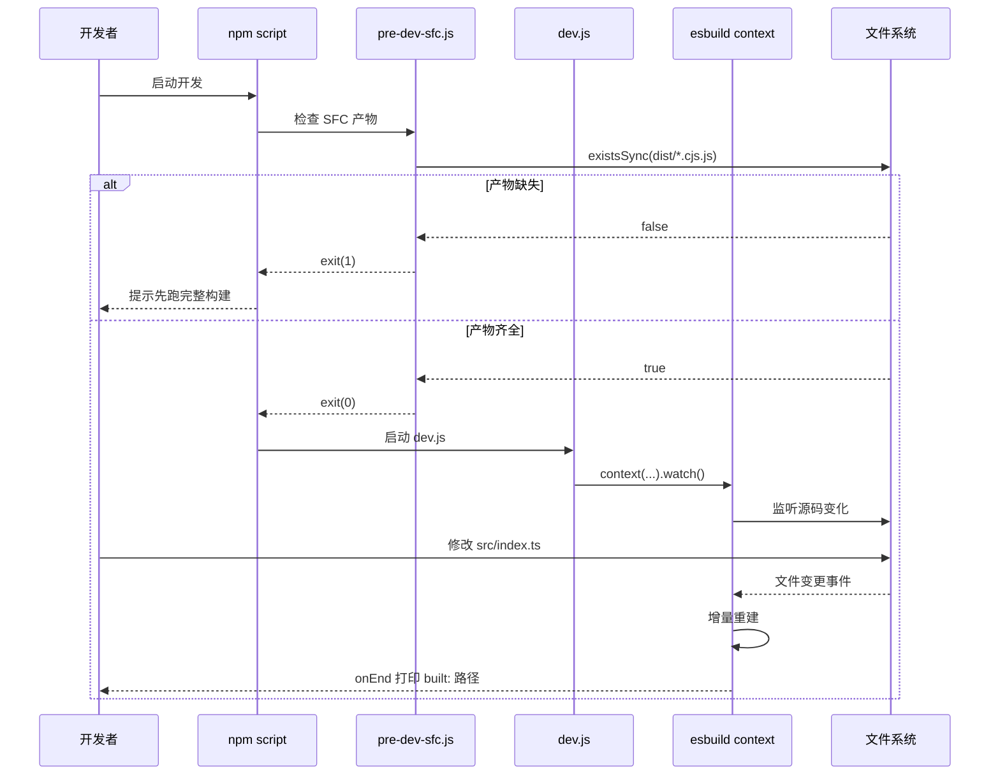

# 第 3 章：開發態鏈路：dev 腳本與 SFC 預編譯的協作機制

上一章我們追蹤了生產建置從參數解析到多格式產物落盤的完整鏈路，那條鏈路追求的是產物的完整與規範。而開發態的核心訴求只有一個：改一行程式碼，瀏覽器裡立刻能看到效果。生產建置那套「解析參數 → 生成配置 → 全量打包 → 落盤」的鏈路，動輒數十秒，完全無法滿足這個訴求。Vue core 倉庫為此維護了一條獨立的開發態鏈路：`scripts/dev.js`用 esbuild 的 watch 模式做增量建置，`scripts/pre-dev-sfc.js`在主建置前預先編譯 SFC 編譯器。本章拆解這兩者的協作機制。

# 3.1 dev.js：用 esbuild 換速度的增量建置器

## 直覺模型

生產建置像「印刷廠正式排版付印」——品質優先，慢一點沒關係；開發建置像「草稿紙上的鉛筆速寫」——不求精美，只求下筆即現。Vue 選擇 esbuild 而非 Rollup 來畫這張速寫，原因寫在檔案開頭的註解裡：Rollup 產物更小、Tree-shaking 更好，但 esbuild 快得多。[FACT:scripts/dev.js:3-5]

若沒有這個腳本，開發者每次改動都得跑一遍完整生產建置，回饋循環從毫秒級退化到分鐘級，熱更新體驗蕩然無存。

## 參數解析與格式推導

腳本入口用 Node 內建的`parseArgs`解析三個選項：`format`（預設`global`）、`prod`（預設`false`）、`inline`（預設`false`）。[FACT:scripts/dev.js:18-40]位置參數被收集為`targets`，若為空則預設為`['vue']`。[FACT:scripts/dev.js:42-53]

> **[Design Inference & Architectural Trade-offs]**
> 這裡有個容易忽略的細節：`rawFormat`與`format`是兩次賦值。`parseArgs`的`default: 'global'`已經保證了`rawFormat`有值，但腳本仍寫了`const format = rawFormat || 'global'`作為兜底。[FACT:scripts/dev.js:42]這是防禦性寫法，避免`parseArgs`行為變化或顯式傳入空字串時下游`format.startsWith`拋錯。

`format`到 esbuild 輸出格式的映射是三路分支：以`global`開頭映射為`iife`，等於`cjs`映射為`cjs`，其餘一律`esm`。[FACT:scripts/dev.js:42-53]產物檔案名後綴則由`-runtime`後綴單獨處理：`global-runtime`會變成`runtime.global`，其餘保持原樣。[FACT:scripts/dev.js:42-53]

## 目標包定位與輸出路徑

腳本先讀取`packages-private`目錄列表，用於判斷目標包屬於公開包還是私有包。[FACT:scripts/dev.js:56]對每個 target，決定包基路徑是`packages`還是`packages-private`，再`require`其`package.json`拿到`version`與`buildOptions`。[FACT:scripts/dev.js:58-63]

輸出檔案名有個特例：`vue-compat`目標會被重命名為`vue`，避免產物叫`vue-compat.global.js`。[FACT:scripts/dev.js:64-69]最終路徑形如`packages/vue/dist/vue.global.js`，`prod`為真時插入`prod.`段。

## external 解析：避免把依賴打進產物

`external`陣列決定哪些模組不被打包。邏輯分兩層：

第一層，當`inline`未開啟且格式為`cjs`或含`esm-bundler`時，把`dependencies`、`peerDependencies`的鍵全部加入 external，並硬編碼`path`、`url`、`stream`三個 Node 內建模組。[FACT:scripts/dev.js:76-88]註解明確說明這三個是為`@vue/compiler-sfc`和`server-renderer`準備的。

第二層，針對`compiler-sfc`目標，額外解析`@vue/consolidate`的`devDependencies`，把它們以及`fs`、`vm`、`crypto`等一併 external。[FACT:scripts/dev.js:90-112]程式碼裡還硬編碼了`react-dom/server`、`teacup/lib/express`、`arc-templates/dist/es5`、`then-pug`、`then-jade`等模板引擎路徑——這些是 consolidate 支援的模板引擎，屬於可選依賴，不能強制安裝。

> **[Design Inference & Architectural Trade-offs]**
> 這段邏輯與`rollup.config.js`高度重複，原始碼註解也承認了這點（`TODO this logic is largely duplicated from rollup.config.js`）。之所以沒有抽公共函式，是因為 dev 與 prod 的 external 策略存在細微差異（dev 更激進地 external 化以加速建置），強行統一反而增加耦合。

## 外掛與 define 注入

外掛陣列預設只有一個`log-rebuild`，在`onEnd`鉤子裡列印建置產物相對路徑。[FACT:scripts/dev.js:115-124]這是開發者感知「改動已生效」的唯一回饋信號。

> **[Design Inference & Architectural Trade-offs]**
> 第二個外掛是條件性的：當格式不是`cjs`且包的`buildOptions.enableNonBrowserBranches`為真時，掛載`polyfillNode()`。[FACT:scripts/dev.js:126-128]這類包（如`compiler-sfc`）在瀏覽器建置中仍會走 Node 分支，需要 Node 內建模組的 polyfill 才能在瀏覽器環境跑通。

`define`區塊是本章資訊密度最高的部分。[FACT:scripts/dev.js:141-159]它把原始碼裡所有`__XXX__`巨集替換為字面量：

- `__COMMIT__`固定為`"dev"`，`__VERSION__`取包版本；
- `__DEV__`由`prod`標誌決定，`__TEST__`恆為`false`；
- `__BROWSER__`的推導最微妙：`format !== 'cjs' && !pkg.buildOptions?.enableNonBrowserBranches`。[FACT:scripts/dev.js:146-148]也就是說，只有「非 cjs 且包不支援非瀏覽器分支」才標記為瀏覽器環境；
- `__SSR__`為`format !== 'global'`，即 global 建置不啟用 SSR 分支；
- `__COMPAT__`由 target 是否為`vue-compat`決定；
- 三個 feature flag（`__FEATURE_SUSPENSE__`、`__FEATURE_OPTIONS_API__`、`__FEATURE_PROD_DEVTOOLS__`、`__FEATURE_PROD_HYDRATION_MISMATCH_DETAILS__`）在 dev 模式下全部寫死。

這些巨集與`vitest.config.ts`中的`define`區塊一一對應。[FACT:vitest.config.ts:6-21]測試環境把`__TEST__`設為`true`、`__DEV__`設為`true`，與 dev 建置的差異正是「測試 vs 開發」兩種運行態的區分點。

## watch 模式啟動

最後一步是`esbuild.context(...).then(ctx => ctx.watch())`。[FACT:scripts/dev.js:130-161] `context`建立建置上下文但不立即執行，`watch()`才真正啟動檔案監聽。此後 esbuild 內部維護依賴圖，任何被依賴檔案變化都會觸發增量重建，重建完成回呼`onEnd`列印日誌。

# 3.2 pre-dev-sfc.js：破解循環依賴的預編譯哨兵

## 直覺模型

想像一個「雞生蛋」困局：`compiler-sfc`的原始碼裡 import 了`compiler-core`，而`compiler-core`在開發態又需要`compiler-sfc`來處理`.vue`檔案。如果兩者都靠 esbuild watch 即時編譯，誰先編譯誰就卡死。`pre-dev-sfc.js`的角色就是「先孵出蛋，再養雞」——在主建置啟動前，確保這幾個包的 CJS 產物已經存在。

## 檢查清單與短路邏輯

腳本維護一個固定清單：`compiler-sfc`、`compiler-core`、`compiler-dom`、`compiler-ssr`、`shared`。[FACT:scripts/pre-dev-sfc.js:4-10]對每個包，檢查`packages/${pkg}/dist/${pkg}.cjs.js`是否存在。[FACT:scripts/pre-dev-sfc.js:4-23]

只要有一個缺失，`allFilesPresent`置為`false`並立即`break`，不再檢查剩餘包。[FACT:scripts/pre-dev-sfc.js:20-21]最後若`allFilesPresent`為假，`process.exit(1)`以非零碼退出。[FACT:scripts/pre-dev-sfc.js:25-27]

## 退出碼的語義

這個腳本本身不執行任何編譯，它只做「存在性斷言」。`exit(1)`是給上層呼叫者（通常是 npm script 的`&&`鏈或 CI 腳本）看的信號：產物不全，需要先跑一次完整建置。若全部存在則正常退出（退出碼 0），主建置繼續。

# 3.3 aliases.js 與 vitest.config.ts：開發態鏈路的另一半

`scripts/dev.js`解決的是「產物怎麼快速生成」，但開發時還有另一條路徑：跑測試。`scripts/aliases.js`為 vitest 和 rollup 提供共享的路径別名。[FACT:scripts/aliases.js:7-7]

## 別名生成邏輯

`resolveEntryForPkg`把包名映射到`packages/${p}/src/index.ts`。[FACT:scripts/aliases.js:7-7]基礎 entries 硬編碼了四個特殊映射：`vue`、`vue/compiler-sfc`、`vue/server-renderer`、`@vue/compat`。[FACT:scripts/aliases.js:16-21]

隨後遍歷`packages`目錄下所有子目錄，跳過`vue`本身、跳過`nonSrcPackages`（`sfc-playground`、`template-explorer`、`dts-test`）、跳過已存在的 key，且必須是目錄，才加入`@vue/${dir}`映射。[FACT:scripts/aliases.js:23-35]

> **[Design Inference & Architectural Trade-offs]**
> 這套「硬編碼特殊項 + 動態掃描通用項」的策略，是為了讓新增包無需手動改別名檔案——只要目錄名符合規範，vitest 自動能解析。`nonSrcPackages`排除清單則是因為這三個套件沒有`src/index.ts`入口，強行映射會導致解析失敗。

## vitest 的 define 與別名消費

`vitest.config.ts`直接 import`entries`作為`resolve.alias`。[FACT:vitest.config.ts:3][FACT:vitest.config.ts:22-24]其`define`區塊與 dev.js 的巨集注入形成對照：測試環境`__DEV__: true`、`__TEST__: true`、`__BROWSER__: false`、`__CJS__: true`。[FACT:vitest.config.ts:6-21]

測試被拆成五個 project：`unit`、`unit-gc`、`unit-jsdom`、`e2e`、`e2e-browser`。[FACT:vitest.config.ts:51-118]其中`unit-gc`用`pool: 'forks'`並傳`--expose-gc`，專門跑需要手動觸發 GC 的 SSR 測試。[FACT:vitest.config.ts:65-76] `e2e-browser`則啟用 playwright 的 chromium 實例，跑 Transition 相關測試。[FACT:vitest.config.ts:99-117]

# 設計思考

**為什麼 dev 用 esbuild 而 prod 用 Rollup？**這不是技術選型的隨意，而是兩種場景的約束不同。開發態對產物大小不敏感，對回饋延遲極度敏感；生產態反之。esbuild 用 Go 編寫、平行化程度高，冷啟動和增量建置都快一個數量級，但它的 Tree-shaking 和程式碼分割能力弱於 Rollup。[FACT:scripts/dev.js:3-5]用兩套工具分別服務兩種場景，是工程上的務實取捨。

> **[Design Inference & Architectural Trade-offs]**
> **pre-dev-sfc 為什麼只檢查不編譯？**如果它自己觸發編譯，就又把循環依賴引回來了——它要編譯`compiler-sfc`，而編譯過程本身可能依賴`compiler-sfc`的產物。所以它只能做「斷言」，把「缺產物」這個事實暴露給上層，由上層決定是跑完整建置還是報錯退出。 這是一種「哨兵模式」：不解決問題，只報告問題。

**external 列表的重複是技術債嗎？**dev.js 與 rollup.config.js 的 external 邏輯重複，原始碼註解也承認了。[FACT:scripts/dev.js:73]但兩者的 external 集合並不完全一致——dev 為了速度會更激進地 external 化。強行抽公共函式需要引入參數化的差異開關，反而讓兩處邏輯都更難讀。這是「重複優於錯誤抽象」的典型權衡。

# 本章小結

本章拆解了 Vue core 開發態鏈路的三塊拼圖：

1. **`scripts/dev.js`**：用 esbuild 的`context().watch()`實現增量建置，透過`parseArgs`解析格式與旗標位，動態`require`目標套件`package.json`定位輸出路徑，注入`__DEV__`、`__BROWSER__`等巨集控制條件編譯，並用`log-rebuild`外掛在每次重建後列印回饋。

2. **`scripts/pre-dev-sfc.js`**：在主建置前檢查五個核心套件的 CJS 產物是否存在，缺失則以退出碼 1 短路，避免循環依賴導致的建置死鎖。

3. **`scripts/aliases.js` + `vitest.config.ts`**：為測試鏈路提供共享路徑別名，硬編碼特殊項加動態掃描通用項，配合多 project 配置覆蓋單元、GC、jsdom、e2e、瀏覽器 e2e 五種測試場景。

# 本章思考與自測

Q1: 若把`scripts/pre-dev-sfc.js`中的`break`去掉（即檢查完所有套件再決定退出），在什麼場景下會導致開發者體驗變差？為什麼原始碼作者選擇「發現第一個缺失就短路」？

**參考解析**：

[FACT:scripts/pre-dev-sfc.js:4-23]

`break`位於`if (!fs.existsSync(...))`分支內，一旦發現某個套件產物缺失就立即跳出迴圈。

若去掉`break`，腳本會繼續檢查剩餘套件，最終`allFilesPresent`仍為`false`，退出碼仍是 1，**功能上等價**。但差異在於：

1. **效能**：五個`existsSync`呼叫本身很快，但若清單擴展到幾十個套件，短路能省下大量無謂的 stat 系統呼叫。

2. **語意**：短路表達的是「只要有一個缺失，整體就不完整」——這是一個布林斷言，不需要知道具體缺幾個。繼續檢查不產生額外資訊。

3. **開發者體驗**：實際上變差的是「報錯資訊」。當前腳本不列印哪個套件缺失，開發者只看到退出碼 1。若去掉`break`並加上日誌，反而能告訴開發者「缺 compiler-core 和 shared」——但這需要額外程式碼。作者選擇最簡實現，把「缺哪個」的診斷留給上層建置腳本的報錯。

所以`break`的核心動機是「斷言語意 + 效能」，而非體驗優化。

Q2: `scripts/dev.js`中`__BROWSER__`的推導是`format !== 'cjs' && !pkg.buildOptions?.enableNonBrowserBranches`。假設某個套件的`buildOptions.enableNonBrowserBranches`為`true`，且開發者用`-f global`建置，此時`__BROWSER__`為`false`。這會導致什麼後果？如果誤改為`true`會怎樣？

**參考解析**：

[FACT:scripts/dev.js:146-148]

當`format = 'global'`且`enableNonBrowserBranches = true`時：

- `format !== 'cjs'`為`true`
- `!pkg.buildOptions?.enableNonBrowserBranches`為`false`
- 整體`__BROWSER__ = false`

這意味著原始碼中所有`if (__BROWSER__)`分支被 esbuild 的 define 替換為`if (false)`，瀏覽器專屬程式碼被 Tree-shaking 移除，非瀏覽器分支（Node 專屬邏輯）被保留。

**後果**：global 建置產物本應跑在瀏覽器裡，卻包含了 Node 專屬分支。若這些分支引用了`fs`、`path`等 Node 內建模組，瀏覽器載入時會報「模組未定義」。這正是為什麼`enableNonBrowserBranches`為真的套件（如`compiler-sfc`）通常不用於 global 建置，或者需要`polyfillNode()`外掛兜底。[FACT:scripts/dev.js:126-128]

**若誤改為`true`**：`__BROWSER__ = true`，瀏覽器分支被保留，Node 分支被移除。對於`compiler-sfc`這類必須在 Node 環境跑 SFC 編譯的套件，會導致核心功能（讀取檔案、呼叫 Node API）被 Tree-shaking 掉，產物在 Node 裡執行時報「函式未定義」。

Q3: `scripts/aliases.js`中，動態掃描`packages`目錄時跳過了`nonSrcPackages`（`sfc-playground`、`template-explorer`、`dts-test`）。如果某個新套件被加入`packages`目錄但沒有`src/index.ts`，且未被加入`nonSrcPackages`，會發生什麼？vitest 執行時會在哪個環節報錯？

**參考解析**：

[FACT:scripts/aliases.js:23-35]

動態掃描邏輯是：對每個目錄，若`dir !== 'vue'`、不在`nonSrcPackages`、key 未存在、且是目錄，就加入`entries['@vue/${dir}'] = resolveEntryForPkg(dir)`。

`resolveEntryForPkg`返回的是`packages/${p}/src/index.ts`的路徑。[FACT:scripts/aliases.js:7-7]注意它**不檢查檔案是否存在**，只是拼接路徑。

**後果**：別名會被註冊，但指向一個不存在的檔案。vitest 在解析 import 時，若某個測試檔案 import 了這個套件，Vite 的 resolve 外掛會嘗試載入該路徑，報「無法解析模組」或「檔案不存在」。

**報錯環節**：不是在`aliases.js`執行時（它只做字串拼接），而是在 vitest 啟動後、首次解析到該 import 時。若沒有任何測試 import 這個套件，則不會報錯——別名只是躺在`entries`物件裡。

**規避方式**：把這類無`src/index.ts`的套件加入`nonSrcPackages`，或者確保新套件有標準入口。這也是為什麼`nonSrcPackages`需要手動維護——它是「約定優於配置」的例外清單。

三者協作的邊界很清晰：`pre-dev-sfc`管「產物是否就緒」，`dev.js`管「產物如何快速更新」，`aliases`管「測試如何解析原始碼」。開發態鏈路解決了速度問題，但建置期還有另一類更隱蔽的最佳化——那些在程式碼被瀏覽器執行之前就完成的轉換。下一章將進入編譯期魔法，看列舉內聯與 Tree-shaking 驗證機制如何在建置期把 TypeScript enum 替換為字面量，並確保按需引入的承諾不被破壞。
