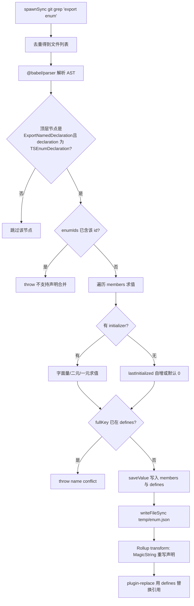
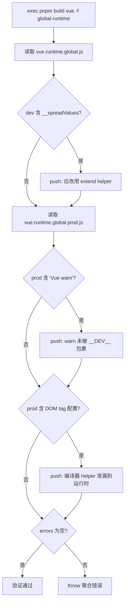

# 第 4 章：編譯期魔法：列舉內聯與 Tree-shaking 驗證機制

上一章我們看到開發態鏈路如何用檔案監聽與增量建置換取「改一行立即生效」的速度。但速度之外，Vue 還有一條更隱蔽的約束：發布產物的體積必須可控。這條約束的敵人之一，是 TypeScript 的 enum——它在執行時是一個真實存在的物件，會破壞 Tree-shaking。本章進入編譯期，看 scripts/inline-enums.js 如何在程式碼被瀏覽器執行之前，把列舉「溶解」成字面量；再看 scripts/verify-treeshaking.js 如何在建置之後，用產物字串反向驗證「按需引入」的承諾沒有被悄悄破壞。

# 4.1 列舉內聯：把執行時物件溶解成字面量

## 直覺模型

想像你寫了一份食譜，裡面反覆出現「少許鹽」。如果每次做菜都要翻到附錄去查「少許 = 3 克」，既慢又佔地方。列舉內聯做的事，就是在印刷前把全書的「少許鹽」直接替換成「3 克鹽」，然後把附錄那一頁撕掉。對讀者（執行時）而言，結果完全一樣，但書更薄了。

若沒有它，系統會面臨什麼災難？TypeScript 的普通`enum`編譯後會生成一個真實的物件字面量，並且帶有雙向映射（`Enum[Enum.A] === 'A'`）。這個物件是**有副作用的模組級宣告**，Rollup 無法證明它未被使用，於是只能保留——哪怕你只 import 了其中一個成員，整個列舉物件連同反向映射都會被塞進產物。[FACT:scripts/inline-enums.js:3-9]的註解說得很直白：他們曾用`const enum`，但因 issue #1228 改用普通 enum，於是用這個腳本「手動找回 const enum 的零成本收益」。

## 資料結構與記憶體佈局

腳本的核心是三個型別定義，理解它們就理解了整個資料流。[FACT:scripts/inline-enums.js:33-36]

- `EnumMember`：`{ name, value }`，單個列舉成員的名字與求值後的字面量。
- `EnumDeclaration`：`{ id, range: [start, end], members }`。`range`是**原始碼位元組偏移**，指向`export enum X { ... }`整段宣告在檔案中的起止位置——這是後續 MagicString 精確替換的錨點。
- `EnumData`：`{ declarations, defines }`。`declarations`按檔案路徑索引，記錄該檔案裡所有列舉宣告的替換範圍；`defines`是一個扁平映射，鍵是 `` `${列舉名}.${成員名}` `` 形式的字符串，值是 `JSON.stringify` 後的字面量。

這裡有個關鍵設計：`defines`的鍵**不含檔案路徑**。[FACT:scripts/inline-enums.js:98-103]註解解釋了原因——`ErrorCodes`可以同時存在於`@vue/compiler-core`和`@vue/runtime-core`，所以允許同名列舉跨檔案存在；但同一個`ErrorCodes.__EXTEND_POINT__`不允許在兩個同名列舉裡重複，否則`fullKey in defines`命中，直接拋`name conflict`。這是一個「按成員名全域唯一」的約束，而非「按列舉名全域唯一」。

快取落在`temp/enum.json`。[FACT:scripts/inline-enums.js:33-36]為什麼需要落盤？因為`scanEnums()`在建置入口只呼叫一次，而 Rollup 會為每個套件、每種格式啟動**獨立的行程**。[FACT:scripts/inline-enums.js:39-41]註解點明：資料要跨並發的 Rollup 行程共享，所以必須序列化到磁碟，由各行程的`inlineEnums()`讀回。

## Step-by-Step：從 grep 到字面量替換

**第一步：grep 出所有含`export enum`的檔案。**[FACT:scripts/inline-enums.js:51-61]用`spawnSync('git', ['grep', 'export enum'])`，輸出形如`path:line:content`，再按`:`切出第一段（檔案路徑），用`Set`去重。注意這裡用的是`git grep`而非遍歷檔案系統——它天然只掃被 Git 追蹤的檔案，自動排除`node_modules`與建置產物。

**第二步：Babel 解析並收集列舉資訊。**[FACT:scripts/inline-enums.js:64-70]對每個檔案用`@babel/parser`以`typescript`外掛、`sourceType: 'module'`解析成 AST，然後只遍歷`ast.program.body`的頂層節點。[FACT:scripts/inline-enums.js:74-79]只認`ExportNamedDeclaration`且其`declaration.type === 'TSEnumDeclaration'`的節點——也就是說，**非匯出的 enum 不會被處理**。

對每個列舉宣告，腳本逐成員求值。成員求值分三條路徑：

1. **字面量初始化**：`StringLiteral`或`NumericLiteral`直接取`init.value`。[FACT:scripts/inline-enums.js:114-119]

2. **二元表達式**：如`1 << 2`。遞迴`resolveValue`處理左右運算元，運算元可以是字面量，也可以是`MemberExpression`（即引用前面已定義的列舉成員）。[FACT:scripts/inline-enums.js:121-151]關鍵在`MemberExpression`分支：它用`content.slice(node.start, node.end)`從**原始原始碼文字**裡切出表達式字串（如`ErrorCodes.FOO`），再查`defines`。若查不到就拋`unhandled enum initialization expression`。[FACT:scripts/inline-enums.js:132-141]這解釋了為什麼`defines`必須是全域扁平映射——跨列舉引用時，被引用者可能來自另一個檔案，但鍵只認`枚举名.成员名`。

3. **一元表達式**：如`-1`，拼成`-1`字串後用`evaluate`求值。[FACT:scripts/inline-enums.js:152-163]

求值本身用的是`new Function('return ' + exp)()`。[FACT:scripts/inline-enums.js:39-41]這是一個**受控的 eval**：輸入來自原始碼裡已解析的 AST 片段，不是任意使用者輸入，所以安全邊界可控。

**第三步：處理無初始化器的成員（自增語意）。**[FACT:scripts/inline-enums.js:171-183]若成員沒有`initializer`：第一個成員預設`0`；後續成員若`lastInitialized`是數字則`++`；若是字串則拋`wrong enum initialization sequence`——因為字串列舉成員不允許隱式自增。這正是 TypeScript 列舉的語意。

**第四步：寫快取並回傳清理函式。**[FACT:scripts/inline-enums.js:200-213] `scanEnums()`回傳一個閉包，呼叫即`rmSync`刪除快取檔案。`build.js`在`try/finally`裡使用它。[FACT:scripts/build.js:81-112]這保證了即使建置中途拋錯，快取也會被清理，不會污染下一次建置。

**第五步：Rollup transform 階段替換。** `inlineEnums()`讀回快取，建構一個 Rollup 外掛。[FACT:scripts/inline-enums.js:219-234]在`transform(code, id)`中，若`id`命中`enumData.declarations`，就用 MagicString 把`[start, end]`這段宣告替換成物件字面量。[FACT:scripts/inline-enums.js:242-274]

替換後的形態是`export const X = { ... }`。注意它**不是簡單地刪掉列舉**，而是重寫成物件字面量，並且對數字成員額外生成反向映射：`JSON.stringify(value.toString()) + ': ' + JSON.stringify(name)`。[FACT:scripts/inline-enums.js:257-270]註解引用了 TypeScript 官方文件的 reverse-mappings 規則：字串列舉成員不生成反向映射，數字成員生成。這保證了替換後執行時行為與原 enum 完全一致。

而真正消除執行時開銷的，是`defines`被交給`@rollup/plugin-replace`。[FACT:rollup.config.js:222-223]所有對`X.Member`的**引用**在替換外掛裡被直接換成字面量，於是那個重寫出來的物件字面量如果沒人用，就能被 Tree-shaking 搖掉。

下面這張流程圖刻畫了從 grep 到替換的完整決策路徑：

## 設計思考與踩坑

**為什麼用 MagicString 而不是重新生成整個檔案？**因為`s.update(start, end, ...)`只替換列舉宣告那一段，其餘原始碼位元組完全不動，`s.generateMap()`還能生成精確的 sourcemap。[FACT:scripts/inline-enums.js:277-281]若用 Babel 重新列印整個 AST，會遺失原始格式、註解，且 sourcemap 品質下降。

**`range`為何是`node.start/node.end`而非`declaration.start`？**[FACT:scripts/inline-enums.js:189-193]斷言的是`node.start`（即`ExportNamedDeclaration`節點），替換範圍覆蓋`export enum X {...}`整段，包括`export`關鍵字。替換文字以`export const`開頭，正好接續。

**踩坑點：`defines`的全域唯一性約束。**如果兩個不同檔案裡各有一個`ErrorCodes`，且都定義了`__EXTEND_POINT__`，建置會直接失敗。[FACT:scripts/inline-enums.js:101-103]這不是 bug，而是刻意設計——因為`defines`是全域替換表，無法區分檔案來源。生產環境中新增列舉成員時，若名字與已有列舉成員衝突，會在這裡炸出來。

**踩坑點：`new Function`的求值時機。**二元表達式求值發生在`scanEnums`階段，此時`defines`裡可能還沒有被引用的成員（若引用順序顛倒）。[FACT:scripts/inline-enums.js:136-140]會拋`unhandled enum initialization expression`。這要求列舉成員的引用必須遵循「先定義後引用」的原始碼順序。

# 4.2 Tree-shaking 驗證：用產物字串反向證明承諾

## 直覺模型

列舉內聯是「事前最佳化」，但最佳化是否真的生效？如果某個 helper 因為寫法不當被意外保留，體積會悄悄膨脹，而開發者毫無察覺。`verify-treeshaking.js`就是那個「事後質檢員」：它建構出產物，然後像驗屍一樣檢查產物裡**不該出現的東西是否出現**。若沒有它，Vue 的按需引入承諾可能在某次重構後無聲破裂，直到使用者抱怨包變大才被發現。

## 資料結構與檢查項

這個腳本沒有複雜資料結構，核心是一個`errors`陣列和三次`includes`檢查。[FACT:scripts/verify-treeshaking.js:6-6]它先建構`global-runtime`格式，然後分別讀取 dev 與 prod 產物。

三個檢查項對應三類「Tree-shaking 失敗」：

1. **dev 產物含`__spreadValues`**。[FACT:scripts/verify-treeshaking.js:13-19]這是 esbuild 為`{ ...obj }`物件展開語法生成的 helper。若它出現，說明執行時程式碼裡用了物件展開，而 Vue 約定應改用`extend`helper 以避免額外程式碼。

2. **prod 產物含`Vue warn`**。[FACT:scripts/verify-treeshaking.js:26-31]說明有`warn()`呼叫沒有被`__DEV__`條件包裹，導致警告程式碼洩漏進生產包。

3. **prod 產物含 DOM tag 配置列表**。[FACT:scripts/verify-treeshaking.js:33-42]如`html,body,base`、`svg,animate,animateMotion`、`annotation,annotation-xml,maction`。這些是`isHTMLTag()`等 helper 內部的資料，本應只存在於編譯器、被執行時搖掉。若出現在執行時產物裡，說明執行時路徑誤用了編譯器專屬 helper。

## Step-by-Step：驗證流程

[FACT:scripts/verify-treeshaking.js:5-5]先`exec('pnpm', ['build', 'vue', '-f', 'global-runtime'])`，只建構`vue`包的`global-runtime`格式——這是最小化的執行時產物，最適合暴露洩漏。建構完成後同步讀取兩個檔案，逐個`includes`檢查，命中就往`errors`裡 push 一條帶解釋的訊息。最後若`errors.length`非零，拋出聚合錯誤。[FACT:scripts/verify-treeshaking.js:44-48]

## 設計思考與踩坑

> **[Design Inference & Architectural Trade-offs]**
> **為什麼用字串`includes`而不是 AST 分析？**因為這是「哨兵檢查」而非「精確分析」。它不追求完備性，只針對歷史上真實發生過的三類回歸設置低成本警報。字串匹配零依賴、零解析開銷，且對壓縮後的產物同樣有效——AST 分析在 minify 後反而更難做。

> **[Design Inference & Architectural Trade-offs]**
> **為什麼只驗證`global-runtime`？**這個格式把所有依賴內聯（`external`為空），是體積最敏感、最容易被誤引入的產物。若它乾淨，其他格式通常也乾淨。同時它建構快，適合放進 CI 頻繁跑。

> **[Design Inference & Architectural Trade-offs]**
> **踩坑點：檢查項是「黑名單」，會隨程式碼演進失效。**若某天`isHTMLTag`的資料結構改了，`html,body,base`這個字串不再出現，檢查就形同虛設。這要求維護者在改動相關 helper 時同步更新這裡的哨兵字串。這是黑名單式驗證的固有代價。

# 4.3 與 Rollup 的協作：外掛順序與 define 注入

列舉內聯不是孤立運行的，它嵌在 Rollup 的外掛流水線裡。理解它在流水線中的位置，才能理解為什麼`defines`要交給`replace`而非`esbuild`。

[FACT:rollup.config.js:47-50]在配置模組頂層就呼叫`inlineEnums()`，解構出`[enumPlugin, enumDefines]`。注意這是在**每個 Rollup 程序啟動時**執行的，讀的是`scanEnums`寫好的快取。

外掛陣列的順序是：`json` → `alias` → `enumPlugin` → `...resolveReplace()` → `esbuild`。[FACT:rollup.config.js:324-339] `enumPlugin`排在`replace`之前，意味著列舉宣告的重寫先發生，然後`replace`才用`defines`去替換引用。而`esbuild`排在最後，負責 TS 轉譯。

為什麼`defines`走`replace`而不走`esbuild`的`define`？[FACT:rollup.config.js:220-221]註解給出答案：esbuild 的 define「有點嚴格，只允許字面量 JSON 或識別符」。而列舉成員名如`ErrorCodes.__EXTEND_POINT__`是帶點的成員表達式，esbuild 的 define 無法直接處理這種鍵。所以必須用`@rollup/plugin-replace`，它支援任意字串鍵的替換。[FACT:rollup.config.js:250-251]且設置了`preventAssignment: true`，避免把賦值語句左側也替換掉。

`resolveReplace()`裡`const replacements = { ...enumDefines }`是第一步。[FACT:rollup.config.js:222-223]之後才疊加生產環境的`/*@__PURE__*/`標註、`__DEV__`等替換。這個順序保證了列舉字面量替換始終生效。

# 設計思考

**列舉內聯的本質是「用建構期複雜度換執行時體積」。**它把 TypeScript 的型別系統語意（列舉求值、自增、反向映射）在建構期完整復現了一遍——`scanEnums`裡的求值邏輯幾乎是 TS 編譯器列舉求值的一個子集。[FACT:scripts/inline-enums.js:110-183]這帶來維護成本：TS 若新增列舉語法（如更複雜的常量表達式），這裡必須跟進，否則拋`unhandled`錯誤。但收益是明確的：執行時零列舉物件，Tree-shaking 得以徹底。

> **[Design Inference & Architectural Trade-offs]**
> **驗證腳本與內聯腳本是一對「承諾與兌現」。**內聯腳本承諾「列舉不佔執行時體積」，驗證腳本檢查「其他程式碼也沒偷偷佔體積」。兩者共同守護 Vue 的體積預算。這種「優化 + 驗證」的成對設計，是大型前端庫工程化的典型模式：任何優化都需要一個自動化檢查來防止回歸。

**跨程序快取是並發建構的必需品。** `scanEnums`單次執行、`inlineEnums`多次讀取的模式，[FACT:scripts/inline-enums.js:39-41]解決了「一次掃描、N 個程序消費」的問題。若沒有快取，每個 Rollup 程序都要重新 grep + 解析，浪費大量 IO 與 CPU。

# 本章小結

# 本章思考與自測

Q1: 若把`scanEnums`中`saveValue`裡的`if (fullKey in defines)`衝突檢查刪掉，在什麼場景下會導致建構產物出現錯誤？

**參考解析**：

`defines`是全局扁平映射，鍵為`枚举名.成员名`，不含檔案路徑。[FACT:scripts/inline-enums.js:98-103]刪除衝突檢查後，若兩個不同檔案各有一個同名列舉且定義了同名成員（如`@vue/compiler-core`與`@vue/runtime-core`都有`ErrorCodes.__EXTEND_POINT__`），後寫入者會覆蓋先寫入者。

後果：`defines['ErrorCodes.__EXTEND_POINT__']`只剩一個值，而`plugin-replace`在替換時無法區分檔案來源，會把**所有**檔案裡的`ErrorCodes.__EXTEND_POINT__`都替換成同一個值。[FACT:rollup.config.js:222-223]於是其中一個包的列舉成員值被靜默篡改，執行時行為錯誤且極難排查——因為原始碼看起來完全正確。

這正是註解強調「允許同名列舉跨檔案，但不允許同名成員」的原因。[FACT:scripts/inline-enums.js:98-100]衝突檢查是防止全局替換表被污染的守門人。

Q2: 若把`rollup.config.js`中外掛陣列裡`enumPlugin`與`...resolveReplace()`的順序對調，會發生什麼？

**參考解析**：

當前順序是`enumPlugin`在前、`replace`在後。[FACT:rollup.config.js:331-332]Rollup 的`transform`鉤子按外掛陣列順序執行。

若對調，`replace`會先運行，此時列舉宣告還是原始的`export enum X { ... }`形態。`replace`用`defines`去替換`X.Member`引用——但此時引用還在，替換能生效。問題出在`enumPlugin`隨後運行時：它用`s.update(start, end, ...)`重寫宣告段。[FACT:scripts/inline-enums.js:250-273]但`replace`已經修改過`code`，而`enumPlugin`拿到的`code`是`replace`的輸出，其位元組偏移已與`scanEnums`記錄的`range`（基於原始原始碼）**不再對應**。

後果：MagicString 會在錯誤的偏移處切割，產物語法錯亂。這揭示了外掛流水線的一個隱含契約：**基於原始碼偏移的轉換必須最先執行**，後續轉換才能安全地在其輸出上繼續。

Q3: `verify-treeshaking.js`只檢查三個字串哨兵。若某次重構把`isHTMLTag`內部資料從`'html,body,base'`改成陣列形式`['html','body','base']`，驗證腳本會怎樣？這暴露了什麼設計缺陷？

**參考解析**：

驗證腳本用`prodBuild.includes('html,body,base')`檢查。[FACT:scripts/verify-treeshaking.js:33-37]若資料改成陣列，壓縮產物裡不再出現逗號連接的字串，`includes`返回`false`，檢查**靜默通過**——即使`isHTMLTag`真的洩漏進了執行時產物。

這暴露了黑名單式字串驗證的固有缺陷：**哨兵字串與原始碼實現耦合，實現一變，驗證即失效**。它無法檢測「未知的洩漏」，只能檢測「已知的、且字串形態未變的洩漏」。

> **[Design Inference & Architectural Trade-offs]**
> 改進方向： 可以改為檢查更穩定的識別符（如函式名`isHTMLTag`），或在原始碼層面用 lint 規則禁止執行時 import 編譯器 helper，而非依賴產物字串。但在當前成本約束下，字串哨兵是「夠用且廉價」的折中。

列舉內聯解決了「構建期如何消除執行時開銷」，驗證腳本解決了「如何確認優化沒被破壞」。但構建產物除了 JS，還有一類同樣需要流水線加工的產物——型別宣告檔案。下一章將進入型別產物流水線，看 Vue 如何從原始碼`.d.ts`生成發布級型別包，以及`dts-test`如何用型別契約測試守住公開 API 的型別形狀。

本章拆解了編譯期的兩個關鍵腳本。inline-enums.js 用 git grep 定位列舉、Babel 解析 AST、new Function 求值成員、MagicString 精確重寫宣告，最終通過 defines 全域替換表把列舉引用變成字面量，讓列舉物件可被 Tree-shaking 搖掉。verify-treeshaking.js 則在構建後用字串哨兵檢查產物，確保三類已知的 Tree-shaking 洩漏不會回歸。兩者一個負責「優化」，一個負責「驗證優化沒被破壞」，共同守護 Vue 的體積承諾。接下來，我們將從編譯期轉向型別產物的生成鏈路，看 Vue 如何保證原始碼型別與發布型別嚴格一致。
