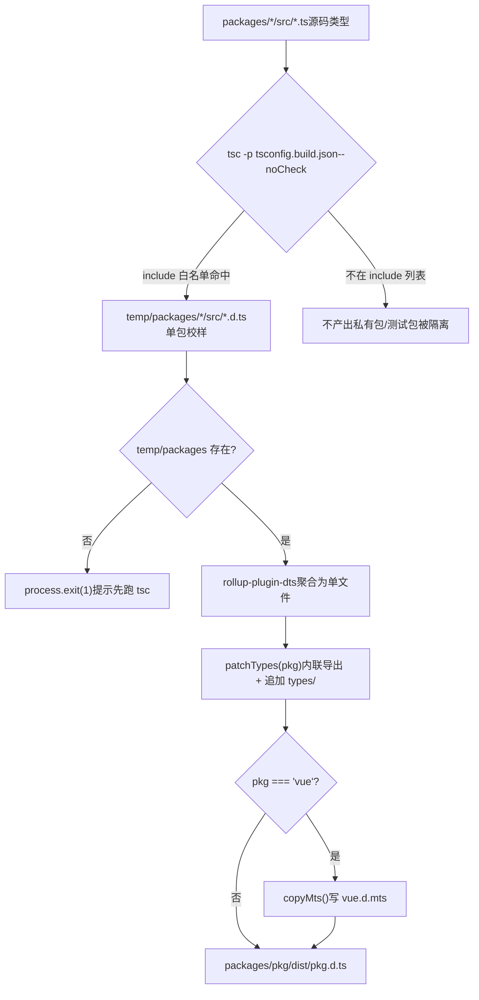
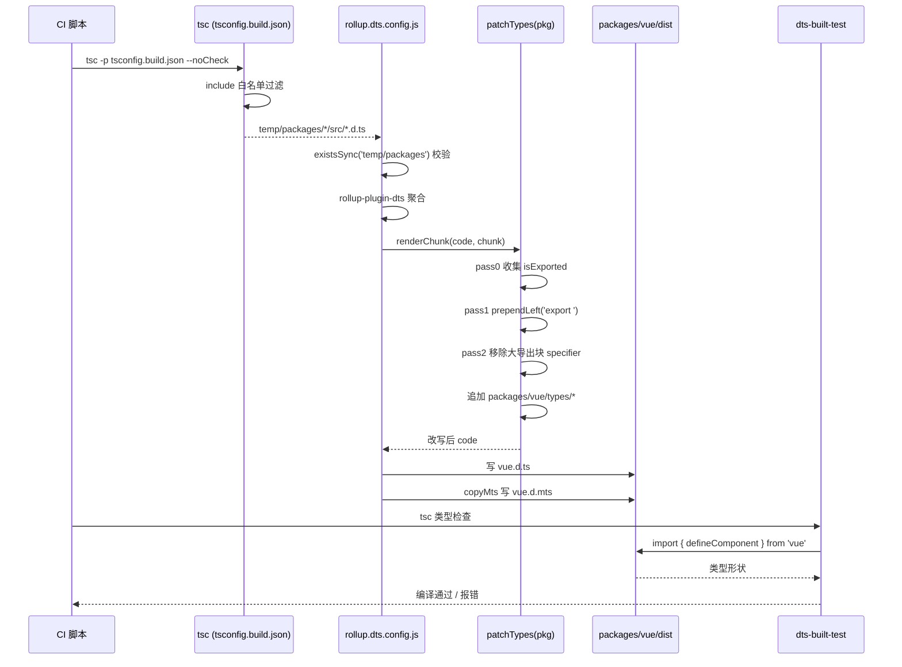

# 第 5 章：型別產物流水線：從原始碼 .d.ts 到發布級型別包

上一章我們拆解了`inline-enums.js`與`verify-treeshaking.js`：一個負責把 enum 引用替換成字面量、讓列舉物件能被搖掉，另一個負責在構建後用字串哨兵確認三類已知洩漏沒有回歸。兩者共同守護了 Vue 的執行時體積承諾。但構建產物不止 JS。當使用者`import { ref } from 'vue'`時，編輯器彈出的型別提示、`tsc`對使用者程式碼的型別檢查，全都依賴另一類產物——`.d.ts`宣告檔案。JS 產物錯了，執行時報錯；型別產物錯了，使用者側編譯期就報錯，或者更糟：型別靜默漂移，使用者程式碼能編譯通過，但型別形狀與真實執行時行為不符。本章追蹤 Vue 如何把散落在各子包`src`裡的原始碼型別，聚合成發布級的型別包，並用`dts-built-test`在真實構建產物上做型別冒煙測試。

# 5.1 兩階段型別流水線：tsc 出料，rollup 聚合

## 直覺模型

想像一條印刷流水線：第一階段，每個子包各自把自己的手稿（`.ts`原始碼）排版成單頁校樣（`.d.ts`）；第二階段，把幾十張校樣按目錄順序裝訂成一本書（發布級`.d.ts`），並統一頁首頁尾（匯出宣告）。

若沒有這條流水線，Vue 就得手工維護一份發布型別檔案，原始碼一改就得同步手改——這是型別漂移的溫床。Vue 的做法是：**型別產物完全由原始碼生成，絕不手寫**。

## 第一階段：tsconfig.build.json 劃定出料範圍

`tsconfig.build.json`是這條流水線的第一階段配置。它繼承根`tsconfig.json`，只覆蓋構建相關選項。

[FACT:tsconfig.build.json:3-9]

關鍵選項逐個拆解：

- `declaration: true`：讓 tsc 為每個原始檔生成對應`.d.ts`。
- `emitDeclarationOnly: true`：**只出型別，不出 JS**。JS 由 Rollup 負責，tsc 在這裡純粹是型別提取器。
- `stripInternal: true`：凡是標註`@internal`的宣告一律從`.d.ts`中剔除。這是 Vue 控制公開 API 表面的第一道閘門——內部實現細節即使被`export`，只要打了`@internal`就不會洩漏到發布型別裡。
- `composite: false`：關閉專案引用（project references）的增量構建模式。Vue 這裡不需要跨包增量，關掉可避免`.tsbuildinfo`帶來的額外狀態。

`include`列表則精確劃定了哪些目錄參與出料：

[FACT:tsconfig.build.json:10-23]

注意這裡**只列了 12 個目錄**，而不是整個`packages/`。`packages-private/`、`packages/dts-test/`、`packages/sfc-playground/`等都不在其中。這意味著：私有包和測試包的型別**永遠不會**進入發布產物。這是一個物理隔離——不是靠約定，而是靠配置。

> **[Design Inference & Architectural Trade-offs]**
> 為什麼用白名單而非黑名單？因為 monorepo 裡新增子包是常態。若用`exclude`黑名單，新增一個私有包時忘了加進 exclude，它的類型就會悄悄混進發布產物。白名單則相反：新增包預設不參與建置，必須顯式加入，符合「安全預設值」原則。

執行`tsc -p tsconfig.build.json --noCheck`後，產物落在`temp/packages/<pkg>/src/*.d.ts`。注意`--noCheck`：跳過類型檢查，只做 emit。類型檢查由單獨的`tsc --noEmit`負責，建置階段不重複檢查，節省時間。

## 第二階段：rollup.dts.config.js 聚合

第二階段由`rollup.dts.config.js`驅動。它的入口先做一次前置校驗：

[FACT:rollup.dts.config.js:15-22]

若`temp/packages`不存在，說明第一階段沒跑，腳本直接`process.exit(1)`並提示先跑`tsc`。這是流水線的**順序契約**：rollup 階段強依賴 tsc 階段的產物，缺一不可。

接著讀取所有子包目錄，並支援`TARGETS`環境變數做子集建置：

[FACT:rollup.dts.config.js:15-22]

`TARGETS`機制允許只重建某幾個包的類型，在開發除錯時能顯著縮短回饋環。

核心是`targetPackages.map(...)`為每個包生成一份 Rollup 配置：

[FACT:rollup.dts.config.js:23-42]

逐欄位解讀：

- `input: ./temp/packages/${pkg}/src/index.d.ts`：入口是第一階段產出的類型檔案，而非原始碼`.ts`。
- `output.file: packages/${pkg}/dist/${pkg}.d.ts`：產物落到各包自己的`dist`目錄，檔案名與包名一致（如`vue.d.ts`）。
- `format: 'es'`：類型檔案統一用 ES module 格式。
- `plugins: [dts(), patchTypes(pkg), ...(pkg === 'vue' ? [copyMts()] : [])]`：三個外掛，前兩個對所有包生效，`copyMts`只對`vue`包生效。

`onwarn`鉤子值得單獨說：

[FACT:rollup.dts.config.js:23-42]

在 dts rollup 過程中，所有非相對路徑的 import 預設被外部化（externalized）。這會導致 Rollup 報`UNRESOLVED_IMPORT`警告。但這是**預期行為**——類型檔案裡的`import { X } from 'some-pkg'`本來就該保留為外部引用，不該被打包進來。所以腳本對「非相對路徑的未解析導入」直接`return`吞掉警告，只對相對路徑的未解析導入放行給預設`warn`。

> **[Design Inference & Architectural Trade-offs]**
> 這裡有個微妙之處：`!warning.exporter?.startsWith('.')`判斷的是 exporter 是否以`.`開頭。相對路徑導入若未解析，說明第一階段產物有缺失，是真問題，必須報警。這個區分讓警告噪音降到最低，同時不放過真錯誤。

## 流水線全景

這張圖錨定了兩階段的控制流：`tsc`的白名單決定誰能進流水線，`rollup`的`check`決定能否繼續，`patchTypes`是必經環節，`copyMts`是`vue`包專屬分支。

# 5.2 patchTypes：把聚合產物改寫成發布級形狀

## 直覺模型

`rollup-plugin-dts`把幾十個`.d.ts`合併成一個檔案後，產出的形狀是「先宣告一堆類型，最後用一個巨大的`export { A, B, C, ... }`統一導出」。這對人類閱讀不友好，對某些工具鏈（如 VitePress 的`defineComponent`調用）還會觸發「推斷類型無法在不引用的情況下命名」的報錯。

`patchTypes`就是這道**後處理整形工序**：把「集中導出」改成「就地內聯導出」，再追加包專屬的類型增強。

## 資料結構：兩個 Set 與三趟遍歷

`patchTypes`返回一個 Rollup 外掛，核心邏輯在`renderChunk`鉤子裡。它維護兩個集合：

[FACT:rollup.dts.config.js:87-88]

- `isExported`：記錄所有**原本就被導出**的類型名（來自`export { ... }`宣告）。
- `shouldRemoveExport`：記錄所有**需要從大導出塊中移除**的類型名（因為已經被內聯導出了）。

處理流程分三趟（pass 0 / pass 1 / pass 2），這是典型的「先收集、再改寫、後清理」模式。

## Step-by-Step Walkthrough

**Pass 0：收集所有已導出類型名。**

[FACT:rollup.dts.config.js:90-100]

遍歷 AST 頂層節點，凡是`ExportNamedDeclaration`且**不帶 source**（即不是`export ... from '...'`的再導出），就把其 specifier 的 local name 加進`isExported`。

**Pass 1：為宣告節點就地添加`export`前綴。**

[FACT:rollup.dts.config.js:102-125]

遍歷頂層節點，對`VariableDeclaration`、`TSTypeAliasDeclaration`、`TSInterfaceDeclaration`、`TSDeclareFunction`、`TSEnumDeclaration`、`ClassDeclaration`六類宣告調用`processDeclaration`。

`processDeclaration`的邏輯：

[FACT:rollup.dts.config.js:70-85]

三步：

1. 無`id`直接返回（如匿名宣告）。

2. 名字以`_`開頭則跳過——這是**約定**：下劃線前綴的類型是內部輔助類型，不導出。

3. 把名字加進`shouldRemoveExport`；若該名字在`isExported`中（即原本就被導出），就在宣告起始位置`prependLeft`一個`export `字串。

注意`VariableDeclaration`分支有個額外斷言：

[FACT:rollup.dts.config.js:104-115]

若一個`declare const`宣告了多個 declarator（如`declare const a, b`），直接拋錯。因為`processDeclaration`只處理`declarations[0]`，多 declarator 會導致漏處理。這裡選擇**快速失敗**而非靜默錯誤，是防禦性編程的體現。

**Pass 2：從大導出塊中移除已內聯的類型。**

[FACT:rollup.dts.config.js:127-171]

遍歷`ExportNamedDeclaration`，對每個 specifier：

- 若其 local name 在`shouldRemoveExport`中，且`exported === local`（排除`export { Foo as Bar }`的重命名情況），則移除該 specifier。
- 移除時用 MagicString 精確刪除：若後面還有 specifier，刪到下一個 specifier 的 start；若是最後一個，刪到前一個的 end 或自身 start。
- 若整個導出塊的所有 specifier 都被移除，則刪除整個`ExportNamedDeclaration`節點。

**收尾：追加包專屬類型。**

[FACT:rollup.dts.config.js:172-183]

`code = s.toString()`拿到改寫後的程式碼後，檢查`packages/${pkg}/types`目錄是否存在。若存在，讀取目錄下所有檔案內容，用換行拼接後追加到程式碼末尾。

> **[Design Inference & Architectural Trade-offs]**
> 這個`types/`目錄是**手工維護的型別增強**入口，用於放那些無法從原始碼自動生成的型別（如 JSX 全域增強、巨集型別宣告）。它和自動生成的型別在同一個檔案裡合併，但來源清晰分離——自動生成的在上，手工增強的在下。

## 為什麼必須內聯匯出？

註解裡給出了直接原因：

[FACT:rollup.dts.config.js:45-51]

原文說：把所有型別改成內聯匯出、並從大匯出區塊中移除，否則在 VitePress 的`defineComponent`呼叫中會報「the inferred type cannot be named without a reference」。

> **[Design Inference & Architectural Trade-offs]**
> 這個報錯的本質是：TypeScript 在生成型別時，若某個型別只能透過「引用另一個模組的匯出」來命名，而該引用在消費端不可見，就會報錯。集中匯出區塊讓型別名和宣告位置分離，加劇了這個問題。內聯匯出讓每個型別在宣告處就可見，消除了這個間接層。

## copyMts：為 Node ESM/CJS 雙模提供型別

`copyMts`外掛只對`vue`套件生效：

[FACT:rollup.dts.config.js:196-204]

它在`writeBundle`鉤子裡，把`vue.d.ts`的內容原樣寫入`vue.d.mts`。

註解解釋了原因：

[FACT:rollup.dts.config.js:188-192]

根據 TypeScript 4.7 的`package.json`exports 規範，要為 Node ESM 和 CJS 同時正確提供型別，**必須有兩個獨立的宣告檔案**。所以建置時把`vue.d.ts`複製一份為`vue.d.mts`。

> **[Design Inference & Architectural Trade-offs]**
> 為什麼是複製而非重新生成？因為 ESM 和 CJS 的型別形狀完全一致，差異只在副檔名和`package.json`的`exports`映射。複製是最廉價的方案，避免重複跑一遍 rollup。

# 5.3 dts-built-test：在真實產物上做型別冒煙測試

## 直覺模型

前兩節保證了型別產物能生成、形狀正確。但「能生成」不等於「生成得對」。如果`patchTypes`的某趟走訪有 bug，把某個匯出誤刪了，產物依然能生成，但使用者`import`時會發現型別缺失。

`dts-built-test`就是**在真實建置產物上跑的型別冒煙測試**：它不測原始碼型別，而是`import`已發布的`vue`套件，驗證關鍵型別形狀沒有回歸。

## 資料結構：一個最小化的型別斷言

整個測試套件的核心只有一個檔案：

[FACT:packages-private/dts-built-test/src/index.ts:3-6]

逐行解讀：

- L1：從`vue`匯入`defineComponent`。注意這裡匯入的是**套件名**，不是相對路徑——它消費的是`packages/vue/dist/vue.d.ts`這個真實產物。
- L3-6：定義一個元件`_CustomPropsNotErased`，帶空 props 和空 setup。
- L8：註解`// #8376`，指向一個具體 issue。
- L9-12：匯出`CustomPropsNotErased`，型別是`_CustomPropsNotErased`與`{ foo: string }`的交叉型別。

這個測試驗證的是：**`defineComponent`的返回型別在交叉`{ foo: string }`後，`foo`屬性不會被擦除**。

> **[Design Inference & Architectural Trade-offs]**
> issue #8376 的背景推測：`defineComponent`的返回型別可能經過某種條件型別或映射型別處理，導致交叉型別中的額外屬性被「擦除」。這個測試用最小重現鎖定了這個行為，一旦回歸就會在型別檢查階段報錯。

## 套件配置：workspace 依賴指向真實產物

[FACT:packages-private/dts-built-test/package.json:1-11]

關鍵欄位：

- `private: true`：不發布到 npm。
- `types: dist/index.d.ts`：型別入口指向建置產物。
- `dependencies`裡三個`workspace:*`依賴：`@vue/shared`、`@vue/reactivity`、`vue`。

> **[Design Inference & Architectural Trade-offs]**
> 為什麼依賴`@vue/shared`和`@vue/reactivity`？因為`vue`的型別可能引用這兩個套件的型別。在 workspace 模式下，pnpm 會把這些依賴符號連結到本地套件，而本地套件的`types`欄位指向各自`dist`下的產物。這樣整個測試鏈路消費的都是**建置產物**，而非原始碼。

## 測試如何運行

`dts-built-test`本身沒有測試腳本，它的`src/index.ts`就是測試案例。運行方式是：在 CI 中執行`tsc`對該套件做型別檢查。若型別形狀回歸，`tsc`報錯，CI 失敗。

> **[Design Inference & Architectural Trade-offs]**
> 這個設計的巧妙之處在於：它把「型別契約」編碼成了**可編譯的程式碼**。不需要額外的斷言庫，不需要執行時，`tsc`本身就是測試運行器。型別對了就編譯通過，型別錯了就編譯失敗。

## 與 dts-test 的分工

注意本章的`dts-built-test`和下一章的`dts-test`是兩回事：

- `dts-built-test`（本章）：消費**建置產物**，驗證發布級型別形狀。
- `dts-test`（下一章）：消費**原始碼型別**，驗證 API 表面契約。

> **[Design Inference & Architectural Trade-offs]**
> 為什麼需要兩層？因為原始碼型別和產物型別可能不一致。`patchTypes`的 AST 改寫、`stripInternal`的剔除、`types/`目錄的追加，都可能在原始碼型別正確的前提下引入產物級 bug。`dts-built-test`專門守住這最後一公里。

## 型別流水線的完整時序

這張時序圖錨定了跨模組協作：CI 驅動 tsc 和 Rollup 兩個階段，`patchTypes`的三趟走訪是核心加工，`dts-built-test`在最後消費產物做驗證。

# 設計思考、錯誤恢復與生產踩坑

## 為什麼用 MagicString 而非字串替換？

`patchTypes`全程用 MagicString 做精確改寫，而非`code.replace(...)`。原因有二：

1. **位置精確**：AST 節點自帶`start`/`end`偏移，MagicString 按偏移操作，不會誤傷同名識別符。

2. **保留 sourcemap**：MagicString 能生成映射，讓改寫後的型別檔案仍能追溯回原始碼。雖然型別檔案的 sourcemap 用途有限，但保持一致性是良好實踐。

## 快速失敗 vs 靜默容錯

`patchTypes`在多處使用`assert`：

[FACT:rollup.dts.config.js:74-74]

[FACT:rollup.dts.config.js:107-108]

[FACT:rollup.dts.config.js:147-148]

這些斷言在遇到非預期 AST 形狀時立即拋錯。對比`onwarn`裡對`UNRESOLVED_IMPORT`的靜默吞掉——**預期內的噪音吞掉，預期外的形狀快速失敗**。這是建置腳本的正確姿態：寧可建置失敗，也不要產出形狀錯誤的型別檔案。

## 生產踩坑：`_`前綴約定

`processDeclaration`跳過`_`開頭的型別：

[FACT:rollup.dts.config.js:76-78]

這意味著原始碼裡任何以`_`開頭的匯出型別，都不會被內聯匯出。若某個型別本應公開，卻因命名以`_`開頭而被跳過，使用者側就會遇到「型別不存在」的報錯。

> **[Design Inference & Architectural Trade-offs]**
> 排查這類問題的思路：先看產物`vue.d.ts`裡該型別是否還在大匯出塊中，再看原始碼裡該型別名是否以`_`開頭。這是命名約定與工具行為的隱式耦合，容易踩坑。

## 生產踩坑：多 declarator 斷言

[FACT:rollup.dts.config.js:106-115]

若某個`.d.ts`裡出現`declare const a, b`，建置直接拋錯。這在手寫型別裡罕見，但若某個工具生成的型別檔案用了這種形式，就會觸發。錯誤訊息裡會印出問題程式碼片段，便於定位。

# 本章小結

本章追蹤了 Vue 型別產物的完整流水線：

1. **第一階段（tsc）**：`tsconfig.build.json`用`include`白名單精確劃定出料範圍，`emitDeclarationOnly`只出型別，`stripInternal`剔除內部宣告。產物落在`temp/packages/`。

2. **第二階段（rollup）**：`rollup.dts.config.js`用`rollup-plugin-dts`聚合各套件型別，`patchTypes`透過三趟 AST 遍歷把集中匯出改寫成內聯匯出，並追加`types/`目錄的手工增強。`copyMts`為`vue`套件額外生成`.d.mts`。

3. **驗證階段（dts-built-test）**：在真實建置產物上做型別冒煙測試，用可編譯的程式碼鎖定關鍵型別形狀，防止型別漂移。

# 本章思考與自測

Q1: 若把`tsconfig.build.json`的`include`白名單改成`["packages"]`（即包含整個 packages 目錄），會發生什麼？在什麼場景下會導致發布型別污染？

**參考解析**：

`include`從 12 個精確目錄改成`["packages"]`後，所有子套件（包括`packages-private`之外的所有`packages/*`）都會參與 tsc 出料。[FACT:tsconfig.build.json:10-23]

後果鏈：

1. `temp/packages/`下會多出許多套件的`.d.ts`。

2. `rollup.dts.config.js`的`readdirSync('temp/packages')`會讀到這些多出來的套件。[FACT:rollup.dts.config.js:15-22]

3. `targetPackages`預設等於所有套件，於是會為每個套件生成`packages/<pkg>/dist/<pkg>.d.ts`。[FACT:rollup.dts.config.js:15-22]

污染場景：若某個套件本不該發布（如內部工具套件），它的型別產物會出現在`dist`下。若該套件的`package.json`沒有`private: true`，發布腳本可能把它一起發到 npm，導致內部型別洩漏。

這正是白名單設計的價值：新增套件預設不參與，必須顯式加入，符合安全預設值。

Q2: `patchTypes`的 pass 1 中，`processDeclaration`對`_`開頭的型別直接`return`。若某個公開 API 的型別恰好以`_`開頭（如`_InternalType`被意外匯出），使用者側會看到什麼現象？如何排查？

**參考解析**：

`processDeclaration`遇到`_`開頭直接返回，既不加入`shouldRemoveExport`，也不 prepend`export `。[FACT:rollup.dts.config.js:76-78]

後果：

1. 該型別不會獲得內聯`export`。

2. 它也不會從大匯出塊中被移除（因為不在`shouldRemoveExport`中）。

3. 所以它**仍在大匯出塊裡**，理論上仍可被匯入。

但問題在於：大匯出塊裡的`export { _InternalType }`引用的是宣告位置。若該宣告因某種原因（如`stripInternal`）被剔除，匯出塊就會引用一個不存在的名字，導致`tsc`報錯。

排查思路：

1. 看產物`vue.d.ts`裡該型別是否既不在宣告處有`export`，又在大匯出塊裡被引用。

2. 看原始碼裡該型別名是否以`_`開頭。

3. 若確認是命名問題，重新命名去掉底線前綴即可。

這暴露了命名約定與工具行為的隱式耦合：`_`前綴本意是「內部」，但工具把它當成了「不匯出」，兩者語意不完全一致。

Q3: `dts-built-test`的`src/index.ts`用交叉型別`typeof _CustomPropsNotErased & { foo: string }`驗證`foo`不被擦除。若把交叉型別改成`Omit<typeof _CustomPropsNotErased, never> & { foo: string }`，測試還能捕獲 #8376 的回歸嗎？為什麼？

**參考解析**：

`Omit<T, never>`會建立一個新的映射型別，它會**重新計算**T 的所有屬性。若 #8376 的 bug 是「交叉型別中的額外屬性被擦除」，那麼：

- 原始寫法`T & { foo: string }`：直接交叉，`foo`是交叉型別的一部分，若`defineComponent`的返回型別處理邏輯擦除了交叉中的額外屬性，`foo`會遺失。
- `Omit`寫法：`Omit`先對`T`做映射，再與`{ foo: string }`交叉。`Omit`的映射過程可能改變型別結構，使得 bug 的觸發條件不再成立——即使 bug 存在，測試也可能通過。

[FACT:packages-private/dts-built-test/src/index.ts:9-12]

所以測試用例的**最小性**很關鍵：它必須精確重現 bug 的觸發路徑。任何額外的型別轉換（如`Omit`、`Pick`）都可能掩蓋 bug。這也是為什麼測試裡用最樸素的交叉型別，而非更「優雅」的寫法。

> **[Design Inference & Architectural Trade-offs]**
> 改進方向： 可以同時保留多種寫法，覆蓋不同的型別轉換路徑，提高回歸捕獲率。但會增加維護成本，需權衡。

型別流水線解決了「如何從原始碼生成發布級型別」，`dts-built-test`解決了「如何驗證產物型別形狀」。但型別契約不止於「形狀對不對」，還包括「API 表面是否符合預期」——哪些型別該匯出、哪些不該、泛型約束是否精確。下一章將進入`dts-test`，看 Vue 如何用型別契約測試守護公開 API 表面。

三者構成「生成 → 整形 → 驗證」的閉環，保證原始碼型別與發佈型別嚴格一致。然而，型別套件本身正確，並不等于公開 API 的型別形狀被鎖定。下一章我們將深入`packages-private/dts-test`，看 20 餘個`.test-d.ts`檔案如何用`expectType`等工具，把「型別即 API 契約」變成可回歸的自動化測試。
