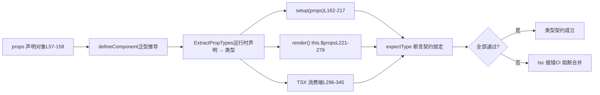

# 第 6 章：型別契約測試：dts-test 如何守護 API 表面

上一章我們追蹤了型別宣告的生成鏈路，看到 Vue 如何透過建置配置與冒煙測試保證「原始碼型別」與「發佈型別」嚴格一致。但型別契約不止于「形狀對不對」，更關鍵的是「API 表面是否符合預期」——哪些型別該匯出、哪些不該、泛型約束是否精確。本章進入`packages-private/dts-test`，看 Vue 如何用 20 餘個`.test-d.ts`檔案把「型別即 API 契約」落地為可回歸的自動化測試。

# 型別契約測試的認知模型：把「說明書」變成「可執行的合約」

`dts-test`目錄裡的檔案有一個反直覺的特徵：它們**幾乎不產生任何執行時行為**。打開`defineComponent.test-d.tsx`，你會看到大量`defineComponent({...})`呼叫，但它們從不在測試執行時被真正執行——這些檔案只被`tsc`/`vue-tsc`做型別檢查，`noEmit: true`保證不產出任何 JS。

[FACT:packages-private/dts-test/tsconfig.test.json:1-11]

這份配置是整個契約體系的「執行環境」：`noEmit`關閉產物輸出，`jsx: preserve`讓 TSX 語法保留給型別系統解析，`strict`打開全部嚴格檢查，`moduleResolution: bundler`匹配現代打包語意，`lib`同時引入`esnext`與`dom`。**若沒有這套配置，`.test-d.tsx`裡的 JSX 會被當作執行時 JSX 處理，型別斷言就失去意義**。

> **[Design Inference & Architectural Trade-offs]**
> 把型別測試獨立成一個`packages-private`子套件而非塞進`packages/vue`的`__tests__`，動機有三：其一，型別測試的依賴是`vue`的**發佈級型別**（`vue/jsx`、`vue`的`.d.ts`），而非原始碼內部模組，物理隔離能強制走公開入口；其二，`tsc`檢查型別測試的耗時遠高于執行時單測，獨立目錄便于 CI 單獨調度；其三，`.test-d.tsx`檔案不會被 Vitest 的執行時收集器誤執行。

生活類比：普通單元測試像「把機器通電跑一遍看會不會冒煙」，而型別契約測試像「簽合約前逐條核對條款」——不實際交易，只確認「甲方應付款項」寫的是「人民幣」而不是「美元」。合約條款錯了，機器跑得再順也沒用。

`utils.d.ts`提供了這套「合約核對」的全部工具：

[FACT:packages-private/dts-test/utils.d.ts:7-21]

關鍵工具只有四個：`expectType<T>(value: T)`斷言`value`的型別恰好是`T`；`expectAssignable<T, T2 extends T>`斷言`T2`可賦值給`T`；`IsUnion<T>`判斷`T`是否為聯合型別；`IsAny<T>`判斷`T`是否為`any`。注意 L5 的`import 'vue/jsx'`——它註冊了全域 JSX 命名空間，讓 TSX 裡的`<MyComponent />`能被型別系統識別為`JSX.Element`。

[FACT:packages-private/dts-test/utils.d.ts:7-21]

`IsUnion`的實現值得細看：`T extends any ? (U extends T ? false : true) : never`利用分布式條件型別，若`T`是聯合型別，每個成員會獨立求值，最終`extends false`判斷是否所有分支都返回`false`。這是**型別層面的存在性證明**——用來鎖定「`props.jjj`必須是聯合型別而非被合併成單一簽名」這類契約。

# 場景驅動 Walkthrough：`defineComponent`的 props 型別推導全鏈路

`defineComponent.test-d.tsx`有 2260 行，是契約體系的核心。我們代入一個具象場景：**使用者寫下`defineComponent({ props: {...}, setup(props) {...} })`，Vue 的型別系統需要從`props`執行時宣告推導出`setup`裡`props`參數的精確型別**。這條鏈路是 Vue 型別系統最複雜的部分。

## 第一步：構造「期望型別」作為契約基準

測試檔案先定義`ExpectedProps`介面，把每種 props 宣告方式應該推導出的型別**顯式寫死**：

[FACT:packages-private/dts-test/defineComponent.test-d.tsx:21-53]

這個介面是「合約條款」的書面版本。注意幾個微妙的型別：`a?: number | undefined`（可選 props 帶`undefined`）、`aa: number`（有 default 所以非可選）、`aaa: number | null`（`PropType<number | null>`顯式宣告）、`aaaa: number | undefined`（`required: true as const`但型別含`undefined`）。這些差異不是隨意寫的，每一種對應`props`宣告裡一個特定分支。

## 第二步：用各種宣告方式「餵」給`defineComponent`

[FACT:packages-private/dts-test/defineComponent.test-d.tsx:57-158]

這段`props`物件是**宣告方式的窮舉矩陣**，覆蓋了 Vue props 的所有寫法：

- `a: Number`—— 建構函式簡寫，推導為`number | undefined`
- `aa: { type: Number as PropType<number | undefined>, default: 1 }`—— 有 default，推導為非可選`number`
- `aaaa: { type: Number, required: true as const }` —— `as const`防止`true`被拓寬為`boolean`，保留字面量型別
- `b: { type: String, required: true as true }` —— `required: true`讓屬性非 void
- `bb: { default: 'hello' }`—— 無`type`，僅靠 default 推導型別
- `cc: Array as PropType<string[]>`—— 顯式型別轉換
- `l: [Date]`—— 陣列語法，推導為`Date | undefined`
- `ll: [Date, Number]`—— 多型別陣列，推導為`Date | number | undefined`
- `lll: [String, Number]`—— 同上

> **[Design Inference & Architectural Trade-offs]**
> `required: true as const`（L70）與`required: true as true`（L75）兩種寫法並存，是歷史演進痕跡：早期用`as true`，後來發現`as const`更通用（能同時鎖定物件裡其他字面量），但舊寫法保留以驗證向後相容。這是契約測試的典型價值——**它同時鎖定了「新寫法可用」和「舊寫法不回歸」**。

## 第三步：在`setup` / `render` / `this`三個位置斷言

這是契約測試最精妙的設計：**同一個 props 型別，必須在三個不同的消費位置都推導正確**。

[FACT:packages-private/dts-test/defineComponent.test-d.tsx:160-217]

`setup(props)`裡對每個 prop 做`expectType<ExpectedProps['x']>(props.x)`。注意 L168-170 的特殊處理：

[FACT:packages-private/dts-test/defineComponent.test-d.tsx:168-170]

`// @ts-expect-error should included 'undefined'`配合`expectType<number>(props.aaaa)`——**故意寫一個會報錯的斷言，用`@ts-expect-error`吞掉錯誤**。這驗證了`props.aaaa`的類型**不是** `number`（否則這行不會報錯，`@ts-expect-error`反而會因「無錯誤可吞」而失敗）。這是類型測試的「反向斷言」技巧。

[FACT:packages-private/dts-test/defineComponent.test-d.tsx:204-205]

`// @ts-expect-error props should be readonly`配合`props.a = 1`——驗證 props 在`setup`裡是唯讀的。若某次重構不小心讓 props 變成可變，這行不再報錯，`@ts-expect-error`就會失敗。

`render()`裡則透過`this.$props`和`this.x`兩個路徑斷言：

[FACT:packages-private/dts-test/defineComponent.test-d.tsx:221-279]

L252-276 驗證「宣告的 props 也要暴露在`this`上」，L278-279 驗證`this.a = 1`報錯（`this`上的 props 也唯讀）。L281-287 驗證 setup 返回值的解包：`this.c`是`number`（`ref(1)`被解包）、`this.d.e.value`是`string`（嵌套 ref 保留`.value`）、`this.f.g`是`GT`（`reactive`裡的 branded 類型不被解包）。

## 第四步：TSX 消費端的類型校驗

類型契約的最後一環是「用戶怎麼用這個組件」。TSX 裡`<MyComponent />`的 props 校驗是獨立的類型路徑：

[FACT:packages-private/dts-test/defineComponent.test-d.tsx:296-322]

這裡驗證了`<MyComponent>`接受所有宣告的 props，以及`class`/`style`/`key`/`ref`/`ref_for`這些內建屬性。然後是**反向校驗**：

[FACT:packages-private/dts-test/defineComponent.test-d.tsx:337-345]

`// @ts-expect-error missing required props`驗證缺必填 props 報錯；`wrong prop types`驗證類型不匹配報錯；L342 驗證`ggg="baz"`報錯（`ggg`只接受`'foo' | 'bar'`）。

整條鏈路可以用一張數據流圖概括：



這張圖的關鍵在於：**同一個`props`宣告，必須同時滿足三個消費位置的類型期望**。任何一處推導偏差都會讓`tsc`報錯。

# 邊界與後門：`__typeProps`、`__typeEmits`與條件類型契約

`defineComponent`的類型推導有個根本限制：**運行時 props 宣告無法表達「條件類型」**。比如「當`color='white'`時`appearance`必須是`'outline'`」這種約束，運行時對象語法寫不出來。Vue 為此提供了`__typeProps`等「類型後門」。

## `__typeProps`：條件 props 的類型逃生艙

[FACT:packages-private/dts-test/defineComponent.test-d.tsx:1803-1836]

`ConditionalProps`是一個聯合類型：要麼`color`和`appearance`都可選，要麼`color: 'white'`且`appearance: 'outline'`。測試驗證：

- L1823-1824：`<Comp color="white" />`報錯——單獨給`color: 'white'`不滿足任一分支
- L1825-1826：`<Comp color="white" appearance="normal" />`報錯——`appearance`必須是`'outline'`
- L1827：`<Comp color="white" appearance="outline" />`通過

> **[Design Inference & Architectural Trade-offs]**
> `__typeProps`的設計動機是「讓類型系統表達運行時無法表達的約束」。它不參與運行時 props 解析，純類型層面的覆蓋。代價是用戶需要手動維護類型與運行時宣告的一致性——這也是為什麼它叫「backdoor」而非正式 API。

## `__typeEmits`：兩種 emits 語法的等價性

`__typeEmits`支持兩種語法，測試**同時鎖定兩者**：

[FACT:packages-private/dts-test/defineComponent.test-d.tsx:1838-1885]

對象語法`{ change: [id: number], update: [value: string] }`用命名元組表達參數。測試驗證`this.$props.onChange?.(123)`通過、`onChange?.('123')`報錯。

[FACT:packages-private/dts-test/defineComponent.test-d.tsx:1887-1934]

調用簽名語法`{ (e: 'change', id: number): void; (e: 'update', value: string): void }`用重載表達。**兩種語法的測試體幾乎逐行相同**——這是刻意的：契約要求兩種寫法產生**完全等價**的類型行為。

> **[Design Inference & Architectural Trade-offs]**
> 為什麼保留兩種語法？對象語法更接近`defineEmits`的寫法，調用簽名語法更接近傳統 TS 事件類型。Vue 需要同時支持，且保證行為一致。測試的「逐行鏡像」結構是最強的等價性證明。

## `__typeRefs`與`__typeEl`：跨組件引用與宿主節點類型

[FACT:packages-private/dts-test/defineComponent.test-d.tsx:1936-1952]

`__typeRefs`讓父組件能精確知道子組件 ref 的類型。`Parent`宣告`__typeRefs: { child: ComponentInstance<typeof Child> }`，於是`refs.child.$refs.foo`能推導為`number`。

[FACT:packages-private/dts-test/defineComponent.test-d.tsx:1963-1977]

`__typeEl`更微妙。L1963-1977 的測試註釋點明了設計意圖：**自定義渲染器（TUI、canvas、native）的宿主節點不是 DOM`Element`**，所以`TypeEl`不能被約束為`Element`。測試用`CustomElement`接口驗證`$el`能接受任意宿主類型。

> **[Design Inference & Architectural Trade-offs]**
> 這是 Vue 3 支持自定義渲染器的類型層面保障。若`TypeEl`被硬約束為`Element`，`@vue/runtime-test`這類非 DOM 渲染器的用戶就無法正確推導`$el`類型。契約測試在這裡守護的是「渲染器無關性」。

## 泛型組件與運行時 props 的互斥約束

`function syntax w/ runtime props`一節鎖定了一條重要規則：**泛型組件不能與對象運行時 props 共存**。

[FACT:packages-private/dts-test/defineComponent.test-d.tsx:1501-1545]

L1501 的註釋`generics aren't supported with object runtime props`是契約宣告。L1525-1535 驗證泛型 setup + 對象 props 報錯；L1538-1539 驗證`<Comp3<string>>`報錯。而數組 props 則允許泛型（L1464-1499）。

> **[Design Inference & Architectural Trade-offs]**
> 這條約束的根因是類型推導順序：對象 props 需要`ExtractPropTypes`先確定類型，而泛型需要在實例化時才能確定，兩者衝突。數組 props 不參與類型提取，所以不衝突。契約測試把這條「類型系統限制」固化為可回歸的斷言。

# 設計思考、錯誤恢復與生產踩坑

## `@ts-expect-error`的雙刃劍

`@ts-expect-error`是類型契約測試的核心工具，但它有個致命陷阱：**當它下面的代碼不再報錯時，`@ts-expect-error`本身會報錯**。這看似是保護，實則要求測試作者精確控制「錯誤發生的位置」。

[FACT:packages-private/dts-test/defineComponent.test-d.tsx:1354-1362]

看這段：`// @ts-expect-error missing prop`被放在`<Comp msg={123} />`的**上一行**，但整個表達式被包在`expectType<JSX.Element>(...)`裡。若`@ts-expect-error`的位置偏移一行，或錯誤實際發生在`expectType`調用而非 JSX 上，測試就會失敗。

> **[Design Inference & Architectural Trade-offs]**
> 生產踩坑點：當 TypeScript 版本升級導致錯誤位置微調時，大量`@ts-expect-error`可能集體失效。Vue 的應對策略是**把`@ts-expect-error`緊貼被斷言代碼**，並在 CI 裡鎖定 TypeScript 版本。任何 TS 升級都需要重新驗證全部類型測試。

## `IsAny`與`IsUnion`：型別層面的「存在性證明」

[FACT:packages-private/dts-test/defineComponent.test-d.tsx:1991-1993]

`expectType<IsAny<typeof props.foo>>(false)`驗證`props.foo`不是`any`。這是**反向契約**：不僅要求型別正確，還要求型別「不能退化為`any`」。`any`是型別系統的黑洞，任何`any`都會讓後續斷言失去意義。

[FACT:packages-private/dts-test/defineComponent.test-d.tsx:195-196]

`expectType<IsUnion<typeof props.jjj>>(true)`驗證`jjj`是聯合型別。`jjj`宣告為`((arg1: string) => string) | ((arg1: string, arg2: string) => string)`，若型別系統把它合併成單一簽名，`IsUnion`會回傳`false`，測試失敗。

> **[Design Inference & Architectural Trade-offs]**
> 這兩個工具守護的是「型別的精確性」而非「型別的正確性」。一個退化為`any`或聯合被合併的型別，在大多數使用場景下「看起來能用」，但會丟失 IDE 提示和編譯期檢查。契約測試必須鎖定這種精確性。

## 宣告順序的隱式契約

[FACT:packages-private/dts-test/defineComponent.test-d.tsx:1784-1801]

這段註解極其關鍵：`code generated by tsc / vue-tsc, make sure this continues to work so we don't accidentally change the args order of DefineComponent`。`DefineComponent`有 13 個泛型參數，順序是**公開契約**——`vue-tsc`生成的元件型別依賴這個順序。測試用`declare const MyButton: DefineComponent<...>`顯式寫出全部 13 個參數，鎖定順序。

> **[Design Inference & Architectural Trade-offs]**
> 這是最容易被忽視的契約：泛型參數順序不是「實作細節」，而是「生成程式碼的 ABI」。任何調整順序的 PR 都會讓`vue-tsc`生成的`.d.ts`與執行時型別不相容。契約測試在這裡扮演「ABI 相容性守衛」。

## 跨檔案契約：`componentInstance.test-d.tsx`的補充

`componentInstance.test-d.tsx`只有 154 行，但覆蓋了`ComponentInstance`工具型別的所有輸入形態：

[FACT:packages-private/dts-test/componentInstance.test-d.tsx:10-40]

`ComponentInstance<typeof CompSetup>`從`defineComponent`結果提取實例型別；`ComponentInstance<typeof CompFunctional>`從函數式元件提取；`ComponentInstance<typeof CompFunction>`從裸函式提取。三者都必須推導出`ComponentPublicInstance`基底類別。

[FACT:packages-private/dts-test/componentInstance.test-d.tsx:71-116]

更極端的是「無`defineComponent`包裹的裸物件」：`CompObjectSetup`、`CompObjectData`、`CompObjectNoProps`三種形態都要能被`ComponentInstance`正確提取。L113-114 尤其反直覺：`CompObjectNoProps`沒有`props`宣告，但`compObjectNoProps.test`仍推導為`string | undefined`——這是`ComponentPublicInstance`基底類別提供的兜底。

[FACT:packages-private/dts-test/componentInstance.test-d.tsx:143-147]

L141 的`#12751`測試鎖定了一個邊界：`__typeEmits`宣告的`'update:visible'`事件，在實例上應暴露為`comp['onUpdate:visible']`（帶冒號的字串鍵），且`$props`型別為`{ 'onUpdate:visible'?: (value?: boolean) => any }`。L152-153 驗證`comp['$props']['$props']`報錯——防止型別遞迴自引用。

# 本章小結

`dts-test`目錄用 20 餘個`.test-d.ts`檔案，把「型別即 API 契約」落地為可回歸的自動化測試。核心機制有三層：

1. **工具層**：`expectType`、`expectAssignable`、`IsUnion`、`IsAny`提供型別斷言原語，`@ts-expect-error`提供反向斷言能力。

2. **契約層**：`ExpectedProps`介面把「應該推導出什麼型別」顯式寫死，`props`宣告矩陣窮舉所有寫法，三個消費位置（`setup`/`render`/TSX）交叉驗證。

3. **後門層**：`__typeProps`、`__typeEmits`、`__typeRefs`、`__typeEl`為執行時無法表達的型別約束提供逃生艙，同時鎖定兩種 emits 語法的等價性。

# 本章思考與自測

Q1: 若把`defineComponent.test-d.tsx`L168-170 的`@ts-expect-error`刪掉，只保留`expectType<number>(props.aaaa)`，會發生什麼？為什麼這個測試會「靜默失效」？

**參考解析**：

`props.aaaa`宣告為`{ type: Number as PropType<number | undefined>, required: true as const }`，其推導型別是`number | undefined`（因為`PropType<number | undefined>`顯式包含了`undefined`）。

`expectType<number>(props.aaaa)`要求`props.aaaa`恰好是`number`。由於實際型別是`number | undefined`，這行**本身就會報錯**。`@ts-expect-error`的作用是「預期這裡會報錯，吞掉它」。

若刪掉`@ts-expect-error`，這行會直接報錯，測試失敗——看起來是「更嚴格」了。但問題在於：**如果某次重構讓`props.aaaa`真的變成`number`（bug 修復或行為變更），這行不再報錯，而刪掉`@ts-expect-error`後測試會通過**——此時測試無法區分「型別正確」和「型別錯誤但恰好不報錯」。

保留`@ts-expect-error`的寫法是**雙向鎖定**：既要求「當前型別是`number | undefined`」（透過`@ts-expect-error`吞掉`expectType<number>`的錯誤），又要求「型別不能是`number`」（若變成`number`，`@ts-expect-error`會因無錯誤可吞而失敗）。這是型別契約測試的核心技巧——**用「預期報錯」來鎖定「型別必須包含某成分」**。

[FACT:packages-private/dts-test/defineComponent.test-d.tsx:168-170]

Q2: `__typeProps`後門測試（L1803-1836）驗證了條件聯合型別的約束。若把`ConditionalProps`從聯合型別改成`{ color?: 'normal' | 'primary' | 'secondary' | 'white'; appearance?: 'normal' | 'outline' | 'text' }`（即把所有選項拍平），測試會怎樣失敗？這說明了`__typeProps`的什麼設計約束？

**參考解析**：

拍平後的型別允許任意`color`與`appearance`組合，包括`color: 'white'` + `appearance: 'normal'`。但測試 L1825-1826 明確要求這個組合**報錯**：

```
// @ts-expect-error
;
```

若型別被拍平，這行不再報錯，`@ts-expect-error`因「無錯誤可吞」而失敗。同時 L1823-1824 的`<Comp color="white" />`也會從「報錯」變成「通過」，同樣讓`@ts-expect-error`失敗。

這說明`__typeProps`的設計約束是：**它必須保留聯合型別的「分支互斥」語意**。`__typeProps`不是簡單的「型別覆蓋」，而是「用型別系統表達執行時 props 無法表達的條件約束」。若實作時把`Props`做了`Prettify`或`Omit`之類的映射變換，可能破壞聯合分支的判別性，導致約束失效。

> **[Design Inference & Architectural Trade-offs]**
> 這也是為什麼`__typeProps`的測試用例用最樸素的`CommonProps & ConditionalProps`交叉，而非更「優雅」的映射型別——任何額外的型別變換都可能掩蓋 bug。

Q3: `DefineComponent`的 13 個泛型參數順序被 L1784-1801 顯式鎖定。若某次重構把第 9 個參數（`VNodeProps & AllowedComponentProps & ComponentCustomProps`）與第 10 個參數（`Readonly<ExtractPropTypes<{}>>`）交換，哪些下游會受影響？為什麼契約測試必須鎖定這個順序？

**參考解析**：

`DefineComponent`的泛型參數順序是`vue-tsc`生成元件型別時的「ABI」。當使用者在`<script setup>`裡寫`defineProps` / `defineEmits`，`vue-tsc`會生成類似 L1999-2116 的`CreateComponentPublicInstance<...>`型別，其中泛型參數的**位置**決定了每個型別參數的含義。

若交換第 9、10 個參數：

1. `vue-tsc`生成的`.d.ts`會按舊順序填充參數，但`DefineComponent`按新順序解釋——`VNodeProps & AllowedComponentProps & ComponentCustomProps`會被當作 props 型別，`Readonly<ExtractPropTypes<{}>>`會被當作 VNode 屬性。結果是**使用者元件的 props 型別全部錯位**。

2. L1786-1800 的`declare const MyButton: DefineComponent<...>`會直接報錯——因為`{}`與`VNodeProps & ...`不相容。

3. L1999-2116 的`ErrorMessage`型別（模擬`vue-tsc`生成結果）也會報錯。

契約測試鎖定順序的價值在於：**它把「泛型參數順序」從「實作細節」提升為「公開契約」**。任何調整順序的 PR 都會讓 L1786-1800 立即失敗，阻止不相容變更進入發布。

[FACT:packages-private/dts-test/defineComponent.test-d.tsx:1784-1801]

> **[Design Inference & Architectural Trade-offs]**
> 這是型別契約測試最容易被低估的價值：它守護的不是「型別對不對」，而是「型別系統的介面穩定性」。泛型參數順序、`@ts-expect-error`的位置、`IsAny`的回傳值，都是「型別 ABI」的組成部分。

型別契約測試解決了「API 表面是否符合預期」。但型別只是 Vue 工程化的一半——另一半是「使用者如何在瀏覽器裡即時驗證這些 API 的行為」。下一章將進入 SFC Playground，看 Vue 如何把編譯器、執行時、型別系統打包進一個瀏覽器內的即時除錯環境，讓使用者在改程式的瞬間看到編譯產物與執行結果。

契約測試守護的不只是「型別對不對」，還包括「型別精不精確」（`IsAny`/`IsUnion`）、「泛型參數順序穩不穩定」（`DefineComponent`13 參數）、「渲染器無關性」（`__typeEl`不約束為`Element`）。這些約束一旦被打破，使用者側的 IDE 提示、`vue-tsc`生成的型別都會漂移。而型別契約的穩定性，最終要服務於開發者日常的除錯體驗——下一章我們將走進`packages-private/sfc-playground`，看一個純前端 Playground 如何在瀏覽器內完成 SFC 編譯與即時預覽的閉環。
