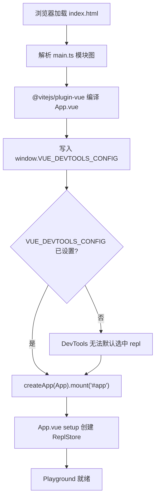
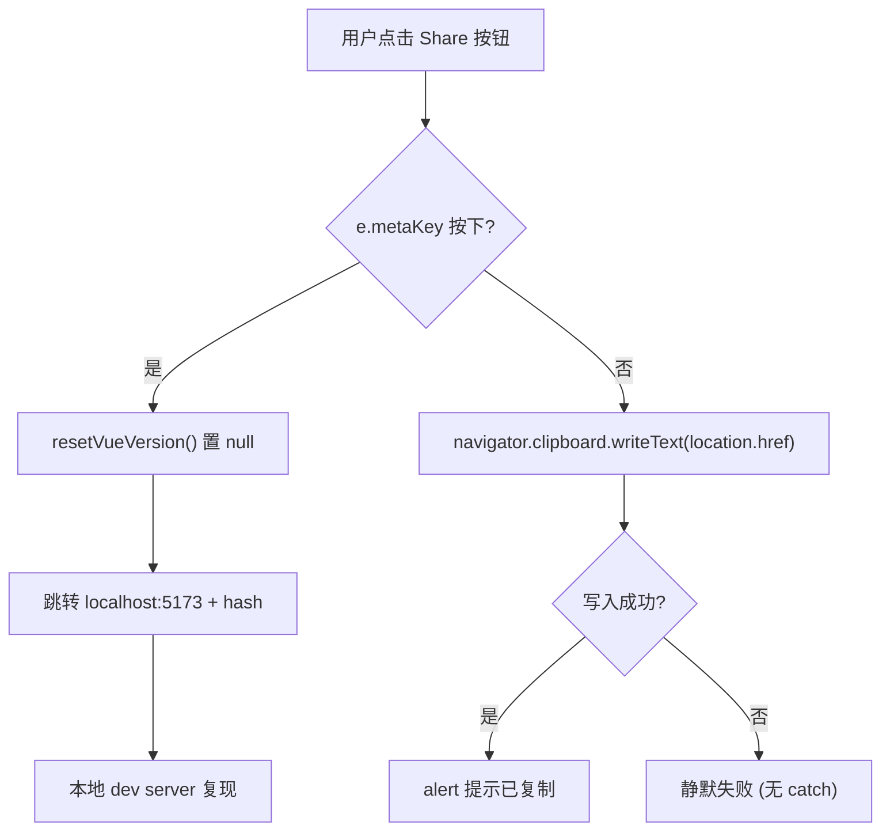
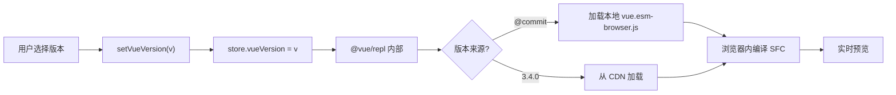

# 第 7 章：SFC Playground：瀏覽器內的即時編譯與除錯子系統

上一章我們用 20 餘個`.test-d.ts`檔案把「型別即 API 契約」釘死在 CI 裡。但型別契約只回答「API 表面長什麼樣」，它無法回答「這段 SFC 編譯出來到底長什麼樣」「SSR 模式下渲染結果是否一致」。要回答後兩個問題，Vue 團隊需要一個能在瀏覽器裡跑完整編譯管線的沙箱——這就是`packages-private/sfc-playground`。它和`packages/`下的公開套件有本質區別：`package.json`裡`"private": true`且`"version": "0.0.0"` [FACT:packages-private/sfc-playground/package.json:2-4]，意味著它永不發布到 npm，只是官方除錯工具。它的依賴裡`vue`指向`workspace:*` [FACT:packages-private/sfc-playground/package.json:19]，也就是本地原始碼建置產物，而非 npm 上的穩定版——這讓 Playground 天然成為「當前 commit 的活體演示」。本章聚焦三個問題：入口如何初始化、Header 如何驅動狀態切換、建置期常數如何注入。

# 一、入口的極簡主義：main.ts 與 ReplStore 的初始化契約

## 直覺模型

`main.ts`只有 9 行，像一個「開機自檢腳本」：在 Vue 應用掛載之前，先往`window`上塞一個全域配置，告訴 Vue DevTools「預設選中哪個 app」。若沒有這一步，DevTools 打開時會面對多個 app 實例（Playground 自身 + 使用者 REPL 裡執行的程式碼）而無法自動聚焦，除錯體驗會退化成手動切換。

## 資料結構與全域副作用

`main.ts`的核心不是`createApp`，而是對`window`的污染式寫入：

[FACT:packages-private/sfc-playground/src/main.ts:4-7]

```ts
// @ts-expect-error Custom window property
window.VUE_DEVTOOLS_CONFIG = {
  defaultSelectedAppId: 'repl',
}
```

這裡有兩個值得注意的工程細節：

> **[Design Inference & Architectural Trade-offs]**
> 1. **`@ts-expect-error`而非`@ts-ignore`**：`window`的標準型別`Window & typeof globalThis`上並沒有`VUE_DEVTOOLS_CONFIG`欄位。用`@ts-expect-error`意味著「我知道這裡會報錯，且我要求它必須報錯」——如果未來某個`@types/*`補上了這個欄位，`@ts-expect-error`會因「未產生錯誤」而反向報錯，從而提醒作者移除該註解。這與上一章型別契約測試的思路一脈相承：**用型別系統守護意圖，而非掩蓋問題**。

> **[Design Inference & Architectural Trade-offs]**
> 2. **`defaultSelectedAppId: 'repl'`的字串約定**：這個`'repl'`必須與`@vue/repl`內部建立 app 時使用的 id 完全一致。它是一個跨套件的字面量契約，沒有任何型別約束保護——一旦`@vue/repl`改了 id，Playground 的 DevTools 預設選中就會靜默失效。

## Step-by-Step：從 HTML 到掛載

執行流極短，但每一步都有隱含約束：

1. 瀏覽器載入`index.html`，其中包含`<div id="app">`（本材料未提供，但`mount('#app')`反推可知）。

2. 模組圖解析：`main.ts`頂部`import App from './App.vue'` [FACT:packages-private/sfc-playground/src/main.ts:2]觸發`@vitejs/plugin-vue`的 SFC 編譯。

> **[Design Inference & Architectural Trade-offs]**
> 3. **關鍵順序**：`window.VUE_DEVTOOLS_CONFIG`必須在`createApp(App).mount('#app')` [FACT:packages-private/sfc-playground/src/main.ts:9]之前寫入。因為 DevTools 的 hook 是在`createApp`內部註冊的，晚於 mount 寫入配置將無法影響首次選中。

4. `mount('#app')`觸發`App.vue`的 setup，進而建立`ReplStore`（在`App.vue`中，本材料未含）。



## 設計思考與踩坑

`main.ts`的極簡是刻意的：**把複雜度全部下沉到`App.vue`與`ReplStore`**。入口只承擔「全域副作用注入 + 掛載」兩件事，任何業務邏輯都不應出現在這裡。這是 Playground 作為「除錯工具」而非「產品」的取捨——它不需要 SSR 相容、不需要多入口、不需要延遲載入。

> **[Design Inference & Architectural Trade-offs]**
> 生產踩坑點：`window.VUE_DEVTOOLS_CONFIG`是**全域單例**。如果 Playground 被嵌入到另一個也使用 DevTools 的頁面（如 iframe 場景），後寫入者會覆蓋前者。由於 Playground 通常獨立部署，這個風險被接受。

---

# 二、Header.vue：computed 衍生狀態與 emit 單向資料流

## 直覺模型

`Header.vue`是 Playground 的「控制面板」——版本選擇、PROD/DEV 切換、SSR 開關、主題切換、分享、下載。它本身**不持有任何業務狀態**，所有狀態都來自`props.store`與布林 props，所有變更都透過`emit`上報給父元件。若沒有這種「啞元件 + 事件冒泡」的約束，Header 會變成狀態散落的重災區，版本切換與 SSR 切換的副作用將無法集中管理。

## 資料結構與欄位剖析

Header 的 props 定義是理解其職責的鑰匙：

[FACT:packages-private/sfc-playground/src/Header.vue:13-19]

```ts
const props = defineProps()
```

五個 props 分成兩類：

- **`store: ReplStore`**：唯一的狀態容器引用，來自`@vue/repl`。Header 透過它讀取`store.loading`、`store.vueVersion`、`store.typescriptVersion`，並直接寫入`store.vueVersion`。
- **四個布林/字面值 props**：`prod`、`ssr`、`autoSave`、`theme`。它們是**受控狀態**，Header 唯讀不寫，變更必須`emit`。

對應的 emit 列表[FACT:packages-private/sfc-playground/src/Header.vue:20-28]：

```ts
const emit = defineEmits([
  'toggle-theme',
  'toggle-ssr',
  'toggle-prod',
  'toggle-autosave',
  'reload-page',
])
```

注意`toggle-theme`雖然由`toggleDark()`內部`emit`，但`toggle-ssr`/`toggle-prod`/`toggle-autosave`是模板裡直接`$emit`的[FACT:packages-private/sfc-playground/src/Header.vue:102-118]。這種混用是 Vue 3`<script setup>`的常見風格：**需要副作用時用函式 emit，純轉發時用模板`$emit`**。

## Step-by-Step：版本顯示與切換

代入場景：使用者開啟 Playground，Header 需要顯示當前 Vue 版本。

**步驟 1：computed 衍生顯示文字**

[FACT:packages-private/sfc-playground/src/Header.vue:30-37]

```ts
const vueVersion = computed(() => {
  if (store.loading) {
    return 'loading...'
  }
  return store.vueVersion || `@${__COMMIT__}`
})
```

這裡有三層優先級：`loading`態 →`'loading...'`；使用者顯式選了版本 →`store.vueVersion`；否則 →`@${__COMMIT__}`（當前 commit 短雜湊）。`__COMMIT__`是建置期注入的常數，下一節詳述。

**步驟 2：VersionSelect 雙向綁定**

[FACT:packages-private/sfc-playground/src/Header.vue:88-88]

```html

```

注意這裡**沒有用`v-model`**，而是顯式拆成`:model-value` + `@update:model-value`。原因在於`vueVersion`是 computed（唯讀），不能直接雙向綁定；必須透過`setVueVersion`這個 setter 函式寫入`store.vueVersion`：

[FACT:packages-private/sfc-playground/src/Header.vue:39-41]

```ts
async function setVueVersion(v: string) {
  store.vueVersion = v
}

function resetVueVersion() {
  store.vueVersion = null
}
```

> **[Design Inference & Architectural Trade-offs]**
> `setVueVersion`宣告為`async`但內部無`await`——這是歷史遺留還是刻意為之？ 推測是為了與`VersionSelect`的非同步載入語義對齊（切換版本會觸發遠端載入），保持介面一致。

**步驟 3：TypeScript 版本的對比**

[FACT:packages-private/sfc-playground/src/Header.vue:76-80]

```html

```

TypeScript 版本用了`v-model`，因為`store.typescriptVersion`是可寫的普通屬性，不需要 computed 包裝。**同一個元件在同一個模板裡用兩種綁定方式**，正是「受控 vs 非受控」的直觀體現。

## 主題切換：副作用與 emit 的組合

[FACT:packages-private/sfc-playground/src/Header.vue:58-66]

```ts
function toggleDark() {
  const cls = document.documentElement.classList
  cls.toggle('dark')
  localStorage.setItem(
    'vue-sfc-playground-prefer-dark',
    String(cls.contains('dark')),
  )
  emit('toggle-theme', cls.contains('dark'))
}
```

這個函式做了三件事：操作 DOM class、持久化到 localStorage、emit 通知父元件。**注意它沒有直接改`props.theme`**——因為 props 唯讀，父元件收到`toggle-theme`後才會更新`theme`，進而驅動模板裡的`:title`文案[FACT:packages-private/sfc-playground/src/Header.vue:123]。

> **[Design Inference & Architectural Trade-offs]**
> 這裡有一個微妙的設計：**DOM class 操作與 Vue 響應式狀態是兩條獨立路徑**。`document.documentElement.classList.toggle('dark')`直接改 DOM，而`theme`prop 透過 Vue 更新。如果兩者不同步（例如父元件拒絕更新），UI 會出現「class 已切換但 title 文案未變」的不一致。 實際中父元件總是接受 emit，所以問題不顯現。

## 隱藏邏輯：copyLink 的 metaKey 分支

[FACT:packages-private/sfc-playground/src/Header.vue:47-56]

```ts
async function copyLink(e: MouseEvent) {
  if (e.metaKey) {
    resetVueVersion()
    // hidden logic for going to local debug from play.vuejs.org
    window.location.href = 'http://localhost:5173/' + window.location.hash
    return
  }
  await navigator.clipboard.writeText(location.href)
  alert('Sharable URL has been copied to clipboard.')
}
```

這是一個**開發者後門**：在`play.vuejs.org`上按住 Cmd 點擊分享按鈕，會跳轉到`localhost:5173`（本地 dev server），並把當前 URL hash 帶過去。hash 裡編碼了完整的 REPL 狀態（原始碼、版本、選項），因此本地除錯能重現線上問題。註解`// hidden logic for going to local debug from play.vuejs.org` [FACT:packages-private/sfc-playground/src/Header.vue:47-56]明確標註了這是有意隱藏的功能。

> **[Design Inference & Architectural Trade-offs]**
> `resetVueVersion()`在跳轉前被呼叫，把`store.vueVersion`置為`null`，確保本地除錯用的是當前 commit 而非線上選定的版本。



## 設計思考與踩坑

> **[Design Inference & Architectural Trade-offs]**
> **踩坑 1：`navigator.clipboard`的權限與安全上下文**。`copyLink`沒有 try/catch[FACT:packages-private/sfc-playground/src/Header.vue:47-56]。在非 HTTPS 或使用者拒絕剪貼簿權限時，`writeText`會 reject，導致未捕獲的 Promise rejection。Playground 部署在 HTTPS 上，風險被接受，但這是典型的「生產環境陷阱」。

> **[Design Inference & Architectural Trade-offs]**
> **踩坑 2：`toggleDark`的 localStorage key 硬編碼**。`'vue-sfc-playground-prefer-dark'`是字串字面值，沒有常數抽取。如果未來要改 key，需要全域搜尋。

**踩坑 3：`currentCommit`與`vueVersion`的比較**。模板裡`:class="{ active: vueVersion === \`@${currentCommit}\` }"` [FACT:packages-private/sfc-playground/src/Header.vue:88-88]用字串拼接比較。如果`__COMMIT__`注入失敗（變成`undefined`），這裡會變成`'@undefined'`，永遠不匹配。建置期常數注入的可靠性直接決定了 UI 正確性——這正是下一節的主題。

---

# 三、建置期常數注入：__COMMIT__ 與 copyVuePlugin 的雙重職責

## 直覺模型

`vite.config.ts`是 Playground 的「裝配車間」：它在建置時執行`git rev-parse`拿到 commit 雜湊，透過`define`把它變成全域常數`__COMMIT__`；同時透過自訂外掛把`packages/vue/dist/`下的 ESM 瀏覽器產物複製到 Playground 的產物目錄。若沒有這一步，Playground 就無法在瀏覽器裡載入「當前 commit 的 Vue 執行時期」——它只能依賴 npm 上的穩定版，失去「活體演示」的意義。

## 資料結構與建置期常數

[FACT:packages-private/sfc-playground/vite.config.ts:7-9]

```ts
const commit = spawnSync('git', ['rev-parse', '--short=7', 'HEAD'])
  .stdout.toString()
  .trim()
```

`spawnSync`同步執行 git 命令，`--short=7`取 7 位短雜湊。同步執行是刻意的：**設定檔在模組載入期就需要`commit`的值**，非同步會打亂 Vite 的設定解析時序。

[FACT:packages-private/sfc-playground/vite.config.ts:23-26]

```ts
define: {
  __COMMIT__: JSON.stringify(commit),
  __VUE_PROD_DEVTOOLS__: JSON.stringify(true),
},
```

`define`是 Vite 的**文字替換**機制：原始碼裡所有`__COMMIT__`會被替換成`JSON.stringify(commit)`的結果（即帶引號的字串字面量）。`JSON.stringify`是必需的——如果直接寫`commit`，替換後會變成裸識別符`abc1234`，被當作變數名而非字串。

> **[Design Inference & Architectural Trade-offs]**
> `__VUE_PROD_DEVTOOLS__: true`是另一個關鍵常數：它讓 Vue 的**生產建置**也保留 DevTools 支援。預設情況下生產建置會剝離 DevTools hook 以減小體積，但 Playground 需要除錯使用者程式碼，所以強制開啟。

## Step-by-Step：copyVuePlugin 的產物搬運

[FACT:packages-private/sfc-playground/vite.config.ts:32-63]

```ts
function copyVuePlugin(): Plugin {
  return {
    name: 'copy-vue',
    generateBundle() {
      const copyFile = (file: string) => {
        const filePath = path.resolve(
          import.meta.dirname,
          '../../packages',
          file,
        )
        const basename = path.basename(file)
        if (!fs.existsSync(filePath)) {
          throw new Error(
            `${basename} not built. ` +
              `Run "nr build vue -f esm-browser" first.`,
          )
        }
        this.emitFile({
          type: 'asset',
          fileName: basename,
          source: fs.readFileSync(filePath, 'utf-8'),
        })
      }

      copyFile(`vue/dist/vue.esm-browser.js`)
      copyFile(`vue/dist/vue.esm-browser.prod.js`)
      copyFile(`vue/dist/vue.runtime.esm-browser.js`)
      copyFile(`vue/dist/vue.runtime.esm-browser.prod.js`)
      copyFile(`server-renderer/dist/server-renderer.esm-browser.js`)
    },
  }
}
```

關鍵點逐一解析：

1. **`generateBundle`鉤子**：在 Rollup 產生 bundle 之後、寫入磁碟之前執行。此時可以`emitFile`往產物裡塞額外檔案。

2. **`import.meta.dirname`**：Node 20.11+ 提供的 ESM 版`__dirname`。路徑`../../packages`從`packages-private/sfc-playground/`上溯到倉庫根，再進入`packages/`。

3. **存在性檢查 + 明確報錯**：如果`vue.esm-browser.js`不存在，拋出帶修復指令的錯誤`Run "nr build vue -f esm-browser" first.`。這是**開發者體驗**的典範——錯誤訊息直接告訴你怎麼修。

4. **五個產物**：`vue`的完整版/執行時期版 × dev/prod，加上`server-renderer`。這五個檔案正是 Playground 在瀏覽器裡動態 import 的候選集，對應 Header 裡的版本切換與 SSR 開關。

> **[Design Inference & Architectural Trade-offs]**
> **為什麼是這五個？**完整版（含編譯器）用於「執行時期編譯」場景；執行時期版用於「預編譯」場景；dev/prod 對應 Header 的 PROD/DEV 切換；server-renderer 對應 SSR 開關。這五個檔案構成了 Playground 的「Vue 執行時期矩陣」。

## 版本切換的完整資料流

把 Header 的`setVueVersion`與 copyVuePlugin 的產物連起來看：



注意`@${__COMMIT__}`這個特殊值：它對應 copyVuePlugin 複製的本機產物，而非 CDN。這就是為什麼 Playground 必須把 Vue 的瀏覽器建置產物複製進來——**「This Commit」選項需要本機檔案**。

## 設計思考與踩坑

> **[Design Inference & Architectural Trade-offs]**
> **踩坑 1：`spawnSync`的失敗處理**。如果當前目錄不是 git 倉庫（例如從 tarball 解壓），`spawnSync`會回傳非零退出碼，`stdout`為空，`commit`變成空字串。此時`__COMMIT__`被替換成`""`，Header 裡`@${currentCommit}`變成`'@'`。沒有顯式錯誤處理。

> **[Design Inference & Architectural Trade-offs]**
> **踩坑 2：`optimizeDeps.exclude: ['@vue/repl']`** [FACT:packages-private/sfc-playground/vite.config.ts:27-29]。Vite 預設會預打包依賴以加速冷啟動，但`@vue/repl`被排除。原因是`@vue/repl`內部使用了動態 import 與 worker，預打包會破壞這些機制。 這是 Vite 生態裡常見的「預打包與動態載入衝突」問題。

> **[Design Inference & Architectural Trade-offs]**
> **踩坑 3：`script.fs`設定** [FACT:packages-private/sfc-playground/vite.config.ts:13-19]。`@vitejs/plugin-vue`的`script.fs`選項允許 SFC 的`<script>`區塊透過`fs`讀取檔案。這裡傳入`fs.existsSync`與`fs.readFileSync`，是為了支援 SFC 裡的`import`陳述式解析（例如`import x from './foo'`需要檢查檔案是否存在）。**這是 Playground 能在瀏覽器裡模擬完整模組解析的關鍵**——它把 Node 的 fs 能力注入到編譯器的解析階段。

---

# 設計思考：Playground 的架構取捨

把三個小節串起來看，Playground 的架構遵循一條清晰的原則：**把「狀態」與「副作用」分離，把「建置期」與「執行時期」分離**。

- `main.ts`只做全域副作用注入，不碰業務狀態。
- `Header.vue`是純展示元件，狀態透過 props 流入、透過 emit 流出。
- `vite.config.ts`把「當前 commit」這個建置期資訊固化為常數，執行時期唯讀。

> **[Design Inference & Architectural Trade-offs]**
> 這種分離帶來一個直接好處：**Playground 可以被嵌入到任何 Vue 應用裡**（例如文件站的內嵌範例），只要提供`store`與四個布林 props 即可。

代價是**狀態分散**：`store`在`@vue/repl`裡，布林狀態在父元件裡，DOM class 在`document.documentElement`上，localStorage 裡還有一份。四處狀態需要手動同步，任何一處不同步都會導致 UI 不一致。

> **[Design Inference & Architectural Trade-offs]**
> 另一個取捨是**放棄 SSR 相容**。`main.ts`直接存取`window`，`Header.vue`的`toggleDark`直接存取`document`。Playground 是純 CSR 應用，不需要考慮伺服器端渲染。

---

# 本章小結

本章剖析了`packages-private/sfc-playground`的三個核心檔案：

1. **`main.ts`**：9 行進入點，核心是`window.VUE_DEVTOOLS_CONFIG`的注入順序——必須在`mount`之前。

2. **`Header.vue`**：透過`computed`派生`vueVersion`，透過`emit`上報所有狀態變更。`copyLink`的`metaKey`分支是隱藏的本機除錯後門。

3. **`vite.config.ts`**：`spawnSync`拿 commit 雜湊，`define`注入`__COMMIT__`，`copyVuePlugin`把五個 Vue 瀏覽器產物搬運到 Playground 產物目錄。

貫穿三者的主線是**建置期常數與執行期狀態的邊界**：`__COMMIT__`是唯讀的建置期事實，`store.vueVersion`是可變的執行期選擇，Header 的`vueVersion`computed 把兩者統一成一個顯示字串。

# 本章思考與自測

Q1: 如果把`main.ts`中`window.VUE_DEVTOOLS_CONFIG`的賦值移到`createApp(App).mount('#app')`之後，會發生什麼？為什麼？

**參考解析**：`window.VUE_DEVTOOLS_CONFIG`是 Vue DevTools 在`createApp`內部註冊 hook 時讀取的設定[FACT:packages-private/sfc-playground/src/main.ts:4-9]。`createApp`會立即註冊`__VUE_DEVTOOLS_GLOBAL_HOOK__`，此時 DevTools 會讀取`defaultSelectedAppId`來決定預設選中哪個 app。如果賦值晚於`mount`，DevTools 已經完成了首次 app 選擇，設定將不會生效，使用者需要手動在 DevTools 裡切換到`repl`app。更隱蔽的是：由於`@vue/repl`內部也會建立 app，晚賦值可能導致 DevTools 預設選中 Playground 自身而非使用者 REPL，除錯使用者程式碼時需要手動切換。這體現了「全域副作用注入順序」在除錯工具中的重要性。

Q2: `Header.vue`的`toggleDark()`同時操作了 DOM class、localStorage 和 emit，但沒有直接修改`props.theme`。如果父元件收到`toggle-theme`事件後拒絕更新`theme`prop，會出現什麼 UI 不一致？如何從原始碼層面定位？

**參考解析**：`toggleDark()`在[FACT:packages-private/sfc-playground/src/Header.vue:58-66]直接呼叫`document.documentElement.classList.toggle('dark')`，這會立即改變 DOM 上的`dark`class，觸發 CSS 變數切換（見[FACT:packages-private/sfc-playground/src/Header.vue:186-186]的`.dark nav`規則）。但模板裡的`:title`文案[FACT:packages-private/sfc-playground/src/Header.vue:123]依賴`props.theme`，如果父元件不更新，title 會停留在舊值。定位方法：在瀏覽器 DevTools 裡檢查`<html>`的 class 與按鈕的 title 屬性是否矛盾。根因是「DOM 副作用」與「Vue 響應式狀態」走了兩條獨立路徑，沒有單一資料源。

Q3: `copyVuePlugin`在`generateBundle`裡對每個檔案做`fs.existsSync`檢查，缺失時拋出帶修復指令的錯誤。如果去掉這個檢查，直接`fs.readFileSync`，在 CI 環境（未先建置 vue）下會發生什麼？錯誤訊息會如何誤導開發者？

**參考解析**：去掉檢查後，`fs.readFileSync`會拋出`ENOENT: no such file or directory, open '.../packages/vue/dist/vue.esm-browser.js'` [FACT:packages-private/sfc-playground/vite.config.ts:32-63]。這個錯誤只告訴開發者「檔案不存在」，但不會告訴開發者「需要先執行`nr build vue -f esm-browser`」。在 CI 環境下，開發者可能誤以為是路徑設定錯誤、權限問題或 git 子模組未初始化，浪費大量時間排查。原始碼的`throw new Error(\`${basename} not built. Run "nr build vue -f esm-browser" first.\`)`把「症狀」與「修復動作」綁在一起，是開發者體驗設計的關鍵細節。這也解釋了為什麼 Playground 的建置腳本必須與 Vue 核心建置腳本有明確的依賴順序。

---

下一章將進入`packages-private/template-explorer`，看 Vue 如何把編譯器的中間產物（AST、轉換結果、程式碼生成）視覺化，讓開發者能逐步觀察模板到渲染函式的每一步變換。與 Playground 的「端到端黑盒」不同，Template Explorer 是「白盒探針」。

至此，我們看清了 SFC Playground 如何把編譯管線搬進瀏覽器：進入點初始化、Header 狀態切換與建置期常數注入共同構成了一個可即時除錯的沙箱。但 Playground 的視角始終是「整段 SFC 的編譯與執行」，它並不直接回答「編譯器對某個模板表達式究竟做了什麼變換」。下一章將走進 Template Explorer，看它如何把`@vue/compiler-dom`與`@vue/compiler-ssr`的編譯結果逐行攤開，用 SourceMapConsumer 建立原始碼與產物的映射，從而把編譯器的內部行為變成可觀察、可反推的探針。
