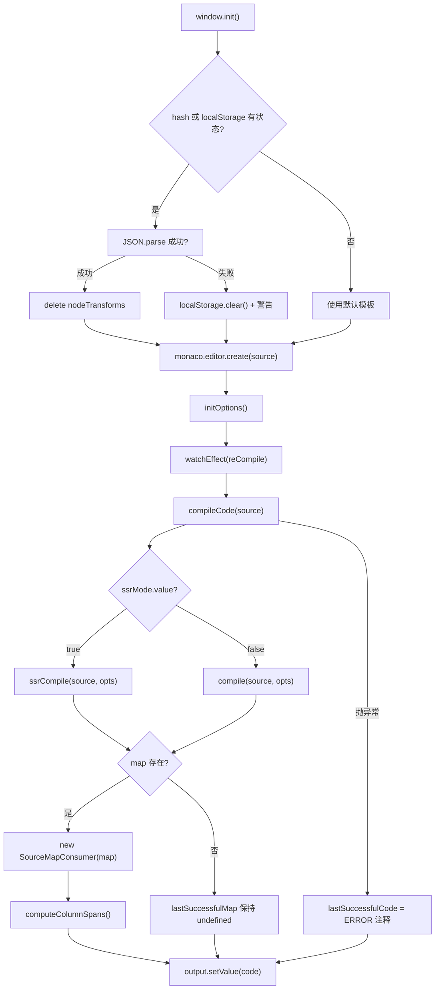
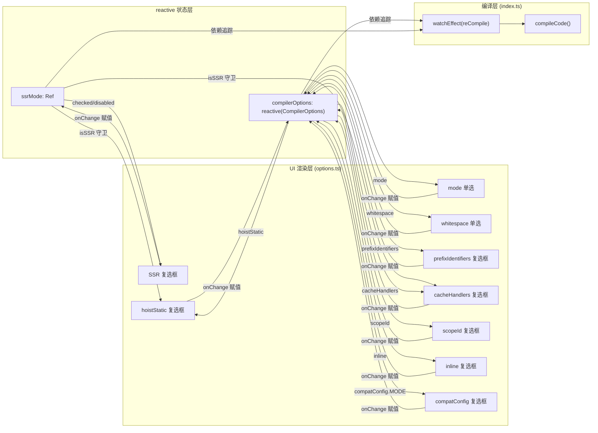

# 第 8 章：Template Explorer：編譯器行為的視覺化探針

上一章我們看到 SFC Playground 如何把「輸入 SFC → 瀏覽器內編譯 → 即時預覽」整條鏈路封裝成一個黑盒：開發者看到的是最終渲染結果，卻看不到編譯器在中間做了什麼。當模板裡寫了一個自訂指令、或者把 hoistStatic 打開後產物突然多出一堆 _hoisted_1 變數時，Playground 無法回答「編譯器為什麼這麼生成」。Template Explorer 的定位恰恰相反：它把 @vue/compiler-dom 與 @vue/compiler-ssr 的編譯產物、AST、錯誤標記、以及原始碼到產物的位置映射全部攤開。它的核心不是「執行」，而是「觀察」。本章圍繞三個檔案展開：index.ts 負責編譯呼叫與 SourceMap 雙向映射，options.ts 用 reactive 管理數十個 CompilerOptions 並驅動 UI，theme.ts 客製化 Monaco 編輯器主題。

# 一、編譯呼叫與 SourceMap 雙向映射：index.ts

## 直覺模型

Template Explorer 的`index.ts`像一台「雙向翻譯機」：左邊輸入模板，右邊輸出渲染函式。但它比翻譯機多一個能力——當你把游標放在左邊某一行，右邊會高亮對應的產物；反過來把游標放在右邊，左邊會高亮對應的模板。若沒有 SourceMap 映射，這個工具就退化成兩個並排的文字框，開發者只能靠肉眼比對，無法建立「模板第幾行 → 產物第幾行」的因果鏈。

## 資料結構與記憶體佈局

`index.ts`裡沒有複雜的 Struct，但有幾個關鍵的模組級狀態變數，它們決定了整個工具的行為：

`lastSuccessfulCode`與`lastSuccessfulMap`是編譯結果的快取[FACT:packages-private/template-explorer/src/index.ts:74-75]。前者是字串，後者是`SourceMapConsumer | undefined`。注意`lastSuccessfulMap`初始為`undefined`，只有在編譯成功且`map`存在時才會被賦值[FACT:packages-private/template-explorer/src/index.ts:99-100]。這個`undefined`狀態是後續所有游標映射邏輯的守衛條件——如果編譯失敗，映射功能自動靜默失效，而不是拋出異常。

`PersistedState`介面定義了持久化到 localStorage 與 URL hash 的狀態形狀[FACT:packages-private/template-explorer/src/index.ts:26-30]：`src`（模板原始碼）、`ssr`（是否 SSR 模式）、`options`（編譯器選項）。這裡有一個關鍵設計：`options`的類型是完整的`CompilerOptions`，但實際持久化時只保存「與預設值不同的項」，這個裁剪邏輯在`reCompile`裡完成。

`sharedEditorOptions`是兩個編輯器共享的建構選項[FACT:packages-private/template-explorer/src/index.ts:26-30]：`fontSize: 14`、`scrollBeyondLastLine: false`、`renderWhitespace: 'selection'`、`minimap.enabled: false`。關閉 minimap 是因為模板和產物通常只有幾十行，minimap 反而佔用橫向空間。

## Step-by-Step Walkthrough

**場景：使用者開啟頁面，輸入`
{{ msg }}
`，然後移動游標。**

**第一步：初始化與狀態恢復。** `window.init`是全域入口[FACT:packages-private/template-explorer/src/index.ts:41]。它首先註冊並啟用自訂主題[FACT:packages-private/template-explorer/src/index.ts:44-45]，然後嘗試從 URL hash 或 localStorage 恢復狀態[FACT:packages-private/template-explorer/src/index.ts:49-56]。注意這裡的解碼順序：先`atob`再`escape`，然後`decodeURIComponent`。如果 hash 解析失敗，會 fallback 到`localStorage.getItem('state')`，再 fallback 到`{}`。如果整個 JSON.parse 失敗，會清空 localStorage 並列印警告[FACT:packages-private/template-explorer/src/index.ts:57-64]。

恢復狀態後，有一個容易被忽略的細節：`delete persistedState.options?.nodeTransforms` [FACT:packages-private/template-explorer/src/index.ts:69]。註解解釋了原因——函式無法被序列化，所以持久化時`nodeTransforms`會遺失，恢復時如果殘留一個空物件會導致編譯器行為異常。這是「持久化不可序列化欄位」的經典陷阱。

**第二步：編譯核心`compileCode`。**這是整個工具的心臟[FACT:packages-private/template-explorer/src/index.ts:76-106]。它首先`console.clear()`，然後根據`ssrMode.value`選擇`ssrCompile`或`compile` [FACT:packages-private/template-explorer/src/index.ts:80]。注意`compileFn`的呼叫參數：展開`compilerOptions`，強制`filename: 'ExampleTemplate.vue'`、`sourceMap: true`，並注入`onError`回呼收集錯誤[FACT:packages-private/template-explorer/src/index.ts:82-89]。

這裡有一個設計決策：`filename`被硬編碼為`'ExampleTemplate.vue'`。這個值在後續的`generatedPositionFor`呼叫中必須精確匹配[FACT:packages-private/template-explorer/src/index.ts:189]，否則 SourceMap 查詢會返回空結果。這是一個隱式的契約——兩處字串必須一致，但沒有任何型別系統保證。

編譯完成後，錯誤被轉換為 Monaco 的 marker 格式並設定到編輯器上[FACT:packages-private/template-explorer/src/index.ts:91-95]。`formatError`把`CompilerError`的`loc`轉換為 Monaco 的`startLineNumber/startColumn/endLineNumber/endColumn` [FACT:packages-private/template-explorer/src/index.ts:108-119]。注意`errors.filter(e => e.loc)`——只有帶位置資訊的錯誤才會被標記，沒有`loc`的錯誤（如全域配置錯誤）只會在控制台輸出。

**第三步：SourceMap 的建立。**編譯成功後，`lastSuccessfulMap = new SourceMapConsumer(map!)` [FACT:packages-private/template-explorer/src/index.ts:99]，緊接著呼叫`computeColumnSpans()` [FACT:packages-private/template-explorer/src/index.ts:100]。`computeColumnSpans`是`source-map-js`的一個關鍵 API：它預計算每個映射段的列跨度，使得`generatedPositionFor`返回的`lastColumn`欄位可用。沒有這一步，反向映射只能定位到起始列，無法高亮整個 token 範圍。

**第四步：雙向游標映射。**當使用者在**原始碼編輯器**移動游標時，觸發`editor.onDidChangeCursorPosition` [FACT:packages-private/template-explorer/src/index.ts:184]。回呼經過 100ms debounce 後，呼叫`lastSuccessfulMap.generatedPositionFor({ source: 'ExampleTemplate.vue', line, column: column - 1 })` [FACT:packages-private/template-explorer/src/index.ts:188-192]。注意`column - 1`：Monaco 的列號從 1 開始，而 SourceMap 的列號從 0 開始。返回的`pos`如果有`line`和`column`，就在輸出編輯器上建立一個裝飾器高亮對應範圍[FACT:packages-private/template-explorer/src/index.ts:194-206]，並捲動到該位置[FACT:packages-private/template-explorer/src/index.ts:207-210]。

反向映射在`output.onDidChangeCursorPosition`中[FACT:packages-private/template-explorer/src/index.ts:223]。它呼叫`originalPositionFor` [FACT:packages-private/template-explorer/src/index.ts:227-230]，但多了一個守衛：忽略`pos.line === 1 && pos.column === 0`的「mock location」[FACT:packages-private/template-explorer/src/index.ts:231-237]。這個守衛非常關鍵——編譯器生成的某些程式碼（如`import`語句或 helper 函式）沒有對應的模板位置，SourceMap 會傳回`{ line: 1, column: 0 }`作為佔位。如果不忽略，游標放在這些行上會錯誤地突顯模板第一行。

**第五步：狀態持久化。** `reCompile`不僅觸發編譯，還負責把目前狀態寫入 localStorage 和 URL hash[FACT:packages-private/template-explorer/src/index.ts:121-146]。持久化時有一個裁剪邏輯：走訪`compilerOptions`，只儲存「非物件且不等於預設值」的項目[FACT:packages-private/template-explorer/src/index.ts:125-133]。這解釋了為什麼`bindingMetadata`這種物件類型的選項不會被持久化——它太複雜，且預設值已經足夠示範。

## 設計思考與生產踩坑

**為什麼用`source-map-js`而不是`source-map`？** `source-map`是 Mozilla 的原版函式庫，體積大且依賴 WASM（新版本）。`source-map-js`是純 JS 實作，體積小，適合瀏覽器環境。Template Explorer 作為純前端工具，選擇`source-map-js`是合理的[FACT:packages-private/template-explorer/package.json:15]。

**debounce 的延遲選擇。**原始碼編輯器的 debounce 預設 300ms[FACT:packages-private/template-explorer/src/index.ts:271]，而游標移動的 debounce 是 100ms[FACT:packages-private/template-explorer/src/index.ts:215]。這個差異是有意的：編譯是重操作，300ms 避免頻繁觸發；游標移動是輕操作，100ms 保證回應感。但 100ms 仍然可能導致快速移動游標時的高亮閃爍——這是可接受的取捨。

**`window.init`的全域掛載。**注意`window.init`和`window.monaco`都掛在全域[FACT:packages-private/template-explorer/src/index.ts:19-23]。這是因為 Monaco 編輯器透過 CDN 的`loader.js`非同步載入，載入完成後呼叫`window.init`。這種「全域回呼」模式是 Monaco 在非模組化環境下的標準用法，但與現代 ESM 建置方式格格不入。

---

# 二、reactive 驅動的選項面板：options.ts

## 直覺模型

`options.ts`像一個「控制台面板」：上面有十幾個開關和單選按鈕，每個都對應編譯器的一個行為。撥動任何一個開關，右邊的編譯產物立刻變化。若沒有這個模組，開發者只能改原始碼裡的`compile`呼叫參數再重新編譯，無法即時對比不同選項的效果。

## 資料結構與記憶體佈局

`options.ts`的核心是三個匯出：

`ssrMode`是一個`ref(false)` [FACT:packages-private/template-explorer/src/options.ts:5]。它獨立於`compilerOptions`，因為 SSR 模式切換的是編譯函式本身（`compile` vs `ssrCompile`），而不是編譯選項。

`defaultOptions`是一個完整的`CompilerOptions`物件[FACT:packages-private/template-explorer/src/options.ts:5-27]。它定義了所有選項的預設值，包括`mode: 'module'`、`prefixIdentifiers: false`、`hoistStatic: false`、`cacheHandlers: false`、`scopeId: null`、`inline: false`、`ssrCssVars: '{ color }'`、`compatConfig: { MODE: 3 }`、`whitespace: 'condense'`，以及一個包含 7 個綁定類型的`bindingMetadata` [FACT:packages-private/template-explorer/src/options.ts:18-26]。

`compilerOptions`是`reactive(Object.assign({}, defaultOptions))` [FACT:packages-private/template-explorer/src/options.ts:29-31]。注意這裡用了`Object.assign({}, ...)`做淺拷貝——如果直接`reactive(defaultOptions)`，修改`compilerOptions`會污染`defaultOptions`，導致`reCompile`裡的「與預設值比較」邏輯失效。

## Step-by-Step Walkthrough

**場景：使用者點擊「hoistStatic」核取方塊。**

**第一步：UI 渲染。** `App`元件的`setup`傳回一個渲染函式[FACT:packages-private/template-explorer/src/options.ts:33-35]。這個渲染函式讀取`ssrMode.value`、`compilerOptions.mode`、`compilerOptions.prefixIdentifiers`等響應式狀態[FACT:packages-private/template-explorer/src/options.ts:36-39]，因此當這些狀態變化時，整個 UI 會重新渲染。

**第二步：核取方塊的 checked 綁定。** `hoistStatic`核取方塊的`checked`屬性是`compilerOptions.hoistStatic && !isSSR` [FACT:packages-private/template-explorer/src/options.ts:150]。這裡有一個邏輯：SSR 模式下`hoistStatic`被強制顯示為未選中，因為 SSR 編譯不支援靜態提升。同時`disabled: isSSR` [FACT:packages-private/template-explorer/src/options.ts:151]確保使用者無法在 SSR 模式下切換它。

**第三步：onChange 處理。**當使用者點擊核取方塊時，`onChange`觸發[FACT:packages-private/template-explorer/src/options.ts:152-156]，直接把`e.target.checked`賦給`compilerOptions.hoistStatic`。由於`compilerOptions`是`reactive`的，這個賦值會觸發依賴追蹤，進而觸發`watchEffect(reCompile)` [FACT:packages-private/template-explorer/src/index.ts:266]，最終重新編譯。

**第四步：選項間的連動。**注意`cacheHandlers`的`checked`是`usePrefix && compilerOptions.cacheHandlers && !isSSR` [FACT:packages-private/template-explorer/src/options.ts:166]，`disabled`是`!usePrefix || isSSR` [FACT:packages-private/template-explorer/src/options.ts:167]。這意味著`cacheHandlers`依賴`prefixIdentifiers`或`mode === 'module'`。這種連動關係在 UI 上表現為：當`prefixIdentifiers`未開啟且模式為`function`時，`cacheHandlers`核取方塊是停用的。

`scopeId`的連動更複雜：`disabled: !isModule` [FACT:packages-private/template-explorer/src/options.ts:182]，`checked: isModule && compilerOptions.scopeId` [FACT:packages-private/template-explorer/src/options.ts:183]。只有 module 模式下才能設定 scopeId，且 onChange 時如果`isModule`為 false，會強制設為`null` [FACT:packages-private/template-explorer/src/options.ts:184-189]。

**第五步：掛載。** `initOptions`呼叫`createApp(App).mount(document.getElementById('header')!)` [FACT:packages-private/template-explorer/src/options.ts:232-234]。注意這裡用的是`vue`套件的`createApp`，而不是`@vue/runtime-dom`——因為`options.ts`是應用層程式碼，可以直接依賴完整的`vue`套件。

## 設計思考與生產踩坑

**為什麼用`reactive`而不是`ref`？** `compilerOptions`是一個包含十幾個欄位的物件，用`reactive`可以直接`compilerOptions.hoistStatic = true`，而不需要`compilerOptions.value.hoistStatic = true`。這在 UI 程式碼中更簡潔。但`reactive`的代價是解構會遺失響應性——原始碼中沒有任何解構，全部透過`compilerOptions.xxx`存取，這是正確的用法。

**`bindingMetadata`的預設值設計。**預設值包含 7 個綁定[FACT:packages-private/template-explorer/src/options.ts:18-26]，涵蓋了`SETUP_CONST`、`SETUP_REF`、`SETUP_LET`、`SETUP_MAYBE_REF`、`PROPS`五種類型。這是為了讓開發者打開`prefixIdentifiers`後能立刻看到不同綁定類型對產物中`$setup`存取方式的影響。如果沒有這個預設值，`prefixIdentifiers`的效果會非常單調。

**`compatConfig`的嵌套響應性。** `compilerOptions.compatConfig!.MODE = 2` [FACT:packages-private/template-explorer/src/options.ts:216-220]這種嵌套賦值在`reactive`下是響應式的，因為`reactive`會遞迴代理嵌套物件。但注意`compatConfig`的類型是`CompatConfig | undefined`，所以用了`!`斷言。如果預設值裡沒有`compatConfig`，這裡會執行時崩潰。

**`ssrMode`與`compilerOptions`的職責分離。** `ssrMode`是`ref`，`compilerOptions`是`reactive`。為什麼不把`ssr`放進`compilerOptions`？因為`ssr`不是`CompilerOptions`的欄位——它決定用哪個編譯函式，而不是傳給編譯函式的參數。這種「控制流狀態」與「配置狀態」的分離是清晰的設計。

---

# 三、Monaco 主題客製化：theme.ts

## 直覺模型

`theme.ts`像給編輯器「換一套皮膚」：它定義了每種語法 token 的顏色和字體樣式。若沒有這個模組，Monaco 會使用預設的`vs-dark`主題，雖然能用，但 Vue 模板中的 HTML 標籤、表達式、指令會缺乏視覺區分，開發者難以快速定位關鍵部分。

## 資料結構與記憶體佈局

`theme.ts`導出一個符合 Monaco`IStandaloneThemeData`介面的物件[FACT:packages-private/template-explorer/src/theme.ts:1-244]。它有三個頂層欄位：

`base: 'vs-dark'`指定基礎主題[FACT:packages-private/template-explorer/src/theme.ts:2]，`inherit: true`表示繼承基礎主題的規則[FACT:packages-private/template-explorer/src/theme.ts:3]。這意味著只需要定義差異部分，未定義的 token 會 fallback 到`vs-dark`。

`rules`是一個陣列，每個元素包含`token`（Monaco 的 token 名稱）和`foreground`/`background`/`fontStyle` [FACT:packages-private/template-explorer/src/theme.ts:4-235]。這個陣列有 50 多個條目，覆蓋了 number、comment、keyword、string、variable、entity.name.tag 等 token 類型。

`colors`定義了編輯器 UI 的顏色[FACT:packages-private/template-explorer/src/theme.ts:236-243]：`editor.foreground`、`editor.background`、`editor.selectionBackground`、`editor.lineHighlightBackground`、`editorCursor.foreground`、`editorWhitespace.foreground`。

## Step-by-Step Walkthrough

**場景：頁面載入時註冊主題。**

**第一步：定義主題。** `monaco.editor.defineTheme('my-theme', theme)` [FACT:packages-private/template-explorer/src/index.ts:44]。這個呼叫把`theme.ts`的導出物件註冊到 Monaco 的主題註冊表中，鍵名為`'my-theme'`。

**第二步：啟用主題。** `monaco.editor.setTheme('my-theme')` [FACT:packages-private/template-explorer/src/index.ts:45]。這行程式碼必須在`defineTheme`之後呼叫，否則會拋出「主題未定義」錯誤。

**第三步：token 匹配。**當 Monaco 渲染模板程式碼時，它會用 HTML 語言服務對程式碼進行 tokenize，然後按 token 名稱查找`rules`中的規則。例如`
`中的`div`會被標記為`entity.name.tag`，匹配到`foreground: 'cc6666'` [FACT:packages-private/template-explorer/src/theme.ts:41-44]，顯示為紅色。

## 設計思考與生產踩坑

**為什麼用`inherit: true`？**如果不繼承，需要定義所有 token 的顏色，包括那些模板中不出現的（如`markup.heading`、`meta.diff`）。繼承讓主題檔案只需要關注模板和 JS 產物中實際出現的 token。

**token 名稱的層級匹配。**Monaco 的 token 匹配是前綴匹配的：`entity.name.tag`會匹配`entity.name.tag.html`、`entity.name.tag.css`等。原始碼中同時定義了`entity.name.tag` [FACT:packages-private/template-explorer/src/theme.ts:41-44]和`entity.name.tag.css` [FACT:packages-private/template-explorer/src/theme.ts:169-172]，後者會覆蓋前者的 CSS 特定場景。

**`colors`與`rules`的分工。** `rules`控制程式碼文字的顏色，`colors`控制編輯器 UI（背景、游標、選取行）的顏色。兩者獨立，但需要視覺協調。原始碼中的`editor.background: '#1D1F21'`與`base: 'vs-dark'`的預設背景接近，這是為了保持視覺一致性。

---

# 設計思考：視覺化探針的工程取捨

Template Explorer 與 SFC Playground 的核心差異在於「觀察粒度」。Playground 觀察的是「整段 SFC 編譯後能否執行」，Template Explorer 觀察的是「單個模板表達式被編譯成什麼」。這種差異決定了兩個工具的技术選型：

**SourceMapConsumer 的引入是必然的。**沒有它，開發者只能靠肉眼比對原始碼和產物，無法建立精確的「第幾行 → 第幾行」映射。但 SourceMapConsumer 的 API 是非同步的（新版本返回 Promise），原始碼中使用的是同步版本`source-map-js`，這是為了簡化呼叫邏輯。

**`reactive`管理選項是 Vue 生態的自然選擇。**如果用原生 DOM 事件手動管理十幾個選項的狀態同步，程式碼量會翻倍。`reactive`的依賴追蹤讓「選項變化 → 重新編譯」這條鏈路自動化，`watchEffect(reCompile)`一行程式碼就完成了訂閱。

**Monaco 的全域載入模式是歷史包袱。** `window.monaco`和`window.init`的全域掛載方式源於 Monaco 的 AMD 載入器設計。在現代 ESM 建置中，這顯得格格不入，但 Monaco 的體積（約 5MB）使得按需載入仍然是必要的。

---

# 本章小結

Template Explorer 是一個「白盒探針」：它不執行編譯產物，只展示編譯過程。`index.ts`透過`compileCode`呼叫`@vue/compiler-dom`或`@vue/compiler-ssr`，用`SourceMapConsumer`建立原始碼與產物的雙向映射，透過 Monaco 的裝飾器 API 實現游標聯動高亮。`options.ts`用`reactive`管理`CompilerOptions`，透過`watchEffect`驅動重新編譯，選項間的聯動關係（如 SSR 停用`hoistStatic`）在 UI 層顯式編碼。`theme.ts`客製化 Monaco 主題，讓模板和產物的語法 token 有清晰的視覺區分。

這個工具的核心價值在於「用工具反推編譯器行為」：當你不確定`hoistStatic`對某個模板做了什麼，打開 Template Explorer，切換選項，觀察產物變化。這比閱讀編譯器原始碼更直觀，比猜測更可靠。

# 本章思考與自測

Q1: 如果將`index.ts`中`originalPositionFor`的 mock location 守衛（`pos.line === 1 && pos.column === 0`）刪除，在什麼場景下會導致錯誤高亮？為什麼編譯器會生成`{ line: 1, column: 0 }`這樣的映射？

**參考解析**：守衛位於[FACT:packages-private/template-explorer/src/index.ts:231-237]。編譯器在生成產物時會插入一些沒有模板對應位置的程式碼，例如`import { createElementVNode as _createElementVNode } from 'vue'`這樣的 helper 匯入語句，或者`export function render(_ctx, _cache) { ... }`這樣的函式簽名。這些程式碼在 SourceMap 中沒有原始位置，`source-map-js`會返回`{ line: 1, column: 0 }`作為佔位。如果刪除守衛，當使用者把游標放在這些行上時，`originalPositionFor`返回`{ line: 1, column: 0 }`，程式碼會認為這是一個有效位置，進而在原始碼編輯器第一行第一列建立高亮裝飾器。結果是：使用者點擊產物的`import`行，原始碼編輯器的第一行被錯誤高亮，產生誤導。這個守衛的本質是「區分真實映射與佔位映射」，而`{ line: 1, column: 0 }`是`source-map-js`約定的「無映射」哨兵值。

Q2: `reCompile`中持久化選項時，條件`typeof val !== 'object' && val !== defaultOptions[key]`會跳過所有物件類型的選項。如果`bindingMetadata`被使用者修改（例如透過控制台），重新整理頁面後這個修改會遺失。這是 bug 還是刻意設計？如果要在持久化中支援`bindingMetadata`，需要解決什麼問題？

**參考解析**：條件位於[FACT:packages-private/template-explorer/src/index.ts:129]。這是刻意設計，原因有三：第一，`bindingMetadata`的值是`BindingTypes`列舉，序列化後是數字，反序列化時無法區分「使用者顯式設定為 0」和「預設值」；第二，`compatConfig`是巢狀物件，`val !== defaultOptions[key]`比較的是參照，永遠為 true，會導致所有物件選項都被持久化；第三，`nodeTransforms`包含函式，無法序列化，原始碼中已經透過`delete persistedState.options?.nodeTransforms`處理[FACT:packages-private/template-explorer/src/index.ts:69]。如果要支援`bindingMetadata`，需要實作深比較（而非參照比較），並且需要處理列舉值的序列化/反序列化。更根本的問題是：`bindingMetadata`在 UI 上沒有編輯入口，使用者只能透過控制台修改，這種修改本身就不應該被持久化。

Q3: `options.ts`中`compilerOptions`用`reactive(Object.assign({}, defaultOptions))`建立。如果將`Object.assign({}, defaultOptions)`改為直接`reactive(defaultOptions)`，在使用者切換選項後重新整理頁面，會發生什麼？為什麼？

**參考解析**：`Object.assign({}, defaultOptions)`是淺拷貝，位於[FACT:packages-private/template-explorer/src/options.ts:29-31]。如果改為`reactive(defaultOptions)`，`compilerOptions`和`defaultOptions`會指向同一個物件。當使用者切換`hoistStatic`為 true 時，`compilerOptions.hoistStatic`變為 true，同時`defaultOptions.hoistStatic`也變為 true。然後`reCompile`中的持久化邏輯[FACT:packages-private/template-explorer/src/index.ts:129]會比較`val !== defaultOptions[key]`，此時`val`和`defaultOptions[key]`都是 true，條件為 false，該選項不會被儲存到 localStorage。重新整理頁面後，`defaultOptions`被重新初始化為`hoistStatic: false`，使用者的修改遺失。更嚴重的是，`defaultOptions`被污染後，後續所有「與預設值比較」的邏輯都會失效，導致持久化功能完全崩潰。這個 bug 的隱蔽性在於：單次工作階段內一切正常，只有重新整理後才能發現。

---

下一章將進入`scripts/release.js`，看 Vue 如何用一個互動式狀態機編排版本號更新、建置、測試、Git 提交、打 tag 與 npm publish 的全流程。與 Template Explorer 的「觀察」不同，release.js 是「執行」——它需要在多個步驟間維護狀態，處理失敗回滾，並在互動式確認與自動化之間取得平衡。

透過 Template Explorer，我們掌握了如何將編譯器內部狀態——AST、編譯產物、SourceMap——轉化為可互動的視覺化探針，從而把「編譯器為什麼這麼生成」從猜測變成觀察。這種對內部狀態的精確控制與編排，同樣體現在 Vue 的發布流程中：下一章將深入 scripts/release.js，看一個 500 餘行的狀態機如何用 parseArgs 解析十餘個旗標、透過 enquirer 互動確認版本號，並按順序觸發建置、測試、Git 提交、打 tag 與 npm publish，揭示一次正式發版背後完整的狀態流轉與失敗回滾策略。
