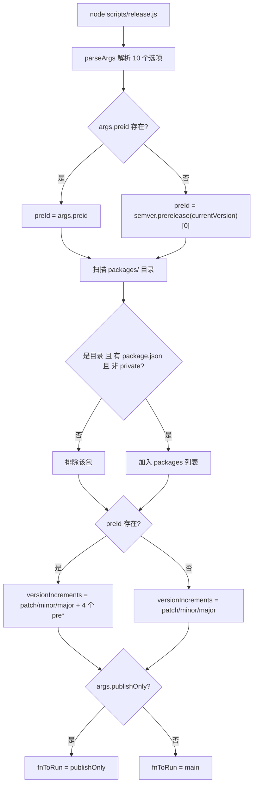
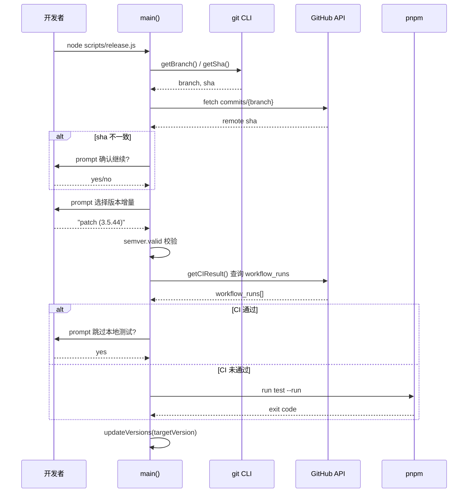
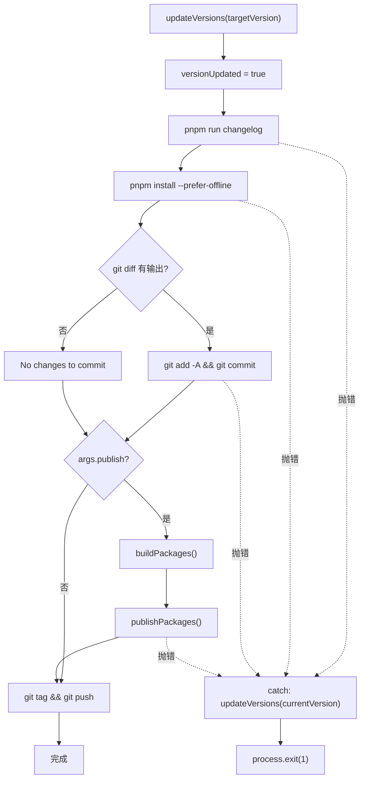

# 第 9 章：發布自動化：release.js 的狀態機與互動式編排

上一章我們藉助 template-explorer 反推編譯器行為，掌握了用工具觀察內部機制的方法論。現在，我們把視線從編譯時轉向發布時——這是每個開源專案最危險的時刻：它同時觸碰版本號、建置產物、Git 歷史與 npm registry 四個不可逆的外部系統。一次錯誤的 npm publish 無法撤回，一次錯誤的 tag 推送會污染所有下游使用者的依賴解析。Vue core 用一個 537 行的 scripts/release.js 來馴服這種危險——它既不是純粹的自動化腳本，也不是純粹的手動清單，而是一個互動式狀態機：在關鍵節點停下來問人，在可預測的節點全自動執行，並在任何一步失敗時把版本號回滾到起點。本章將拆解這個編排器的三個核心機制：參數解析與狀態初始化、互動式版本決策與 CI 門禁、以及發布順序與失敗回滾。

# 參數解析與全域狀態初始化

## 直覺模型

把`release.js`想像成一台老式洗衣機的控制面板：旋鈕（`parseArgs`）決定用哪種模式，指示燈（全域變數）記錄當前處於哪個階段，而「取消」按鈕（錯誤處理）必須能把機器恢復到進水前的狀態。若沒有這套初始化邏輯，腳本就會在「使用者到底想發什麼版本」這個問題上失控——要麼發錯版本號，要麼在 CI 裡卡死等待一個永遠不會到來的鍵盤輸入。

## 旗標與全域狀態的記憶體佈局

> **[Design Inference & Architectural Trade-offs]**
> 腳本啟動後的第一件事是把命令列參數解析成一個結構化物件。這裡用的是 Node 內建的`parseArgs`，而非`yargs`或`commander`—— 這是為了消除第三方依賴，因為發布腳本本身必須在任何環境下都能跑起來，哪怕`node_modules`裝了一半。

[FACT:scripts/release.js:27-62]定義了 10 個選項，可分為四類：

- **版本語義類**：`preid`（預發布識別碼，如`alpha`/`beta`/`rc`）、`tag`（npm dist-tag）
- **跳過類**：`skipBuild`、`skipTests`、`skipGit`、`skipPrompts`——這四個布林開關構成了「自動化程度」的調節旋鈕
- **執行模式類**：`dry`（空跑）、`publish`（是否在本機直接發布）、`publishOnly`（只發布不更新版本）
- **目標類**：`registry`（自訂 registry 位址）

注意`publish`的預設值是`false` [FACT:scripts/release.js:51-54]，而其他布林項沒有預設值（即`undefined`）。這個不對稱是刻意的：`publish`的語義是「是否在本機執行 npm publish」，預設不發布，把發布動作交給 GitHub Actions；而`skipXxx`預設`undefined`意味著「未指定」，後續邏輯會區分「使用者顯式傳了`--skipTests`」和「使用者沒傳」。

解析完成後，腳本把參數攤平到一組模組級變數上[FACT:scripts/release.js:64-66]：

```js
const preId = args.preid || semver.prerelease(currentVersion)?.[0]
const isDryRun = args.dry
let skipTests = args.skipTests
const skipBuild = args.skipBuild
const skipPrompts = args.skipPrompts
const skipGit = args.skipGit
```

這裡有兩處值得玩味的設計。第一，`preId`的取值優先級是「命令列顯式指定 > 從當前版本號推斷」[FACT:scripts/release.js:64-66]。如果當前`package.json`的版本是`3.5.0-beta.1`，那麼`semver.prerelease`會返回`['beta', 1]`，取`[0]`得到`'beta'`。這意味著在 beta 分支上連續發版時，不需要每次都敲`--preid beta`。第二，`skipTests`用`let`宣告而其他用`const` [FACT:scripts/release.js:64-66]，因為它在`runTestsIfNeeded`中會被 CI 結果動態改寫——這是一個「延遲決策」的狀態位。

緊接著是套件發現邏輯[FACT:scripts/release.js:68-83]：讀取`packages/`目錄，過濾掉非目錄項、沒有`package.json`的項，以及`private: true`的套件。注意這裡讀的是`packages/`而非`packages-private/`——後者是內部除錯套件，永不發布。

## 發布順序的排序演算法

[FACT:scripts/release.js:85-85]定義了一個看似簡單卻至關重要的函式：

```js
const sortPackagesForPublishing = (packageNames) => [
  ...packageNames.filter(p => p !== 'vue'),
  ...packageNames.filter(p => p === 'vue'),
]
```

它把`vue`這個入口套件排到最後。註解[FACT:scripts/release.js:85-85]解釋了原因：如果先發布`vue`，使用者在`@vue/runtime-core`等內部套件還沒上線時就能安裝到新版`vue`，npm 會因找不到匹配的內部依賴而報錯。這是「發布原子性」在 npm 生態下的妥協方案——npm 沒有跨套件事務，只能靠順序來逼近原子性。

## 版本增量候選集的動態構造

[FACT:scripts/release.js:111-116]構造了互動式選單的候選項：

```js
const versionIncrements = [
  'patch', 'minor', 'major',
  ...(preId ? ['prepatch', 'preminor', 'premajor', 'prerelease'] : []),
]
```

這是一個條件展開：只有在`preId`存在時（即當前處於預發布通道，或使用者顯式指定了`--preid`），才把預發布相關的增量類型加入選單。若當前是穩定版`3.5.43`且未指定`preid`，選單就只有`patch/minor/major`三項——避免使用者誤操作把穩定版變成`3.5.44-0`這種半吊子預發布版本。

`inc`函式[FACT:scripts/release.js:120-120]封裝了`semver.inc`，把`preId`作為第三個參數傳入。這裡有個型別防禦：`typeof preId === 'string' ? preId : undefined`——因為`preId`可能是`string | undefined`，而`semver.inc`期望`string | undefined`，這個三元表達式是為了滿足 TS 的型別收窄。

## 執行原語：run 與 dryRun 的雙軌制

[FACT:scripts/release.js:122-123]是整章最精妙的設計之一：

```js
const run = async (bin, args, opts = {}) =>
  exec(bin, args, { stdio: 'inherit', ...opts })
const dryRun = async (bin, args, opts = {}) =>
  console.log(pico.blue(`[dryrun] ${bin} ${args.join(' ')}`), opts)
const runIfNotDry = isDryRun ? dryRun : run
```

`run`把子程序的 stdio 設為`inherit`，讓建置/測試的輸出直接透傳到終端——這對長時間執行的建置至關重要，使用者能看到即時進度。`dryRun`則只列印命令不執行。`runIfNotDry`是一個「策略選擇」：在模組載入時就把函式指標綁定到`dryRun`或`run`，後續所有呼叫點無需再判斷`isDryRun`。

> **[Design Inference & Architectural Trade-offs]**
> 這種「在初始化時決定策略」的模式比「在每個呼叫點判斷」更不易出錯：如果某個呼叫點忘了判斷`isDryRun`，在 dry run 模式下就會真的執行副作用。而`runIfNotDry`把判斷集中到一處，消除了這類遺漏的可能。



---

# 互動式版本決策與 CI 門禁

## 直覺模型

這一階段像機場安檢：先核對你的登機證（本地 commit 是否與遠端同步），再確認你要去哪（版本號），最後檢查你是否已通過安檢（CI 是否通過）。任何一環不通過，整個流程就中止。若沒有這道門禁，一個未推送的本地 commit 可能被打上 tag 並發布，導致 npm 上的版本對應的原始碼在 GitHub 上根本不存在——這是最難以排查的發布事故。

## 同步檢查與版本選擇

`main`函式的第一件事是`isInSyncWithRemote()` [FACT:scripts/release.js:141-141]。這個函式[FACT:scripts/release.js:337-363]的邏輯是：取當前分支名，請求 GitHub API 取得該分支的最新 commit SHA，與本地`git rev-parse HEAD`比對。若不一致，彈出一個紅色警告的確認框[FACT:scripts/release.js:348-355]，讓使用者決定是否繼續。若 API 請求失敗（網路問題、無 token），則直接返回`false`並終止[FACT:scripts/release.js:365-367]。

> **[Design Inference & Architectural Trade-offs]**
> 這裡的設計哲學是「失敗即中止」：網路異常時寧可不讓發布，也不冒險在狀態未知的情況下繼續。因為發布是不可逆的，而重跑一次腳本的成本很低。

版本號的確定分兩條路徑。若使用者在命令列傳了位置參數（如`node scripts/release.js 3.6.0`），`targetVersion`直接取該值[FACT:scripts/release.js:141-141]。否則進入互動式選單[FACT:scripts/release.js:152-176]：先讓使用者選增量類型，若選`custom`則再彈一個輸入框讓使用者手填版本號。

注意[FACT:scripts/release.js:174]這一行：

```js
targetVersion = release.match(/\((.*)\)/)?.[1] ?? ''
```

選單項的格式是`patch (3.5.44)`，這行正則從括號裡提取出實際版本號。如果使用者選了`custom`，走的是另一條分支[FACT:scripts/release.js:164-172]。

隨後有一個「二次解析」邏輯[FACT:scripts/release.js:178-182]：如果`targetVersion`恰好是`patch`/`minor`這類增量關鍵字（使用者可能直接傳`node release.js minor`），就呼叫`inc`把它轉成具體版本號。最後用`semver.valid`校驗[FACT:scripts/release.js:184-186]，非法版本號直接拋錯。

## CI 門禁：runTestsIfNeeded 的三態邏輯

這是全章最複雜的控制流。[FACT:scripts/release.js:281-317]的`runTestsIfNeeded`實際上是一個三態決策機：

**狀態一：使用者顯式傳了`--skipTests`**。`skipTests`初始為`true`，直接跳過整個函式體，列印 "Tests skipped."[FACT:scripts/release.js:314-316]。

**狀態二：未跳過，且 CI 已通過**。腳本呼叫`getCIResult()` [FACT:scripts/release.js:319-335]，它請求 GitHub Actions API，檢查是否存在名為`ci`且`conclusion === 'success'`的 workflow run[FACT:scripts/release.js:319-335]。若通過，則詢問使用者「CI 已通過，是否跳過本地測試？」[FACT:scripts/release.js:288-295]。若使用者開了`--skipPrompts`，則自動跳過本地測試[FACT:scripts/release.js:296-298]。

**狀態三：未跳過，且 CI 未通過**。若開了`--skipPrompts`，直接拋錯[FACT:scripts/release.js:299-304]：

```js
throw new Error(
  'CI for the latest commit has not passed yet. ' +
    'Only run the release workflow after the CI has passed.',
)
```

若沒開`--skipPrompts`，則`skipTests`保持`undefined`，落到最後的本地測試分支[FACT:scripts/release.js:307-313]，執行`pnpm run test --run`。

這裡有個微妙的細節[FACT:scripts/release.js:285]：

```js
skipTests ||= isCIPassed
```

`||=`是邏輯或賦值：只有當`skipTests`為假值（`undefined`或`false`）時才賦值為`isCIPassed`。這意味著如果使用者顯式傳了`--skipTests`（`true`），這行不會改變它；如果使用者沒傳（`undefined`），則把它設為 CI 結果。但緊接著[FACT:scripts/release.js:287-298]又會在 CI 通過時重新賦值——所以`||=`這行的實際作用只是「若 CI 未通過，把`skipTests`設為`false`」，從而讓後續的`if (!skipTests)`分支執行本地測試。

> **[Design Inference & Architectural Trade-offs]**
> 這個邏輯繞了一圈，本質是想表達：「CI 通過 → 可以跳過本地測試（但問一下使用者）；CI 未通過 → 必須跑本地測試（除非使用者明確要求跳過）」。用`||=`加後續覆蓋的寫法雖然緊湊，但可讀性不高，是典型的「狀態位被多處修改」的程式碼異味。



## 版本號寫入：updateVersions 的遍歷

[FACT:scripts/release.js:377-384]的`updateVersions`做兩件事：更新根`package.json`，再遍歷所有子套件呼叫`updatePackage`。`updatePackage` [FACT:scripts/release.js:391-398]讀取 JSON、改寫`name`和`version`、用`JSON.stringify(pkg, null, 2) + '\n'`寫回——注意末尾的`\n`，這是為了保持檔案以換行結尾，避免 git diff 顯示 "No newline at end of file"。

`getNewPackageName`參數預設是`keepThePackageName` [FACT:scripts/release.js:105]，即不改套件名。這個參數的存在是為了支援「發布到自訂 registry 時重命名套件」的場景——雖然當前呼叫點都傳預設值，但介面預留了擴展性。

---

# 發布順序、冪等性與失敗回滾

## 直覺模型

這一階段像多米諾骨牌：`updateVersions`推倒第一張牌（改版本號），後續的 changelog、lockfile、commit、tag、publish 依次倒下。如果中途某張牌卡住，必須有一套機制把已經倒下的牌扶起來——否則倉庫會停留在「版本號已改但沒發布」的半吊子狀態。

## 冪等發布：isPackagePublished 與錯誤兜底

> **[Design Inference & Architectural Trade-offs]**
> `publishPackage` [FACT:scripts/release.js:439-489]是發布的核心。它首先確定 dist-tag[FACT:scripts/release.js:442-451]：優先使用`--tag`參數，否則根據版本號中的`alpha`/`beta`/`rc`關鍵字推斷。注意這裡用的是`version.includes('alpha')`而非`semver.prerelease`—— 因為版本號可能形如`3.5.0-alpha.1`，`includes`足夠簡單且不會誤判。

發布前有一道冪等性檢查[FACT:scripts/release.js:453-458]：

```js
if (!isDryRun && (await isPackagePublished(packageName, version))) {
  console.log(pico.yellow(`Skipping already published: ${pkgVersion}`))
  alreadyPublishedPackages.push(pkgVersion)
  return
}
```

`isPackagePublished` [FACT:scripts/release.js:491-513]執行`npm view <pkg>@<version> version`，若成功返回`true`，若報 E404 類錯誤返回`false`。這個檢查的意義在於：發布流程可能因網路中斷而重跑，重跑時已發布的套件不應再次發布（npm 會拒絕重複版本）。

但檢查本身也可能失敗——比如`npm view`因網路超時拋了非 E404 錯誤。此時`isPackagePublished`會把錯誤向上拋[FACT:scripts/release.js:507-510]，導致整個發布中止。這是「寧可中止也不冒險」的又一體現。

即使檢查通過，`pnpm publish`本身仍可能因競態（另一個 CI 剛發布了同版本）而失敗。所以`publishPackage`在 catch 區塊裡做了二次兜底[FACT:scripts/release.js:480-488]：

```js
} catch (e) {
  if (e.message?.match(/previously published/)) {
    console.log(pico.red(`Skipping already published: ${pkgVersion}`))
    alreadyPublishedPackages.push(pkgVersion)
  } else {
    throw e
  }
}
```

只有匹配到`previously published`才吞掉錯誤，其他錯誤一律重拋。這是「精確容錯」：只對已知的、可安全忽略的錯誤做降級處理。

## 發布標誌位的動態拼裝

[FACT:scripts/release.js:412-432]根據執行環境拼裝`pnpm publish`的附加標誌：

```js
const additionalPublishFlags = []
if (isDryRun) additionalPublishFlags.push('--dry-run')
if (isDryRun || skipGit || process.env.CI)
  additionalPublishFlags.push('--no-git-checks')
if (process.env.CI && !args.registry)
  additionalPublishFlags.push('--provenance')
```

`--no-git-checks`在三種情況下啟用：dry run、跳過 git、或在 CI 中。原因是`pnpm publish`預設會檢查工作區是否乾淨、當前分支是否是發布分支等，而在 CI 中這些檢查會誤報。

`--provenance`只在 CI 且未指定自訂 registry 時啟用[FACT:scripts/release.js:425-427]。provenance 是 npm 的供應鏈安全特性，它把建置產物的來源資訊（哪個 commit、哪個 workflow）簽名後附在套件上。但自訂 registry（如內部私有 registry）通常不支援 provenance，所以加了`!args.registry`的條件。

## 失敗回滾：versionUpdated 標誌位

回到`main`的末尾[FACT:scripts/release.js:528-537]：

```js
fnToRun().catch(err => {
  if (versionUpdated) {
    updateVersions(currentVersion)
  }
  console.error(err)
  process.exit(1)
})
```

`versionUpdated`是一個模組級布林量，初始為`false` [FACT:scripts/release.js:24-27]，在`updateVersions`呼叫成功後立即置為`true` [FACT:scripts/release.js:208]。若後續任何步驟（changelog 生成、lockfile 更新、git commit、publish）拋錯，catch 區塊會檢查這個標誌位，若為`true`則把版本號回滾到`currentVersion`。

> **[Design Inference & Architectural Trade-offs]**
> 這個回滾是「盡力而為」的：它只回滾`package.json`中的版本號，不回滾 changelog 檔案、不回滾 lockfile、不回滾已經執行的 git commit。如果錯誤發生在 git commit 之後，倉庫裡會留下一個「版本號已回滾但 commit 已存在」的中間狀態。這是設計上的取捨——完整的回滾需要`git reset`，而那會破壞使用者可能已經做的其他改動。所以腳本選擇只回滾最關鍵的版本號，讓使用者手動處理其餘部分。

注意`publishOnly`路徑[FACT:scripts/release.js:519-526]不設定`versionUpdated`，因為它的語意是「只發布，不改版本」——即使失敗也無需回滾。但它在`targetVersion`存在時會呼叫`updateVersions` [FACT:scripts/release.js:519-526]，此時若失敗，版本號不會被回滾。這是一個潛在的邊界問題，見章末思考題。



## 發布順序與 vue 套件的特殊處理

`publishPackages` [FACT:scripts/release.js:412-432]遍歷`sortPackagesForPublishing(packages)`的結果，逐個呼叫`publishPackage`。由於排序把`vue`放最後[FACT:scripts/release.js:85-85]，整個發布序列保證了內部套件先上線。

`publishPackage`內部用`cwd: getPkgRoot(pkgName)` [FACT:scripts/release.js:475]把工作目錄切到子套件目錄，這樣`pnpm publish`發布的是子套件而非根套件。註解[FACT:scripts/release.js:462-463]特別提醒「不要改成 npm publish」——因為`pnpm publish`能正確處理`workspace:*`依賴協議，把它轉換成實際版本號，而`npm publish`會原樣保留`workspace:*`導致安裝失敗。

---

# 設計思考

**為什麼用`parseArgs`而非`yargs`？**發布腳本是「最後一道防線」，它必須在任何環境下可執行。第三方 CLI 函式庫若因依賴樹損壞而載入失敗，整個發布流程就癱瘓了。Node 內建的`parseArgs`雖然功能簡陋（不支援子命令、不支援自動 help），但零依賴、零風險。

**為什麼把`publish`預設設為`false`？**因為 Vue 的正式發布走 GitHub Actions（見[FACT:scripts/release.js:256-263]的提示訊息），本地腳本只負責改版本號、生成 changelog、打 tag、推送。真正的`npm publish`在 CI 中執行，這樣能利用 CI 的 provenance 簽名和受控環境。`--publish`標誌是給維護者在緊急情況下本地發布用的逃生通道。

**為什麼回滾只回滾版本號？**因為完整回滾需要理解「哪些改動是腳本做的、哪些是使用者做的」，而這在 git 層面無法區分。腳本選擇只回滾它最確定自己改過的東西——`package.json`的版本號——其餘交給使用者判斷。

---

# 本章小結

`scripts/release.js`用 537 行程式碼實作了一個「互動式狀態機」，其核心設計可歸納為三點：

1. **參數即策略**：10 個標誌位在模組載入時被解析並攤平到全域變數，`runIfNotDry`在初始化時綁定策略，避免呼叫點遺漏判斷。

2. **門禁前置**：同步檢查、版本校驗、CI 門禁都在任何副作用發生前完成，確保「要麼全做，要麼不做」。

3. **精確容錯**：`isPackagePublished`預檢 +`previously published`錯誤兜底構成雙重冪等保護；`versionUpdated`標誌位實現最小化回滾。

這套機制與上一章的 Template Explorer 形成有趣對照：Template Explorer 是「觀察」——把編譯器內部狀態視覺化；release.js 是「執行」——把發布流程的每一步狀態顯式化。兩者都體現了同一個工程哲學：**把隱式狀態變成顯式狀態，把不可控的副作用變成可控的步驟**。

# 本章思考與自測

Q1: 若把[FACT:scripts/release.js:285]的`skipTests ||= isCIPassed`改為`skipTests = isCIPassed`，在使用者顯式傳了`--skipTests`且 CI 未通過時會發生什麼？為什麼？

**參考解析**：原邏輯中，使用者傳`--skipTests`時`skipTests`初始為`true` [FACT:scripts/release.js:64-66]，`||=`不會改變它，因此`runTestsIfNeeded`在[FACT:scripts/release.js:282]的`if (!skipTests)`判斷為假，直接跳到[FACT:scripts/release.js:314-316]印出 "Tests skipped."。若改為`skipTests = isCIPassed`，則`skipTests`被強制設為`false`（CI 未通過），隨後[FACT:scripts/release.js:287]的`if (isCIPassed)`為假，落到[FACT:scripts/release.js:299]的`else if (skipPrompts)`——若未開`--skipPrompts`，則`skipTests`保持`false`，最終在[FACT:scripts/release.js:307-313]執行本地測試。這違背了使用者「顯式跳過測試」的意圖，在 CI 環境（`--skipPrompts`）下更會直接拋錯[FACT:scripts/release.js:300-303]，導致發布中止。`||=`的存在正是為了尊重使用者的顯式選擇。

Q2: `publishOnly`路徑[FACT:scripts/release.js:519-526]在`targetVersion`存在時會呼叫`updateVersions`，但它不設定`versionUpdated`。若此時`buildPackages`或`publishPackages`拋錯，會發生什麼？這個設計是否合理？

**參考解析**：`publishOnly`呼叫`updateVersions(targetVersion)` [FACT:scripts/release.js:519-526]修改了所有`package.json`的版本號，但沒有設定`versionUpdated = true`。當後續`buildPackages` [FACT:scripts/release.js:519-526]或`publishPackages` [FACT:scripts/release.js:519-526]拋錯時，`fnToRun().catch` [FACT:scripts/release.js:528-537]檢查`versionUpdated`為`false`，不會回滾版本號。結果是倉庫停留在「版本號已改但發布失敗」的狀態。這個設計在`publishOnly`的原始語意（只發布、不改版本）下是合理的——因為`targetVersion`通常不傳，`updateVersions`不執行。但當使用者傳了`targetVersion`時，這個路徑就存在回滾漏洞。修復方式是在[FACT:scripts/release.js:519-526]後加`versionUpdated = true`，或讓`publishOnly`復用`main`的回滾邏輯。

Q3: `isPackagePublished` [FACT:scripts/release.js:491-513]用`npm view`檢查套件是否已發布。若網路逾時導致`npm view`拋出非 E404 錯誤，會發生什麼？這個行為在 CI 重跑場景下是否安全？

**參考解析**：`isPackagePublished`在 catch 區塊中[FACT:scripts/release.js:507-510]呼叫`isPackageNotFoundError`判斷錯誤類型。該函式[FACT:scripts/release.js:515-515]只匹配`/E404|No match found|No matching version|notarget/i`。網路逾時錯誤的 message 不含這些關鍵字，因此`isPackageNotFoundError`返回`false`，`isPackagePublished`把錯誤重拋[FACT:scripts/release.js:507-510]。這個錯誤向上傳播到`publishPackage` [FACT:scripts/release.js:453]，導致整個發布中止。在 CI 重跑場景下，這會導致「明明包已發布，卻因網路抖動而中止」——但這是安全的失敗方向：中止比誤判「未發布」而重複發布要好。重複發布會觸發 npm 的`previously published`錯誤，被[FACT:scripts/release.js:491-492]兜底，但會浪費一次網路往返。所以「網路錯誤即中止」是保守但正確的選擇。

---

下一章將進入`.github/workflows/`，看 release.js 推送 tag 之後，GitHub Actions 如何接管後續的建置與發布，以及 CI 門禁的完整實作。

至此，我們看清了 release.js 如何用狀態機與互動式編排把不可逆的發布風險降到最低。但發布腳本本身只是執行者，真正決定何時觸發、以何種條件放行的，是更上層的自動化守門人。下一章將剖析 .github/workflows 目錄下的 CI/CD 體系：ci.yml 如何在 PR 階段執行 lint/typecheck/test 三重門禁、release.yml 如何在 tag 推送時觸發發布、size-report.yml 與 size-data.yml 如何追蹤包體積回歸、autofix.yml 如何自動修復格式問題。你將理解 Vue 如何用 GitHub Actions 把工程規範固化為不可繞過的流水線。
