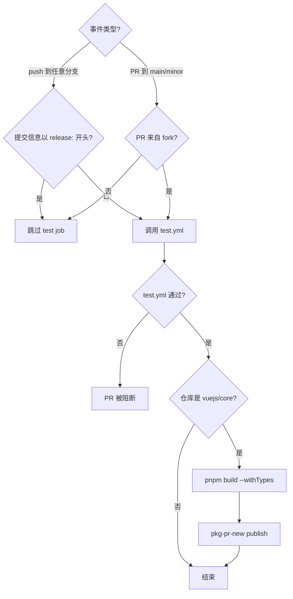
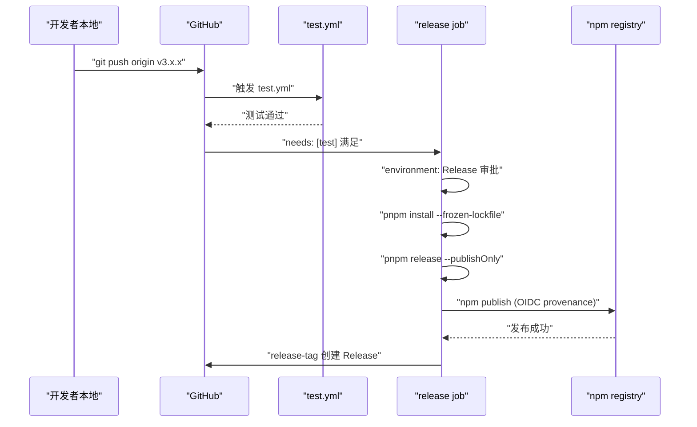
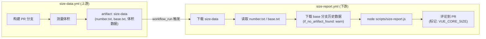

# 第 10 章：CI/CD 工作流：從 PR 到 Release 的自動化守門人

上一章我們看到`scripts/release.js`如何用互動式狀態機把一次發版的每一步串起來。但那個腳本有一個前提：它必須被某個人或某個系統主動呼叫。在 Vue core 倉庫裡，這個主動呼叫者不是維護者的本地終端，而是 GitHub Actions。release.js 是執行者，workflows 是決策者——它決定什麼事件觸發什麼任務、什麼條件下放行、什麼條件下阻斷。本章聚焦`.github/workflows/`目錄下的四個檔案：`ci.yml`（PR 門禁與持續預發布）、`release.yml`（tag 觸發的正式發布）、`size-report.yml`（體積回歸報告）、`autofix.yml`（格式自動修復）。理解它們的核心不是記住 YAML 語法，而是看清 Vue 團隊如何把工程規範翻譯成不可繞過的流水線約束。

# 一、ci.yml：三重門禁與持續預發布

## 直覺模型

把`ci.yml`想像成機場安檢口。每個 PR 都要過這道閘：lint 檢查你的行李有沒有違禁品，typecheck 確認你的證件真實有效，test 驗證你沒有攜帶危險品。但安檢口不止一個——Vue 還在這裡掛了一條「持續預發布」通道，把每個 PR 的建置產物直接發布到 pkg-pr-new，讓貢獻者能在真實 npm 安裝場景下驗證自己的改動。

若沒有這道閘，任何一次合併都可能把格式錯誤、型別漏洞或行為回歸帶進 main 分支，而 main 分支是後續所有 release 的源頭。

## 觸發條件與並發控制

`ci.yml`的觸發配置值得逐行拆解。

[FACT:.github/workflows/ci.yml:2-11]

```yaml
on:
  push:
    branches:
      - '**'
    tags:
      - '!**'
  pull_request:
    branches:
      - main
      - minor
```

這裡有兩個關鍵設計。第一，`push`事件監聽所有分支（`'**'`），但用`tags: ['!**']`顯式排除所有 tag 推送。為什麼要排除 tag？因為 tag 推送由`release.yml`單獨處理，如果`ci.yml`也響應 tag，會導致發布流程和 CI 流程重複觸發，浪費 runner 資源甚至產生競態。第二，`pull_request`只監聽`main`和`minor`兩個分支——這是 Vue 的雙分支策略：`main`承載穩定版，`minor`承載預發布版。

[FACT:.github/workflows/ci.yml:22-22]

```yaml
concurrency:
  group: ${{ github.workflow }}-${{ github.event.pull_request.number || github.ref }}
  cancel-in-progress: ${{ github.event_name == 'pull_request' }}
```

並發控制是這裡最精妙的一筆。`group`的表達式用`github.event.pull_request.number || github.ref`做 fallback：PR 事件用 PR 編號做分組鍵，push 事件用 ref（分支名）做分組鍵。這意味著同一個 PR 的多次推送會落在同一個並發組裡。而`cancel-in-progress`只在 PR 事件時為`true`——當你連續推送三次提交時，前兩次的 CI 會被自動取消，只保留最新一次。

> **[Design Inference & Architectural Trade-offs]**
> 這個設計的動機很明確：PR 階段開發者頻繁推送，舊提交的 CI 結果已經無意義，取消它們能節省大量 runner 時間。但 push 到 main 分支時不能取消——因為 main 上的每次 push 都可能是發布前的最後一次驗證，取消會導致驗證缺口。

## 三重門禁的入口：test job 的條件判斷

[FACT:.github/workflows/ci.yml:22-22]

```yaml
jobs:
  test:
    if: ${{ ! startsWith(github.event.head_commit.message, 'release:') && (github.event_name == 'push' || github.event.pull_request.head.repo.full_name != github.repository) }}
    uses: ./.github/workflows/test.yml
```

這個`if`條件包含兩個邏輯與（`&&`）的分支，每個都值得展開。

第一個條件`! startsWith(github.event.head_commit.message, 'release:')`：如果提交資訊以`release:`開頭，跳過測試。這正是上一章 release.js 推送的提交訊息格式——release.js 在本機已經跑過完整測試，CI 不需要重複驗證。這是一個「信任上游」的優化。

> **[Design Inference & Architectural Trade-offs]**
> 第二個條件`(github.event_name == 'push' || github.event.pull_request.head.repo.full_name != github.repository)`：push 事件總是跑測試；PR 事件則要求 PR 來自 fork（`head.repo.full_name != github.repository`）。為什麼 fork 的 PR 才跑？ 因為同倉庫分支的 PR 通常由核心團隊成員建立，他們的分支推送已經觸發過 push 事件的 CI。而 fork 的 PR 不會觸發 push 事件（fork 的 push 不會通知上游倉庫），所以必須在 PR 事件裡補跑。

注意`uses: ./.github/workflows/test.yml`——這是一個 reusable workflow 呼叫。`test.yml`是獨立的 workflow 檔案，被`ci.yml`和`release.yml`共享。這種復用避免了在多個 workflow 裡重複定義 lint/typecheck/test 的步驟。

## 持續預發布：pkg-pr-new 的角色

[FACT:.github/workflows/ci.yml:25-51]

```yaml
continuous-release:
  if: github.repository == 'vuejs/core'
  runs-on: ubuntu-latest
  steps:
    - name: Checkout
      uses: actions/checkout@3d3c42e5aac5ba805825da76410c181273ba90b1 # v7.0.1
      with:
        persist-credentials: false
    # ... 安装 pnpm、Node.js、依赖 ...
    - name: Build
      run: pnpm build --withTypes
    - name: Release
      run: pnpx pkg-pr-new publish --compact --pnpm './packages/*' --packageManager=pnpm,npm,yarn
```

`continuous-release`job 只在`vuejs/core`主倉庫運行（`if: github.repository == 'vuejs/core'`），fork 上不執行。它做三件事：建置（`pnpm build --withTypes`，帶型別宣告）、然後用`pkg-pr-new`把`./packages/*`下的所有套件發布到一個臨時的 npm registry。

> **[Design Inference & Architectural Trade-offs]**
> 這個機制的價值在於：貢獻者可以在自己的專案裡直接`npm install`這個 PR 的建置產物，驗證改動是否真的解決了問題。這比「看 CI 綠了」更有說服力，因為它驗證的是真實的套件消費場景。

注意所有 action 都鎖定了 commit SHA（如`actions/checkout@3d3c42e5...`），而不是用`@v4`這樣的浮動 tag。這是供應鏈安全的硬性要求——防止 action 倉庫被入侵後惡意程式碼自動流入。

## ci.yml 控制流圖



---

# 二、release.yml：tag 推送後的發布編排

## 直覺模型

如果說`ci.yml`是安檢口，`release.yml`就是發射台。當 release.js 在本機完成版本號更新、提交、打 tag 並推送後，tag 推送事件點燃了`release.yml`的引擎。它先跑一遍完整測試（再次確認），然後在受保護的`Release`環境中執行`pnpm release --publishOnly`，最後建立 GitHub Release。

若沒有它，release.js 推送的 tag 就只是一個 Git 引用，npm 上不會有新版本，GitHub 上不會有 Release 頁面。

## 觸發條件：只認 tag

[FACT:.github/workflows/release.yml:3-6]

```yaml
on:
  push:
    tags:
      - 'v*' # Push events to matching v*, i.e. v1.0, v20.15.10
```

只監聽`v*`格式的 tag 推送。這與`ci.yml`的`tags: ['!**']`形成互補——兩者嚴格互斥，不會同時觸發。

## 發布 job 的守衛條件

[FACT:.github/workflows/release.yml:8-21]

```yaml
jobs:
  test:
    uses: ./.github/workflows/test.yml

  release:
    if: github.repository == 'vuejs/core'
    needs: [test]
    runs-on: ubuntu-latest
    permissions:
      contents: write
      id-token: write
    environment: Release
```

這裡有三層守衛，每一層都不可省略。

第一層`if: github.repository == 'vuejs/core'`：防止 fork 上誤觸發發布。如果有人 fork 了倉庫並推送了一個`v1.0.0`tag，這個條件會阻止發布流程運行。

第二層`needs: [test]`：release job 依賴 test job。test job 呼叫`test.yml`，如果測試失敗，release job 根本不會啟動。這是「發布前必須通過測試」的硬約束。

> **[Design Inference & Architectural Trade-offs]**
> 第三層`environment: Release`：這是一個 GitHub Environment，可以配置部署保護規則（如需要特定人員審批）。 這意味著即使 tag 推送觸發了 workflow，發布步驟也可能需要人工審批才能執行——這是對不可逆操作的最後一道防線。

權限方面，`contents: write`用於建立 GitHub Release，`id-token: write`用於 npm 的 provenance 認證（OIDC token）。注意這裡沒有`packages: write`，因為 Vue 發布到 npm 而非 GitHub Packages。

## 發布步驟的完整鏈路

[FACT:.github/workflows/release.yml:37-46]

```yaml
- name: Install deps
  run: pnpm install --frozen-lockfile

- name: Update npm
  run: npm i -g npm@latest

- name: Build and publish
  id: publish
  run: |
    pnpm release --publishOnly
```

> **[Design Inference & Architectural Trade-offs]**
> 三個步驟各有講究。`--frozen-lockfile`確保 CI 環境嚴格按 lockfile 安裝，不會因為依賴版本漂移導致建置產物與本機不一致。`npm i -g npm@latest`是為了獲取最新的 npm CLI—— 因為 provenance 和 OIDC 認證依賴較新版本的 npm，舊版本可能不支援這些特性。

`pnpm release --publishOnly`是上一章 release.js 的入口。`--publishOnly`標誌告訴 release.js：跳過互動式版本號選擇、跳過 Git 提交和打 tag（因為 tag 已經存在），只執行建置和 npm publish。

## 建立 GitHub Release

[FACT:.github/workflows/release.yml:48-57]

```yaml
- name: Create GitHub release
  id: release_tag
  uses: yyx990803/release-tag@8cccf7c5aa332d71d222df46677f70f77a8d2dc0 # v1.0.0
  env:
    GITHUB_TOKEN: ${{ secrets.GITHUB_TOKEN }}
  with:
    tag_name: ${{ github.ref }}
    body: |
      For stable releases, please refer to [CHANGELOG.md](...) for details.
      For pre-releases, please refer to [CHANGELOG.md](...) of the `minor` branch.
```

> **[Design Inference & Architectural Trade-offs]**
> 這裡用的是 Vue 作者尤雨溪自己維護的`release-tag` action。`tag_name: ${{ github.ref }}`直接使用觸發事件的 ref（即`refs/tags/v3.x.x`）。Release body 不寫具體變更內容，而是指向 CHANGELOG.md—— 因為 Vue 的 changelog 由 conventional-changelog 自動生成，手動維護 Release body 會與 changelog 產生不一致。

## release.yml 時序圖



---

# 三、size-report.yml 與 autofix.yml：體積追蹤與格式自癒

## size-report.yml：跨 workflow 的體積回歸報告

`size-report.yml`的觸發方式很特殊——它不是由 push 或 PR 直接觸發，而是由另一個 workflow 的完成事件觸發。

[FACT:.github/workflows/size-report.yml:3-7]

```yaml
on:
  workflow_run:
    workflows: ['size data']
    types:
      - completed
```

`workflow_run`事件監聽名為`size data`的 workflow 完成。這是一個兩階段設計：`size-data.yml`（本章未提供原始碼）負責在 PR 上建置並測量體積，把結果作為 artifact 上傳；`size-report.yml`在`size data`完成後，下載 artifact，生成報告，並評論到 PR 上。

[FACT:.github/workflows/size-report.yml:20-23]

```yaml
if: >
  github.repository == 'vuejs/core' &&
  github.event.workflow_run.event == 'pull_request' &&
  github.event.workflow_run.conclusion == 'success'
```

三重守衛：主倉庫、PR 事件、上游 workflow 成功。如果`size data`失敗了，報告 job 不會執行——因為沒有資料可報告。

資料流轉過程如下：

[FACT:.github/workflows/size-report.yml:41-46]

```yaml
- name: Download Size Data
  uses: dawidd6/action-download-artifact@d63b86af1b34672e53c440b1b83979861906bad7 # v24
  with:
    name: size-data
    run_id: ${{ github.event.workflow_run.id }}
    path: temp/size
```

從上游 workflow run 下載`size-data`artifact 到`temp/size`。然後並行讀取 PR 編號和 base 分支：

[FACT:.github/workflows/size-report.yml:48-59]

```yaml
- parallel:
    - name: Read PR Number
      id: pr-number
      uses: juliangruber/read-file-action@271ff311a4947af354c6abcd696a306553b9ec18 # v1.1.8
      with:
        path: temp/size/number.txt
    - name: Read base branch
      id: pr-base
      uses: juliangruber/read-file-action@271ff311a4947af354c6abcd696a306553b9ec18 # v1.1.8
      with:
        path: temp/size/base.txt
```

`parallel`是 GitHub Actions 的語法糖，讓兩個無依賴的步驟同時執行。`number.txt`和`base.txt`是`size-data.yml`在測量時寫入的元資料檔案。

接著下載 base 分支的歷史體積資料用於對比：

[FACT:.github/workflows/size-report.yml:61-69]

```yaml
- name: Download Previous Size Data
  uses: dawidd6/action-download-artifact@d63b86af1b34672e53c440b1b83979861906bad7 # v24
  with:
    branch: ${{ steps.pr-base.outputs.content }}
    workflow: size-data.yml
    event: push
    name: size-data
    path: temp/size-prev
    if_no_artifact_found: warn
```

注意`if_no_artifact_found: warn`——如果 base 分支還沒有歷史資料（比如新分支），不會失敗，只是警告。這保證了首次執行時報告仍能生成，只是沒有對比基線。

最後生成報告並評論：

[FACT:.github/workflows/size-report.yml:71-89]

```yaml
- name: Prepare report
  run: node scripts/size-report.js > size-report.md

- name: Read Size Report
  id: size-report
  uses: juliangruber/read-file-action@271ff311a4947af354c6abcd696a306553b9ec18 # v1.1.8
  with:
    path: ./size-report.md

- name: Create Comment
  uses: actions-cool/maintain-one-comment-backup@fbbc22ad1809c1bcf46f19b58397b6254773588c # backup for v3.0.0
  with:
    token: ${{ secrets.GITHUB_TOKEN }}
    number: ${{ steps.pr-number.outputs.content }}
    body: |
      ${{ steps.size-report.outputs.content }}
      
    body-include: ''
```

`scripts/size-report.js`讀取`temp/size`和`temp/size-prev`下的資料，生成 Markdown 報告。`maintain-one-comment-backup`action 用`body-include: '<!-- VUE_CORE_SIZE -->'`作為標記，確保同一個 PR 上只保留一條體積報告評論（更新而非追加）。注意 L81 的註解說明原 action 倉庫被 GitHub 封鎖，所以用了備份倉庫並鎖定 commit。

## autofix.yml：格式問題的自動修復

`autofix.yml`解決一個很實際的問題：貢獻者提交的程式碼格式不符合 prettier/eslint 規範，CI 報錯，貢獻者需要手動跑`pnpm lint --fix`再提交。這個 workflow 把這一步自動化了。

[FACT:.github/workflows/autofix.yml:3-8]

```yaml
on:
  pull_request:

concurrency:
  group: ${{ github.workflow }}-${{ github.event.pull_request.number }}
  cancel-in-progress: ${{ github.event_name == 'pull_request' }}
```

觸發所有 PR，並行控制與`ci.yml`類似——同一個 PR 的新推送會取消舊的 autofix 執行。

[FACT:.github/workflows/autofix.yml:35-41]

```yaml
- name: Run eslint
  run: pnpm run lint --fix

- name: Run prettier
  run: pnpm run format

- uses: autofix-ci/action@7a166d7532b277f34e16238930461bf77f9d7ed8
```

先跑 eslint 的`--fix`，再跑 prettier 格式化，最後`autofix-ci/action`把修改後的檔案直接提交回 PR 分支。注意`pnpm run format`本身就是格式化命令（不需要`--fix`標誌，因為 format 腳本內部就是`prettier --write`）。

> **[Design Inference & Architectural Trade-offs]**
> 這個機制的關鍵在於`autofix-ci/action`會以 PR 作者的身分提交修復，而不是以 bot 身分。這樣貢獻者不需要額外操作，格式修復就自動出現在他們的 PR 裡。但這也意味著如果貢獻者的分支有保護規則（不允許 bot 推送），autofix 會失敗——這是需要貢獻者手動處理的邊界情況。

## size-report 資料流圖



---

# 設計思考：把規範固化為流水線

回顧這四個 workflow，可以看到幾條貫穿始終的設計原則。

**第一，權限最小化。** `ci.yml`和`autofix.yml`都宣告`permissions: contents: read`，只有`release.yml`需要`contents: write`和`id-token: write`。`size-report.yml`需要`pull-requests: write`和`issues: write`來發評論。每個 workflow 只拿它真正需要的權限。

**第二，供應鏈安全。**所有第三方 action 都鎖定到 commit SHA，而非浮動 tag。`size-report.yml`L81 的註解更是直接說明原 action 倉庫被封鎖後切換到備份倉庫並鎖定 commit——這是對供應鏈攻擊的實戰防禦。

**第三，職責分離與複用。** `test.yml`被`ci.yml`和`release.yml`共享，避免測試邏輯重複。`size-data.yml`和`size-report.yml`分離，讓測量和報告各自獨立演進。

**第四，失敗方向的選擇。** `size-report.yml`的`if_no_artifact_found: warn`選擇「警告而非失敗」，因為缺少歷史資料不應該阻斷 PR。而`release.yml`的`needs: [test]`選擇「測試失敗即阻斷發布」，因為發布是不可逆操作。

**第五，並行控制的差異化。**PR 事件取消舊執行（`cancel-in-progress: true`），push 事件不取消（`cancel-in-progress: false`）。這個差異反映了兩種事件的語義：PR 的舊提交已無意義，push 的每次提交都可能是最終狀態。

---

# 本章小結

本章剖析了 Vue core 倉庫的四個核心 workflow：

- **`ci.yml`**：PR 門禁 + 持續預發布。透過`if`條件區分 push/PR 和 fork/同倉庫，用`concurrency`取消過時的 PR 執行，用`pkg-pr-new`發布可安裝的預發布套件。
- **`release.yml`**：tag 觸發的正式發布。三層守衛（倉庫檢查、needs test、environment 審批）確保只有通過測試且經審批的 tag 才能發布到 npm。
- **`size-report.yml`**：跨 workflow 的體積回歸報告。透過`workflow_run`事件監聽上游`size data`完成，下載 artifact 並對比 base 分支資料，以評論形式回饋到 PR。
- **`autofix.yml`**：格式自動修復。在 PR 上執行 eslint --fix 和 prettier，透過`autofix-ci/action`把修復直接提交回 PR 分支。

這四個 workflow 共同構成了一道「不可繞過的流水線」：程式碼規範由 autofix 自動修復，類型和測試由 ci.yml 強制檢查，體積回歸由 size-report 追蹤，發布由 release.yml 在多重守衛下執行。

# 本章思考與自測

Q1: 如果將`ci.yml`中`cancel-in-progress`的值改為恆為`true`（即去掉`github.event_name == 'pull_request'`的條件），在什麼場景下會導致問題？

**參考解析**：`cancel-in-progress`恆為`true`意味著 push 到 main 分支時，新的 push 會取消正在執行的舊 CI。考慮這個場景：main 分支上連續合併了兩個 PR，第一個 PR 的 CI 正在執行（包含完整的 lint/typecheck/test），第二個 PR 的合併觸發了新的 CI 執行。如果`cancel-in-progress`為`true`，第一個 PR 的 CI 會被取消——但第一個 PR 的程式碼已經在 main 上了，它的 CI 結果對於判斷 main 分支的健康狀態至關重要。取消它意味著 main 分支上有一段程式碼從未被完整驗證過。而[FACT:.github/workflows/ci.yml:22-22]的條件`github.event_name == 'pull_request'`正是為了避免這個問題：只有 PR 事件才取消舊執行，push 事件永遠不取消。

Q2: `release.yml`中`release`job 的`if: github.repository == 'vuejs/core'`和`environment: Release`分別防禦什麼場景？如果去掉其中一個會怎樣？

**參考解析**：`if: github.repository == 'vuejs/core'` [FACT:.github/workflows/release.yml:14]防禦的是 fork 場景。如果有人 fork 了 vuejs/core 並推送一個`v3.99.0`tag，沒有這個條件，workflow 會在 fork 倉庫中執行`pnpm release --publishOnly`。雖然 fork 倉庫沒有 npm token 無法真正發布，但會浪費 runner 資源並可能產生誤導性的失敗通知。`environment: Release` [FACT:.github/workflows/release.yml:21]防禦的是「tag 推送後自動發布」的風險——它允許配置人工審批，確保即使 tag 被推送，發布也需要維護者確認。如果去掉`if`條件，fork 會浪費資源；如果去掉`environment`，任何有 tag 推送權限的人都能觸發發布，沒有最後的人工確認環節。兩者是不同層次的防禦，不能互相替代。

Q3: `size-report.yml`中`if_no_artifact_found: warn`的選擇與`release.yml`中`needs: [test]`的選擇，分別體現了怎樣的失敗方向設計哲學？如果互換這兩個策略會發生什麼？

**參考解析**：`if_no_artifact_found: warn` [FACT:.github/workflows/size-report.yml:69]選擇「缺少歷史資料時警告而非失敗」，因為體積報告是輔助資訊，不是阻斷條件。如果改為`fail`，那麼新分支或首次執行的 PR 會因為找不到 base 資料而失敗，這顯然不合理。`needs: [test]` [FACT:.github/workflows/release.yml:15]選擇「測試失敗即阻斷發布」，因為發布是不可逆操作，必須確保程式碼品質。如果互換——size-report 在缺少資料時失敗，release 在測試失敗時仍然發布——前者會導致大量誤報阻斷正常 PR，後者會導致未經測試的程式碼進入 npm。這體現了「輔助資訊寬鬆、不可逆操作嚴格」的失敗方向設計原則。

---

下一章將深入體積預算機制的核心：`scripts/size-report.js`如何解析體積資料、如何計算增量、如何格式化輸出，以及`usage-size`的度量哲學——為什麼 Vue 選擇測量「實際使用體積」而非「完整包體積」。

從 PR 門禁到 tag 發布，四個 workflow 檔案共同構成了一條不可繞過的自動化守門鏈。但流水線能阻斷合併，前提是它掌握可量化的判斷依據。下一章將聚焦 Vue 對包體積這一核心指標的工程化治理：`scripts/size-report.js`如何計算各產物 gzip 後大小並與基線對比，`scripts/usage-size.js`如何模擬真實使用者引入場景估算實際開銷，以及 CI 如何在體積超標時阻斷合併。
