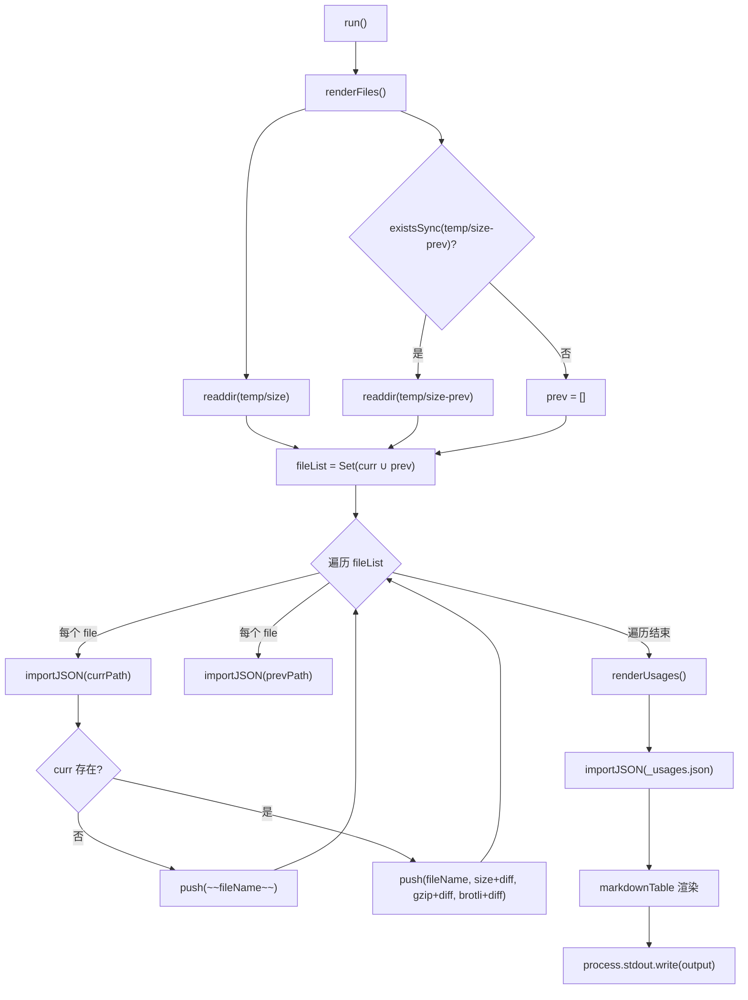
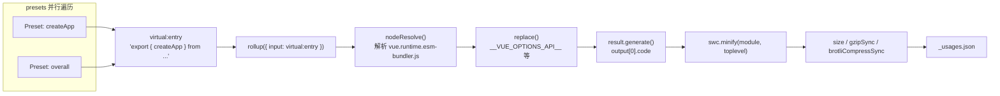

# 第 11 章：體積預算機制：size-report 與 usage-size 的度量哲學

上一章我們看到，Vue 用 GitHub Actions 把 lint、型別檢查、測試和體積追蹤固化成不可繞過的流水線，其中 size-report.yml 與 size-data.yml 負責在每次改動後留下體積數據。但流水線只負責執行，真正回答「大了多少、大在哪裡」的，是本章要拆解的兩個腳本。體積預算的核心矛盾在於：包體積是一個只能感知、難以精確歸因的指標。使用者抱怨「Vue 太大了」時，維護者需要回答三個問題——大了多少？大在哪裡？這次改動是否讓它更大？scripts/size-report.js 負責對比，scripts/usage-size.js 負責歸因，二者共同構成體積預算的度量哲學。

# 11.1 size-report：把體積差異變成可讀的 Markdown 表格

## 直覺模型

想像你是一個物流公司的質檢員。每個包裹（建置產物）出庫前都要稱重，而你的工作不是稱重本身，而是把「今天的重量」和「昨天的重量」並排放在一張表上，用加粗的`+2.3 kB`標出哪些包裹變重了。若沒有這張對比表，維護者只能看到一堆孤立的數字，無法判斷某次 PR 是否引入了體積回歸。

`size-report.js`就是這個質檢員。它不產生體積數據（那是`usage-size.js`和建置腳本的事），它只消費兩個目錄下的 JSON 檔案，生成一份 Markdown 報告。

## 資料結構與目錄約定

腳本的核心約定藏在兩個常數裡。當前資料目錄是`temp/size`，歷史基線目錄是`temp/size-prev`。

[FACT:scripts/size-report.js:23-24]

這兩個目錄的命名不是隨意的：`temp/size`由`size-data.yml`工作流在每次執行時生成並上傳為 artifact[FACT:.github/workflows/size-data.yml:53-57]，而`temp/size-prev`則由`size-report.yml`在拉取基線 artifact 後解壓得到。目錄名本身就是資料流的契約。

腳本定義了三個型別別名，它們精確刻畫了 JSON 檔案的結構：

[FACT:scripts/size-report.js:8-21]

`SizeResult`有三個數值欄位：`size`（未壓縮）、`gzip`、`brotli`。`BundleResult`在此基礎上加了`file`欄位用於顯示檔案名。`UsageResult`則是一個`Record`，鍵是 preset 名稱，值是`SizeResult & { name: string }`——注意這裡多了一個`name`欄位，因為 JSON 物件的鍵在`Object.values`之後會遺失，必須把名字冗餘存進值裡。

## Step-by-Step Walkthrough

主流程極簡，只有兩步加一次輸出：

[FACT:scripts/size-report.js:23-38]

`run()`先呼叫`renderFiles()`渲染產物檔案表格，再呼叫`renderUsages()`渲染使用場景表格，最後把累積在模組級變數`output`中的字串一次性寫到 stdout[FACT:scripts/size-report.js:25]。這種「累積字串再一次性輸出」的模式避免了多次`process.stdout.write`的拼接開銷，也讓輸出順序完全可控。

**第一步：收集檔案列表並求並集。**

[FACT:scripts/size-report.js:44-49]

`filterFiles`過濾掉兩類檔案：以`_`開頭的（如`_usages.json`）和以`.txt`結尾的（如`number.txt`、`base.txt`）。這兩類檔案是元資料，不是體積數據。然後取當前目錄和歷史目錄檔案名的並集`fileList`——用`Set`去重。為什麼要取並集？因為一個檔案可能只存在於歷史目錄（本次建置刪除了該產物），也可能只存在於當前目錄（本次建置新增了產物）。兩種情況都需要在報告中體現。

**第二步：逐檔案對比。**

[FACT:scripts/size-report.js:43-75]

對並集中的每個檔案，分別從兩個目錄嘗試匯入 JSON。`importJSON`的實作是「檔案不存在返回 undefined」：

[FACT:scripts/size-report.js:112-115]

這裡用了動態`import()`配合`with: { type: 'json' }`匯入斷言，而不是`fs.readFileSync` + `JSON.parse`。前者由 Node 的模組載入器處理，後者需要手動處理編碼和解析錯誤。選擇`import()`的代價是它返回 Promise，所以整個`renderFiles`是 async 的。

關鍵分支在`if (!curr)`：如果當前目錄沒有這個檔案，說明該產物已被刪除，用 Markdown 的刪除線語法`~~fileName~~`標記[FACT:scripts/size-report.js:60-61]。否則正常渲染一行，每個數值後面拼接`getDiff`的結果。

**第三步：計算差異。**

[FACT:scripts/size-report.js:124-130]

`getDiff`有三個提前返回點：`prev === undefined`時返回空串（沒有基線，無法比較）；`diff === 0`時返回空串（無變化，不顯示噪音）；否則返回加粗的帶符號差值。注意`prettyBytes(diff)`對負數也能正確處理，會輸出`-1.2 kB`這樣的形式，而`sign`變數只在正數時補`+`。

**第四步：渲染 usage 表格。**

[FACT:scripts/size-report.js:80-103]

`renderUsages`與`renderFiles`的結構差異值得注意：它直接匯入`_usages.json`，因為 usage 資料固定存在這一個檔案裡。`Object.values(curr)`把 Record 轉成陣列後，透過`prev?.[usage.name]`用名字查找歷史資料——這正是`name`欄位冗餘儲存的原因。`.filter(usage => !!usage)`這一行實際上是冗餘的，因為`map`總是返回陣列元素，不會產生 falsy 值。

最後用`markdown-table`庫把二維陣列渲染成 Markdown 表格[FACT:scripts/size-report.js:72-74]。

## 設計思考與踩坑

> **[Design Inference & Architectural Trade-offs]**
> **為什麼用`import()`而非`readFileSync`？**動態`import()`對 JSON 的匯入斷言是 Node 20+ 的標準做法，它天然處理了 ESM 環境下的 JSON 載入。代價是無法在同步上下文中使用，且每次匯入都會被模組快取——但在這個一次性腳本中，快取不是問題。

**`filterFiles`的`file[0] !== '_'`判斷。**這個判斷假設檔案名非空。如果`readdir`返回空字串（理論上不可能），`file[0]`是`undefined`，`undefined !== '_'`為 true，不會誤過濾。這是防禦性編程的邊界。

**刪除產物的處理。**當某個產物被刪除時，報告用刪除線標記而非直接移除。這是有意的設計：維護者需要看到「這個檔案消失了」，而不是讓它靜默地從表格中消失。若直接過濾掉，讀者會誤以為該產物從未存在過。

# 11.2 usage-size：模擬真實使用者的引入場景

## 直覺模型

`size-report`告訴你「完整包有多大」，但這回答不了使用者真正關心的問題：「我只用`createApp`，實際要下載多少程式碼？」完整包體積包含了大量你可能永遠用不到的程式碼（如`defineCustomElement`、`Transition`、`KeepAlive`）。`usage-size.js`的角色就是扮演一個「典型使用者」：寫一個只 import 特定 API 的虛擬入口檔案，用 Rollup 打包，看最終產物有多大。

這就像餐廳不告訴你「廚房裡所有食材總重 50 公斤」，而是告訴你「點一份宮保雞丁，實際用到的食材是 300 克」。

## 資料結構：Preset 陣列

腳本的核心資料結構是`presets`陣列，每個元素描述一個使用場景：

[FACT:scripts/usage-size.js:27-55]

`Preset`型別有三個欄位：`name`（顯示名）、`imports`（從 Vue 匯入的 API 列表）、可選的`replace`（額外的編譯期替換）。五個 preset 覆蓋了從最小到最大的使用場景：

- `createApp (CAPI only)`：只匯入`createApp`，並把`__VUE_OPTIONS_API__`替換為`'false'`，模擬純組合式 API 使用者[FACT:scripts/usage-size.js:35-40]
- `createApp`：只匯入`createApp`，保留 Options API[FACT:scripts/usage-size.js:35-40]
- `createSSRApp`：SSR 場景[FACT:scripts/usage-size.js:35-40]
- `defineCustomElement`：Web Components 場景[FACT:scripts/usage-size.js:35-40]
- `overall`：匯入六個核心 API，模擬「全功能」使用者[FACT:scripts/usage-size.js:44-54]

入口檔案固定為 runtime-only 的 esm-bundler 產物：

[FACT:scripts/usage-size.js:24-28]

選擇`vue.runtime.esm-bundler.js`而非完整版`vue.esm-bundler.js`，是因為執行時版本不含模板編譯器，更接近現代建置工具使用者的實際情況——他們用 SFC 預編譯模板，不需要執行時編譯器。

## Step-by-Step Walkthrough

**第一步：平行生成所有 preset 的 bundle。**

[FACT:scripts/usage-size.js:62-69]

`main()`為每個 preset 建立`generateBundle`的 Promise，用`Promise.all`平行執行。這裡平行是安全的，因為每個`generateBundle`呼叫獨立的`rollup()`，互不共享狀態。

**第二步：建構虛擬入口。**

[FACT:scripts/usage-size.js:94-96]

這是整個腳本最精巧的部分。它不寫臨時檔案到磁碟，而是建構一個虛擬模組 ID`virtual:entry`，內容是一個 re-export 語句：`export { createApp } from '/absolute/path/to/vue.runtime.esm-bundler.js'`。注意`entry`是絕對路徑，因為 Rollup 需要能解析它。

**第三步：設定 Rollup 外掛鏈。**

[FACT:scripts/usage-size.js:98-121]

外掛陣列的順序至關重要：

1. **自訂`usage-size-plugin`**：`resolveId`攔截`virtual:entry`回傳自身，`load`回傳虛擬內容[FACT:scripts/usage-size.js:101-110]。這是 Rollup 虛擬模組的標準模式。

2. **`nodeResolve()`**：解析`vue.runtime.esm-bundler.js`內部的 import[FACT:scripts/usage-size.js:111]。

3. **`replace`**：注入編譯期常數[FACT:scripts/usage-size.js:112-119]。

`replace`外掛的設定揭示了 esm-bundler 產物的核心機制：它保留了`__VUE_OPTIONS_API__`、`__VUE_PROD_DEVTOOLS__`等執行時旗標，由使用者的建置工具替換。這裡腳本替使用者做了替換：

- `process.env.NODE_ENV` → `"production"`：走生產分支
- `__VUE_PROD_DEVTOOLS__` → `'false'`：關閉 devtools 支援
- `__VUE_PROD_HYDRATION_MISMATCH_DETAILS__` → `'false'`：關閉 hydration 詳細報錯
- `__VUE_OPTIONS_API__` → `'true'`：預設保留 Options API

然後展開`...preset.replace`，讓 preset 可以覆蓋預設值。`createApp (CAPI only)`preset 正是用這個機制把`__VUE_OPTIONS_API__`改成`'false'` [FACT:scripts/usage-size.js:35-40]。

`preventAssignment: true`防止替換`obj.process.env.NODE_ENV = x`這類賦值語句[FACT:scripts/usage-size.js:117]。

**第四步：生成、壓縮、度量。**

[FACT:scripts/usage-size.js:123-134]

`result.generate({})`產出程式碼，取`output[0].code`。然後用 SWC 壓縮：

[FACT:scripts/usage-size.js:125-130]

`module: true`表示輸入是 ESM，`toplevel: true`允許壓縮頂層作用域變數名。壓縮後分別計算三個指標：`minified.length`（位元組長度）、`gzipSync(minified).length`、`brotliCompressSync(minified).length`。

注意這裡用的是`node:zlib`的同步 API，而非非同步版本。在一次性腳本中，同步 API 更簡潔，且壓縮本身是 CPU 密集操作，非同步不會帶來平行收益。

**第五步：輸出與持久化。**

[FACT:scripts/usage-size.js:62-86]

結果先以人類可讀格式列印到主控台，用`pico`著色[FACT:scripts/usage-size.js:62-86]。然後寫入`temp/size/_usages.json`，用`Object.fromEntries`把陣列轉回 Record，鍵是 preset 名[FACT:scripts/usage-size.js:81-85]。

`--write`旗標控制是否額外寫出每個 preset 的未壓縮 bundle 到磁碟[FACT:scripts/usage-size.js:136-138]，用於除錯。

## 設計思考與踩坑

> **[Design Inference & Architectural Trade-offs]**
> **為什麼用虛擬模組而非臨時檔案？**臨時檔案需要處理路徑、清理、並行寫入衝突。虛擬模組把入口內容保留在記憶體中，Rollup 的`resolveId`/`load`鉤子天然支援這種模式。代價是必須精確匹配 ID，任何拼寫錯誤都會導致 Rollup 報「無法解析入口」。

**`replace`的`preventAssignment`陷阱。**如果不設`preventAssignment: true`，`replace`外掛會對`process.env.NODE_ENV = 'x'`這樣的賦值語句也做替換，產生`"production" = 'x'`的語法錯誤。Vue 原始碼中確實存在對`process.env.NODE_ENV`的賦值（在測試工具中），所以這個選項是必需的。

**`__VUE_OPTIONS_API__`的預設值選擇。**腳本把預設值設為`'true'` [FACT:scripts/usage-size.js:116]，而非`'false'`。這是保守選擇：如果使用者不配置，Vue 會保留 Options API 支援。`createApp (CAPI only)`preset 顯式覆蓋為`'false'`，展示關閉後的體積收益。這個對比本身就是給使用者的文件：告訴使用者「關掉 Options API 能省多少」。

**平行`Promise.all`的失敗語意。**如果任何一個 preset 的打包失敗，`Promise.all`會立即 reject，其他正在進行的打包不會被取消（Rollup 沒有提供取消機制）。在 CI 中這意味著一次失敗會浪費其他 preset 的計算，但腳本本身會以非零退出碼結束，CI 能正確捕獲。

# 11.3 從資料到門禁：CI 如何消費這些報告

## 資料流全景

理解這兩個腳本，必須把它們放回 CI 流水線中。`size-data.yml`在 push 到 main/minor 或 PR 時執行`pnpm run size` [FACT:.github/workflows/size-data.yml:45]，產生`temp/size`目錄，然後上傳為 artifact[FACT:.github/workflows/size-data.yml:53-57]。

對於 PR，它還會額外寫入兩個中繼資料檔案：

[FACT:.github/workflows/size-data.yml:47-51]

`number.txt`存 PR 編號，`base.txt`存目標分支名。這兩個檔案正是`size-report.js`中`filterFiles`要過濾掉的`.txt`檔案[FACT:scripts/size-report.js:44-45]。它們的存在是為了讓下游的`size-report.yml`知道「該和哪個基線對比」。

## 基線的取得與對比

`size-report.yml`（上一章已詳述）的工作流是：下載當前 PR 的`size-data`artifact，下載目標分支的基線 artifact，把基線解壓到`temp/size-prev`，然後執行`size-report.js`產生 Markdown 報告並評論到 PR。

這裡有一個關鍵的設計約束：`size-report.js`本身不負責取得基線，它假設`temp/size-prev`已經存在。如果不存在，`existsSync(prevDir)`回傳 false，`prev`為空陣列[FACT:scripts/size-report.js:48]，所有 diff 都為空字串。這是優雅降級：沒有基線時報告仍然產生，只是不顯示差異。

## 體積門禁的判定邏輯

> **[Design Inference & Architectural Trade-offs]**
> 需要澄清一個常見誤解：`size-report.js`本身不做門禁判定。它只產生報告，不回傳退出碼，不設定閾值。真正的門禁發生在`size-report.yml`工作流層面——它可能包含一個步驟，解析報告中的 diff 值，如果超過閾值則讓 job 失敗。

這種「度量與判定分離」的設計有深刻理由：度量腳本應該保持純粹，只負責產出事實；判定邏輯應該在工作流層面，因為閾值可能隨版本、分支、發布階段而變化。把閾值硬編碼進`size-report.js`會讓它難以複用。

# 設計思考

**為什麼體積預算需要兩套度量？**完整包體積和 usage 體積回答不同問題。完整包體積是「上限」——它告訴你最壞情況下使用者要下載多少。usage 體積是「典型值」——它告訴你大多數使用者實際下載多少。兩者結合才能給出完整的體積畫像。如果只有完整包體積，維護者會傾向於過度優化冷門 API；如果只有 usage 體積，可能忽略某些邊緣場景的體積爆炸。

**gzip 與 brotli 雙指標的意義。**現代 CDN 普遍支援 brotli，但並非所有場景都啟用。同時報告兩者，讓維護者能評估「在只支援 gzip 的環境下體積如何」。brotli 通常比 gzip 小 15-20%，這個差距本身就是有價值的資訊。

**資料格式的穩定性契約。** `size-report.js`和`usage-size.js`透過 JSON 檔案解耦。`usage-size.js`寫`_usages.json`，`size-report.js`讀它。這個契約的欄位名（`name`、`size`、`gzip`、`brotli`）是隱式的，沒有 schema 校驗。如果`usage-size.js`改了欄位名而忘記同步`size-report.js`，報告會靜默顯示錯誤資料。這是當前設計的脆弱點。

# 本章小結

# 本章思考與自測

Q1: `size-report.js`的`filterFiles`過濾掉以`_`開頭的檔案。如果`usage-size.js`把輸出檔案從`_usages.json`改名為`usages.json`，會發生什麼？

**參考解析**：`filterFiles`的過濾條件是`file[0] !== '_' && !file.endsWith('.txt')` [FACT:scripts/size-report.js:44-45]。如果檔案改名為`usages.json`，它不再以`_`開頭，會被`filterFiles`保留，進入`fileList`聯集。然後`renderFiles`會嘗試把它當作 bundle 檔案處理：`importJSON`能成功匯入（它是合法 JSON），但它的結構是`Record<string, UsageResult>`而非`BundleResult`，所以`curr?.file`是`undefined`，`fileName`為空字串，`curr.size`也是`undefined`，`prettyBytes(undefined)`會拋錯或輸出異常。這會導致報告產生失敗。這個問題的根源是`filterFiles`用檔案名前綴作為「中繼資料 vs 資料」的區分依據，而非用目錄結構或顯式清單。更健壯的做法是把 usage 資料放在子目錄中，或維護一個顯式的中繼資料檔案列表。

Q2: `usage-size.js`中`Promise.all(tasks)`並行執行所有 preset 的打包。如果某個 preset 的`replace`配置遺漏了`__VUE_OPTIONS_API__`，會發生什麼？為什麼預設值設為`'true'`而非`'false'`？

**參考解析**：`replace`外掛的配置中，`__VUE_OPTIONS_API__: 'true'`是預設值，然後展開`...preset.replace`允許覆蓋[FACT:scripts/usage-size.js:116-118]。如果某個 preset 遺漏了配置，它會使用預設值`'true'`，即保留 Options API 支援，體積會偏大。預設值設為`'true'`是保守選擇：它反映「使用者不配置時的實際行為」。Vue 的 esm-bundler 產物中，`__VUE_OPTIONS_API__`的預設行為就是保留 Options API（除非使用者顯式關閉）。如果把預設值設為`'false'`，所有未顯式配置的 preset 都會顯示偏小的體積，誤導使用者以為「不配置就能省體積」。`createApp (CAPI only)`preset 顯式設為`'false'` [FACT:scripts/usage-size.js:35-40]，正是為了展示「顯式關閉後的收益」，與預設值形成對比。

Q3: `size-report.js`的`importJSON`使用動態`import()`而非`fs.readFileSync`。如果`temp/size-prev`目錄中的某個 JSON 檔案損壞（非法 JSON），兩種實作的行為有何不同？

**參考解析**：動態`import()`在解析非法 JSON 時會拋出`SyntaxError`，且這個錯誤無法被`importJSON`內部的`existsSync`檢查捕獲——`existsSync`只檢查檔案是否存在，不檢查內容合法性[FACT:scripts/size-report.js:112-115]。錯誤會向上傳播到`renderFiles`，導致整個報告生成失敗。如果用`fs.readFileSync` + `JSON.parse`，同樣會拋錯，但可以在`importJSON`內部用 try-catch 包裹，返回`undefined`實現優雅降級。當前實現選擇讓錯誤傳播，隱含假設是「artifact 中的 JSON 一定是合法的」——這個假設在 CI 環境中通常成立，因為檔案是由`usage-size.js`和構建腳本生成的。但在本地調試時，如果手動修改了 JSON 檔案導致損壞，報告會直接崩潰而非跳過該檔案。這是一個「信任數據源」的設計選擇。

---

體積預算機制解決了「度量什麼」和「如何對比」的問題，但它依賴一個前提：構建產物本身是可復現的。下一章將進入最小調試沙盒：`vite-debug`如何用最少的配置啟動一個可交互的 Vue 開發環境，以及它如何與本地構建產物聯動，形成從源碼修改到運行時驗證的閉環。

至此，體積預算的度量閉環已經清晰：size-report.js 用目錄對比回答「大了多少」，usage-size.js 用虛擬模組模擬真實引入場景回答「大在哪裡」，而門禁判定則留給工作流層。這套機制讓體積回歸從模糊的抱怨變成可追溯的數據。但數據只能告訴你問題存在，要真正定位和修復，還需要一個能快速復現問題的最小環境。下一章將進入 packages-private/vite-debug，看 Vue 如何用 Vite + SFC 搭建一個極簡調試沙盒，把「在真實源碼上做最小復現」變成可操作的日常實踐。
