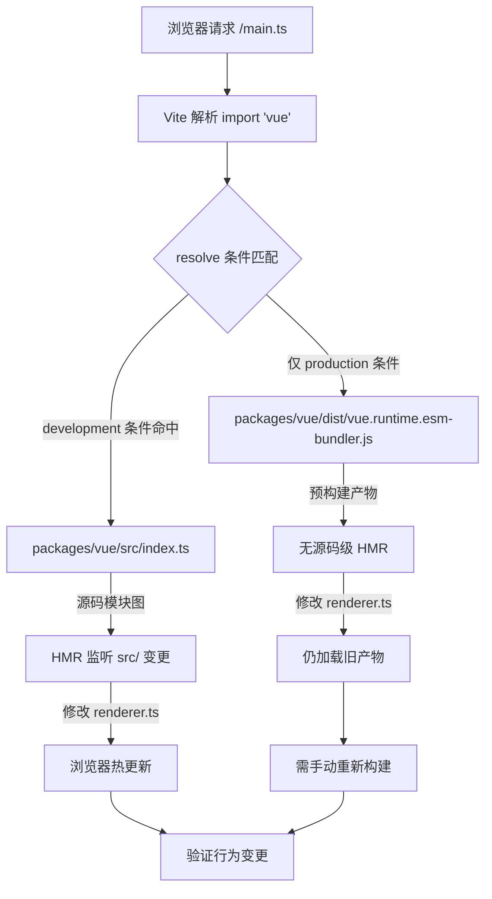

# 第 12 章：最小調試沙盒：vite-debug 與本地開發閉環

上一章我們完成了體積預算的度量閉環：size-report.js 回答「大了多少」，usage-size.js 回答「大在哪裡」，工作流層負責門禁判定。但這套機制有一個隱含前提——構建產物本身是可復現的。當你發現某個包體積異常膨脹，或者某個運行時行為與預期不符時，你需要一個能快速加載本地源碼、修改後立即看到效果的最小環境。packages-private/vite-debug 就是這個環境。它只有四個檔案、總計不到 40 行代碼，卻構成了 Vue core 倉庫中「在真實源碼上做最小復現」的日常實踐入口。本章將逐檔案拆解這個沙盒的構造邏輯，並解釋它為什麼被放在 packages-private 而非 packages 目錄下。

# 一、沙盒的骨架：`main.ts`與`App.vue`的最小掛載鏈路

## 直覺模型

如果把整個 Vue 運行時比作一台發動機，那麼`vite-debug`就是一台「裸機測試台」——沒有外殼、沒有儀表盤，只有最少的接線讓發動機轉起來。它的價值不在於功能完整，而在於**排除一切干擾變量**：當你懷疑某個 bug 出在響應式系統或渲染器內部時，你不會希望調試環境本身的複雜度成為噪音源。

## 數據結構與檔案佈局

先看`main.ts`的全部內容：

[FACT:packages-private/vite-debug/main.ts:4-4]

```ts
import { createApp } from 'vue'
import App from './App.vue'

const app = createApp(App)

app.mount('#app')
```

這六行代碼是 Vue 應用啟動的標準範式，但每一行在調試場景下都有精確的工程含義：

- **L1**的`import { createApp } from 'vue'`中，`'vue'`這個模組標識符最終解析到什麼，完全由`vite.config.ts`和`package.json`的依賴聲明決定。這是整個沙盒最關鍵的一環——我們稍後會看到它如何被指向本地源碼。
- **L2**的`import App from './App.vue'`觸發了`@vitejs/plugin-vue`的 SFC 編譯管線：Vite 在 dev server 啟動時註冊了這個插件，當瀏覽器請求`App.vue`時，插件將其拆解為`<script>`、`<template>`、`<style>`三個虛擬模組分別編譯。
- **L4**的`createApp(App)`創建應用實例，此時 Vue 內部會初始化`app._context`、`app._instance`等核心字段，但尚未觸發任何渲染。
- **L6**的`app.mount('#app')`是真正的啟動開關：它會查找 DOM 中 id 為`app`的容器元素，創建根組件實例，觸發首次渲染。

注意這裡沒有`index.html`的引用——Vite 的約定是項目根目錄下的`index.html`作為入口 HTML，其中包含`<div id="app"></div>`和`<script type="module" src="/main.ts"></script>`。這個檔案雖然不在本章的 keyFiles 中，但它是`app.mount('#app')`能成功的前提。

## 場景驅動的 Walkthrough：一次點擊的完整鏈路

現在看`App.vue`，它是這個沙盒的「實驗載體」：

[FACT:packages-private/vite-debug/App.vue:4-8]

```vue

import { ref } from 'vue'

const count = ref(0)

  {{ count }}

button {
  color: red;
}

```

代入一個具象場景：**當用戶在瀏覽器中點擊按鈕時，發生了什麼？**

**第一步：SFC 編譯期（dev server 啟動時）**

`@vitejs/plugin-vue`將`App.vue`編譯為三個部分：

- `<script setup>`塊被編譯為組件的`setup()`函數，`ref(0)`調用返回一個`RefImpl`對象，其`.value`初始為`0`。
- `<template>`塊被編譯為渲染函數，`{{ count }}`被轉換為`_toDisplayString(count.value)`，`@click="count++"`被轉換為`onClick: $event => (count.value++)`。
- `<style>`塊被編譯為 CSS 模組，通過`<style>`標籤注入 DOM。

**第二步：首次渲染（`app.mount`調用時）**

`createApp(App)`返回的 app 實例在`mount('#app')`時，會建立根元件的`ComponentInternalInstance`，執行`setup()`得到`count`的 RefImpl，然後呼叫渲染函式生成 VNode 樹。渲染函式中讀取`count.value`會觸發`track`收集依賴——當前活躍的渲染副作用（`ReactiveEffect`）被記錄到`count`的`dep`中。

**第三步：點擊事件（使用者互動時）**

瀏覽器觸發`click`事件，Vue 的事件處理器執行`count.value++`。這是一個 setter 操作，觸發`trigger`：遍歷`count.dep`中收集的副作用，排程重新渲染。由於是同步更新且不在批次佇列中，渲染副作用被立即執行，重新呼叫渲染函式，生成新的 VNode，與舊 VNode 進行 diff，發現文字內容從`0`變為`1`，更新真實 DOM 的`textContent`。

整個鏈路可以用下面的資料流圖表示：

```mermaid
flowchart LR
    subgraph compile["编译期 (Vite Dev Server)"]
        sfc["App.vue"] -->|"@vitejs/plugin-vue"| script["setup() 函数"]
        sfc -->|"@vitejs/plugin-vue"| render["渲染函数"]
        sfc -->|"@vitejs/plugin-vue"| style["CSS 模块"]
    end
    subgraph runtime["运行时 (浏览器)"]
        script -->|"ref(0)"| refimpl["RefImpl { value: 0 }"]
        render -->|"读取 count.value"| track["track() 收集依赖"]
        click["用户点击"] -->|"count.value++"| trigger["trigger() 触发更新"]
        trigger -->|"调度渲染副作用"| rerender["重新执行渲染函数"]
        rerender -->|"diff + patch"| dom["更新真实 DOM"]
    end
    track -.->|"dep 记录 ReactiveEffect"| trigger
```

這張圖的關鍵在於：**編譯期產物和執行時行為之間的耦合點只有兩個**——`ref(0)`返回的 RefImpl 物件，以及渲染函式中對`count.value`的讀寫。這意味著如果你想除錯響應式系統的某個分支（比如`trigger`中的排程邏輯），你只需要在這個`App.vue`中構造對應的讀寫模式即可。

## 設計思考：為什麼是`ref`而不是`reactive`？

> **[Design Inference & Architectural Trade-offs]**
> 選擇`ref(0)`而非`reactive({ count: 0 })`作為預設範例，隱含了一個除錯優先的考量：`ref`的`.value`存取路徑更短，在除錯器中展開`RefImpl`物件時能直接看到`_value`、`dep`、`__v_isRef`等內部欄位，而`reactive`返回的 Proxy 物件在主控台中展開會觸發 getter，可能干擾對原始狀態的觀察。對於「最小重現」場景，減少一層 Proxy 間接層意味著更少的變數。

---

# 二、別名解析：`vite.config.ts`與`package.json`如何把`'vue'`指向本地原始碼

## 直覺模型

`vite.config.ts`只有六行，但它是整個沙盒的「路由中樞」——決定了`import { createApp } from 'vue'`中的`'vue'`最終載入的是 npm 上的發布版本，還是倉庫中正在開發的原始碼。如果沒有正確的別名配置，你在`App.vue`中修改的程式碼可能根本沒有觸發你正在除錯的那份 Vue 原始碼，除錯就變成了「對著錯誤的靶子開槍」。

## 資料結構與解析鏈路

先看`vite.config.ts`：

[FACT:packages-private/vite-debug/vite.config.ts:4-6]

```ts
import { defineConfig } from 'vite'
import vue from '@vitejs/plugin-vue'

export default defineConfig({
  plugins: [vue()],
})
```

這裡**沒有顯式的`resolve.alias`配置**。那麼`'vue'`是如何被解析到本地原始碼的？答案在`package.json`中：

[FACT:packages-private/vite-debug/package.json:1-15]

```json
{
  "name": "vite-debug",
  "private": true,
  "type": "module",
  "scripts": {
    "dev": "vite",
    "build": "vite build",
    "serve": "vite preview"
  },
  "devDependencies": {
    "@vitejs/plugin-vue": "catalog:",
    "vite": "catalog:",
    "vue": "workspace:*"
  }
}
```

關鍵在**L13**：`"vue": "workspace:*"`。這是 pnpm workspace 協議的宣告，表示`vite-debug`依賴的是 monorepo 中名為`vue`的本地套件，而非 npm registry 上的版本。pnpm 會在`node_modules/vue`建立符號連結，指向`packages/vue`（Vue 的主套件目錄）。

但這還不夠——`packages/vue`的`package.json`中`main`/`module`/`exports`欄位通常指向**建置產物**（如`dist/vue.runtime.esm-bundler.js`），而不是`src/`下的原始碼。如果你修改了`packages/runtime-core/src/renderer.ts`，但沒有重新建置，Vite 載入的仍然是舊的`dist`檔案。

> **[Design Inference & Architectural Trade-offs]**
> 這就是為什麼 Vue core 倉庫的`packages/vue/package.json`中通常會配置`"development"`條件匯出或類似的原始碼入口映射——在 dev 模式下，Vite 的`resolve.conditions`會優先匹配`development`條件，從而載入`src/index.ts`而非`dist`。這個機制使得`vite-debug`無需顯式配置 alias，就能在修改原始碼後透過 HMR 立即看到效果。

## 場景驅動的 Walkthrough：一次`import 'vue'`的解析過程

代入場景：**當 Vite dev server 收到瀏覽器對`main.ts`的請求，遇到`import { createApp } from 'vue'`時，解析鏈路是怎樣的？**



這個流程圖揭示了一個關鍵分支：**如果`development`條件沒有正確配置，修改原始碼後瀏覽器不會熱更新**，你會陷入「改了程式碼但行為沒變」的困惑。排查方法是在瀏覽器 DevTools 的 Network 面板中查看`vue`模組的實際載入路徑——如果看到`dist/`路徑，說明原始碼入口映射未生效。

## 設計思考：為什麼不在`vite.config.ts`中顯式寫 alias？

> **[Design Inference & Architectural Trade-offs]**
> 一個自然的疑問是：為什麼不直接在`vite.config.ts`中寫`resolve: { alias: { vue: '../../packages/vue/src/index.ts' } }`？這樣做雖然直觀，但有兩個問題：

1. **破壞子路徑匯入**：Vue 的公開 API 包含`vue/server-renderer`、`vue/compiler-sfc`等子路徑。如果只 alias 了`'vue'`本身，子路徑匯入仍然會走`dist`，導致部分模組來自原始碼、部分來自產物，行為不一致。

2. **繞過條件匯出機制**：Vue 的`package.json`中`exports`欄位已經定義了完整的條件匯出映射（`development`/`production`/`browser`/`node`等），alias 會覆蓋這套機制，使得除錯環境與真實使用者環境的解析行為產生偏差。

因此，`vite-debug`選擇「信任 workspace 協議 + 條件匯出」的組合，讓解析鏈路盡可能接近真實使用場景。這也解釋了為什麼`package.json`中`"vue": "workspace:*"`是必需的——它是觸發 pnpm 符號連結、進而讓 Vite 能透過`node_modules/vue`找到`packages/vue`的前提。

## 生產踩坑：`catalog:`協議與版本漂移

注意`package.json`中**L11-L12**使用了`"catalog:"`協議：

```json
"@vitejs/plugin-vue": "catalog:",
"vite": "catalog:",
```

這是 pnpm 的 catalog 特性，表示版本號由`pnpm-workspace.yaml`中的`catalog`欄位統一管理。它的作用是**避免 monorepo 中多個套件引用同一依賴時出現版本漂移**。

> **[Design Inference & Architectural Trade-offs]**
> 在除錯場景下，這帶來一個隱蔽的陷阱：如果你在`vite-debug`中遇到一個疑似 Vite 或 plugin-vue 的 bug，想臨時升級版本驗證，直接修改`package.json`中的`catalog:`是無效的——你需要修改`pnpm-workspace.yaml`中的 catalog 定義，這會影響所有使用該 catalog 的套件。正確的做法是臨時改為顯式版本號（如`"vite": "5.0.0"`），驗證完畢後再改回`catalog:`。

---

# 三、`packages-private`的隔離設計：為什麼除錯沙盒不對外發布

## 直覺模型

`packages-private`目錄就像公司的「內部試驗室」——裡面的樣品不對外銷售，只用於測試和演示。它與`packages`目錄物理隔離，避免除錯程式碼被誤發布到 npm。

## 隔離機制的三層保障

**第一層：目錄隔離**

`packages-private/vite-debug`不在`packages/`下，而`pnpm-workspace.yaml`通常會將`packages/*`和`packages-private/*`都聲明為 workspace 成員，但發布腳本（如`scripts/release.js`）只會遍歷`packages/`下的套件。

**第二層：`private: true`**

[FACT:packages-private/vite-debug/package.json:3]

```json
"private": true,
```

這一行是 npm/pnpm 的硬性約束：標記為`private`的套件**永遠無法被`npm publish`發布**，即使手動執行也會被拒絕。這是防止誤發布的最後一道防線。

**第三層：無`version`欄位**

注意`package.json`中沒有`version`欄位。npm 規範要求可發布的套件必須有`version`，缺少該欄位的套件在`npm publish`時會報錯。這是「雙重保險」——即使`private`被誤刪，缺少`version`仍會阻止發布。

## 設計思考：除錯沙盒與 Playground 的分工

Vue core 倉庫中已經有一個功能完整的`SFC Playground`（第 7 章討論過），為什麼還需要`vite-debug`？

> **[Design Inference & Architectural Trade-offs]**
> 兩者的定位截然不同：

| 維度 | SFC Playground | vite-debug |
| --- | --- | --- |
| 執行環境 | 瀏覽器內（編譯也在瀏覽器） | Node.js + 瀏覽器 |
| 原始碼載入 | 透過 CDN 或預建置產物 | 直接載入本地原始碼 |
| 除錯能力 | 受限於瀏覽器沙盒 | 可用 Node.js 除錯器、斷點 |
| 修改原始碼 | 不支援 | 支援 HMR |
| 適用場景 | 驗證編譯輸出、分享重現 | 除錯執行時內部行為 |

`vite-debug`的核心價值在於**它執行在真實的 Node.js 環境中**，你可以用`node --inspect`附加除錯器，在`packages/reactivity/src/effect.ts`中打斷點，觀察`ReactiveEffect`的建立和排程過程。這是 Playground 無法提供的。

## 生產踩坑：HMR 邊界與狀態丟失

> **[Design Inference & Architectural Trade-offs]**
> 使用`vite-debug`除錯時，一個常見的困惑是：修改`App.vue`中的`count`初始值後，瀏覽器中的計數沒有重置。這是因為 Vite 的 HMR 對`<script setup>`區塊的處理是**保留元件狀態、只替換渲染函式**。如果你需要完全重置狀態，需要手動重新整理頁面，或者在`App.vue`中加入`import.meta.hot?.invalidate()`強制整頁重新整理。

另一個陷阱是：當你修改`packages/runtime-core/src/`下的原始碼時，HMR 的傳播鏈路可能不會自動觸發——因為`vite-debug`的 HMR 邊界定義在`App.vue`層面，而`packages/`下的原始碼變更需要透過 Vite 的模組圖傳播。如果發現修改原始碼後瀏覽器無反應，檢查 Vite 終端輸出是否有`hmr update`日誌；如果沒有，可能需要重啟 dev server。

---

# 本章小結

`packages-private/vite-debug`用四個檔案、不到 40 行程式碼，建構了一個完整的除錯閉環：

1. **`main.ts`**提供最小掛載鏈路：`createApp(App).mount('#app')`，排除一切非必要初始化邏輯。

2. **`App.vue`**作為實驗載體：`ref`+ 模板插值 + 事件處理，覆蓋響應式系統的主路徑。

3. **`vite.config.ts` + `package.json`**透過`workspace:*`協議和條件匯出，將`'vue'`解析到本地原始碼，實現「改原始碼即生效」。

4. **`packages-private` + `private: true`+ 無`version`**三層隔離，確保除錯程式碼不會被誤發布。

這個沙盒的工程哲學是：**除錯環境本身的複雜度應該趨近於零，把所有的複雜度留給被除錯的原始碼**。當你在`packages/reactivity`中遇到一個難以重現的 bug 時，`vite-debug`提供了一個可以隨意修改、立即驗證的實驗台。

# 本章思考與自測

Q1: 如果將`package.json`中的`"vue": "workspace:*"`改為`"vue": "^3.4.0"`，在`vite-debug`中修改`packages/reactivity/src/ref.ts`後，瀏覽器中的行為會發生什麼變化？為什麼？

**參考解析**：改為`"^3.4.0"`後，pnpm 會從 npm registry 下載 Vue 3.4.x 的發布版本，而非連結到本地`packages/vue` [FACT:packages-private/vite-debug/package.json:13]。此時`import { createApp } from 'vue'`解析到的是`node_modules/.pnpm/vue@3.4.x/node_modules/vue/dist/vue.runtime.esm-bundler.js`，即預建置產物。修改`packages/reactivity/src/ref.ts`不會觸發任何 HMR，因為 Vite 的模組圖中根本不包含這個檔案。瀏覽器中執行的仍然是 npm 版本的`ref`實作。這個實驗反向驗證了`workspace:*`是原始碼級除錯的必要條件。

Q2: `App.vue`中`<style>`區塊沒有加`scoped`，如果在這個沙盒中同時掛載兩個元件實例，樣式會發生什麼？這與`vite-debug`的除錯目標有何關係？

**參考解析**：沒有`scoped`時，`button { color: red }`是全域樣式[FACT:packages-private/vite-debug/App.vue:4-8]，會作用於頁面中所有`<button>`元素。如果掛載兩個元件實例，兩個實例的按鈕都會變紅。這與除錯目標的關係在於：`vite-debug`的定位是「最小重現」，而非「樣式隔離驗證」。省略`scoped`減少了編譯期注入`data-v-xxx`屬性的變數，使得除錯器中的 DOM 結構更乾淨。如果你需要除錯`scoped`樣式的編譯邏輯，應該顯式加入`scoped`並觀察`@vitejs/plugin-vue`生成的屬性注入程式碼。

Q3: 假設你在`packages/runtime-core/src/renderer.ts`的`patch`函式中加了一行`console.log`，但瀏覽器控制台沒有輸出。請列出至少三種可能的原因，並說明如何逐一排查。

**參考解析**：

原因一：**原始碼入口未生效**。`'vue'`解析到了`dist`產物而非`src`。排查：在 DevTools Network 面板查看`vue`模組的載入路徑，如果是`dist/`開頭，說明條件匯出未命中`development`條件[FACT:packages-private/vite-debug/package.json:13]。

原因二：**HMR 未傳播**。Vite 的模組圖沒有將`packages/runtime-core/src/renderer.ts`的變更傳播到`vite-debug`。排查：查看 Vite 終端是否有`hmr update`日誌；如果沒有，重啟 dev server。

原因三：**`patch`函式未被呼叫**。如果當前頁面沒有觸發任何 DOM 更新（比如沒有點擊按鈕），`patch`可能只在首次掛載時執行一次，而首次掛載發生在你加入`console.log`之前。排查：重新整理頁面，或在`App.vue`中加入一個觸發更新的操作。

原因四（補充）：**建置快取**。Vite 的依賴預建置快取（`node_modules/.vite`）可能仍然使用舊版本。排查：刪除`node_modules/.vite`後重啟。

---

體積預算告訴你「問題存在」，`vite-debug`讓你「親手重現問題」。但當你試圖把這個沙盒模式推廣到整個 monorepo 時，會遇到一系列邊界條件：workspace 協議在 CI 環境下的解析差異、`catalog:`版本鎖定的升級困境、`packages-private`與`packages`之間的依賴方向約束……下一章將進入架構權衡與避坑指南，系統梳理 monorepo 工程化在真實專案中暴露的邊界條件。

至此，我們完成了從體積度量到最小重現的工程閉環：vite-debug 用極簡的四個檔案，把「在真實原始碼上快速驗證」變成了日常可用的實踐。但當你真正開始複刻這套體系時，會發現更多隱藏的權衡——為什麼 packages-private 必須與 packages 物理隔離？為什麼列舉內聯必須在 Rollup 之前完成？下一章將彙總前十二章暴露的關鍵決策點與生產踩坑記錄，為你提供一份完整的避坑清單與決策依據。
