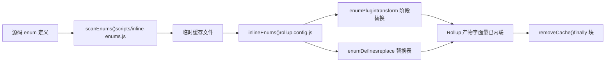
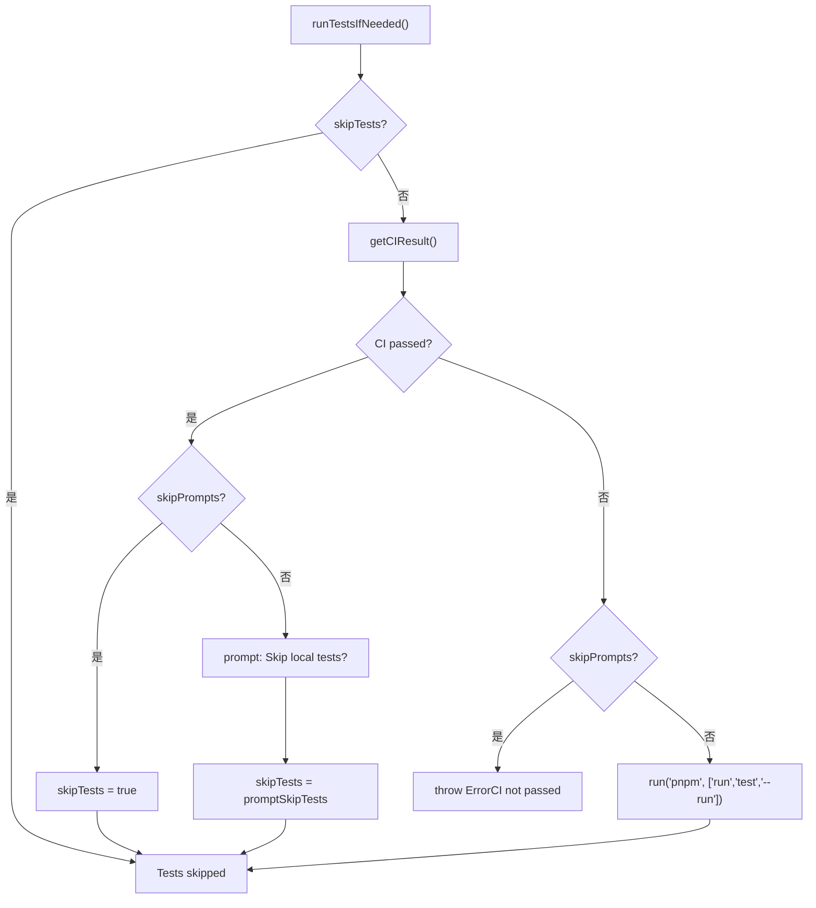

# 第 13 章：架構權衡與避坑指南：monorepo 工程化的邊界條件

上一章我們以`packages-private/vite-debug`為切口，掌握了在真實原始碼上做最小重現的除錯範式。當這種內部除錯包越來越多，一個現實問題便浮出水面：它們與對外發布的正式包共處同一 workspace，如何確保發布流程不會誤傷？本章將深入 monorepo 工程化的邊界條件，從`packages`與`packages-private`的雙目錄契約出發，剖析架構權衡背後的防禦性設計，並給出可落地的避坑指南。

# 13.2 時序鐵律：列舉內聯必須先於 Rollup 執行

## 直覺模型

列舉內聯就像「在裝箱前把零件上的標籤換成數字」。如果裝箱工人（Rollup）已經開始打包，你再去改標籤，箱子裡的零件和標籤就對不上了。`build.js`用`scanEnums()` / `removeCache()`這對函式把內聯嚴格夾在 Rollup 之前。

## 資料結構與生命週期

`inline-enums.js`匯出的`scanEnums()`返回一個`removeCache`閉包，它掃描原始碼中的 enum 定義，生成臨時檔案供 Rollup 消費[FACT:scripts/build.js:30-34]。`build.js`的`run()`用`try/finally`保證快取清理[FACT:scripts/build.js:81-112]：

```js
const removeCache = scanEnums()
try {
  // ... buildAll / checkAllSizes / build-dts
} finally {
  removeCache()
}
```

`rollup.config.js`在模組頂層呼叫`inlineEnums()`拿到`[enumPlugin, enumDefines]` [FACT:rollup.config.js:47-50]，其中`enumPlugin`插入 plugins 陣列[FACT:rollup.config.js:331-331]，`enumDefines`併入 replace 插件的替換表[FACT:rollup.config.js:222-223]。

## Step-by-Step：一次建置中列舉的完整生命週期

1. `build.js`的`run()`首先呼叫`scanEnums()`，掃描所有套件的 enum 定義並寫入臨時快取，返回`removeCache` [FACT:scripts/build.js:87-87]。

2. `buildAll`並發啟動多個 Rollup 程序[FACT:scripts/build.js:119-121]。

3. 每個 Rollup 程序在配置載入階段執行`inlineEnums()`，讀取上一步生成的快取，得到`enumPlugin`與`enumDefines` [FACT:rollup.config.js:47-50]。

4. `enumPlugin`在 transform 階段把原始碼中的 enum 引用替換為字面量；`enumDefines`作為 replace 的補充，處理跨模組的常數替換[FACT:rollup.config.js:222-223]。

5. 建置結束，`finally`區塊呼叫`removeCache()`清理臨時檔案[FACT:scripts/build.js:119-121]。



## 設計思考與踩坑

> **[Design Inference & Architectural Trade-offs]**
> 為什麼不用 Rollup 插件在 transform 階段現掃現用？因為列舉內聯需要**跨套件全域視圖**：`runtime-core`引用的 enum 可能定義在`shared`中，單個 Rollup 程序只看到自己套件的原始碼樹，無法完成跨套件替換。`scanEnums()`在建置前建立全域快取，正是為了解決這個可見性問題。

生產踩坑點：`removeCache()`放在`finally`中，意味著即使建置中途拋錯也會清理。但如果你在除錯時手動中斷程序（Ctrl+C），`finally`可能不執行，殘留的快取檔案會導致下次建置讀到過期列舉。排查方法：檢查`temp/`目錄下是否有殘留的 enum 快取檔案，手動刪除後重試。

---

# 13.3 發布編排器：`release.js`的 skip 旗標矩陣

## 直覺模型

`release.js`像婚禮總導演，`skipBuild` / `skipTests` / `skipGit` / `skipPrompts`四個開關就是「跳過彩排」「跳過宣誓」「跳過拍照」「跳過確認」的按鈕。每個按鈕的存在都對應一種真實場景：CI 環境需要`skipPrompts`，本地除錯需要`skipGit`，緊急熱修需要`skipTests`。

## 旗標的資料結構與預設值

四個 skip 旗標在`parseArgs`中宣告[FACT:scripts/release.js:39-50]，隨後解構為區域變數[FACT:scripts/release.js:64-66]：

```js
let skipTests = args.skipTests
const skipBuild = args.skipBuild
const skipPrompts = args.skipPrompts
const skipGit = args.skipGit
```

注意`skipTests`用`let`宣告，因為它在`runTestsIfNeeded()`中會被動態改寫[FACT:scripts/release.js:281-317]。

## Step-by-Step：一次 release 的完整決策流

`main()`的執行順序[FACT:scripts/release.js:143-279]：

1. **遠端同步檢查**：`isInSyncWithRemote()`比對本地 HEAD 與遠端分支 SHA，不一致時彈確認框[FACT:scripts/release.js:337-363]。

2. **版本選擇**：無位置參數時彈出`versionIncrements`選擇選單[FACT:scripts/release.js:152-176]。

3. **測試決策**：`runTestsIfNeeded()`是 skip 邏輯最密集的地方[FACT:scripts/release.js:281-317]。

4. **版本更新**：`updateVersions()`遍歷所有套件改寫`package.json` [FACT:scripts/release.js:377-398]。

5. **Changelog 生成**：呼叫`pnpm run changelog` [FACT:scripts/release.js:211-212]。

6. **Git 提交**：`skipGit`為真時整段跳過[FACT:scripts/release.js:231-240]。

7. **發布**：僅當`args.publish`為真時執行`buildPackages()` + `publishPackages()` [FACT:scripts/release.js:243-246]。

`runTestsIfNeeded()`的分支邏輯值得單獨展開：



## 設計思考與踩坑

> **[Design Inference & Architectural Trade-offs]**
> `skipTests`用`let`而非`const`的設計，是為了支持「CI 已通過則自動跳過本地測試」的最佳化路徑。這在 CI 發布場景下節省了大量時間——GitHub Actions 的`release.yml`已經跑過完整測試，本地再跑一遍純屬浪費。

**發布順序的隱藏契約**：`sortPackagesForPublishing`把`vue`排到最後[FACT:scripts/release.js:85-85]，註解明確說明「使用者不能在內部套件可用之前安裝新的入口套件」。如果你修改了這個排序，使用者`npm install vue@next`時可能拉到依賴尚未發布的版本，導致`ERR_MODULE_NOT_FOUND`。

**冪等性保護**：`publishPackage`在發布前呼叫`isPackagePublished`檢查 registry[FACT:scripts/release.js:453-458]，發布失敗時捕獲`previously published`錯誤並降級為跳過[FACT:scripts/release.js:480-488]。這讓 release 腳本可以安全重試——網路中斷後重新執行不會因為「套件已存在」而整體失敗。

**失敗回滾**：`fnToRun().catch()`在`versionUpdated`為真時呼叫`updateVersions(currentVersion)`回滾版本號[FACT:scripts/release.js:528-537]。但注意：這只回滾`package.json`中的版本欄位，**不會回滾已經`git commit`的提交**。如果你在`skipGit`為假的情況下發布失敗，需要手動`git reset`。

---

# 設計思考：三個權衡的共性模式

回顧本章三個核心權衡，它們共享同一個設計哲學：**把「容易忘記的執行時檢查」轉化為「不可能繞過的結構性約束」**。

- `packages-private`物理隔離：不依賴腳本作者記得檢查`private`欄位，而是讓掃描範圍天然排除。
- 列舉內聯前置：不依賴 Rollup 外掛在 transform 時「碰巧」能看到跨套件 enum，而是建置前建立全域快取。
- `release.js`的 skip 矩陣：不依賴發布者記得「CI 已過就不用本地跑測試」，而是讓腳本自動查詢 CI 狀態並改寫`skipTests`。

> **[Design Inference & Architectural Trade-offs]**
> 這種模式的代價是**腳本複雜度上升**：`build.js`需要維護`privatePackages`列表，`rollup.config.js`需要重複目錄探測邏輯，`release.js`需要處理四個 skip 旗標的交叉組合。但對於 Vue 這種每週多次發布的倉庫，結構性約束帶來的可靠性收益遠超複雜度成本。

---

# 本章小結

本章從原始碼出發，拆解了 Vue core 工程化體系的三個關鍵邊界條件：

1. **`packages-private`與`packages`的物理隔離**由 workspace glob、`build.js`目錄探測、`release.js`過濾三處共同保證[FACT:pnpm-workspace.yaml:1-3][FACT:scripts/build.js:153-170][FACT:scripts/release.js:68-83]。

2. **列舉內聯的時序約束**由`scanEnums()` / `removeCache()`的`try/finally`結構強制保證，Rollup 配置在模組頂層消費快取[FACT:scripts/build.js:81-112][FACT:rollup.config.js:47-50]。

3. **`release.js`的 skip 旗標位矩陣**服務於 CI 發布、本地除錯、緊急熱修三種場景，`skipTests`的動態改寫和發布順序排序是兩個最容易被忽略的隱藏契約[FACT:scripts/release.js:281-317][FACT:scripts/release.js:85-85]。

# 本章思考與自測

Q1: 如果把`build.js`中`build(target)`函式裡的`privatePackages.includes(target)`判斷去掉，統一用`packages`作為`pkgBase`，在什麼場景下會出問題？

**參考解析**：`build.js:160-164`的目錄探測是私有套件能被建置的唯一入口。去掉後，`nr build vite-debug`會在`packages/vite-debug`下查找`package.json`，而該目錄不存在，`fs.readFileSync`直接拋`ENOENT`。更隱蔽的問題是：如果未來有人在`packages/`下建立了同名目錄，建置會靜默使用錯誤目錄的配置，產物路徑和`buildOptions`全部錯位。此外，`rollup.config.js:37-42`有獨立的目錄探測邏輯，兩處必須同步修改，否則會出現「`build.js`找到了套件但 Rollup 找不到」的不一致狀態。

Q2: `release.js`的`runTestsIfNeeded()`中，`skipTests ||= isCIPassed`這行程式碼（`release.js:285`）在`skipPrompts`為真且 CI 未通過時會走哪條分支？如果去掉`else if (skipPrompts)`分支的`throw`，會有什麼後果？

**參考解析**：當`skipPrompts`為真且 CI 未通過時，`skipTests ||= isCIPassed`中`isCIPassed`為`false`，`skipTests`保持原值（通常為`false`）。隨後進入`else if (skipPrompts)`分支，拋出`Error`（`release.js:299-304`）。如果去掉這個`throw`，程式碼會繼續執行到`if (!skipTests)`分支，在無互動環境下執行`pnpm run test --run`。這在 CI 中可能導致測試因環境差異而失敗，或者更糟——測試通過但 CI 實際未通過（比如 CI 跑的是不同的測試子集），發布出未經完整驗證的版本。

Q3: `rollup.config.js:55`的`inlineEnums()`在模組頂層呼叫，而`build.js:87`的`scanEnums()`在`run()`函式內呼叫。如果交換這兩者的執行時機（即讓`inlineEnums()`在 Rollup 的`buildStart`鉤子中呼叫），會破壞什麼？

**參考解析**：`scanEnums()`必須在所有 Rollup 程序啟動之前完成，因為它需要掃描**所有套件**的原始碼來建立全域 enum 快取。`inlineEnums()`在`rollup.config.js`模組頂層呼叫，此時 Rollup 尚未開始任何建置，快取已經就緒。如果改為在`buildStart`中呼叫，每個 Rollup 程序會獨立掃描——但`buildAll`是並行執行的（`build.js:119-121`），多個程序同時掃描同一批檔案會產生競態：程序 A 可能讀到程序 B 尚未寫完的快取檔案，導致 enum 替換不完整。更嚴重的是，`scanEnums()`返回的`removeCache`閉包依賴掃描時的檔案句柄狀態，並行場景下清理時機無法協調。

雙目錄契約、建置腳本的歸屬判定、發布腳本的二次過濾——這些機制共同劃定了 monorepo 工程化的安全邊界。但邊界並非一成不變：隨著建置工具從 Rollup 向 Rolldown 遷移、型別測試與執行時測試走向融合，現有的權衡策略也將面臨新的挑戰。下一章，我們將基於 3.0 至 3.4 的變更軌跡，展望下一代工程化體系的演進方向。
