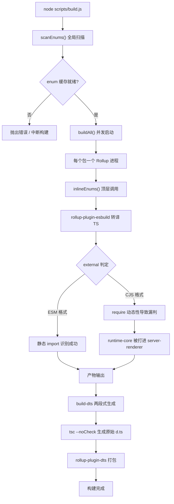
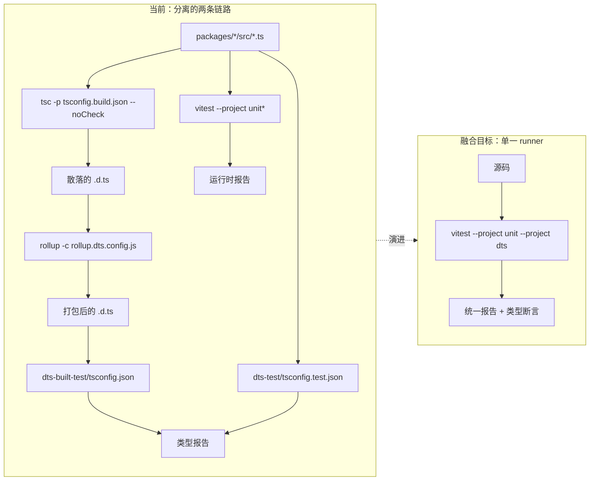
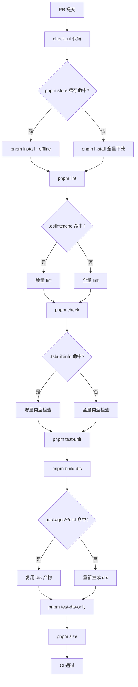

# 第 14 章：未來演進：從 3.x 到下一代工程化體系

上一章我們梳理了 Vue core 工程化體系的「安全邊界」——雙目錄契約、建置腳本歸屬判定、發布腳本二次過濾，這些機制並非一次性設計，而是在 3.0 到 3.4 的迭代中被反覆打磨出來的。本章換一個視角：不再看「現在長什麼樣」，而是看「它是怎麼長成現在這樣的」，並據此推斷下一代工程化體系會往哪裡走。本章的原始碼材料是 changelogs/CHANGELOG-3.3.md、changelogs/CHANGELOG-3.4.md 以及倉庫根部的 package.json。變更日誌看起來只是「修了什麼 bug」的流水帳，但它是工程化體系最真實的體檢報告：每一次 build: 前綴的提交、每一次 types: 前綴的改動、每一次依賴版本的回退，都在暴露當前架構的應力點。我們要做的，是從這些應力點裡讀出演進方向。把變更日誌當作「工程化體系的觀測窗口」而非「功能清單」，是本章的核心方法論。功能變更告訴我們 Vue 能做什麼，而建置、型別、CI 相關的變更告訴我們 Vue 的工程化體系「在哪裡疼」。

# 一、建置工具鏈的應力點：從 Rollup 到 Rolldown 的遷移勢能

## 直覺模型

把建置工具鏈想像成一條裝配流水線：Rollup 是主裝配台，esbuild 負責快速切割（轉譯 TS），terser 負責最後打包壓縮。當產品（Vue 執行時）越來越複雜，裝配台上的工序越來越多，主裝配台本身就成了瓶頸。Rolldown 的定位，就是用 Rust 重寫的主裝配台——它要替換的不是 esbuild，而是 Rollup 本身。

若沒有這層演進壓力，系統面臨的「災難」不是崩潰，而是**建置時間隨包數量線性膨脹**：每加一個子包，就要多起一個 Rollup 程序，多掃描一遍 enum 快取，多跑一輪 dts 生成。

## 資料結構與依賴佈局

先看當前工具鏈的靜態快照。`package.json`的`devDependencies`是一份精確的「裝配台清單」：

[FACT:package.json:103-106]

```
    "rollup": "^4.63.3",
    "rollup-plugin-dts": "^6.5.1",
    "rollup-plugin-esbuild": "^6.2.1",
    "rollup-plugin-polyfill-node": "^0.13.0",
```

這裡能讀出三個關鍵事實。第一，Rollup 主版本是`^4.63.3`，處於 Rollup 4.x 的成熟期。第二，`rollup-plugin-esbuild`承擔 TS 轉譯，意味著 Rollup 本身不解析 TS，只處理 esbuild 吐出的 JS。第三，`rollup-plugin-dts`獨立負責`.d.ts`打包，這正是上一章討論的`dts-built-test`獨立性的物質基礎。

再看建置腳本的入口編排：

[FACT:package.json:8-9]

```
    "build": "node scripts/build.js",
    "build-dts": "tsc -p tsconfig.build.json --noCheck && rollup -c rollup.dts.config.js",
```

`build-dts`是「兩段式」的：先`tsc --noCheck`生成原始宣告檔案（`--noCheck`跳過型別檢查，只做 emit），再用`rollup -c rollup.dts.config.js`把散落的`.d.ts`打包成單檔案。這個設計本身就是對 Rollup 能力的依賴——`rollup-plugin-dts`需要 Rollup 的模組圖來追蹤型別依賴。

## 場景驅動：一次`build:`提交暴露了什麼

變更日誌裡`build:`前綴的條目，是建置工具鏈應力點的直接證據。我們挑三條來看。

第一條，3.4.32 的 minify 配置對齊：

[FACT:changelogs/CHANGELOG-3.4.md:84]

```
* **build:** use consistent minify options from previous terser config ([789675f](https://github.com/vuejs/core/commit/789675f65d2b72cf979ba6a29bd323f716154a4b))
```

這條提交的動機是「從 terser 遷移到 esbuild minify 後，壓縮選項不一致」。它揭示了一個遷移中的中間態：Vue 曾用 terser 做壓縮，後來改用 esbuild（`devDependencies`裡的`esbuild: ^0.28.2`印證了這點），但壓縮選項沒有完全對齊，導致產物體積或行為出現偏差。這正是「換裝配台零件」時的典型代價。

第二條，3.4.38 的 entities 版本回退：

[FACT:changelogs/CHANGELOG-3.4.md:6]

```
* **build:** revert entities to 4.5 to avoid runtime resolution errors ([f349af7](https://github.com/vuejs/core/commit/f349af7b65b9f8605d8b7bafcc06c25ab1f2daf0)), closes [#11603](https://github.com/vuejs/core/issues/11603)
```

`entities`是 HTML 實體解碼庫，被`compiler-dom`依賴。回退到 4.5 是因為新版本在執行時解析上出問題。這條提交說明：**建置工具鏈的依賴升級不是孤立的，一個間接依賴的版本跳動會穿透到執行時行為**。

第三條，3.4.29 的 server-renderer cjs 建置污染：

[FACT:changelogs/CHANGELOG-3.4.md:155]

```
* **build:** fix accidental inclusion of runtime-core in server-renderer cjs build ([11cc12b](https://github.com/vuejs/core/commit/11cc12b915edfe0e4d3175e57464f73bc2c1cb04)), closes [#11137](https://github.com/vuejs/core/issues/11137)
```

這是最典型的一類建置 bug：CJS 格式下，`server-renderer`意外把`runtime-core`打進了自己的產物。原因通常是 Rollup 的`external`判定在 CJS 格式下失效——ESM 能靠`import`語句靜態識別外部依賴，CJS 的`require`動態性更強，容易漏判。這條提交直接指向了 Rollup 配置中`external`邏輯的脆弱性。

## 遷移勢能的 Mermaid 刻畫

下面這張圖刻畫了當前構建流水線的控制流，並標出了 Rolldown 遷移會觸及的節點：



> **[Design Inference & Architectural Trade-offs]**
> Rolldown 的遷移價值在於：它把「每個包一個進程」的並發模型換成「單進程內並行」的模型，`scanEnums()`的全局掃描和`inlineEnums()`的替換可以在同一個 Rust 運行時內協調，上一章討論的「並發掃描競態」問題會從根上消失。但遷移的阻力也在這裡——`rollup-plugin-esbuild`、`rollup-plugin-dts`這些插件生態需要 Rolldown 提供兼容層，而`external`判定邏輯需要重寫。

## 設計思考與踩坑

**為什麼遷移不會一蹴而就？**看`package.json`的`engines`欄位：

[FACT:package.json:61-63]

```
  "engines": {
    "node": ">=20.0.0"
  },
```

Node 20 是硬性下限。Rolldown 作為 Rust 原生模組，需要對應的 N-API 綁定和預編譯二進制分發。一旦引入，`pnpm install`的耗時、跨平台（Windows/macOS/Linux）的二進制兼容性、CI 緩存策略都要重新設計。這不是「換個依賴」那麼簡單，而是**整條安裝-構建-緩存鏈路的重新校準**。

**生產踩坑點**：`build-dts`的`tsc --noCheck`是個雙刃劍。跳過類型檢查讓 emit 變快，但意味著`.d.ts`生成階段不會發現類型錯誤——類型錯誤只能靠`pnpm check`（`tsc --incremental --noEmit`）和`test-dts`兜底。如果 Rolldown 遷移後想合併這兩步，必須確保類型檢查不會拖慢構建，否則就違背了`--noCheck`的初衷。

---

# 二、類型測試與運行時測試的融合趨勢

## 直覺模型

把類型測試和運行時測試想像成兩道獨立的質檢關卡：一道檢查「說明書（`.d.ts`）寫得對不對」，一道檢查「機器（運行時）轉得對不對」。兩道關卡各自有獨立的工位、獨立的工具、獨立的報告。融合趨勢的意思是：**能不能讓同一份測試用例同時驗證說明書和機器？**

若沒有融合，系統面臨的災難是**類型與運行時行為漂移**：`.d.ts`說`ref()`返回`Ref<T>`，但運行時實際返回的對象形狀變了，類型測試通過、運行時測試也通過，但兩者組合起來是錯的。

## 數據結構：測試腳本的編排佈局

`package.json`的`scripts`裡，測試相關的條目清晰地分成兩組：

[FACT:package.json:19-24]

```
    "test": "vitest",
    "test-unit": "vitest --project unit*",
    "test-e2e": "node scripts/build.js vue -f global -d && vitest --project e2e --project e2e-browser",
    "test-dts": "run-s build-dts test-dts-only",
    "test-dts-only": "tsc -p packages-private/dts-built-test/tsconfig.json && tsc -p ./packages-private/dts-test/tsconfig.test.json",
    "test-coverage": "vitest run --project unit* --coverage",
```

這裡的關鍵結構是`test-dts`的`run-s build-dts test-dts-only`——它是**串行**的：先構建`.d.ts`，再跑類型測試。而`test-dts-only`內部又是**兩個獨立的`tsc`進程**：一個跑`dts-built-test`（驗證構建產物），一個跑`dts-test`（驗證源碼類型）。

注意`test-unit`用的是`vitest --project unit*`，`test-e2e`用的是`vitest --project e2e --project e2e-browser`。這說明 Vitest 的`--project`機制已經把測試按「單元/端到端/瀏覽器」分成了不同的 project。**融合的物理基礎已經存在**：Vitest 的 project 機制允許在同一個 runner 裡跑不同類型的測試。

## 場景驅動：一次`types:`提交的完整路徑

變更日誌裡`types:`前綴的條目密度極高，這是類型系統複雜度的直接體現。我們追蹤一條典型的類型修復。

3.4.37 的 ref 類型回退：

[FACT:changelogs/CHANGELOG-3.4.md:23-24]

```
* Revert "fix(types/ref): allow getter and setter types to be unrelated ([#11442](https://github.com/vuejs/core/issues/11442))" ([b1abac0](https://github.com/vuejs/core/commit/b1abac06cdb198bd72f8e614b1f68b92e1c78339))
* Revert "fix(types/ref): correct type inference for nested refs ([#11536](https://github.com/vuejs/core/issues/11536))" ([3a56315](https://github.com/vuejs/core/commit/3a56315f94bc0e11cfbb288b65482ea8fc3a39b4))
```

兩條連續的 Revert，回退了兩個類型修復。注意 3.4.35 裡這兩個修復剛被合入：

[FACT:changelogs/CHANGELOG-3.4.md:55]

```
* **types/ref:** allow getter and setter types to be unrelated ([#11442](https://github.com/vuejs/core/issues/11442)) ([e0b2975](https://github.com/vuejs/core/commit/e0b2975ef65ae6a0be0aa0a0df43fb887c665251))
```

[FACT:changelogs/CHANGELOG-3.4.md:30]

```
* **types/ref:** correct type inference for nested refs ([#11536](https://github.com/vuejs/core/issues/11536)) ([536f623](https://github.com/vuejs/core/commit/536f62332c455ba82ef2979ba634b831f91928ba)), closes [#11532](https://github.com/vuejs/core/issues/11532) [#11537](https://github.com/vuejs/core/issues/11537)
```

從 3.4.35 合入到 3.4.37 回退，中間只隔了一個補丁版本。這個「合入-回退」的快速循環，暴露了類型測試的一個根本困境：**類型測試能驗證「類型簽名符合預期」，但驗證不了「這個類型簽名在真實代碼裡是否好用」**。`allow getter and setter types to be unrelated`在類型測試裡可能完全通過，但實際使用時會讓`ref`的類型推斷變得過於寬鬆，破壞下游代碼的類型安全。

## 類型測試融合的 Mermaid 刻畫

下面這張圖刻畫了當前類型測試與運行時測試的分離結構，以及融合後的目標形態：



> **[Design Inference & Architectural Trade-offs]**
> 融合的技術路徑大概率是：把`dts-built-test`和`dts-test`的`tsc`調用封裝成 Vitest 的自定義 project，讓類型斷言以`expectTypeOf`的形式內聯在測試文件裡。這樣一次`vitest`調用就能同時跑運行時斷言和類型斷言，報告統一。但阻力在於：`tsc`的類型檢查是「全量」的，而 Vitest 的測試是「按文件」的，兩者的增量策略不兼容。

## 設計思考與踩坑

**為什麼`dts-built-test`必須獨立於`dts-test`？**上一章已經討論過，這裡從演進視角補充：`dts-built-test`驗證的是**構建產物**（`rollup-plugin-dts`打包後的`.d.ts`），`dts-test`驗證的是**源碼類型**。如果融合時把兩者合併，就會丟失「構建產物是否與源碼類型一致」這個關鍵檢查點。3.4.38 的這條提交正好印證了構建產物類型的重要性：

[FACT:changelogs/CHANGELOG-3.4.md:9]

```
* **types:** add fallback stub for DOM types when DOM lib is absent ([#11598](https://github.com/vuejs/core/issues/11598)) ([4db0085](https://github.com/vuejs/core/commit/4db0085de316e1b773f474597915f9071d6ae6c6))
```

「當 DOM lib 缺失時提供 fallback stub」——這是構建產物層面的類型兼容性修復，只有在`dts-built-test`這種「消費打包後`.d.ts`」的場景下才能被發現。

**生產踩坑點**：類型測試的「合入-回退」循環說明，類型簽名的變更需要**真實下游項目**的驗證，而不僅僅是類型斷言。Vue 的類型測試跑在`packages-private/dts-test`裡，用的是倉庫內部的測試用例，覆蓋不了所有下游用法。融合趨勢如果只關注「把兩個 runner 合併」，而不解決「如何引入真實下游回饋」，就只是形式上的融合。

---

# 三、CI 快取的細粒度優化方向

## 直覺模型

把 CI 快取想像成一個倉庫的「備料區」：每次建置都要從備料區取原料（依賴、建置產物、型別快取）。如果備料區只有一個大箱子，取任何一樣東西都要翻遍整個箱子，那快取命中率再高也快不起來。細粒度優化的意思是：**把大箱子拆成按用途分類的小格子**。

若沒有細粒度快取，系統面臨的災難是**快取失效的級聯放大**：改一行原始碼，導致整個`node_modules`快取失效，CI 重新安裝所有依賴，建置時間從 2 分鐘變成 10 分鐘。

## 資料結構：可快取物的分類

從`package.json`裡能識別出幾類可快取的「物料」：

第一類，依賴安裝產物。`packageManager`欄位鎖定了 pnpm 版本：

[FACT:package.json:4]

```
  "packageManager": "pnpm@12.4.2",
```

pnpm 的`node_modules`是符號連結結構，快取的是 pnpm 的 content-addressable store，而不是扁平的`node_modules`。這意味著快取鍵應該基於`pnpm-lock.yaml`的雜湊，而不是`package.json`。

第二類，建置產物。`clean`腳本揭示了產物的物理位置：

[FACT:package.json:10]

```
    "clean": "rimraf --glob packages/*/dist temp .eslintcache",
```

`packages/*/dist`、`temp`、`.eslintcache`——這三類產物可以獨立快取。`dist`是建置輸出，`temp`是臨時檔案（如`bench.json`），`.eslintcache`是 lint 快取。

第三類，型別檢查快取。`check`腳本用了`--incremental`：

[FACT:package.json:15]

```
    "check": "tsc --incremental --noEmit",
```

`--incremental`會生成`.tsbuildinfo`檔案，這是型別檢查的增量快取。CI 裡如果快取了這個檔案，`tsc`的二次執行會快很多。

## 場景驅動：一次 PR 的 CI 執行流

代入一個典型場景：開發者修改了`packages/reactivity/src/ref.ts`，提交 PR。CI 需要跑哪些步驟，哪些能命中快取？

從`scripts`裡能推斷出 CI 的執行序列（`simple-git-hooks`的`pre-commit`是本地鉤子，CI 會跑更完整的序列）：

[FACT:package.json:48-51]

```
  "simple-git-hooks": {
    "pre-commit": "pnpm lint-staged && pnpm check",
    "commit-msg": "node scripts/verify-commit.js"
  },
```

本地`pre-commit`跑`lint-staged`和`check`。CI 上則會跑`lint`、`check`、`test-unit`、`test-dts`、`size`等。每一步的快取策略不同：

- `lint`：快取`.eslintcache`，鍵基於原始碼檔案雜湊。
- `check`：快取`.tsbuildinfo`，鍵基於`tsconfig`和原始碼雜湊。
- `test-unit`：Vitest 有自己的快取，但通常 CI 上不快取測試結果，只快取依賴。
- `test-dts`：依賴`build-dts`的產物，快取鍵基於`packages/*/dist`的雜湊。
- `size`：依賴建置產物，快取鍵同上。

## CI 快取優化的 Mermaid 刻畫



> **[Design Inference & Architectural Trade-offs]**
> 細粒度快取的核心矛盾是**快取鍵的粒度**：鍵太粗（比如只基於 commit hash），命中率低；鍵太細（比如基於每個檔案的雜湊），計算鍵的開銷就抵消了快取收益。Vue 這類 monorepo 的合理策略是「按包分片」：每個`packages/*`子包獨立快取`dist`，`reactivity`的改動不會讓`compiler-core`的`dist`快取失效。

## 設計思考與踩坑

**為什麼`size`腳本要拆成多個子命令？**看這三條：

[FACT:package.json:11-14]

```
    "size": "run-s \"size-*\" && node scripts/usage-size.js",
    "size-global": "node scripts/build.js vue runtime-dom -f global -p --size",
    "size-esm-runtime": "node scripts/build.js vue -f esm-bundler-runtime",
    "size-esm": "node scripts/build.js runtime-dom runtime-core reactivity shared -f esm-bundler",
```

`size`用`run-s "size-*"`串行跑所有`size-`前綴的子命令。這種「前綴聚合」模式讓每個體積維度（global、esm-runtime、esm）可以獨立快取和獨立失敗。如果合併成一個大命令，任何一個維度超標都會讓整個`size`失敗，無法定位是哪個維度的問題。

**生產踩坑點**：CI 快取最容易踩的坑是**快取污染**——快取了錯誤的產物，導致後續建置基於髒資料。`clean`腳本的存在就是為了應對這種情況：

[FACT:package.json:10]

```
    "clean": "rimraf --glob packages/*/dist temp .eslintcache",
```

注意它清理的是`packages/*/dist`，而不是`packages-private/*/dist`。這意味著`packages-private`的產物不在常規清理範圍內——如果 CI 快取了`packages-private`的產物，而`clean`不清理它，就可能出現「快取了舊版本 playground 產物」的問題。細粒度快取設計時必須把`packages-private`單獨處理。

---

# 設計思考：工程化體系作為產品的生命週期

把三節的線索串起來，能看到一條清晰的主線：**Vue 的工程化體系正在從「能用」走向「好用」，從「手工編排」走向「宣告式配置」**。

建置工具鏈的遷移（Rollup → Rolldown）是「效能驅動」的演進：當包數量增長到一定程度，行程級並行的開銷超過了收益，必須換成更輕量的並行模型。

型別測試的融合是「一致性驅動」的演進：當型別簽名的變更頻率超過執行時行為的變更頻率，分離的兩套測試就成了負擔，必須讓它們共享同一份用例。

CI 快取的細粒度化是「成本驅動」的演進：當 CI 分鐘數成為瓶頸，粗粒度快取的浪費就不可接受，必須按用途分片。

> **[Design Inference & Architectural Trade-offs]**
> 這三條演進線的共同約束是**向後相容**。Vue 的發布策略（從變更日誌的`BREAKING CHANGES`段落可見）允許在 minor 版本做「type-only breaking change」，但不允許執行時 breaking change。這意味著工程化體系的演進必須保證：無論內部工具鏈怎麼換，產物的公開 API 和執行時行為不能變。這是所有演進決策的硬邊界。

---

# 本章小結

本章從變更日誌和`package.json`出發，梳理了 Vue core 工程化體系的三條演進線：

1. **建置工具鏈**：Rollup 4.x + esbuild + rollup-plugin-dts 的當前組合，其應力點體現在`build:`前綴的提交裡（minify 配置對齊、entities 版本回退、CJS external 漏判）。Rolldown 遷移的勢能來自「單進程並行」對「多進程併發」的替代，阻力來自插件生態和跨平台二進制分發。

2. **類型測試融合**：`test-dts`的`run-s build-dts test-dts-only`串行結構，以及`dts-built-test`與`dts-test`的雙`tsc`進程，是當前分離形態的物理證據。融合的技術路徑是藉助 Vitest 的`--project`機制，阻力是`tsc`全量檢查與 Vitest 按文件測試的增量策略不兼容。

3. **CI 緩存細粒度化**：`packageManager`鎖定 pnpm、`clean`清理三類產物、`check`用`--incremental`、`size`用前綴聚合——這些都是可緩存物的分類依據。核心矛盾是緩存鍵的粒度，合理策略是「按包分片」。

最重要的認知轉變是：**工程化體系本身就是一個產品，它有自己的用戶（貢獻者）、自己的性能指標（構建時間、CI 分鐘數）、自己的兼容性約束（產物 API 不變）**。它需要持續迭代，而不是一次性設計。

# 本章思考與自測

Q1: `package.json:9`的`build-dts`用了`tsc -p tsconfig.build.json --noCheck`。如果去掉`--noCheck`，在 Rolldown 遷移後會帶來什麼連鎖反應？

**參考解析**：`--noCheck`的作用是跳過類型檢查、只做 emit。去掉它後，`tsc`會在生成`.d.ts`之前做全量類型檢查。在當前 Rollup 架構下，這只是讓`build-dts`變慢；但在 Rolldown 遷移後，問題會放大：Rolldown 的核心賣點是「單進程並行構建」，如果`build-dts`階段引入一個全量`tsc`檢查，它就成了整條流水線的串行瓶頸——所有包的構建都要等這個檢查完成。更嚴重的是，`tsc`的類型檢查是單線程的，無法利用 Rolldown 的並行能力。正確的做法是保持`--noCheck`，把類型檢查交給獨立的`pnpm check`（`package.json:15`）和`test-dts`（`package.json:22`），讓構建和檢查解耦。

Q2: 變更日誌 3.4.37 連續回退了兩個`types/ref`修復（`CHANGELOG-3.4.md:23-24`），而這兩個修復在 3.4.35 剛合入（`CHANGELOG-3.4.md:30,55`）。如果類型測試與運行時測試已經融合，這個「合入-回退」循環能否被避免？為什麼？

**參考解析**：不能完全避免，但能縮短循環。融合後的類型測試仍然只能驗證「類型簽名符合斷言」，而`allow getter and setter types to be unrelated`這類修復的問題在於「類型簽名過於寬鬆，破壞下游代碼的類型安全」——這是**下游用法**的問題，不是**簽名本身**的問題。融合能縮短循環的地方在於：如果類型斷言和運行時斷言寫在同一個測試文件裡，開發者能更快發現「類型簽名變了但運行時行為沒變」的不一致。但要真正避免回退，需要引入真實下游項目的類型檢查（比如把`packages-private/dts-test`擴展成「模擬下游用法」的測試集），這超出了單純「融合 runner」的範疇。

Q3: `package.json:10`的`clean`腳本清理`packages/*/dist`，但不清理`packages-private/*/dist`。如果 CI 採用「按包分片」的細粒度緩存策略，這個不對稱會帶來什麼生產陷阱？

**參考解析**：陷阱在於「緩存了`packages-private`的舊產物」。`packages-private`包含`sfc-playground`、`template-explorer`等調試工具，它們的構建產物（如`packages-private/sfc-playground/dist`）如果被 CI 緩存，而`clean`不清理它們，就會出現：源碼更新了，但 CI 復用了舊的 playground 產物，導致`build-sfc-playground`（`package.json:39`）的驗證結果失真。更隱蔽的是，`dev-sfc-prepare`（`package.json:34`）會檢查`packages-private`的產物是否存在，如果緩存了舊產物，它會跳過重新構建，讓開發者以為環境是新的。細粒度緩存設計時，必須為`packages-private`單獨定義緩存鍵，或者乾脆不緩存它的產物——因為它是調試工具，重建成本低，緩存收益小。

通過變更日誌的觀測窗口，我們識別出了當前工程化體系的應力點，並據此推斷了下一代體系可能的演進方向。這些方向並非空中樓閣，而是從真實的生產踩坑與權衡中生長出來的。至此，全書對 Vue 工程化體系的剖析告一段落，但工程化的探索永無止境——下一章將作為末章，把視角從 Vue 本身拉遠，探討這些經驗如何遷移到更廣泛的工程化場景中。
