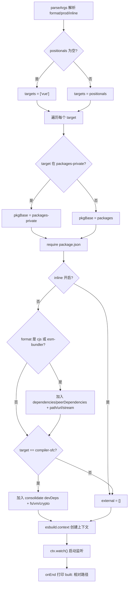
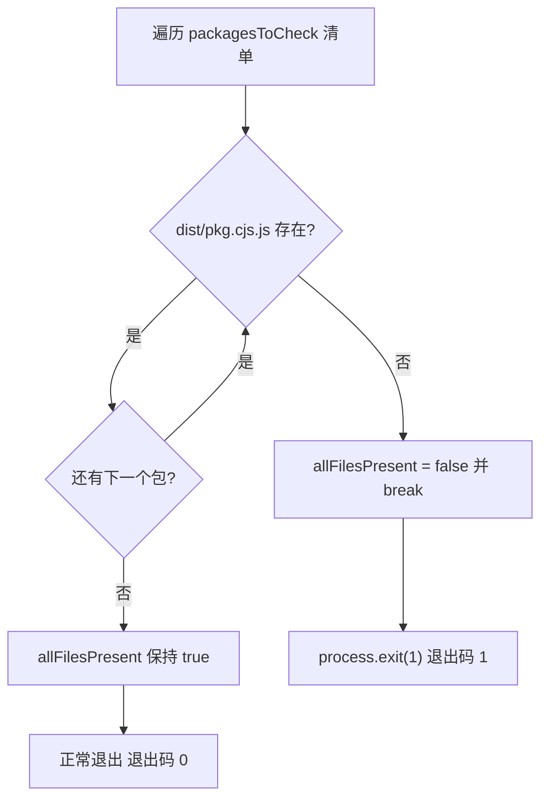
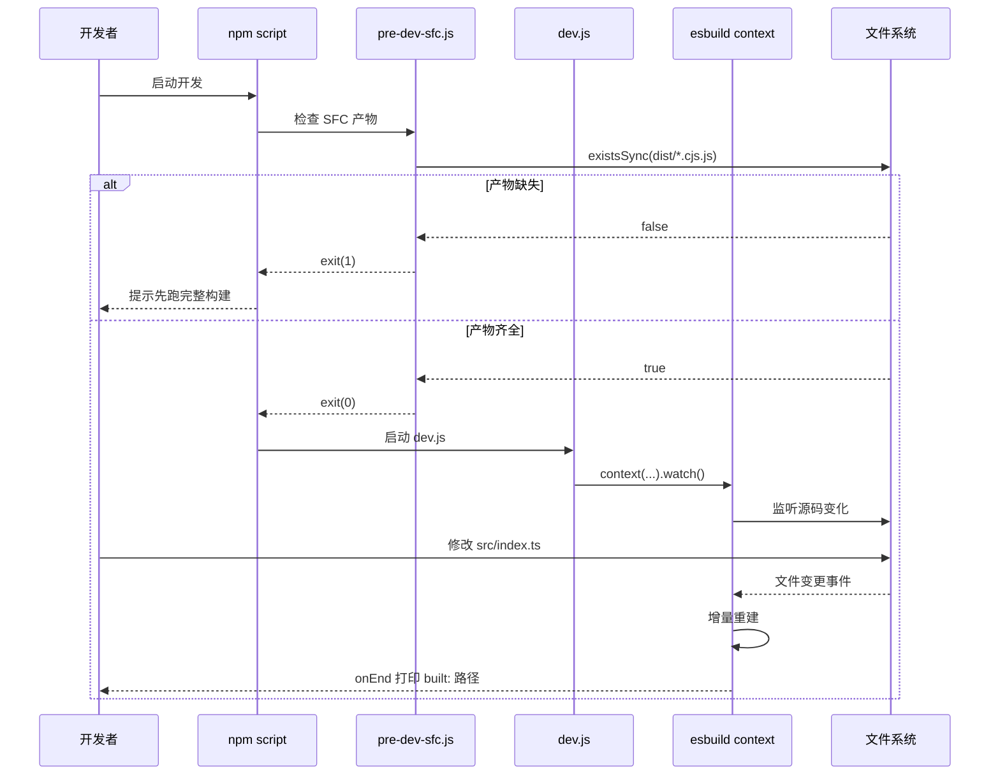

# 第 3 章：动态构建链路：dev 脚本与 SFC 预编译协议

上一章我们追踪了生产构建从参数解析到多格式产物落盘的完整链路，那条链路追求的是产物的完整与规范。而开发态的核心诉求只有一个：改一行代码，浏览器里立刻能看到效果。生产构建那套「解析参数 → 生成配置 → 全量打包 → 落盘」的链路，动辄数十秒，完全无法满足这个诉求。Vue core 仓库为此维护了一条独立的开发态链路：`scripts/dev.js` 用 esbuild 的 watch 模式做增量构建，`scripts/pre-dev-sfc.js` 在主构建前预先编译 SFC 编译器。本章拆解这两者的协作机制。

# 3.1 dev.js：用 esbuild 换速度的增量构建器

## 直觉模型

生产构建像「印刷厂正式排版付印」——质量优先，慢一点没关系；开发构建像「草稿纸上的铅笔速写」——不求精美，只求下笔即现。Vue 选择 esbuild 而非 Rollup 来画这张速写，原因写在文件开头的注释里：Rollup 产物更小、Tree-shaking 更好，但 esbuild 快得多。[FACT:scripts/dev.js:3-5](https://github.com/vuejs/core/blob/4ab865a848a1da3d10fb674f857e5fff13094644/scripts/dev.js#L3-L5)

若没有这个脚本，开发者每次改动都得跑一遍完整生产构建，反馈循环从毫秒级退化到分钟级，热更新体验荡然无存。

## 参数解析与格式推导

脚本入口用 Node 内置的 `parseArgs` 解析三个选项：`format`（默认 `global`）、`prod`（默认 `false`）、`inline`（默认 `false`）。[FACT:scripts/dev.js:18-40](https://github.com/vuejs/core/blob/4ab865a848a1da3d10fb674f857e5fff13094644/scripts/dev.js#L18-L40) 位置参数被收集为 `targets`，若为空则默认为 `['vue']`。[FACT:scripts/dev.js:42-53](https://github.com/vuejs/core/blob/4ab865a848a1da3d10fb674f857e5fff13094644/scripts/dev.js#L42-L53)

> **〔设计推断与架构权衡〕**
> 这里有个容易忽略的细节：`rawFormat` 与 `format` 是两次赋值。`parseArgs` 的 `default: 'global'` 已经保证了 `rawFormat` 有值，但脚本仍写了 `const format = rawFormat || 'global'` 作为兜底。[FACT:scripts/dev.js:42](https://github.com/vuejs/core/blob/4ab865a848a1da3d10fb674f857e5fff13094644/scripts/dev.js#L42)  这是防御性写法，避免 `parseArgs` 行为变化或显式传入空字符串时下游 `format.startsWith` 抛错。

`format` 到 esbuild 输出格式的映射是三路分支：以 `global` 开头映射为 `iife`，等于 `cjs` 映射为 `cjs`，其余一律 `esm`。[FACT:scripts/dev.js:42-53](https://github.com/vuejs/core/blob/4ab865a848a1da3d10fb674f857e5fff13094644/scripts/dev.js#L42-L53) 产物文件名后缀则由 `-runtime` 后缀单独处理：`global-runtime` 会变成 `runtime.global`，其余保持原样。[FACT:scripts/dev.js:42-53](https://github.com/vuejs/core/blob/4ab865a848a1da3d10fb674f857e5fff13094644/scripts/dev.js#L42-L53)

## 目标包定位与输出路径

脚本先读取 `packages-private` 目录列表，用于判断目标包属于公开包还是私有包。[FACT:scripts/dev.js:56](https://github.com/vuejs/core/blob/4ab865a848a1da3d10fb674f857e5fff13094644/scripts/dev.js#L56) 对每个 target，决定包基路径是 `packages` 还是 `packages-private`，再 `require` 其 `package.json` 拿到 `version` 与 `buildOptions`。[FACT:scripts/dev.js:58-63](https://github.com/vuejs/core/blob/4ab865a848a1da3d10fb674f857e5fff13094644/scripts/dev.js#L58-L63)

输出文件名有个特例：`vue-compat` 目标会被重命名为 `vue`，避免产物叫 `vue-compat.global.js`。[FACT:scripts/dev.js:64-69](https://github.com/vuejs/core/blob/4ab865a848a1da3d10fb674f857e5fff13094644/scripts/dev.js#L64-L69) 最终路径形如 `packages/vue/dist/vue.global.js`，`prod` 为真时插入 `prod.` 段。

## external 解析：避免把依赖打进产物

`external` 数组决定哪些模块不被打包。逻辑分两层：

第一层，当 `inline` 未开启且格式为 `cjs` 或含 `esm-bundler` 时，把 `dependencies`、`peerDependencies` 的键全部加入 external，并硬编码 `path`、`url`、`stream` 三个 Node 内置模块。[FACT:scripts/dev.js:76-88](https://github.com/vuejs/core/blob/4ab865a848a1da3d10fb674f857e5fff13094644/scripts/dev.js#L76-L88) 注释明确说明这三个是为 `@vue/compiler-sfc` 和 `server-renderer` 准备的。

第二层，针对 `compiler-sfc` 目标，额外解析 `@vue/consolidate` 的 `devDependencies`，把它们以及 `fs`、`vm`、`crypto` 等一并 external。[FACT:scripts/dev.js:90-112](https://github.com/vuejs/core/blob/4ab865a848a1da3d10fb674f857e5fff13094644/scripts/dev.js#L90-L112) 代码里还硬编码了 `react-dom/server`、`teacup/lib/express`、`arc-templates/dist/es5`、`then-pug`、`then-jade` 等模板引擎路径——这些是 consolidate 支持的模板引擎，属于可选依赖，不能强制安装。

> **〔设计推断与架构权衡〕**
> 这段逻辑与 `rollup.config.js` 高度重复，源码注释也承认了这点（`TODO this logic is largely duplicated from rollup.config.js`）。之所以没有抽公共函数，是因为 dev 与 prod 的 external 策略存在细微差异（dev 更激进地 external 化以加速构建），强行统一反而增加耦合。

## 插件与 define 注入

插件数组默认只有一个 `log-rebuild`，在 `onEnd` 钩子里打印构建产物相对路径。[FACT:scripts/dev.js:115-124](https://github.com/vuejs/core/blob/4ab865a848a1da3d10fb674f857e5fff13094644/scripts/dev.js#L115-L124) 这是开发者感知「改动已生效」的唯一反馈信号。

> **〔设计推断与架构权衡〕**
> 第二个插件是条件性的：当格式不是 `cjs` 且包的 `buildOptions.enableNonBrowserBranches` 为真时，挂载 `polyfillNode()`。[FACT:scripts/dev.js:126-128](https://github.com/vuejs/core/blob/4ab865a848a1da3d10fb674f857e5fff13094644/scripts/dev.js#L126-L128)  这类包（如 `compiler-sfc`）在浏览器构建中仍会走 Node 分支，需要 Node 内置模块的 polyfill 才能在浏览器环境跑通。

`define` 块是本章信息密度最高的部分。[FACT:scripts/dev.js:141-159](https://github.com/vuejs/core/blob/4ab865a848a1da3d10fb674f857e5fff13094644/scripts/dev.js#L141-L159) 它把源码里所有 `__XXX__` 宏替换为字面量：

- `__COMMIT__` 固定为 `"dev"`，`__VERSION__` 取包版本；
- `__DEV__` 由 `prod` 标志决定，`__TEST__` 恒为 `false`；
- `__BROWSER__` 的推导最微妙：`format !== 'cjs' && !pkg.buildOptions?.enableNonBrowserBranches`。[FACT:scripts/dev.js:146-148](https://github.com/vuejs/core/blob/4ab865a848a1da3d10fb674f857e5fff13094644/scripts/dev.js#L146-L148) 也就是说，只有「非 cjs 且包不支持非浏览器分支」才标记为浏览器环境；
- `__SSR__` 为 `format !== 'global'`，即 global 构建不启用 SSR 分支；
- `__COMPAT__` 由 target 是否为 `vue-compat` 决定；
- 三个 feature flag（`__FEATURE_SUSPENSE__`、`__FEATURE_OPTIONS_API__`、`__FEATURE_PROD_DEVTOOLS__`、`__FEATURE_PROD_HYDRATION_MISMATCH_DETAILS__`）在 dev 模式下全部写死。

这些宏与 `vitest.config.ts` 中的 `define` 块一一对应。[FACT:vitest.config.ts:6-21](https://github.com/vuejs/core/blob/4ab865a848a1da3d10fb674f857e5fff13094644/vitest.config.ts#L6-L21) 测试环境把 `__TEST__` 设为 `true`、`__DEV__` 设为 `true`，与 dev 构建的差异正是「测试 vs 开发」两种运行态的区分点。

## watch 模式启动

最后一步是 `esbuild.context(...).then(ctx => ctx.watch())`。[FACT:scripts/dev.js:130-161](https://github.com/vuejs/core/blob/4ab865a848a1da3d10fb674f857e5fff13094644/scripts/dev.js#L130-L161) `context` 创建构建上下文但不立即执行，`watch()` 才真正启动文件监听。此后 esbuild 内部维护依赖图，任何被依赖文件变化都会触发增量重建，重建完成回调 `onEnd` 打印日志。

# 3.2 pre-dev-sfc.js：破解循环依赖的预编译哨兵

## 直觉模型

想象一个「鸡生蛋」困局：`compiler-sfc` 的源码里 import 了 `compiler-core`，而 `compiler-core` 在开发态又需要 `compiler-sfc` 来处理 `.vue` 文件。如果两者都靠 esbuild watch 实时编译，谁先编译谁就卡死。`pre-dev-sfc.js` 的角色就是「先孵出蛋，再养鸡」——在主构建启动前，确保这几个包的 CJS 产物已经存在。

## 检查清单与短路逻辑

脚本维护一个固定清单：`compiler-sfc`、`compiler-core`、`compiler-dom`、`compiler-ssr`、`shared`。[FACT:scripts/pre-dev-sfc.js:4-10](https://github.com/vuejs/core/blob/4ab865a848a1da3d10fb674f857e5fff13094644/scripts/pre-dev-sfc.js#L4-L10) 对每个包，检查 `packages/${pkg}/dist/${pkg}.cjs.js` 是否存在。[FACT:scripts/pre-dev-sfc.js:4-23](https://github.com/vuejs/core/blob/4ab865a848a1da3d10fb674f857e5fff13094644/scripts/pre-dev-sfc.js#L4-L23)

只要有一个缺失，`allFilesPresent` 置为 `false` 并立即 `break`，不再检查剩余包。[FACT:scripts/pre-dev-sfc.js:20-21](https://github.com/vuejs/core/blob/4ab865a848a1da3d10fb674f857e5fff13094644/scripts/pre-dev-sfc.js#L20-L21) 最后若 `allFilesPresent` 为假，`process.exit(1)` 以非零码退出。[FACT:scripts/pre-dev-sfc.js:25-27](https://github.com/vuejs/core/blob/4ab865a848a1da3d10fb674f857e5fff13094644/scripts/pre-dev-sfc.js#L25-L27)

## 退出码的语义

这个脚本本身不执行任何编译，它只做「存在性断言」。`exit(1)` 是给上层调用者（通常是 npm script 的 `&&` 链或 CI 脚本）看的信号：产物不全，需要先跑一次完整构建。若全部存在则正常退出（退出码 0），主构建继续。

# 3.3 aliases.js 与 vitest.config.ts：开发态链路的另一半

`scripts/dev.js` 解决的是「产物怎么快速生成」，但开发时还有另一条路径：跑测试。`scripts/aliases.js` 为 vitest 和 rollup 提供共享的路径别名。[FACT:scripts/aliases.js:7-7](https://github.com/vuejs/core/blob/4ab865a848a1da3d10fb674f857e5fff13094644/scripts/aliases.js#L7-L7)

## 别名生成逻辑

`resolveEntryForPkg` 把包名映射到 `packages/${p}/src/index.ts`。[FACT:scripts/aliases.js:7-7](https://github.com/vuejs/core/blob/4ab865a848a1da3d10fb674f857e5fff13094644/scripts/aliases.js#L7-L7) 基础 entries 硬编码了四个特殊映射：`vue`、`vue/compiler-sfc`、`vue/server-renderer`、`@vue/compat`。[FACT:scripts/aliases.js:16-21](https://github.com/vuejs/core/blob/4ab865a848a1da3d10fb674f857e5fff13094644/scripts/aliases.js#L16-L21)

随后遍历 `packages` 目录下所有子目录，跳过 `vue` 本身、跳过 `nonSrcPackages`（`sfc-playground`、`template-explorer`、`dts-test`）、跳过已存在的 key，且必须是目录，才加入 `@vue/${dir}` 映射。[FACT:scripts/aliases.js:23-35](https://github.com/vuejs/core/blob/4ab865a848a1da3d10fb674f857e5fff13094644/scripts/aliases.js#L23-L35)

> **〔设计推断与架构权衡〕**
> 这套「硬编码特殊项 + 动态扫描通用项」的策略，是为了让新增包无需手动改别名文件——只要目录名符合规范，vitest 自动能解析。`nonSrcPackages` 排除列表则是因为这三个包没有 `src/index.ts` 入口，强行映射会导致解析失败。

## vitest 的 define 与别名消费

`vitest.config.ts` 直接 import `entries` 作为 `resolve.alias`。[FACT:vitest.config.ts:3](https://github.com/vuejs/core/blob/4ab865a848a1da3d10fb674f857e5fff13094644/vitest.config.ts#L3)[FACT:vitest.config.ts:22-24](https://github.com/vuejs/core/blob/4ab865a848a1da3d10fb674f857e5fff13094644/vitest.config.ts#L22-L24) 其 `define` 块与 dev.js 的宏注入形成对照：测试环境 `__DEV__: true`、`__TEST__: true`、`__BROWSER__: false`、`__CJS__: true`。[FACT:vitest.config.ts:6-21](https://github.com/vuejs/core/blob/4ab865a848a1da3d10fb674f857e5fff13094644/vitest.config.ts#L6-L21)

测试被拆成五个 project：`unit`、`unit-gc`、`unit-jsdom`、`e2e`、`e2e-browser`。[FACT:vitest.config.ts:51-118](https://github.com/vuejs/core/blob/4ab865a848a1da3d10fb674f857e5fff13094644/vitest.config.ts#L51-L118) 其中 `unit-gc` 用 `pool: 'forks'` 并传 `--expose-gc`，专门跑需要手动触发 GC 的 SSR 测试。[FACT:vitest.config.ts:65-76](https://github.com/vuejs/core/blob/4ab865a848a1da3d10fb674f857e5fff13094644/vitest.config.ts#L65-L76) `e2e-browser` 则启用 playwright 的 chromium 实例，跑 Transition 相关测试。[FACT:vitest.config.ts:99-117](https://github.com/vuejs/core/blob/4ab865a848a1da3d10fb674f857e5fff13094644/vitest.config.ts#L99-L117)

# 设计思考

**为什么 dev 用 esbuild 而 prod 用 Rollup？** 这不是技术选型的随意，而是两种场景的约束不同。开发态对产物大小不敏感，对反馈延迟极度敏感；生产态反之。esbuild 用 Go 编写、并行化程度高，冷启动和增量构建都快一个数量级，但它的 Tree-shaking 和代码分割能力弱于 Rollup。[FACT:scripts/dev.js:3-5](https://github.com/vuejs/core/blob/4ab865a848a1da3d10fb674f857e5fff13094644/scripts/dev.js#L3-L5) 用两套工具分别服务两种场景，是工程上的务实取舍。

> **〔设计推断与架构权衡〕**
> **pre-dev-sfc 为什么只检查不编译？** 如果它自己触发编译，就又把循环依赖引回来了——它要编译 `compiler-sfc`，而编译过程本身可能依赖 `compiler-sfc` 的产物。所以它只能做「断言」，把「缺产物」这个事实暴露给上层，由上层决定是跑完整构建还是报错退出。 这是一种「哨兵模式」：不解决问题，只报告问题。

**external 列表的重复是技术债吗？** dev.js 与 rollup.config.js 的 external 逻辑重复，源码注释也承认了。[FACT:scripts/dev.js:73](https://github.com/vuejs/core/blob/4ab865a848a1da3d10fb674f857e5fff13094644/scripts/dev.js#L73) 但两者的 external 集合并不完全一致——dev 为了速度会更激进地 external 化。强行抽公共函数需要引入参数化的差异开关，反而让两处逻辑都更难读。这是「重复优于错误抽象」的典型权衡。

# 本章小结

本章拆解了 Vue core 开发态链路的三块拼图：

1. **`scripts/dev.js`**：用 esbuild 的 `context().watch()` 实现增量构建，通过 `parseArgs` 解析格式与标志位，动态 `require` 目标包 `package.json` 定位输出路径，注入 `__DEV__`、`__BROWSER__` 等宏控制条件编译，并用 `log-rebuild` 插件在每次重建后打印反馈。

2. **`scripts/pre-dev-sfc.js`**：在主构建前检查五个核心包的 CJS 产物是否存在，缺失则以退出码 1 短路，避免循环依赖导致的构建死锁。

3. **`scripts/aliases.js` + `vitest.config.ts`**：为测试链路提供共享路径别名，硬编码特殊项加动态扫描通用项，配合多 project 配置覆盖单元、GC、jsdom、e2e、浏览器 e2e 五种测试场景。

# 本章思考与自测

Q1: 若把 `scripts/pre-dev-sfc.js` 中的 `break` 去掉（即检查完所有包再决定退出），在什么场景下会导致开发者体验变差？为什么源码作者选择「发现第一个缺失就短路」？

**参考解析**：

[FACT:scripts/pre-dev-sfc.js:4-23](https://github.com/vuejs/core/blob/4ab865a848a1da3d10fb674f857e5fff13094644/scripts/pre-dev-sfc.js#L4-L23)

`break` 位于 `if (!fs.existsSync(...))` 分支内，一旦发现某个包产物缺失就立即跳出循环。

若去掉 `break`，脚本会继续检查剩余包，最终 `allFilesPresent` 仍为 `false`，退出码仍是 1，**功能上等价**。但差异在于：

1. **性能**：五个 `existsSync` 调用本身很快，但若清单扩展到几十个包，短路能省下大量无谓的 stat 系统调用。

2. **语义**：短路表达的是「只要有一个缺失，整体就不完整」——这是一个布尔断言，不需要知道具体缺几个。继续检查不产生额外信息。

3. **开发者体验**：实际上变差的是「报错信息」。当前脚本不打印哪个包缺失，开发者只看到退出码 1。若去掉 `break` 并加上日志，反而能告诉开发者「缺 compiler-core 和 shared」——但这需要额外代码。作者选择最简实现，把「缺哪个」的诊断留给上层构建脚本的报错。

所以 `break` 的核心动机是「断言语义 + 性能」，而非体验优化。

Q2: `scripts/dev.js` 中 `__BROWSER__` 的推导是 `format !== 'cjs' && !pkg.buildOptions?.enableNonBrowserBranches`。假设某个包的 `buildOptions.enableNonBrowserBranches` 为 `true`，且开发者用 `-f global` 构建，此时 `__BROWSER__` 为 `false`。这会导致什么后果？如果误改为 `true` 会怎样？

**参考解析**：

[FACT:scripts/dev.js:146-148](https://github.com/vuejs/core/blob/4ab865a848a1da3d10fb674f857e5fff13094644/scripts/dev.js#L146-L148)

当 `format = 'global'` 且 `enableNonBrowserBranches = true` 时：

- `format !== 'cjs'` 为 `true`
- `!pkg.buildOptions?.enableNonBrowserBranches` 为 `false`
- 整体 `__BROWSER__ = false`

这意味着源码中所有 `if (__BROWSER__)` 分支被 esbuild 的 define 替换为 `if (false)`，浏览器专属代码被 Tree-shaking 移除，非浏览器分支（Node 专属逻辑）被保留。

**后果**：global 构建产物本应跑在浏览器里，却包含了 Node 专属分支。若这些分支引用了 `fs`、`path` 等 Node 内置模块，浏览器加载时会报「模块未定义」。这正是为什么 `enableNonBrowserBranches` 为真的包（如 `compiler-sfc`）通常不用于 global 构建，或者需要 `polyfillNode()` 插件兜底。[FACT:scripts/dev.js:126-128](https://github.com/vuejs/core/blob/4ab865a848a1da3d10fb674f857e5fff13094644/scripts/dev.js#L126-L128)

**若误改为 `true`**：`__BROWSER__ = true`，浏览器分支被保留，Node 分支被移除。对于 `compiler-sfc` 这类必须在 Node 环境跑 SFC 编译的包，会导致核心功能（读取文件、调用 Node API）被 Tree-shaking 掉，产物在 Node 里运行时报「函数未定义」。

Q3: `scripts/aliases.js` 中，动态扫描 `packages` 目录时跳过了 `nonSrcPackages`（`sfc-playground`、`template-explorer`、`dts-test`）。如果某个新包被加入 `packages` 目录但没有 `src/index.ts`，且未被加入 `nonSrcPackages`，会发生什么？vitest 运行时会在哪个环节报错？

**参考解析**：

[FACT:scripts/aliases.js:23-35](https://github.com/vuejs/core/blob/4ab865a848a1da3d10fb674f857e5fff13094644/scripts/aliases.js#L23-L35)

动态扫描逻辑是：对每个目录，若 `dir !== 'vue'`、不在 `nonSrcPackages`、key 未存在、且是目录，就加入 `entries['@vue/${dir}'] = resolveEntryForPkg(dir)`。

`resolveEntryForPkg` 返回的是 `packages/${p}/src/index.ts` 的路径。[FACT:scripts/aliases.js:7-7](https://github.com/vuejs/core/blob/4ab865a848a1da3d10fb674f857e5fff13094644/scripts/aliases.js#L7-L7) 注意它**不检查文件是否存在**，只是拼接路径。

**后果**：别名会被注册，但指向一个不存在的文件。vitest 在解析 import 时，若某个测试文件 import 了这个包，Vite 的 resolve 插件会尝试加载该路径，报「无法解析模块」或「文件不存在」。

**报错环节**：不是在 `aliases.js` 执行时（它只做字符串拼接），而是在 vitest 启动后、首次解析到该 import 时。若没有任何测试 import 这个包，则不会报错——别名只是躺在 `entries` 对象里。

**规避方式**：把这类无 `src/index.ts` 的包加入 `nonSrcPackages`，或者确保新包有标准入口。这也是为什么 `nonSrcPackages` 需要手动维护——它是「约定优于配置」的例外清单。

三者协作的边界很清晰：`pre-dev-sfc` 管「产物是否就绪」，`dev.js` 管「产物如何快速更新」，`aliases` 管「测试如何解析源码」。开发态链路解决了速度问题，但构建期还有另一类更隐蔽的优化——那些在代码被浏览器执行之前就完成的变换。下一章将进入编译期魔法，看枚举内联与 Tree-shaking 验证机制如何在构建期把 TypeScript enum 替换为字面量，并确保按需引入的承诺不被破坏。
