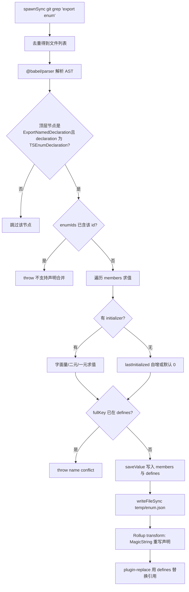
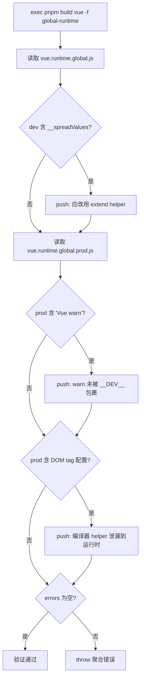

# 第 4 章：魔鬼在细节：Tree-shaking 语义与类型声明生成

上一章我们看到开发态链路如何用文件监听与增量构建换取「改一行立即生效」的速度。但速度之外，Vue 还有一条更隐蔽的约束：发布产物的体积必须可控。这条约束的敌人之一，是 TypeScript 的 enum——它在运行时是一个真实存在的对象，会破坏 Tree-shaking。本章进入编译期，看 scripts/inline-enums.js 如何在代码被浏览器执行之前，把枚举「溶解」成字面量；再看 scripts/verify-treeshaking.js 如何在构建之后，用产物字符串反向验证「按需引入」的承诺没有被悄悄破坏。

# 4.1 枚举内联：把运行时对象溶解成字面量

## 直觉模型

想象你写了一份菜谱，里面反复出现「少许盐」。如果每次做菜都要翻到附录去查「少许 = 3 克」，既慢又占地方。枚举内联做的事，就是在印刷前把全书的「少许盐」直接替换成「3 克盐」，然后把附录那一页撕掉。对读者（运行时）而言，结果完全一样，但书更薄了。

若没有它，系统会面临什么灾难？TypeScript 的普通 `enum` 编译后会生成一个真实的对象字面量，并且带有双向映射（`Enum[Enum.A] === 'A'`）。这个对象是**有副作用的模块级声明**，Rollup 无法证明它未被使用，于是只能保留——哪怕你只 import 了其中一个成员，整个枚举对象连同反向映射都会被塞进产物。[FACT:scripts/inline-enums.js:3-9](https://github.com/vuejs/core/blob/4ab865a848a1da3d10fb674f857e5fff13094644/scripts/inline-enums.js#L3-L9) 的注释说得很直白：他们曾用 `const enum`，但因 issue #1228 改用普通 enum，于是用这个脚本「手动找回 const enum 的零成本收益」。

## 数据结构与内存布局

脚本的核心是三个类型定义，理解它们就理解了整个数据流。[FACT:scripts/inline-enums.js:33-36](https://github.com/vuejs/core/blob/4ab865a848a1da3d10fb674f857e5fff13094644/scripts/inline-enums.js#L33-L36)

- `EnumMember`：`{ name, value }`，单个枚举成员的名字与求值后的字面量。
- `EnumDeclaration`：`{ id, range: [start, end], members }`。`range` 是**源码字节偏移**，指向 `export enum X { ... }` 整段声明在文件中的起止位置——这是后续 MagicString 精确替换的锚点。
- `EnumData`：`{ declarations, defines }`。`declarations` 按文件路径索引，记录该文件里所有枚举声明的替换范围；`defines` 是一个扁平映射，键是 `` `${枚举名}.${成员名}` `` 形式的字符串，值是 `JSON.stringify` 后的字面量。

这里有个关键设计：`defines` 的键**不含文件路径**。[FACT:scripts/inline-enums.js:98-103](https://github.com/vuejs/core/blob/4ab865a848a1da3d10fb674f857e5fff13094644/scripts/inline-enums.js#L98-L103) 注释解释了原因——`ErrorCodes` 可以同时存在于 `@vue/compiler-core` 和 `@vue/runtime-core`，所以允许同名枚举跨文件存在；但同一个 `ErrorCodes.__EXTEND_POINT__` 不允许在两个同名枚举里重复，否则 `fullKey in defines` 命中，直接抛 `name conflict`。这是一个「按成员名全局唯一」的约束，而非「按枚举名全局唯一」。

缓存落在 `temp/enum.json`。[FACT:scripts/inline-enums.js:33-36](https://github.com/vuejs/core/blob/4ab865a848a1da3d10fb674f857e5fff13094644/scripts/inline-enums.js#L33-L36) 为什么需要落盘？因为 `scanEnums()` 在构建入口只调用一次，而 Rollup 会为每个包、每种格式启动**独立的进程**。[FACT:scripts/inline-enums.js:39-41](https://github.com/vuejs/core/blob/4ab865a848a1da3d10fb674f857e5fff13094644/scripts/inline-enums.js#L39-L41) 注释点明：数据要跨并发的 Rollup 进程共享，所以必须序列化到磁盘，由各进程的 `inlineEnums()` 读回。

## Step-by-Step：从 grep 到字面量替换

**第一步：grep 出所有含 `export enum` 的文件。**[FACT:scripts/inline-enums.js:51-61](https://github.com/vuejs/core/blob/4ab865a848a1da3d10fb674f857e5fff13094644/scripts/inline-enums.js#L51-L61) 用 `spawnSync('git', ['grep', 'export enum'])`，输出形如 `path:line:content`，再按 `:` 切出第一段（文件路径），用 `Set` 去重。注意这里用的是 `git grep` 而非遍历文件系统——它天然只扫被 Git 跟踪的文件，自动排除 `node_modules` 与构建产物。

**第二步：Babel 解析并收集枚举信息。**[FACT:scripts/inline-enums.js:64-70](https://github.com/vuejs/core/blob/4ab865a848a1da3d10fb674f857e5fff13094644/scripts/inline-enums.js#L64-L70) 对每个文件用 `@babel/parser` 以 `typescript` 插件、`sourceType: 'module'` 解析成 AST，然后只遍历 `ast.program.body` 的顶层节点。[FACT:scripts/inline-enums.js:74-79](https://github.com/vuejs/core/blob/4ab865a848a1da3d10fb674f857e5fff13094644/scripts/inline-enums.js#L74-L79) 只认 `ExportNamedDeclaration` 且其 `declaration.type === 'TSEnumDeclaration'` 的节点——也就是说，**非导出的 enum 不会被处理**。

对每个枚举声明，脚本逐成员求值。成员求值分三条路径：

1. **字面量初始化**：`StringLiteral` 或 `NumericLiteral` 直接取 `init.value`。[FACT:scripts/inline-enums.js:114-119](https://github.com/vuejs/core/blob/4ab865a848a1da3d10fb674f857e5fff13094644/scripts/inline-enums.js#L114-L119)

2. **二元表达式**：如 `1 << 2`。递归 `resolveValue` 处理左右操作数，操作数可以是字面量，也可以是 `MemberExpression`（即引用前面已定义的枚举成员）。[FACT:scripts/inline-enums.js:121-151](https://github.com/vuejs/core/blob/4ab865a848a1da3d10fb674f857e5fff13094644/scripts/inline-enums.js#L121-L151) 关键在 `MemberExpression` 分支：它用 `content.slice(node.start, node.end)` 从**原始源码文本**里切出表达式字符串（如 `ErrorCodes.FOO`），再查 `defines`。若查不到就抛 `unhandled enum initialization expression`。[FACT:scripts/inline-enums.js:132-141](https://github.com/vuejs/core/blob/4ab865a848a1da3d10fb674f857e5fff13094644/scripts/inline-enums.js#L132-L141) 这解释了为什么 `defines` 必须是全局扁平映射——跨枚举引用时，被引用者可能来自另一个文件，但键只认 `枚举名.成员名`。

3. **一元表达式**：如 `-1`，拼成 `-1` 字符串后用 `evaluate` 求值。[FACT:scripts/inline-enums.js:152-163](https://github.com/vuejs/core/blob/4ab865a848a1da3d10fb674f857e5fff13094644/scripts/inline-enums.js#L152-L163)

求值本身用的是 `new Function('return ' + exp)()`。[FACT:scripts/inline-enums.js:39-41](https://github.com/vuejs/core/blob/4ab865a848a1da3d10fb674f857e5fff13094644/scripts/inline-enums.js#L39-L41) 这是一个**受控的 eval**：输入来自源码里已解析的 AST 片段，不是任意用户输入，所以安全边界可控。

**第三步：处理无初始化器的成员（自增语义）。**[FACT:scripts/inline-enums.js:171-183](https://github.com/vuejs/core/blob/4ab865a848a1da3d10fb674f857e5fff13094644/scripts/inline-enums.js#L171-L183) 若成员没有 `initializer`：第一个成员默认 `0`；后续成员若 `lastInitialized` 是数字则 `++`；若是字符串则抛 `wrong enum initialization sequence`——因为字符串枚举成员不允许隐式自增。这正是 TypeScript 枚举的语义。

**第四步：写缓存并返回清理函数。**[FACT:scripts/inline-enums.js:200-213](https://github.com/vuejs/core/blob/4ab865a848a1da3d10fb674f857e5fff13094644/scripts/inline-enums.js#L200-L213) `scanEnums()` 返回一个闭包，调用即 `rmSync` 删除缓存文件。`build.js` 在 `try/finally` 里使用它。[FACT:scripts/build.js:81-112](https://github.com/vuejs/core/blob/4ab865a848a1da3d10fb674f857e5fff13094644/scripts/build.js#L81-L112) 这保证了即使构建中途抛错，缓存也会被清理，不会污染下一次构建。

**第五步：Rollup transform 阶段替换。** `inlineEnums()` 读回缓存，构造一个 Rollup 插件。[FACT:scripts/inline-enums.js:219-234](https://github.com/vuejs/core/blob/4ab865a848a1da3d10fb674f857e5fff13094644/scripts/inline-enums.js#L219-L234) 在 `transform(code, id)` 中，若 `id` 命中 `enumData.declarations`，就用 MagicString 把 `[start, end]` 这段声明替换成对象字面量。[FACT:scripts/inline-enums.js:242-274](https://github.com/vuejs/core/blob/4ab865a848a1da3d10fb674f857e5fff13094644/scripts/inline-enums.js#L242-L274)

替换后的形态是 `export const X = { ... }`。注意它**不是简单地删掉枚举**，而是重写成对象字面量，并且对数字成员额外生成反向映射：`JSON.stringify(value.toString()) + ': ' + JSON.stringify(name)`。[FACT:scripts/inline-enums.js:257-270](https://github.com/vuejs/core/blob/4ab865a848a1da3d10fb674f857e5fff13094644/scripts/inline-enums.js#L257-L270) 注释引用了 TypeScript 官方文档的 reverse-mappings 规则：字符串枚举成员不生成反向映射，数字成员生成。这保证了替换后运行时行为与原 enum 完全一致。

而真正消除运行时开销的，是 `defines` 被交给 `@rollup/plugin-replace`。[FACT:rollup.config.js:222-223](https://github.com/vuejs/core/blob/4ab865a848a1da3d10fb674f857e5fff13094644/rollup.config.js#L222-L223) 所有对 `X.Member` 的**引用**在替换插件里被直接换成字面量，于是那个重写出来的对象字面量如果没人用，就能被 Tree-shaking 摇掉。

下面这张流程图刻画了从 grep 到替换的完整决策路径：

## 设计思考与踩坑

**为什么用 MagicString 而不是重新生成整个文件？** 因为 `s.update(start, end, ...)` 只替换枚举声明那一段，其余源码字节完全不动，`s.generateMap()` 还能生成精确的 sourcemap。[FACT:scripts/inline-enums.js:277-281](https://github.com/vuejs/core/blob/4ab865a848a1da3d10fb674f857e5fff13094644/scripts/inline-enums.js#L277-L281) 若用 Babel 重新打印整个 AST，会丢失原始格式、注释，且 sourcemap 质量下降。

**`range` 为何是 `node.start/node.end` 而非 `declaration.start`？**[FACT:scripts/inline-enums.js:189-193](https://github.com/vuejs/core/blob/4ab865a848a1da3d10fb674f857e5fff13094644/scripts/inline-enums.js#L189-L193) 断言的是 `node.start`（即 `ExportNamedDeclaration` 节点），替换范围覆盖 `export enum X {...}` 整段，包括 `export` 关键字。替换文本以 `export const` 开头，正好接续。

**踩坑点：`defines` 的全局唯一性约束。** 如果两个不同文件里各有一个 `ErrorCodes`，且都定义了 `__EXTEND_POINT__`，构建会直接失败。[FACT:scripts/inline-enums.js:101-103](https://github.com/vuejs/core/blob/4ab865a848a1da3d10fb674f857e5fff13094644/scripts/inline-enums.js#L101-L103) 这不是 bug，而是刻意设计——因为 `defines` 是全局替换表，无法区分文件来源。生产环境中新增枚举成员时，若名字与已有枚举成员冲突，会在这里炸出来。

**踩坑点：`new Function` 的求值时机。** 二元表达式求值发生在 `scanEnums` 阶段，此时 `defines` 里可能还没有被引用的成员（若引用顺序颠倒）。[FACT:scripts/inline-enums.js:136-140](https://github.com/vuejs/core/blob/4ab865a848a1da3d10fb674f857e5fff13094644/scripts/inline-enums.js#L136-L140) 会抛 `unhandled enum initialization expression`。这要求枚举成员的引用必须遵循「先定义后引用」的源码顺序。

# 4.2 Tree-shaking 验证：用产物字符串反向证明承诺

## 直觉模型

枚举内联是「事前优化」，但优化是否真的生效？如果某个 helper 因为写法不当被意外保留，体积会悄悄膨胀，而开发者毫无察觉。`verify-treeshaking.js` 就是那个「事后质检员」：它构建出产物，然后像验尸一样检查产物里**不该出现的东西是否出现**。若没有它，Vue 的按需引入承诺可能在某次重构后无声破裂，直到用户抱怨包变大才被发现。

## 数据结构与检查项

这个脚本没有复杂数据结构，核心是一个 `errors` 数组和三次 `includes` 检查。[FACT:scripts/verify-treeshaking.js:6-6](https://github.com/vuejs/core/blob/4ab865a848a1da3d10fb674f857e5fff13094644/scripts/verify-treeshaking.js#L6-L6) 它先构建 `global-runtime` 格式，然后分别读取 dev 与 prod 产物。

三个检查项对应三类「Tree-shaking 失败」：

1. **dev 产物含 `__spreadValues`**。[FACT:scripts/verify-treeshaking.js:13-19](https://github.com/vuejs/core/blob/4ab865a848a1da3d10fb674f857e5fff13094644/scripts/verify-treeshaking.js#L13-L19) 这是 esbuild 为 `{ ...obj }` 对象展开语法生成的 helper。若它出现，说明运行时代码里用了对象展开，而 Vue 约定应改用 `extend` helper 以避免额外代码。

2. **prod 产物含 `Vue warn`**。[FACT:scripts/verify-treeshaking.js:26-31](https://github.com/vuejs/core/blob/4ab865a848a1da3d10fb674f857e5fff13094644/scripts/verify-treeshaking.js#L26-L31) 说明有 `warn()` 调用没有被 `__DEV__` 条件包裹，导致警告代码泄漏进生产包。

3. **prod 产物含 DOM tag 配置列表**。[FACT:scripts/verify-treeshaking.js:33-42](https://github.com/vuejs/core/blob/4ab865a848a1da3d10fb674f857e5fff13094644/scripts/verify-treeshaking.js#L33-L42) 如 `html,body,base`、`svg,animate,animateMotion`、`annotation,annotation-xml,maction`。这些是 `isHTMLTag()` 等 helper 内部的数据，本应只存在于编译器、被运行时摇掉。若出现在运行时产物里，说明运行时路径误用了编译器专属 helper。

## Step-by-Step：验证流程

[FACT:scripts/verify-treeshaking.js:5-5](https://github.com/vuejs/core/blob/4ab865a848a1da3d10fb674f857e5fff13094644/scripts/verify-treeshaking.js#L5-L5) 先 `exec('pnpm', ['build', 'vue', '-f', 'global-runtime'])`，只构建 `vue` 包的 `global-runtime` 格式——这是最小化的运行时产物，最适合暴露泄漏。构建完成后同步读取两个文件，逐个 `includes` 检查，命中就往 `errors` 里 push 一条带解释的消息。最后若 `errors.length` 非零，抛出聚合错误。[FACT:scripts/verify-treeshaking.js:44-48](https://github.com/vuejs/core/blob/4ab865a848a1da3d10fb674f857e5fff13094644/scripts/verify-treeshaking.js#L44-L48)

## 设计思考与踩坑

> **〔设计推断与架构权衡〕**
> **为什么用字符串 `includes` 而不是 AST 分析？**  因为这是「哨兵检查」而非「精确分析」。它不追求完备性，只针对历史上真实发生过的三类回归设置低成本警报。字符串匹配零依赖、零解析开销，且对压缩后的产物同样有效——AST 分析在 minify 后反而更难做。

> **〔设计推断与架构权衡〕**
> **为什么只验证 `global-runtime`？**  这个格式把所有依赖内联（`external` 为空），是体积最敏感、最容易被误引入的产物。若它干净，其他格式通常也干净。同时它构建快，适合放进 CI 频繁跑。

> **〔设计推断与架构权衡〕**
> **踩坑点：检查项是「黑名单」，会随代码演进失效。** 若某天 `isHTMLTag` 的数据结构改了，`html,body,base` 这个字符串不再出现，检查就形同虚设。 这要求维护者在改动相关 helper 时同步更新这里的哨兵字符串。这是黑名单式验证的固有代价。

# 4.3 与 Rollup 的协作：插件顺序与 define 注入

枚举内联不是孤立运行的，它嵌在 Rollup 的插件流水线里。理解它在流水线中的位置，才能理解为什么 `defines` 要交给 `replace` 而非 `esbuild`。

[FACT:rollup.config.js:47-50](https://github.com/vuejs/core/blob/4ab865a848a1da3d10fb674f857e5fff13094644/rollup.config.js#L47-L50) 在配置模块顶层就调用 `inlineEnums()`，解构出 `[enumPlugin, enumDefines]`。注意这是在**每个 Rollup 进程启动时**执行的，读的是 `scanEnums` 写好的缓存。

插件数组的顺序是：`json` → `alias` → `enumPlugin` → `...resolveReplace()` → `esbuild`。[FACT:rollup.config.js:324-339](https://github.com/vuejs/core/blob/4ab865a848a1da3d10fb674f857e5fff13094644/rollup.config.js#L324-L339) `enumPlugin` 排在 `replace` 之前，意味着枚举声明的重写先发生，然后 `replace` 才用 `defines` 去替换引用。而 `esbuild` 排在最后，负责 TS 转译。

为什么 `defines` 走 `replace` 而不走 `esbuild` 的 `define`？[FACT:rollup.config.js:220-221](https://github.com/vuejs/core/blob/4ab865a848a1da3d10fb674f857e5fff13094644/rollup.config.js#L220-L221) 注释给出答案：esbuild 的 define「有点严格，只允许字面量 JSON 或标识符」。而枚举成员名如 `ErrorCodes.__EXTEND_POINT__` 是带点的成员表达式，esbuild 的 define 无法直接处理这种键。所以必须用 `@rollup/plugin-replace`，它支持任意字符串键的替换。[FACT:rollup.config.js:250-251](https://github.com/vuejs/core/blob/4ab865a848a1da3d10fb674f857e5fff13094644/rollup.config.js#L250-L251) 且设置了 `preventAssignment: true`，避免把赋值语句左侧也替换掉。

`resolveReplace()` 里 `const replacements = { ...enumDefines }` 是第一步。[FACT:rollup.config.js:222-223](https://github.com/vuejs/core/blob/4ab865a848a1da3d10fb674f857e5fff13094644/rollup.config.js#L222-L223) 之后才叠加生产环境的 `/*@__PURE__*/` 标注、`__DEV__` 等替换。这个顺序保证了枚举字面量替换始终生效。

# 设计思考

**枚举内联的本质是「用构建期复杂度换运行时体积」。** 它把 TypeScript 的类型系统语义（枚举求值、自增、反向映射）在构建期完整复现了一遍——`scanEnums` 里的求值逻辑几乎是 TS 编译器枚举求值的一个子集。[FACT:scripts/inline-enums.js:110-183](https://github.com/vuejs/core/blob/4ab865a848a1da3d10fb674f857e5fff13094644/scripts/inline-enums.js#L110-L183) 这带来维护成本：TS 若新增枚举语法（如更复杂的常量表达式），这里必须跟进，否则抛 `unhandled` 错误。但收益是明确的：运行时零枚举对象，Tree-shaking 得以彻底。

> **〔设计推断与架构权衡〕**
> **验证脚本与内联脚本是一对「承诺与兑现」。** 内联脚本承诺「枚举不占运行时体积」，验证脚本检查「其他代码也没偷偷占体积」。两者共同守护 Vue 的体积预算。 这种「优化 + 验证」的成对设计，是大型前端库工程化的典型模式：任何优化都需要一个自动化检查来防止回归。

**跨进程缓存是并发构建的必需品。** `scanEnums` 单次执行、`inlineEnums` 多次读取的模式，[FACT:scripts/inline-enums.js:39-41](https://github.com/vuejs/core/blob/4ab865a848a1da3d10fb674f857e5fff13094644/scripts/inline-enums.js#L39-L41) 解决了「一次扫描、N 个进程消费」的问题。若没有缓存，每个 Rollup 进程都要重新 grep + 解析，浪费大量 IO 与 CPU。

# 本章小结

# 本章思考与自测

Q1: 若把 `scanEnums` 中 `saveValue` 里的 `if (fullKey in defines)` 冲突检查删掉，在什么场景下会导致构建产物出现错误？

**参考解析**：

`defines` 是全局扁平映射，键为 `枚举名.成员名`，不含文件路径。[FACT:scripts/inline-enums.js:98-103](https://github.com/vuejs/core/blob/4ab865a848a1da3d10fb674f857e5fff13094644/scripts/inline-enums.js#L98-L103) 删除冲突检查后，若两个不同文件各有一个同名枚举且定义了同名成员（如 `@vue/compiler-core` 与 `@vue/runtime-core` 都有 `ErrorCodes.__EXTEND_POINT__`），后写入者会覆盖先写入者。

后果：`defines['ErrorCodes.__EXTEND_POINT__']` 只剩一个值，而 `plugin-replace` 在替换时无法区分文件来源，会把**所有**文件里的 `ErrorCodes.__EXTEND_POINT__` 都替换成同一个值。[FACT:rollup.config.js:222-223](https://github.com/vuejs/core/blob/4ab865a848a1da3d10fb674f857e5fff13094644/rollup.config.js#L222-L223) 于是其中一个包的枚举成员值被静默篡改，运行时行为错误且极难排查——因为源码看起来完全正确。

这正是注释强调「允许同名枚举跨文件，但不允许同名成员」的原因。[FACT:scripts/inline-enums.js:98-100](https://github.com/vuejs/core/blob/4ab865a848a1da3d10fb674f857e5fff13094644/scripts/inline-enums.js#L98-L100) 冲突检查是防止全局替换表被污染的守门人。

Q2: 若把 `rollup.config.js` 中插件数组里 `enumPlugin` 与 `...resolveReplace()` 的顺序对调，会发生什么？

**参考解析**：

当前顺序是 `enumPlugin` 在前、`replace` 在后。[FACT:rollup.config.js:331-332](https://github.com/vuejs/core/blob/4ab865a848a1da3d10fb674f857e5fff13094644/rollup.config.js#L331-L332) Rollup 的 `transform` 钩子按插件数组顺序执行。

若对调，`replace` 会先运行，此时枚举声明还是原始的 `export enum X { ... }` 形态。`replace` 用 `defines` 去替换 `X.Member` 引用——但此时引用还在，替换能生效。问题出在 `enumPlugin` 随后运行时：它用 `s.update(start, end, ...)` 重写声明段。[FACT:scripts/inline-enums.js:250-273](https://github.com/vuejs/core/blob/4ab865a848a1da3d10fb674f857e5fff13094644/scripts/inline-enums.js#L250-L273) 但 `replace` 已经修改过 `code`，而 `enumPlugin` 拿到的 `code` 是 `replace` 的输出，其字节偏移已与 `scanEnums` 记录的 `range`（基于原始源码）**不再对应**。

后果：MagicString 会在错误的偏移处切割，产物语法错乱。这揭示了插件流水线的一个隐含契约：**基于源码偏移的变换必须最先执行**，后续变换才能安全地在其输出上继续。

Q3: `verify-treeshaking.js` 只检查三个字符串哨兵。若某次重构把 `isHTMLTag` 内部数据从 `'html,body,base'` 改成数组形式 `['html','body','base']`，验证脚本会怎样？这暴露了什么设计缺陷？

**参考解析**：

验证脚本用 `prodBuild.includes('html,body,base')` 检查。[FACT:scripts/verify-treeshaking.js:33-37](https://github.com/vuejs/core/blob/4ab865a848a1da3d10fb674f857e5fff13094644/scripts/verify-treeshaking.js#L33-L37) 若数据改成数组，压缩产物里不再出现逗号连接的字符串，`includes` 返回 `false`，检查**静默通过**——即使 `isHTMLTag` 真的泄漏进了运行时产物。

这暴露了黑名单式字符串验证的固有缺陷：**哨兵字符串与源码实现耦合，实现一变，验证即失效**。它无法检测「未知的泄漏」，只能检测「已知的、且字符串形态未变的泄漏」。

> **〔设计推断与架构权衡〕**
> 改进方向： 可以改为检查更稳定的标识符（如函数名 `isHTMLTag`），或在源码层面用 lint 规则禁止运行时 import 编译器 helper，而非依赖产物字符串。但在当前成本约束下，字符串哨兵是「够用且廉价」的折中。

枚举内联解决了「构建期如何消除运行时开销」，验证脚本解决了「如何确认优化没被破坏」。但构建产物除了 JS，还有一类同样需要流水线加工的产物——类型声明文件。下一章将进入类型产物流水线，看 Vue 如何从源码 `.d.ts` 生成发布级类型包，以及 `dts-test` 如何用类型契约测试守住公开 API 的类型形状。

本章拆解了编译期的两个关键脚本。inline-enums.js 用 git grep 定位枚举、Babel 解析 AST、new Function 求值成员、MagicString 精确重写声明，最终通过 defines 全局替换表把枚举引用变成字面量，让枚举对象可被 Tree-shaking 摇掉。verify-treeshaking.js 则在构建后用字符串哨兵检查产物，确保三类已知的 Tree-shaking 泄漏不会回归。两者一个负责「优化」，一个负责「验证优化没被破坏」，共同守护 Vue 的体积承诺。接下来，我们将从编译期转向类型产物的生成链路，看 Vue 如何保证源码类型与发布类型严格一致。
