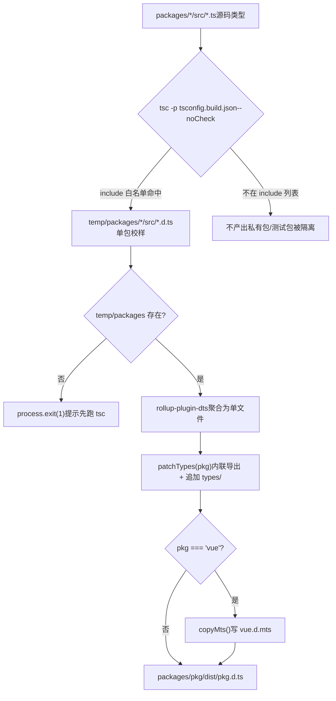
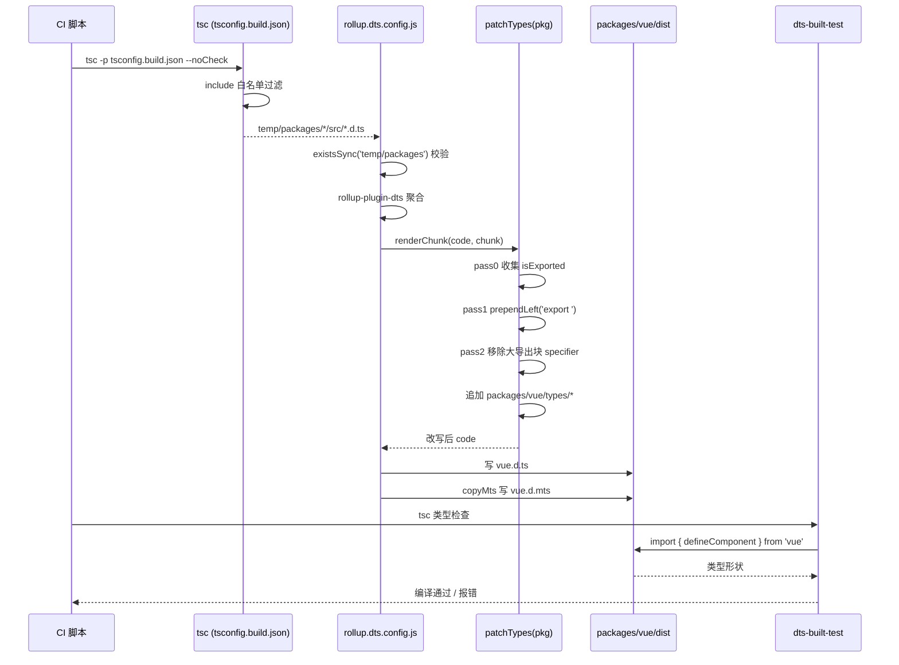

# 第 5 章：类型测试流水线：源码与类型契约的守门人

上一章我们拆解了 `inline-enums.js` 与 `verify-treeshaking.js`：一个负责把 enum 引用替换成字面量、让枚举对象能被摇掉，另一个负责在构建后用字符串哨兵确认三类已知泄漏没有回归。两者共同守护了 Vue 的运行时体积承诺。但构建产物不止 JS。当用户 `import { ref } from 'vue'` 时，编辑器弹出的类型提示、`tsc` 对用户代码的类型检查，全都依赖另一类产物——`.d.ts` 声明文件。JS 产物错了，运行时报错；类型产物错了，用户侧编译期就报错，或者更糟：类型静默漂移，用户代码能编译通过，但类型形状与真实运行时行为不符。本章追踪 Vue 如何把散落在各子包 `src` 里的源码类型，聚合成发布级的类型包，并用 `dts-built-test` 在真实构建产物上做类型冒烟测试。

# 5.1 两阶段类型流水线：tsc 出料，rollup 聚合

## 直觉模型

想象一条印刷流水线：第一阶段，每个子包各自把自己的手稿（`.ts` 源码）排版成单页校样（`.d.ts`）；第二阶段，把几十张校样按目录顺序装订成一本书（发布级 `.d.ts`），并统一页眉页脚（导出声明）。

若没有这条流水线，Vue 就得手工维护一份发布类型文件，源码一改就得同步手改——这是类型漂移的温床。Vue 的做法是：**类型产物完全由源码生成，绝不手写**。

## 第一阶段：tsconfig.build.json 划定出料范围

`tsconfig.build.json` 是这条流水线的第一阶段配置。它继承根 `tsconfig.json`，只覆盖构建相关选项。

[FACT:tsconfig.build.json:3-9]

关键选项逐个拆解：

- `declaration: true`：让 tsc 为每个源文件生成对应 `.d.ts`。
- `emitDeclarationOnly: true`：**只出类型，不出 JS**。JS 由 Rollup 负责，tsc 在这里纯粹是类型提取器。
- `stripInternal: true`：凡是标注 `@internal` 的声明一律从 `.d.ts` 中剔除。这是 Vue 控制公开 API 表面的第一道闸门——内部实现细节即使被 `export`，只要打了 `@internal` 就不会泄漏到发布类型里。
- `composite: false`：关闭项目引用（project references）的增量构建模式。Vue 这里不需要跨包增量，关掉可避免 `.tsbuildinfo` 带来的额外状态。

`include` 列表则精确划定了哪些目录参与出料：

[FACT:tsconfig.build.json:10-23]

注意这里**只列了 12 个目录**，而不是整个 `packages/`。`packages-private/`、`packages/dts-test/`、`packages/sfc-playground/` 等都不在其中。这意味着：私有包和测试包的类型**永远不会**进入发布产物。这是一个物理隔离——不是靠约定，而是靠配置。

> **〔设计推断与架构权衡〕**
> 为什么用白名单而非黑名单？因为 monorepo 里新增子包是常态。若用 `exclude` 黑名单，新增一个私有包时忘了加进 exclude，它的类型就会悄悄混进发布产物。白名单则相反：新增包默认不参与构建，必须显式加入，符合「安全默认值」原则。

执行 `tsc -p tsconfig.build.json --noCheck` 后，产物落在 `temp/packages/<pkg>/src/*.d.ts`。注意 `--noCheck`：跳过类型检查，只做 emit。类型检查由单独的 `tsc --noEmit` 负责，构建阶段不重复检查，节省时间。

## 第二阶段：rollup.dts.config.js 聚合

第二阶段由 `rollup.dts.config.js` 驱动。它的入口先做一次前置校验：

[FACT:rollup.dts.config.js:15-22]

若 `temp/packages` 不存在，说明第一阶段没跑，脚本直接 `process.exit(1)` 并提示先跑 `tsc`。这是流水线的**顺序契约**：rollup 阶段强依赖 tsc 阶段的产物，缺一不可。

接着读取所有子包目录，并支持 `TARGETS` 环境变量做子集构建：

[FACT:rollup.dts.config.js:15-22]

`TARGETS` 机制允许只重建某几个包的类型，在开发调试时能显著缩短反馈环。

核心是 `targetPackages.map(...)` 为每个包生成一份 Rollup 配置：

[FACT:rollup.dts.config.js:23-42]

逐字段解读：

- `input: ./temp/packages/${pkg}/src/index.d.ts`：入口是第一阶段产出的类型文件，而非源码 `.ts`。
- `output.file: packages/${pkg}/dist/${pkg}.d.ts`：产物落到各包自己的 `dist` 目录，文件名与包名一致（如 `vue.d.ts`）。
- `format: 'es'`：类型文件统一用 ES module 格式。
- `plugins: [dts(), patchTypes(pkg), ...(pkg === 'vue' ? [copyMts()] : [])]`：三个插件，前两个对所有包生效，`copyMts` 只对 `vue` 包生效。

`onwarn` 钩子值得单独说：

[FACT:rollup.dts.config.js:23-42]

在 dts rollup 过程中，所有非相对路径的 import 默认被外部化（externalized）。这会导致 Rollup 报 `UNRESOLVED_IMPORT` 警告。但这是**预期行为**——类型文件里的 `import { X } from 'some-pkg'` 本来就该保留为外部引用，不该被打包进来。所以脚本对「非相对路径的未解析导入」直接 `return` 吞掉警告，只对相对路径的未解析导入放行给默认 `warn`。

> **〔设计推断与架构权衡〕**
> 这里有个微妙之处：`!warning.exporter?.startsWith('.')` 判断的是 exporter 是否以 `.` 开头。相对路径导入若未解析，说明第一阶段产物有缺失，是真问题，必须报警。这个区分让警告噪音降到最低，同时不放过真错误。

## 流水线全景

这张图锚定了两阶段的控制流：`tsc` 的白名单决定谁能进流水线，`rollup` 的 `check` 决定能否继续，`patchTypes` 是必经环节，`copyMts` 是 `vue` 包专属分支。

# 5.2 patchTypes：把聚合产物改写成发布级形状

## 直觉模型

`rollup-plugin-dts` 把几十个 `.d.ts` 合并成一个文件后，产出的形状是「先声明一堆类型，最后用一个巨大的 `export { A, B, C, ... }` 统一导出」。这对人类阅读不友好，对某些工具链（如 VitePress 的 `defineComponent` 调用）还会触发「推断类型无法在不引用的情况下命名」的报错。

`patchTypes` 就是这道**后处理整形工序**：把「集中导出」改成「就地内联导出」，再追加包专属的类型增强。

## 数据结构：两个 Set 与三趟遍历

`patchTypes` 返回一个 Rollup 插件，核心逻辑在 `renderChunk` 钩子里。它维护两个集合：

[FACT:rollup.dts.config.js:87-88]

- `isExported`：记录所有**原本就被导出**的类型名（来自 `export { ... }` 声明）。
- `shouldRemoveExport`：记录所有**需要从大导出块中移除**的类型名（因为已经被内联导出了）。

处理流程分三趟（pass 0 / pass 1 / pass 2），这是典型的「先收集、再改写、后清理」模式。

## Step-by-Step Walkthrough

**Pass 0：收集所有已导出类型名。**

[FACT:rollup.dts.config.js:90-100]

遍历 AST 顶层节点，凡是 `ExportNamedDeclaration` 且**不带 source**（即不是 `export ... from '...'` 的再导出），就把其 specifier 的 local name 加进 `isExported`。

**Pass 1：为声明节点就地添加 `export` 前缀。**

[FACT:rollup.dts.config.js:102-125]

遍历顶层节点，对 `VariableDeclaration`、`TSTypeAliasDeclaration`、`TSInterfaceDeclaration`、`TSDeclareFunction`、`TSEnumDeclaration`、`ClassDeclaration` 六类声明调用 `processDeclaration`。

`processDeclaration` 的逻辑：

[FACT:rollup.dts.config.js:70-85]

三步：

1. 无 `id` 直接返回（如匿名声明）。

2. 名字以 `_` 开头则跳过——这是**约定**：下划线前缀的类型是内部辅助类型，不导出。

3. 把名字加进 `shouldRemoveExport`；若该名字在 `isExported` 中（即原本就被导出），就在声明起始位置 `prependLeft` 一个 `export ` 字符串。

注意 `VariableDeclaration` 分支有个额外断言：

[FACT:rollup.dts.config.js:104-115]

若一个 `declare const` 声明了多个 declarator（如 `declare const a, b`），直接抛错。因为 `processDeclaration` 只处理 `declarations[0]`，多 declarator 会导致漏处理。这里选择**快速失败**而非静默错误，是防御性编程的体现。

**Pass 2：从大导出块中移除已内联的类型。**

[FACT:rollup.dts.config.js:127-171]

遍历 `ExportNamedDeclaration`，对每个 specifier：

- 若其 local name 在 `shouldRemoveExport` 中，且 `exported === local`（排除 `export { Foo as Bar }` 的重命名情况），则移除该 specifier。
- 移除时用 MagicString 精确删除：若后面还有 specifier，删到下一个 specifier 的 start；若是最后一个，删到前一个的 end 或自身 start。
- 若整个导出块的所有 specifier 都被移除，则删除整个 `ExportNamedDeclaration` 节点。

**收尾：追加包专属类型。**

[FACT:rollup.dts.config.js:172-183]

`code = s.toString()` 拿到改写后的代码后，检查 `packages/${pkg}/types` 目录是否存在。若存在，读取目录下所有文件内容，用换行拼接后追加到代码末尾。

> **〔设计推断与架构权衡〕**
> 这个 `types/` 目录是**手工维护的类型增强**入口，用于放那些无法从源码自动生成的类型（如 JSX 全局增强、宏类型声明）。它和自动生成的类型在同一个文件里合并，但来源清晰分离——自动生成的在上，手工增强的在下。

## 为什么必须内联导出？

注释里给出了直接原因：

[FACT:rollup.dts.config.js:45-51]

原文说：把所有类型改成内联导出、并从大导出块中移除，否则在 VitePress 的 `defineComponent` 调用中会报「the inferred type cannot be named without a reference」。

> **〔设计推断与架构权衡〕**
> 这个报错的本质是：TypeScript 在生成类型时，若某个类型只能通过「引用另一个模块的导出」来命名，而该引用在消费端不可见，就会报错。集中导出块让类型名和声明位置分离，加剧了这个问题。内联导出让每个类型在声明处就可见，消除了这个间接层。

## copyMts：为 Node ESM/CJS 双模提供类型

`copyMts` 插件只对 `vue` 包生效：

[FACT:rollup.dts.config.js:196-204]

它在 `writeBundle` 钩子里，把 `vue.d.ts` 的内容原样写入 `vue.d.mts`。

注释解释了原因：

[FACT:rollup.dts.config.js:188-192]

根据 TypeScript 4.7 的 `package.json` exports 规范，要为 Node ESM 和 CJS 同时正确提供类型，**必须有两个独立的声明文件**。所以构建时把 `vue.d.ts` 复制一份为 `vue.d.mts`。

> **〔设计推断与架构权衡〕**
> 为什么是复制而非重新生成？因为 ESM 和 CJS 的类型形状完全一致，差异只在文件扩展名和 `package.json` 的 `exports` 映射。复制是最廉价的方案，避免重复跑一遍 rollup。

# 5.3 dts-built-test：在真实产物上做类型冒烟测试

## 直觉模型

前两节保证了类型产物能生成、形状正确。但「能生成」不等于「生成得对」。如果 `patchTypes` 的某趟遍历有 bug，把某个导出误删了，产物依然能生成，但用户 `import` 时会发现类型缺失。

`dts-built-test` 就是**在真实构建产物上跑的类型冒烟测试**：它不测源码类型，而是 `import` 已发布的 `vue` 包，验证关键类型形状没有回归。

## 数据结构：一个最小化的类型断言

整个测试包的核心只有一个文件：

[FACT:packages-private/dts-built-test/src/index.ts:3-6]

逐行解读：

- L1：从 `vue` 导入 `defineComponent`。注意这里导入的是**包名**，不是相对路径——它消费的是 `packages/vue/dist/vue.d.ts` 这个真实产物。
- L3-6：定义一个组件 `_CustomPropsNotErased`，带空 props 和空 setup。
- L8：注释 `// #8376`，指向一个具体 issue。
- L9-12：导出 `CustomPropsNotErased`，类型是 `_CustomPropsNotErased` 与 `{ foo: string }` 的交叉类型。

这个测试验证的是：**`defineComponent` 的返回类型在交叉 `{ foo: string }` 后，`foo` 属性不会被擦除**。

> **〔设计推断与架构权衡〕**
> issue #8376 的背景推测：`defineComponent` 的返回类型可能经过某种条件类型或映射类型处理，导致交叉类型中的额外属性被「擦除」。这个测试用最小复现锁定了这个行为，一旦回归就会在类型检查阶段报错。

## 包配置：workspace 依赖指向真实产物

[FACT:packages-private/dts-built-test/package.json:1-11]

关键字段：

- `private: true`：不发布到 npm。
- `types: dist/index.d.ts`：类型入口指向构建产物。
- `dependencies` 里三个 `workspace:*` 依赖：`@vue/shared`、`@vue/reactivity`、`vue`。

> **〔设计推断与架构权衡〕**
> 为什么依赖 `@vue/shared` 和 `@vue/reactivity`？因为 `vue` 的类型可能引用这两个包的类型。在 workspace 模式下，pnpm 会把这些依赖符号链接到本地包，而本地包的 `types` 字段指向各自 `dist` 下的产物。这样整个测试链路消费的都是**构建产物**，而非源码。

## 测试如何运行

`dts-built-test` 本身没有测试脚本，它的 `src/index.ts` 就是测试用例。运行方式是：在 CI 中执行 `tsc` 对该包做类型检查。若类型形状回归，`tsc` 报错，CI 失败。

> **〔设计推断与架构权衡〕**
> 这个设计的巧妙之处在于：它把「类型契约」编码成了**可编译的代码**。不需要额外的断言库，不需要运行时，`tsc` 本身就是测试运行器。类型对了就编译通过，类型错了就编译失败。

## 与 dts-test 的分工

注意本章的 `dts-built-test` 和下一章的 `dts-test` 是两回事：

- `dts-built-test`（本章）：消费**构建产物**，验证发布级类型形状。
- `dts-test`（下一章）：消费**源码类型**，验证 API 表面契约。

> **〔设计推断与架构权衡〕**
> 为什么需要两层？因为源码类型和产物类型可能不一致。`patchTypes` 的 AST 改写、`stripInternal` 的剔除、`types/` 目录的追加，都可能在源码类型正确的前提下引入产物级 bug。`dts-built-test` 专门守住这最后一公里。

## 类型流水线的完整时序

这张时序图锚定了跨模块协作：CI 驱动 tsc 和 Rollup 两个阶段，`patchTypes` 的三趟遍历是核心加工，`dts-built-test` 在最后消费产物做验证。

# 设计思考、错误恢复与生产踩坑

## 为什么用 MagicString 而非字符串替换？

`patchTypes` 全程用 MagicString 做精确改写，而非 `code.replace(...)`。原因有二：

1. **位置精确**：AST 节点自带 `start`/`end` 偏移，MagicString 按偏移操作，不会误伤同名标识符。

2. **保留 sourcemap**：MagicString 能生成映射，让改写后的类型文件仍能追溯回源码。虽然类型文件的 sourcemap 用途有限，但保持一致性是良好实践。

## 快速失败 vs 静默容错

`patchTypes` 在多处使用 `assert`：

[FACT:rollup.dts.config.js:74-74]

[FACT:rollup.dts.config.js:107-108]

[FACT:rollup.dts.config.js:147-148]

这些断言在遇到非预期 AST 形状时立即抛错。对比 `onwarn` 里对 `UNRESOLVED_IMPORT` 的静默吞掉——**预期内的噪音吞掉，预期外的形状快速失败**。这是构建脚本的正确姿态：宁可构建失败，也不要产出形状错误的类型文件。

## 生产踩坑：`_` 前缀约定

`processDeclaration` 跳过 `_` 开头的类型：

[FACT:rollup.dts.config.js:76-78]

这意味着源码里任何以 `_` 开头的导出类型，都不会被内联导出。若某个类型本应公开，却因命名以 `_` 开头而被跳过，用户侧就会遇到「类型不存在」的报错。

> **〔设计推断与架构权衡〕**
> 排查这类问题的思路：先看产物 `vue.d.ts` 里该类型是否还在大导出块中，再看源码里该类型名是否以 `_` 开头。这是命名约定与工具行为的隐式耦合，容易踩坑。

## 生产踩坑：多 declarator 断言

[FACT:rollup.dts.config.js:106-115]

若某个 `.d.ts` 里出现 `declare const a, b`，构建直接抛错。这在手写类型里罕见，但若某个工具生成的类型文件用了这种形式，就会触发。错误信息里会打印出问题代码片段，便于定位。

# 本章小结

本章追踪了 Vue 类型产物的完整流水线：

1. **第一阶段（tsc）**：`tsconfig.build.json` 用 `include` 白名单精确划定出料范围，`emitDeclarationOnly` 只出类型，`stripInternal` 剔除内部声明。产物落在 `temp/packages/`。

2. **第二阶段（rollup）**：`rollup.dts.config.js` 用 `rollup-plugin-dts` 聚合各包类型，`patchTypes` 通过三趟 AST 遍历把集中导出改写成内联导出，并追加 `types/` 目录的手工增强。`copyMts` 为 `vue` 包额外生成 `.d.mts`。

3. **验证阶段（dts-built-test）**：在真实构建产物上做类型冒烟测试，用可编译的代码锁定关键类型形状，防止类型漂移。

# 本章思考与自测

Q1: 若把 `tsconfig.build.json` 的 `include` 白名单改成 `["packages"]`（即包含整个 packages 目录），会发生什么？在什么场景下会导致发布类型污染？

**参考解析**：

`include` 从 12 个精确目录改成 `["packages"]` 后，所有子包（包括 `packages-private` 之外的所有 `packages/*`）都会参与 tsc 出料。[FACT:tsconfig.build.json:10-23]

后果链：

1. `temp/packages/` 下会多出许多包的 `.d.ts`。

2. `rollup.dts.config.js` 的 `readdirSync('temp/packages')` 会读到这些多出来的包。[FACT:rollup.dts.config.js:15-22]

3. `targetPackages` 默认等于所有包，于是会为每个包生成 `packages/<pkg>/dist/<pkg>.d.ts`。[FACT:rollup.dts.config.js:15-22]

污染场景：若某个包本不该发布（如内部工具包），它的类型产物会出现在 `dist` 下。若该包的 `package.json` 没有 `private: true`，发布脚本可能把它一起发到 npm，导致内部类型泄漏。

这正是白名单设计的价值：新增包默认不参与，必须显式加入，符合安全默认值。

Q2: `patchTypes` 的 pass 1 中，`processDeclaration` 对 `_` 开头的类型直接 `return`。若某个公开 API 的类型恰好以 `_` 开头（如 `_InternalType` 被意外导出），用户侧会看到什么现象？如何排查？

**参考解析**：

`processDeclaration` 遇到 `_` 开头直接返回，既不加入 `shouldRemoveExport`，也不 prepend `export `。[FACT:rollup.dts.config.js:76-78]

后果：

1. 该类型不会获得内联 `export`。

2. 它也不会从大导出块中被移除（因为不在 `shouldRemoveExport` 中）。

3. 所以它**仍在大导出块里**，理论上仍可被导入。

但问题在于：大导出块里的 `export { _InternalType }` 引用的是声明位置。若该声明因某种原因（如 `stripInternal`）被剔除，导出块就会引用一个不存在的名字，导致 `tsc` 报错。

排查思路：

1. 看产物 `vue.d.ts` 里该类型是否既不在声明处有 `export`，又在大导出块里被引用。

2. 看源码里该类型名是否以 `_` 开头。

3. 若确认是命名问题，重命名去掉下划线前缀即可。

这暴露了命名约定与工具行为的隐式耦合：`_` 前缀本意是「内部」，但工具把它当成了「不导出」，两者语义不完全一致。

Q3: `dts-built-test` 的 `src/index.ts` 用交叉类型 `typeof _CustomPropsNotErased & { foo: string }` 验证 `foo` 不被擦除。若把交叉类型改成 `Omit<typeof _CustomPropsNotErased, never> & { foo: string }`，测试还能捕获 #8376 的回归吗？为什么？

**参考解析**：

`Omit<T, never>` 会创建一个新的映射类型，它会**重新计算** T 的所有属性。若 #8376 的 bug 是「交叉类型中的额外属性被擦除」，那么：

- 原始写法 `T & { foo: string }`：直接交叉，`foo` 是交叉类型的一部分，若 `defineComponent` 的返回类型处理逻辑擦除了交叉中的额外属性，`foo` 会丢失。
- `Omit` 写法：`Omit` 先对 `T` 做映射，再与 `{ foo: string }` 交叉。`Omit` 的映射过程可能改变类型结构，使得 bug 的触发条件不再成立——即使 bug 存在，测试也可能通过。

[FACT:packages-private/dts-built-test/src/index.ts:9-12]

所以测试用例的**最小性**很关键：它必须精确复现 bug 的触发路径。任何额外的类型变换（如 `Omit`、`Pick`）都可能掩盖 bug。这也是为什么测试里用最朴素的交叉类型，而非更「优雅」的写法。

> **〔设计推断与架构权衡〕**
> 改进方向： 可以同时保留多种写法，覆盖不同的类型变换路径，提高回归捕获率。但会增加维护成本，需权衡。

类型流水线解决了「如何从源码生成发布级类型」，`dts-built-test` 解决了「如何验证产物类型形状」。但类型契约不止于「形状对不对」，还包括「API 表面是否符合预期」——哪些类型该导出、哪些不该、泛型约束是否精确。下一章将进入 `dts-test`，看 Vue 如何用类型契约测试守护公开 API 表面。

三者构成「生成 → 整形 → 验证」的闭环，保证源码类型与发布类型严格一致。然而，类型包本身正确，并不等于公开 API 的类型形状被锁定。下一章我们将深入 `packages-private/dts-test`，看 20 余个 `.test-d.ts` 文件如何用 `expectType` 等工具，把「类型即 API 契约」变成可回归的自动化测试。
