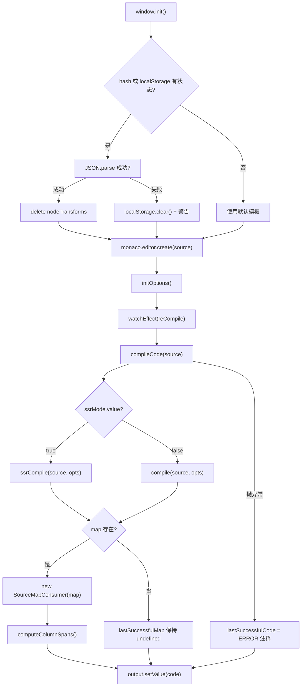
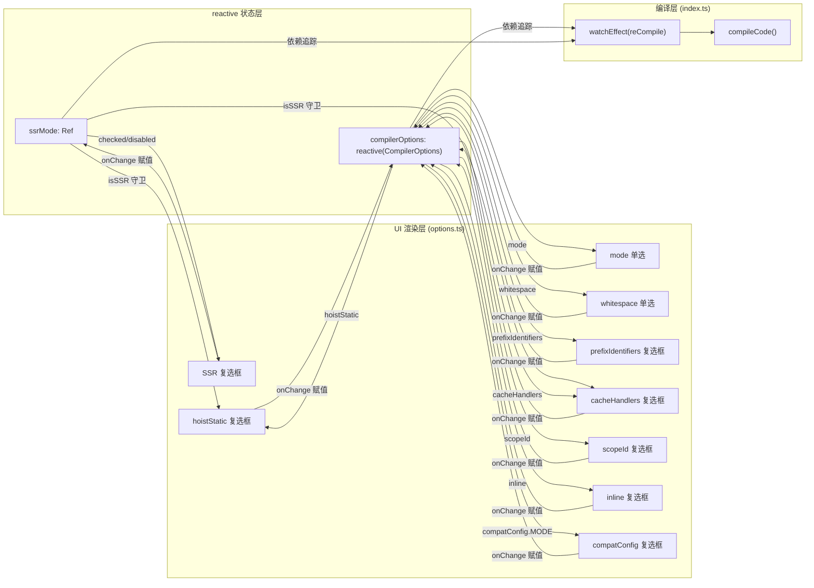

# 第 8 章：运行时核心：@vue/runtime-core 的虚拟 DOM 与组件生命周期

上一章我们看到 SFC Playground 如何把「输入 SFC → 浏览器内编译 → 实时预览」整条链路封装成一个黑盒：开发者看到的是最终渲染结果，却看不到编译器在中间做了什么。当模板里写了一个自定义指令、或者把 hoistStatic 打开后产物突然多出一堆 _hoisted_1 变量时，Playground 无法回答「编译器为什么这么生成」。Template Explorer 的定位恰恰相反：它把 @vue/compiler-dom 与 @vue/compiler-ssr 的编译产物、AST、错误标记、以及源码到产物的位置映射全部摊开。它的核心不是「运行」，而是「观察」。本章围绕三个文件展开：index.ts 负责编译调用与 SourceMap 双向映射，options.ts 用 reactive 管理数十个 CompilerOptions 并驱动 UI，theme.ts 定制 Monaco 编辑器主题。

# 一、编译调用与 SourceMap 双向映射：index.ts

## 直觉模型

Template Explorer 的 `index.ts` 像一台「双向翻译机」：左边输入模板，右边输出渲染函数。但它比翻译机多一个能力——当你把光标放在左边某一行，右边会高亮对应的产物；反过来把光标放在右边，左边会高亮对应的模板。若没有 SourceMap 映射，这个工具就退化成两个并排的文本框，开发者只能靠肉眼比对，无法建立「模板第几行 → 产物第几行」的因果链。

## 数据结构与内存布局

`index.ts` 里没有复杂的 Struct，但有几个关键的模块级状态变量，它们决定了整个工具的行为：

`lastSuccessfulCode` 与 `lastSuccessfulMap` 是编译结果的缓存 [FACT:packages-private/template-explorer/src/index.ts:74-75]。前者是字符串，后者是 `SourceMapConsumer | undefined`。注意 `lastSuccessfulMap` 初始为 `undefined`，只有在编译成功且 `map` 存在时才会被赋值 [FACT:packages-private/template-explorer/src/index.ts:99-100]。这个 `undefined` 状态是后续所有光标映射逻辑的守卫条件——如果编译失败，映射功能自动静默失效，而不是抛出异常。

`PersistedState` 接口定义了持久化到 localStorage 与 URL hash 的状态形状 [FACT:packages-private/template-explorer/src/index.ts:26-30]：`src`（模板源码）、`ssr`（是否 SSR 模式）、`options`（编译器选项）。这里有一个关键设计：`options` 的类型是完整的 `CompilerOptions`，但实际持久化时只保存「与默认值不同的项」，这个裁剪逻辑在 `reCompile` 里完成。

`sharedEditorOptions` 是两个编辑器共享的构造选项 [FACT:packages-private/template-explorer/src/index.ts:26-30]：`fontSize: 14`、`scrollBeyondLastLine: false`、`renderWhitespace: 'selection'`、`minimap.enabled: false`。关闭 minimap 是因为模板和产物通常只有几十行，minimap 反而占用横向空间。

## Step-by-Step Walkthrough

**场景：用户打开页面，输入 `
{{ msg }}
`，然后移动光标。**

**第一步：初始化与状态恢复。** `window.init` 是全局入口 [FACT:packages-private/template-explorer/src/index.ts:41]。它首先注册并激活自定义主题 [FACT:packages-private/template-explorer/src/index.ts:44-45]，然后尝试从 URL hash 或 localStorage 恢复状态 [FACT:packages-private/template-explorer/src/index.ts:49-56]。注意这里的解码顺序：先 `atob` 再 `escape`，然后 `decodeURIComponent`。如果 hash 解析失败，会 fallback 到 `localStorage.getItem('state')`，再 fallback 到 `{}`。如果整个 JSON.parse 失败，会清空 localStorage 并打印警告 [FACT:packages-private/template-explorer/src/index.ts:57-64]。

恢复状态后，有一个容易被忽略的细节：`delete persistedState.options?.nodeTransforms` [FACT:packages-private/template-explorer/src/index.ts:69]。注释解释了原因——函数无法被序列化，所以持久化时 `nodeTransforms` 会丢失，恢复时如果残留一个空对象会导致编译器行为异常。这是「持久化不可序列化字段」的经典陷阱。

**第二步：编译核心 `compileCode`。** 这是整个工具的心脏 [FACT:packages-private/template-explorer/src/index.ts:76-106]。它首先 `console.clear()`，然后根据 `ssrMode.value` 选择 `ssrCompile` 或 `compile` [FACT:packages-private/template-explorer/src/index.ts:80]。注意 `compileFn` 的调用参数：展开 `compilerOptions`，强制 `filename: 'ExampleTemplate.vue'`、`sourceMap: true`，并注入 `onError` 回调收集错误 [FACT:packages-private/template-explorer/src/index.ts:82-89]。

这里有一个设计决策：`filename` 被硬编码为 `'ExampleTemplate.vue'`。这个值在后续的 `generatedPositionFor` 调用中必须精确匹配 [FACT:packages-private/template-explorer/src/index.ts:189]，否则 SourceMap 查询会返回空结果。这是一个隐式的契约——两处字符串必须一致，但没有任何类型系统保证。

编译完成后，错误被转换为 Monaco 的 marker 格式并设置到编辑器上 [FACT:packages-private/template-explorer/src/index.ts:91-95]。`formatError` 把 `CompilerError` 的 `loc` 转换为 Monaco 的 `startLineNumber/startColumn/endLineNumber/endColumn` [FACT:packages-private/template-explorer/src/index.ts:108-119]。注意 `errors.filter(e => e.loc)`——只有带位置信息的错误才会被标记，没有 `loc` 的错误（如全局配置错误）只会在控制台输出。

**第三步：SourceMap 的建立。** 编译成功后，`lastSuccessfulMap = new SourceMapConsumer(map!)` [FACT:packages-private/template-explorer/src/index.ts:99]，紧接着调用 `computeColumnSpans()` [FACT:packages-private/template-explorer/src/index.ts:100]。`computeColumnSpans` 是 `source-map-js` 的一个关键 API：它预计算每个映射段的列跨度，使得 `generatedPositionFor` 返回的 `lastColumn` 字段可用。没有这一步，反向映射只能定位到起始列，无法高亮整个 token 范围。

**第四步：双向光标映射。** 当用户在**源码编辑器**移动光标时，触发 `editor.onDidChangeCursorPosition` [FACT:packages-private/template-explorer/src/index.ts:184]。回调经过 100ms debounce 后，调用 `lastSuccessfulMap.generatedPositionFor({ source: 'ExampleTemplate.vue', line, column: column - 1 })` [FACT:packages-private/template-explorer/src/index.ts:188-192]。注意 `column - 1`：Monaco 的列号从 1 开始，而 SourceMap 的列号从 0 开始。返回的 `pos` 如果有 `line` 和 `column`，就在输出编辑器上创建一个装饰器高亮对应范围 [FACT:packages-private/template-explorer/src/index.ts:194-206]，并滚动到该位置 [FACT:packages-private/template-explorer/src/index.ts:207-210]。

反向映射在 `output.onDidChangeCursorPosition` 中 [FACT:packages-private/template-explorer/src/index.ts:223]。它调用 `originalPositionFor` [FACT:packages-private/template-explorer/src/index.ts:227-230]，但多了一个守卫：忽略 `pos.line === 1 && pos.column === 0` 的「mock location」[FACT:packages-private/template-explorer/src/index.ts:231-237]。这个守卫非常关键——编译器生成的某些代码（如 `import` 语句或 helper 函数）没有对应的模板位置，SourceMap 会返回 `{ line: 1, column: 0 }` 作为占位。如果不忽略，光标放在这些行上会错误地高亮模板第一行。

**第五步：状态持久化。** `reCompile` 不仅触发编译，还负责把当前状态写入 localStorage 和 URL hash [FACT:packages-private/template-explorer/src/index.ts:121-146]。持久化时有一个裁剪逻辑：遍历 `compilerOptions`，只保存「非对象且不等于默认值」的项 [FACT:packages-private/template-explorer/src/index.ts:125-133]。这解释了为什么 `bindingMetadata` 这种对象类型的选项不会被持久化——它太复杂，且默认值已经足够演示。

## 设计思考与生产踩坑

**为什么用 `source-map-js` 而不是 `source-map`？** `source-map` 是 Mozilla 的原版库，体积大且依赖 WASM（新版本）。`source-map-js` 是纯 JS 实现，体积小，适合浏览器环境。Template Explorer 作为纯前端工具，选择 `source-map-js` 是合理的 [FACT:packages-private/template-explorer/package.json:15]。

**debounce 的延迟选择。** 源码编辑器的 debounce 默认 300ms [FACT:packages-private/template-explorer/src/index.ts:271]，而光标移动的 debounce 是 100ms [FACT:packages-private/template-explorer/src/index.ts:215]。这个差异是有意的：编译是重操作，300ms 避免频繁触发；光标移动是轻操作，100ms 保证响应感。但 100ms 仍然可能导致快速移动光标时的高亮闪烁——这是可接受的权衡。

**`window.init` 的全局挂载。** 注意 `window.init` 和 `window.monaco` 都挂在全局 [FACT:packages-private/template-explorer/src/index.ts:19-23]。这是因为 Monaco 编辑器通过 CDN 的 `loader.js` 异步加载，加载完成后调用 `window.init`。这种「全局回调」模式是 Monaco 在非模块化环境下的标准用法，但与现代 ESM 构建方式格格不入。

---

# 二、reactive 驱动的选项面板：options.ts

## 直觉模型

`options.ts` 像一个「控制台面板」：上面有十几个开关和单选按钮，每个都对应编译器的一个行为。拨动任何一个开关，右边的编译产物立刻变化。若没有这个模块，开发者只能改源码里的 `compile` 调用参数再重新编译，无法实时对比不同选项的效果。

## 数据结构与内存布局

`options.ts` 的核心是三个导出：

`ssrMode` 是一个 `ref(false)` [FACT:packages-private/template-explorer/src/options.ts:5]。它独立于 `compilerOptions`，因为 SSR 模式切换的是编译函数本身（`compile` vs `ssrCompile`），而不是编译选项。

`defaultOptions` 是一个完整的 `CompilerOptions` 对象 [FACT:packages-private/template-explorer/src/options.ts:5-27]。它定义了所有选项的默认值，包括 `mode: 'module'`、`prefixIdentifiers: false`、`hoistStatic: false`、`cacheHandlers: false`、`scopeId: null`、`inline: false`、`ssrCssVars: '{ color }'`、`compatConfig: { MODE: 3 }`、`whitespace: 'condense'`，以及一个包含 7 个绑定类型的 `bindingMetadata` [FACT:packages-private/template-explorer/src/options.ts:18-26]。

`compilerOptions` 是 `reactive(Object.assign({}, defaultOptions))` [FACT:packages-private/template-explorer/src/options.ts:29-31]。注意这里用了 `Object.assign({}, ...)` 做浅拷贝——如果直接 `reactive(defaultOptions)`，修改 `compilerOptions` 会污染 `defaultOptions`，导致 `reCompile` 里的「与默认值比较」逻辑失效。

## Step-by-Step Walkthrough

**场景：用户点击「hoistStatic」复选框。**

**第一步：UI 渲染。** `App` 组件的 `setup` 返回一个渲染函数 [FACT:packages-private/template-explorer/src/options.ts:33-35]。这个渲染函数读取 `ssrMode.value`、`compilerOptions.mode`、`compilerOptions.prefixIdentifiers` 等响应式状态 [FACT:packages-private/template-explorer/src/options.ts:36-39]，因此当这些状态变化时，整个 UI 会重新渲染。

**第二步：复选框的 checked 绑定。** `hoistStatic` 复选框的 `checked` 属性是 `compilerOptions.hoistStatic && !isSSR` [FACT:packages-private/template-explorer/src/options.ts:150]。这里有一个逻辑：SSR 模式下 `hoistStatic` 被强制显示为未选中，因为 SSR 编译不支持静态提升。同时 `disabled: isSSR` [FACT:packages-private/template-explorer/src/options.ts:151] 确保用户无法在 SSR 模式下切换它。

**第三步：onChange 处理。** 当用户点击复选框时，`onChange` 触发 [FACT:packages-private/template-explorer/src/options.ts:152-156]，直接把 `e.target.checked` 赋给 `compilerOptions.hoistStatic`。由于 `compilerOptions` 是 `reactive` 的，这个赋值会触发依赖追踪，进而触发 `watchEffect(reCompile)` [FACT:packages-private/template-explorer/src/index.ts:266]，最终重新编译。

**第四步：选项间的联动。** 注意 `cacheHandlers` 的 `checked` 是 `usePrefix && compilerOptions.cacheHandlers && !isSSR` [FACT:packages-private/template-explorer/src/options.ts:166]，`disabled` 是 `!usePrefix || isSSR` [FACT:packages-private/template-explorer/src/options.ts:167]。这意味着 `cacheHandlers` 依赖 `prefixIdentifiers` 或 `mode === 'module'`。这种联动关系在 UI 上表现为：当 `prefixIdentifiers` 未开启且模式为 `function` 时，`cacheHandlers` 复选框是禁用的。

`scopeId` 的联动更复杂：`disabled: !isModule` [FACT:packages-private/template-explorer/src/options.ts:182]，`checked: isModule && compilerOptions.scopeId` [FACT:packages-private/template-explorer/src/options.ts:183]。只有 module 模式下才能设置 scopeId，且 onChange 时如果 `isModule` 为 false，会强制设为 `null` [FACT:packages-private/template-explorer/src/options.ts:184-189]。

**第五步：挂载。** `initOptions` 调用 `createApp(App).mount(document.getElementById('header')!)` [FACT:packages-private/template-explorer/src/options.ts:232-234]。注意这里用的是 `vue` 包的 `createApp`，而不是 `@vue/runtime-dom`——因为 `options.ts` 是应用层代码，可以直接依赖完整的 `vue` 包。

## 设计思考与生产踩坑

**为什么用 `reactive` 而不是 `ref`？** `compilerOptions` 是一个包含十几个字段的对象，用 `reactive` 可以直接 `compilerOptions.hoistStatic = true`，而不需要 `compilerOptions.value.hoistStatic = true`。这在 UI 代码中更简洁。但 `reactive` 的代价是解构会丢失响应性——源码中没有任何解构，全部通过 `compilerOptions.xxx` 访问，这是正确的用法。

**`bindingMetadata` 的默认值设计。** 默认值包含 7 个绑定 [FACT:packages-private/template-explorer/src/options.ts:18-26]，覆盖了 `SETUP_CONST`、`SETUP_REF`、`SETUP_LET`、`SETUP_MAYBE_REF`、`PROPS` 五种类型。这是为了让开发者打开 `prefixIdentifiers` 后能立刻看到不同绑定类型对产物中 `$setup` 访问方式的影响。如果没有这个默认值，`prefixIdentifiers` 的效果会非常单调。

**`compatConfig` 的嵌套响应性。** `compilerOptions.compatConfig!.MODE = 2` [FACT:packages-private/template-explorer/src/options.ts:216-220] 这种嵌套赋值在 `reactive` 下是响应式的，因为 `reactive` 会递归代理嵌套对象。但注意 `compatConfig` 的类型是 `CompatConfig | undefined`，所以用了 `!` 断言。如果默认值里没有 `compatConfig`，这里会运行时崩溃。

**`ssrMode` 与 `compilerOptions` 的职责分离。** `ssrMode` 是 `ref`，`compilerOptions` 是 `reactive`。为什么不把 `ssr` 放进 `compilerOptions`？因为 `ssr` 不是 `CompilerOptions` 的字段——它决定用哪个编译函数，而不是传给编译函数的参数。这种「控制流状态」与「配置状态」的分离是清晰的设计。

---

# 三、Monaco 主题定制：theme.ts

## 直觉模型

`theme.ts` 像给编辑器「换一套皮肤」：它定义了每种语法 token 的颜色和字体样式。若没有这个模块，Monaco 会使用默认的 `vs-dark` 主题，虽然能用，但 Vue 模板中的 HTML 标签、表达式、指令会缺乏视觉区分，开发者难以快速定位关键部分。

## 数据结构与内存布局

`theme.ts` 导出一个符合 Monaco `IStandaloneThemeData` 接口的对象 [FACT:packages-private/template-explorer/src/theme.ts:1-244]。它有三个顶层字段：

`base: 'vs-dark'` 指定基础主题 [FACT:packages-private/template-explorer/src/theme.ts:2]，`inherit: true` 表示继承基础主题的规则 [FACT:packages-private/template-explorer/src/theme.ts:3]。这意味着只需要定义差异部分，未定义的 token 会 fallback 到 `vs-dark`。

`rules` 是一个数组，每个元素包含 `token`（Monaco 的 token 名称）和 `foreground`/`background`/`fontStyle` [FACT:packages-private/template-explorer/src/theme.ts:4-235]。这个数组有 50 多个条目，覆盖了 number、comment、keyword、string、variable、entity.name.tag 等 token 类型。

`colors` 定义了编辑器 UI 的颜色 [FACT:packages-private/template-explorer/src/theme.ts:236-243]：`editor.foreground`、`editor.background`、`editor.selectionBackground`、`editor.lineHighlightBackground`、`editorCursor.foreground`、`editorWhitespace.foreground`。

## Step-by-Step Walkthrough

**场景：页面加载时注册主题。**

**第一步：定义主题。** `monaco.editor.defineTheme('my-theme', theme)` [FACT:packages-private/template-explorer/src/index.ts:44]。这个调用把 `theme.ts` 的导出对象注册到 Monaco 的主题注册表中，键名为 `'my-theme'`。

**第二步：激活主题。** `monaco.editor.setTheme('my-theme')` [FACT:packages-private/template-explorer/src/index.ts:45]。这行代码必须在 `defineTheme` 之后调用，否则会抛出「主题未定义」错误。

**第三步：token 匹配。** 当 Monaco 渲染模板代码时，它会用 HTML 语言服务对代码进行 tokenize，然后按 token 名称查找 `rules` 中的规则。例如 `
` 中的 `div` 会被标记为 `entity.name.tag`，匹配到 `foreground: 'cc6666'` [FACT:packages-private/template-explorer/src/theme.ts:41-44]，显示为红色。

## 设计思考与生产踩坑

**为什么用 `inherit: true`？** 如果不继承，需要定义所有 token 的颜色，包括那些模板中不出现的（如 `markup.heading`、`meta.diff`）。继承让主题文件只需要关注模板和 JS 产物中实际出现的 token。

**token 名称的层级匹配。** Monaco 的 token 匹配是前缀匹配的：`entity.name.tag` 会匹配 `entity.name.tag.html`、`entity.name.tag.css` 等。源码中同时定义了 `entity.name.tag` [FACT:packages-private/template-explorer/src/theme.ts:41-44] 和 `entity.name.tag.css` [FACT:packages-private/template-explorer/src/theme.ts:169-172]，后者会覆盖前者的 CSS 特定场景。

**`colors` 与 `rules` 的分工。** `rules` 控制代码文本的颜色，`colors` 控制编辑器 UI（背景、光标、选中行）的颜色。两者独立，但需要视觉协调。源码中的 `editor.background: '#1D1F21'` 与 `base: 'vs-dark'` 的默认背景接近，这是为了保持视觉一致性。

---

# 设计思考：可视化探针的工程取舍

Template Explorer 与 SFC Playground 的核心差异在于「观察粒度」。Playground 观察的是「整段 SFC 编译后能否运行」，Template Explorer 观察的是「单个模板表达式被编译成什么」。这种差异决定了两个工具的技术选型：

**SourceMapConsumer 的引入是必然的。** 没有它，开发者只能靠肉眼比对源码和产物，无法建立精确的「第几行 → 第几行」映射。但 SourceMapConsumer 的 API 是异步的（新版本返回 Promise），源码中使用的是同步版本 `source-map-js`，这是为了简化调用逻辑。

**`reactive` 管理选项是 Vue 生态的自然选择。** 如果用原生 DOM 事件手动管理十几个选项的状态同步，代码量会翻倍。`reactive` 的依赖追踪让「选项变化 → 重新编译」这条链路自动化，`watchEffect(reCompile)` 一行代码就完成了订阅。

**Monaco 的全局加载模式是历史包袱。** `window.monaco` 和 `window.init` 的全局挂载方式源于 Monaco 的 AMD 加载器设计。在现代 ESM 构建中，这显得格格不入，但 Monaco 的体积（约 5MB）使得按需加载仍然是必要的。

---

# 本章小结

Template Explorer 是一个「白盒探针」：它不运行编译产物，只展示编译过程。`index.ts` 通过 `compileCode` 调用 `@vue/compiler-dom` 或 `@vue/compiler-ssr`，用 `SourceMapConsumer` 建立源码与产物的双向映射，通过 Monaco 的装饰器 API 实现光标联动高亮。`options.ts` 用 `reactive` 管理 `CompilerOptions`，通过 `watchEffect` 驱动重新编译，选项间的联动关系（如 SSR 禁用 `hoistStatic`）在 UI 层显式编码。`theme.ts` 定制 Monaco 主题，让模板和产物的语法 token 有清晰的视觉区分。

这个工具的核心价值在于「用工具反推编译器行为」：当你不确定 `hoistStatic` 对某个模板做了什么，打开 Template Explorer，切换选项，观察产物变化。这比阅读编译器源码更直观，比猜测更可靠。

# 本章思考与自测

Q1: 如果将 `index.ts` 中 `originalPositionFor` 的 mock location 守卫（`pos.line === 1 && pos.column === 0`）删除，在什么场景下会导致错误高亮？为什么编译器会生成 `{ line: 1, column: 0 }` 这样的映射？

**参考解析**：守卫位于 [FACT:packages-private/template-explorer/src/index.ts:231-237]。编译器在生成产物时会插入一些没有模板对应位置的代码，例如 `import { createElementVNode as _createElementVNode } from 'vue'` 这样的 helper 导入语句，或者 `export function render(_ctx, _cache) { ... }` 这样的函数签名。这些代码在 SourceMap 中没有原始位置，`source-map-js` 会返回 `{ line: 1, column: 0 }` 作为占位。如果删除守卫，当用户把光标放在这些行上时，`originalPositionFor` 返回 `{ line: 1, column: 0 }`，代码会认为这是一个有效位置，进而在源码编辑器第一行第一列创建高亮装饰器。结果是：用户点击产物的 `import` 行，源码编辑器的第一行被错误高亮，产生误导。这个守卫的本质是「区分真实映射与占位映射」，而 `{ line: 1, column: 0 }` 是 `source-map-js` 约定的「无映射」哨兵值。

Q2: `reCompile` 中持久化选项时，条件 `typeof val !== 'object' && val !== defaultOptions[key]` 会跳过所有对象类型的选项。如果 `bindingMetadata` 被用户修改（例如通过控制台），刷新页面后这个修改会丢失。这是 bug 还是有意设计？如果要在持久化中支持 `bindingMetadata`，需要解决什么问题？

**参考解析**：条件位于 [FACT:packages-private/template-explorer/src/index.ts:129]。这是有意设计，原因有三：第一，`bindingMetadata` 的值是 `BindingTypes` 枚举，序列化后是数字，反序列化时无法区分「用户显式设置为 0」和「默认值」；第二，`compatConfig` 是嵌套对象，`val !== defaultOptions[key]` 比较的是引用，永远为 true，会导致所有对象选项都被持久化；第三，`nodeTransforms` 包含函数，无法序列化，源码中已经通过 `delete persistedState.options?.nodeTransforms` 处理 [FACT:packages-private/template-explorer/src/index.ts:69]。如果要支持 `bindingMetadata`，需要实现深比较（而非引用比较），并且需要处理枚举值的序列化/反序列化。更根本的问题是：`bindingMetadata` 在 UI 上没有编辑入口，用户只能通过控制台修改，这种修改本身就不应该被持久化。

Q3: `options.ts` 中 `compilerOptions` 用 `reactive(Object.assign({}, defaultOptions))` 创建。如果将 `Object.assign({}, defaultOptions)` 改为直接 `reactive(defaultOptions)`，在用户切换选项后刷新页面，会发生什么？为什么？

**参考解析**：`Object.assign({}, defaultOptions)` 是浅拷贝，位于 [FACT:packages-private/template-explorer/src/options.ts:29-31]。如果改为 `reactive(defaultOptions)`，`compilerOptions` 和 `defaultOptions` 会指向同一个对象。当用户切换 `hoistStatic` 为 true 时，`compilerOptions.hoistStatic` 变为 true，同时 `defaultOptions.hoistStatic` 也变为 true。然后 `reCompile` 中的持久化逻辑 [FACT:packages-private/template-explorer/src/index.ts:129] 会比较 `val !== defaultOptions[key]`，此时 `val` 和 `defaultOptions[key]` 都是 true，条件为 false，该选项不会被保存到 localStorage。刷新页面后，`defaultOptions` 被重新初始化为 `hoistStatic: false`，用户的修改丢失。更严重的是，`defaultOptions` 被污染后，后续所有「与默认值比较」的逻辑都会失效，导致持久化功能完全崩溃。这个 bug 的隐蔽性在于：单次会话内一切正常，只有刷新后才能发现。

---

下一章将进入 `scripts/release.js`，看 Vue 如何用一个交互式状态机编排版本号更新、构建、测试、Git 提交、打 tag 与 npm publish 的全流程。与 Template Explorer 的「观察」不同，release.js 是「执行」——它需要在多个步骤间维护状态，处理失败回滚，并在交互式确认与自动化之间取得平衡。

通过 Template Explorer，我们掌握了如何将编译器内部状态——AST、编译产物、SourceMap——转化为可交互的可视化探针，从而把「编译器为什么这么生成」从猜测变成观察。这种对内部状态的精确控制与编排，同样体现在 Vue 的发布流程中：下一章将深入 scripts/release.js，看一个 500 余行的状态机如何用 parseArgs 解析十余个标志位、通过 enquirer 交互确认版本号，并按顺序触发构建、测试、Git 提交、打 tag 与 npm publish，揭示一次正式发版背后完整的状态流转与失败回滚策略。
