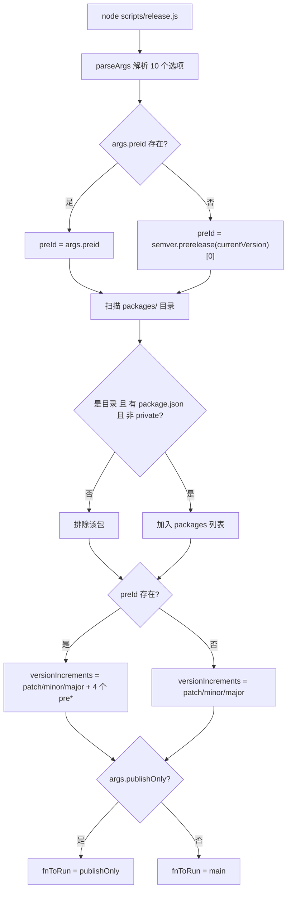
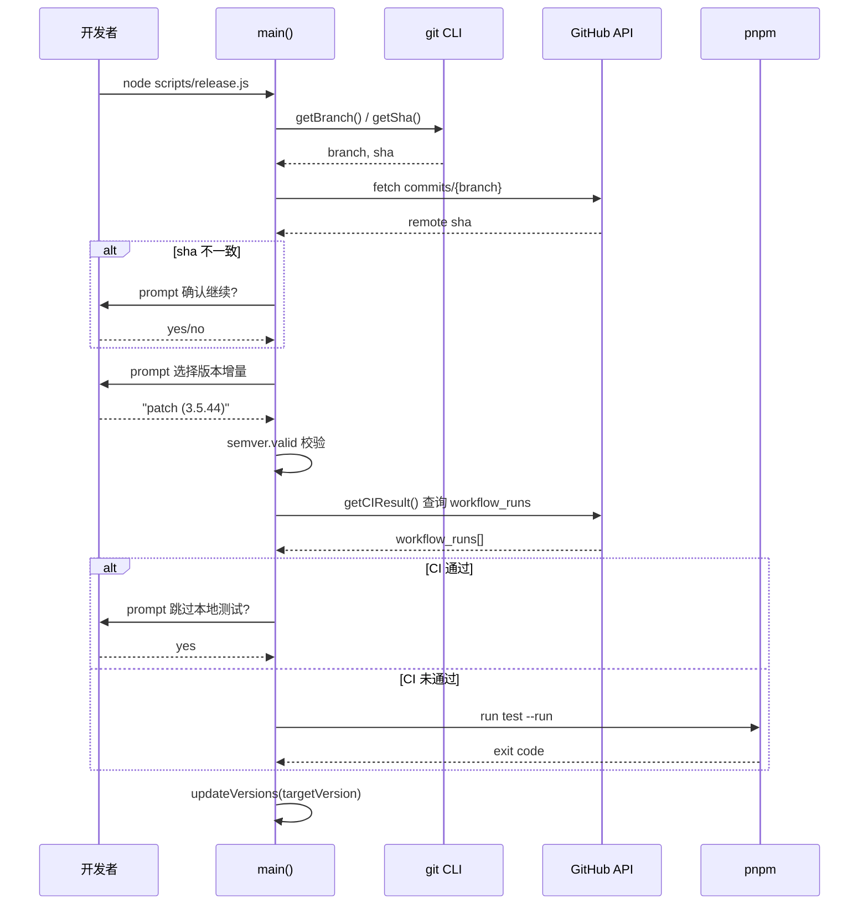
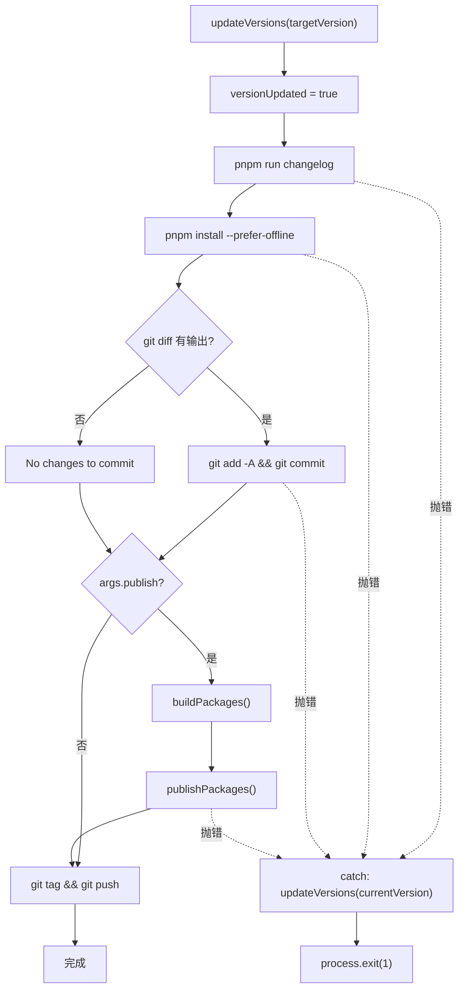

# 第 9 章：编译器核心：@vue/compiler-core 的 AST 转换与代码生成

上一章我们借助 template-explorer 反推编译器行为，掌握了用工具观察内部机制的方法论。现在，我们把视线从编译时转向发布时——这是每个开源项目最危险的时刻：它同时触碰版本号、构建产物、Git 历史与 npm registry 四个不可逆的外部系统。一次错误的 npm publish 无法撤回，一次错误的 tag 推送会污染所有下游用户的依赖解析。Vue core 用一个 537 行的 scripts/release.js 来驯服这种危险——它既不是纯粹的自动化脚本，也不是纯粹的手动清单，而是一个交互式状态机：在关键节点停下来问人，在可预测的节点全自动执行，并在任何一步失败时把版本号回滚到起点。本章将拆解这个编排器的三个核心机制：参数解析与状态初始化、交互式版本决策与 CI 门禁、以及发布顺序与失败回滚。

# 参数解析与全局状态初始化

## 直觉模型

把 `release.js` 想象成一台老式洗衣机的控制面板：旋钮（`parseArgs`）决定用哪种模式，指示灯（全局变量）记录当前处于哪个阶段，而「取消」按钮（错误处理）必须能把机器恢复到进水前的状态。若没有这套初始化逻辑，脚本就会在「用户到底想发什么版本」这个问题上失控——要么发错版本号，要么在 CI 里卡死等待一个永远不会到来的键盘输入。

## 标志位与全局状态的内存布局

> **〔设计推断与架构权衡〕**
> 脚本启动后的第一件事是把命令行参数解析成一个结构化对象。这里用的是 Node 内置的 `parseArgs`，而非 `yargs` 或 `commander`—— 这是为了消除第三方依赖，因为发布脚本本身必须在任何环境下都能跑起来，哪怕 `node_modules` 装了一半。

[FACT:scripts/release.js:27-62](https://github.com/vuejs/core/blob/4ab865a848a1da3d10fb674f857e5fff13094644/scripts/release.js#L27-L62) 定义了 10 个选项，可分为四类：

- **版本语义类**：`preid`（预发布标识符，如 `alpha`/`beta`/`rc`）、`tag`（npm dist-tag）
- **跳过类**：`skipBuild`、`skipTests`、`skipGit`、`skipPrompts`——这四个布尔开关构成了「自动化程度」的调节旋钮
- **执行模式类**：`dry`（空跑）、`publish`（是否在本地直接发布）、`publishOnly`（只发布不更新版本）
- **目标类**：`registry`（自定义 registry 地址）

注意 `publish` 的默认值是 `false` [FACT:scripts/release.js:51-54](https://github.com/vuejs/core/blob/4ab865a848a1da3d10fb674f857e5fff13094644/scripts/release.js#L51-L54)，而其他布尔项没有默认值（即 `undefined`）。这个不对称是刻意的：`publish` 的语义是「是否在本地执行 npm publish」，默认不发布，把发布动作交给 GitHub Actions；而 `skipXxx` 默认 `undefined` 意味着「未指定」，后续逻辑会区分「用户显式传了 `--skipTests`」和「用户没传」。

解析完成后，脚本把参数摊平到一组模块级变量上 [FACT:scripts/release.js:64-66](https://github.com/vuejs/core/blob/4ab865a848a1da3d10fb674f857e5fff13094644/scripts/release.js#L64-L66)：

```js
const preId = args.preid || semver.prerelease(currentVersion)?.[0]
const isDryRun = args.dry
let skipTests = args.skipTests
const skipBuild = args.skipBuild
const skipPrompts = args.skipPrompts
const skipGit = args.skipGit
```

这里有两处值得玩味的设计。第一，`preId` 的取值优先级是「命令行显式指定 > 从当前版本号推断」[FACT:scripts/release.js:64-66](https://github.com/vuejs/core/blob/4ab865a848a1da3d10fb674f857e5fff13094644/scripts/release.js#L64-L66)。如果当前 `package.json` 的版本是 `3.5.0-beta.1`，那么 `semver.prerelease` 会返回 `['beta', 1]`，取 `[0]` 得到 `'beta'`。这意味着在 beta 分支上连续发版时，不需要每次都敲 `--preid beta`。第二，`skipTests` 用 `let` 声明而其他用 `const` [FACT:scripts/release.js:64-66](https://github.com/vuejs/core/blob/4ab865a848a1da3d10fb674f857e5fff13094644/scripts/release.js#L64-L66)，因为它在 `runTestsIfNeeded` 中会被 CI 结果动态改写——这是一个「延迟决策」的状态位。

紧接着是包发现逻辑 [FACT:scripts/release.js:68-83](https://github.com/vuejs/core/blob/4ab865a848a1da3d10fb674f857e5fff13094644/scripts/release.js#L68-L83)：读取 `packages/` 目录，过滤掉非目录项、没有 `package.json` 的项，以及 `private: true` 的包。注意这里读的是 `packages/` 而非 `packages-private/`——后者是内部调试包，永不发布。

## 发布顺序的排序算法

[FACT:scripts/release.js:85-85](https://github.com/vuejs/core/blob/4ab865a848a1da3d10fb674f857e5fff13094644/scripts/release.js#L85-L85) 定义了一个看似简单却至关重要的函数：

```js
const sortPackagesForPublishing = (packageNames) => [
  ...packageNames.filter(p => p !== 'vue'),
  ...packageNames.filter(p => p === 'vue'),
]
```

它把 `vue` 这个入口包排到最后。注释 [FACT:scripts/release.js:85-85](https://github.com/vuejs/core/blob/4ab865a848a1da3d10fb674f857e5fff13094644/scripts/release.js#L85-L85) 解释了原因：如果先发布 `vue`，用户在 `@vue/runtime-core` 等内部包还没上线时就能安装到新版 `vue`，npm 会因找不到匹配的内部依赖而报错。这是「发布原子性」在 npm 生态下的妥协方案——npm 没有跨包事务，只能靠顺序来逼近原子性。

## 版本增量候选集的动态构造

[FACT:scripts/release.js:111-116](https://github.com/vuejs/core/blob/4ab865a848a1da3d10fb674f857e5fff13094644/scripts/release.js#L111-L116) 构造了交互式菜单的候选项：

```js
const versionIncrements = [
  'patch', 'minor', 'major',
  ...(preId ? ['prepatch', 'preminor', 'premajor', 'prerelease'] : []),
]
```

这是一个条件展开：只有在 `preId` 存在时（即当前处于预发布通道，或用户显式指定了 `--preid`），才把预发布相关的增量类型加入菜单。若当前是稳定版 `3.5.43` 且未指定 `preid`，菜单就只有 `patch/minor/major` 三项——避免用户误操作把稳定版变成 `3.5.44-0` 这种半吊子预发布版本。

`inc` 函数 [FACT:scripts/release.js:120-120](https://github.com/vuejs/core/blob/4ab865a848a1da3d10fb674f857e5fff13094644/scripts/release.js#L120-L120) 封装了 `semver.inc`，把 `preId` 作为第三个参数传入。这里有个类型防御：`typeof preId === 'string' ? preId : undefined`——因为 `preId` 可能是 `string | undefined`，而 `semver.inc` 期望 `string | undefined`，这个三元表达式是为了满足 TS 的类型收窄。

## 执行原语：run 与 dryRun 的双轨制

[FACT:scripts/release.js:122-123](https://github.com/vuejs/core/blob/4ab865a848a1da3d10fb674f857e5fff13094644/scripts/release.js#L122-L123) 是整章最精妙的设计之一：

```js
const run = async (bin, args, opts = {}) =>
  exec(bin, args, { stdio: 'inherit', ...opts })
const dryRun = async (bin, args, opts = {}) =>
  console.log(pico.blue(`[dryrun] ${bin} ${args.join(' ')}`), opts)
const runIfNotDry = isDryRun ? dryRun : run
```

`run` 把子进程的 stdio 设为 `inherit`，让构建/测试的输出直接透传到终端——这对长时间运行的构建至关重要，用户能看到实时进度。`dryRun` 则只打印命令不执行。`runIfNotDry` 是一个「策略选择」：在模块加载时就把函数指针绑定到 `dryRun` 或 `run`，后续所有调用点无需再判断 `isDryRun`。

> **〔设计推断与架构权衡〕**
> 这种「在初始化时决定策略」的模式比「在每个调用点判断」更不易出错：如果某个调用点忘了判断 `isDryRun`，在 dry run 模式下就会真的执行副作用。而 `runIfNotDry` 把判断集中到一处，消除了这类遗漏的可能。



---

# 交互式版本决策与 CI 门禁

## 直觉模型

这一阶段像机场安检：先核对你的登机牌（本地 commit 是否与远端同步），再确认你要去哪（版本号），最后检查你是否已通过安检（CI 是否通过）。任何一环不通过，整个流程就中止。若没有这道门禁，一个未推送的本地 commit 可能被打上 tag 并发布，导致 npm 上的版本对应的源码在 GitHub 上根本不存在——这是最难以排查的发布事故。

## 同步检查与版本选择

`main` 函数的第一件事是 `isInSyncWithRemote()` [FACT:scripts/release.js:141-141](https://github.com/vuejs/core/blob/4ab865a848a1da3d10fb674f857e5fff13094644/scripts/release.js#L141-L141)。这个函数 [FACT:scripts/release.js:337-363](https://github.com/vuejs/core/blob/4ab865a848a1da3d10fb674f857e5fff13094644/scripts/release.js#L337-L363) 的逻辑是：取当前分支名，请求 GitHub API 获取该分支的最新 commit SHA，与本地 `git rev-parse HEAD` 比对。若不一致，弹出一个红色警告的确认框 [FACT:scripts/release.js:348-355](https://github.com/vuejs/core/blob/4ab865a848a1da3d10fb674f857e5fff13094644/scripts/release.js#L348-L355)，让用户决定是否继续。若 API 请求失败（网络问题、无 token），则直接返回 `false` 并终止 [FACT:scripts/release.js:365-367](https://github.com/vuejs/core/blob/4ab865a848a1da3d10fb674f857e5fff13094644/scripts/release.js#L365-L367)。

> **〔设计推断与架构权衡〕**
> 这里的设计哲学是「失败即中止」：网络异常时宁可不让发布，也不冒险在状态未知的情况下继续。因为发布是不可逆的，而重跑一次脚本的成本很低。

版本号的确定分两条路径。若用户在命令行传了位置参数（如 `node scripts/release.js 3.6.0`），`targetVersion` 直接取该值 [FACT:scripts/release.js:141-141](https://github.com/vuejs/core/blob/4ab865a848a1da3d10fb674f857e5fff13094644/scripts/release.js#L141-L141)。否则进入交互式菜单 [FACT:scripts/release.js:152-176](https://github.com/vuejs/core/blob/4ab865a848a1da3d10fb674f857e5fff13094644/scripts/release.js#L152-L176)：先让用户选增量类型，若选 `custom` 则再弹一个输入框让用户手填版本号。

注意 [FACT:scripts/release.js:174](https://github.com/vuejs/core/blob/4ab865a848a1da3d10fb674f857e5fff13094644/scripts/release.js#L174) 这一行：

```js
targetVersion = release.match(/\((.*)\)/)?.[1] ?? ''
```

菜单项的格式是 `patch (3.5.44)`，这行正则从括号里提取出实际版本号。如果用户选了 `custom`，走的是另一条分支 [FACT:scripts/release.js:164-172](https://github.com/vuejs/core/blob/4ab865a848a1da3d10fb674f857e5fff13094644/scripts/release.js#L164-L172)。

随后有一个「二次解析」逻辑 [FACT:scripts/release.js:178-182](https://github.com/vuejs/core/blob/4ab865a848a1da3d10fb674f857e5fff13094644/scripts/release.js#L178-L182)：如果 `targetVersion` 恰好是 `patch`/`minor` 这类增量关键字（用户可能直接传 `node release.js minor`），就调用 `inc` 把它转成具体版本号。最后用 `semver.valid` 校验 [FACT:scripts/release.js:184-186](https://github.com/vuejs/core/blob/4ab865a848a1da3d10fb674f857e5fff13094644/scripts/release.js#L184-L186)，非法版本号直接抛错。

## CI 门禁：runTestsIfNeeded 的三态逻辑

这是全章最复杂的控制流。[FACT:scripts/release.js:281-317](https://github.com/vuejs/core/blob/4ab865a848a1da3d10fb674f857e5fff13094644/scripts/release.js#L281-L317) 的 `runTestsIfNeeded` 实际上是一个三态决策机：

**状态一：用户显式传了 `--skipTests`**。`skipTests` 初始为 `true`，直接跳过整个函数体，打印 "Tests skipped." [FACT:scripts/release.js:314-316](https://github.com/vuejs/core/blob/4ab865a848a1da3d10fb674f857e5fff13094644/scripts/release.js#L314-L316)。

**状态二：未跳过，且 CI 已通过**。脚本调用 `getCIResult()` [FACT:scripts/release.js:319-335](https://github.com/vuejs/core/blob/4ab865a848a1da3d10fb674f857e5fff13094644/scripts/release.js#L319-L335)，它请求 GitHub Actions API，检查是否存在名为 `ci` 且 `conclusion === 'success'` 的 workflow run [FACT:scripts/release.js:319-335](https://github.com/vuejs/core/blob/4ab865a848a1da3d10fb674f857e5fff13094644/scripts/release.js#L319-L335)。若通过，则询问用户「CI 已通过，是否跳过本地测试？」[FACT:scripts/release.js:288-295](https://github.com/vuejs/core/blob/4ab865a848a1da3d10fb674f857e5fff13094644/scripts/release.js#L288-L295)。若用户开了 `--skipPrompts`，则自动跳过本地测试 [FACT:scripts/release.js:296-298](https://github.com/vuejs/core/blob/4ab865a848a1da3d10fb674f857e5fff13094644/scripts/release.js#L296-L298)。

**状态三：未跳过，且 CI 未通过**。若开了 `--skipPrompts`，直接抛错 [FACT:scripts/release.js:299-304](https://github.com/vuejs/core/blob/4ab865a848a1da3d10fb674f857e5fff13094644/scripts/release.js#L299-L304)：

```js
throw new Error(
  'CI for the latest commit has not passed yet. ' +
    'Only run the release workflow after the CI has passed.',
)
```

若没开 `--skipPrompts`，则 `skipTests` 保持 `undefined`，落到最后的本地测试分支 [FACT:scripts/release.js:307-313](https://github.com/vuejs/core/blob/4ab865a848a1da3d10fb674f857e5fff13094644/scripts/release.js#L307-L313)，执行 `pnpm run test --run`。

这里有个微妙的细节 [FACT:scripts/release.js:285](https://github.com/vuejs/core/blob/4ab865a848a1da3d10fb674f857e5fff13094644/scripts/release.js#L285)：

```js
skipTests ||= isCIPassed
```

`||=` 是逻辑或赋值：只有当 `skipTests` 为假值（`undefined` 或 `false`）时才赋值为 `isCIPassed`。这意味着如果用户显式传了 `--skipTests`（`true`），这行不会改变它；如果用户没传（`undefined`），则把它设为 CI 结果。但紧接着 [FACT:scripts/release.js:287-298](https://github.com/vuejs/core/blob/4ab865a848a1da3d10fb674f857e5fff13094644/scripts/release.js#L287-L298) 又会在 CI 通过时重新赋值——所以 `||=` 这行的实际作用只是「若 CI 未通过，把 `skipTests` 设为 `false`」，从而让后续的 `if (!skipTests)` 分支执行本地测试。

> **〔设计推断与架构权衡〕**
> 这个逻辑绕了一圈，本质是想表达：「CI 通过 → 可以跳过本地测试（但问一下用户）；CI 未通过 → 必须跑本地测试（除非用户明确要求跳过）」。用 `||=` 加后续覆盖的写法虽然紧凑，但可读性不高，是典型的「状态位被多处修改」的代码味道。



## 版本号写入：updateVersions 的遍历

[FACT:scripts/release.js:377-384](https://github.com/vuejs/core/blob/4ab865a848a1da3d10fb674f857e5fff13094644/scripts/release.js#L377-L384) 的 `updateVersions` 做两件事：更新根 `package.json`，再遍历所有子包调用 `updatePackage`。`updatePackage` [FACT:scripts/release.js:391-398](https://github.com/vuejs/core/blob/4ab865a848a1da3d10fb674f857e5fff13094644/scripts/release.js#L391-L398) 读取 JSON、改写 `name` 和 `version`、用 `JSON.stringify(pkg, null, 2) + '\n'` 写回——注意末尾的 `\n`，这是为了保持文件以换行结尾，避免 git diff 显示 "No newline at end of file"。

`getNewPackageName` 参数默认是 `keepThePackageName` [FACT:scripts/release.js:105](https://github.com/vuejs/core/blob/4ab865a848a1da3d10fb674f857e5fff13094644/scripts/release.js#L105)，即不改包名。这个参数的存在是为了支持「发布到自定义 registry 时重命名包」的场景——虽然当前调用点都传默认值，但接口预留了扩展性。

---

# 发布顺序、幂等性与失败回滚

## 直觉模型

这一阶段像多米诺骨牌：`updateVersions` 推倒第一张牌（改版本号），后续的 changelog、lockfile、commit、tag、publish 依次倒下。如果中途某张牌卡住，必须有一套机制把已经倒下的牌扶起来——否则仓库会停留在「版本号已改但没发布」的半吊子状态。

## 幂等发布：isPackagePublished 与错误兜底

> **〔设计推断与架构权衡〕**
> `publishPackage` [FACT:scripts/release.js:439-489](https://github.com/vuejs/core/blob/4ab865a848a1da3d10fb674f857e5fff13094644/scripts/release.js#L439-L489) 是发布的核心。它首先确定 dist-tag [FACT:scripts/release.js:442-451](https://github.com/vuejs/core/blob/4ab865a848a1da3d10fb674f857e5fff13094644/scripts/release.js#L442-L451)：优先用 `--tag` 参数，否则根据版本号中的 `alpha`/`beta`/`rc` 关键字推断。注意这里用的是 `version.includes('alpha')` 而非 `semver.prerelease`—— 因为版本号可能形如 `3.5.0-alpha.1`，`includes` 足够简单且不会误判。

发布前有一道幂等性检查 [FACT:scripts/release.js:453-458](https://github.com/vuejs/core/blob/4ab865a848a1da3d10fb674f857e5fff13094644/scripts/release.js#L453-L458)：

```js
if (!isDryRun && (await isPackagePublished(packageName, version))) {
  console.log(pico.yellow(`Skipping already published: ${pkgVersion}`))
  alreadyPublishedPackages.push(pkgVersion)
  return
}
```

`isPackagePublished` [FACT:scripts/release.js:491-513](https://github.com/vuejs/core/blob/4ab865a848a1da3d10fb674f857e5fff13094644/scripts/release.js#L491-L513) 执行 `npm view <pkg>@<version> version`，若成功返回 `true`，若报 E404 类错误返回 `false`。这个检查的意义在于：发布流程可能因网络中断而重跑，重跑时已发布的包不应再次发布（npm 会拒绝重复版本）。

但检查本身也可能失败——比如 `npm view` 因网络超时抛了非 E404 错误。此时 `isPackagePublished` 会把错误向上抛 [FACT:scripts/release.js:507-510](https://github.com/vuejs/core/blob/4ab865a848a1da3d10fb674f857e5fff13094644/scripts/release.js#L507-L510)，导致整个发布中止。这是「宁可中止也不冒险」的又一体现。

即使检查通过，`pnpm publish` 本身仍可能因竞态（另一个 CI 刚发布了同版本）而失败。所以 `publishPackage` 在 catch 块里做了二次兜底 [FACT:scripts/release.js:480-488](https://github.com/vuejs/core/blob/4ab865a848a1da3d10fb674f857e5fff13094644/scripts/release.js#L480-L488)：

```js
} catch (e) {
  if (e.message?.match(/previously published/)) {
    console.log(pico.red(`Skipping already published: ${pkgVersion}`))
    alreadyPublishedPackages.push(pkgVersion)
  } else {
    throw e
  }
}
```

只有匹配到 `previously published` 才吞掉错误，其他错误一律重抛。这是「精确容错」：只对已知的、可安全忽略的错误做降级处理。

## 发布标志位的动态拼装

[FACT:scripts/release.js:412-432](https://github.com/vuejs/core/blob/4ab865a848a1da3d10fb674f857e5fff13094644/scripts/release.js#L412-L432) 根据运行环境拼装 `pnpm publish` 的附加标志：

```js
const additionalPublishFlags = []
if (isDryRun) additionalPublishFlags.push('--dry-run')
if (isDryRun || skipGit || process.env.CI)
  additionalPublishFlags.push('--no-git-checks')
if (process.env.CI && !args.registry)
  additionalPublishFlags.push('--provenance')
```

`--no-git-checks` 在三种情况下启用：dry run、跳过 git、或在 CI 中。原因是 `pnpm publish` 默认会检查工作区是否干净、当前分支是否是发布分支等，而在 CI 中这些检查会误报。

`--provenance` 只在 CI 且未指定自定义 registry 时启用 [FACT:scripts/release.js:425-427](https://github.com/vuejs/core/blob/4ab865a848a1da3d10fb674f857e5fff13094644/scripts/release.js#L425-L427)。provenance 是 npm 的供应链安全特性，它把构建产物的来源信息（哪个 commit、哪个 workflow）签名后附在包上。但自定义 registry（如内部私有 registry）通常不支持 provenance，所以加了 `!args.registry` 的条件。

## 失败回滚：versionUpdated 标志位

回到 `main` 的末尾 [FACT:scripts/release.js:528-537](https://github.com/vuejs/core/blob/4ab865a848a1da3d10fb674f857e5fff13094644/scripts/release.js#L528-L537)：

```js
fnToRun().catch(err => {
  if (versionUpdated) {
    updateVersions(currentVersion)
  }
  console.error(err)
  process.exit(1)
})
```

`versionUpdated` 是一个模块级布尔量，初始为 `false` [FACT:scripts/release.js:24-27](https://github.com/vuejs/core/blob/4ab865a848a1da3d10fb674f857e5fff13094644/scripts/release.js#L24-L27)，在 `updateVersions` 调用成功后立即置为 `true` [FACT:scripts/release.js:208](https://github.com/vuejs/core/blob/4ab865a848a1da3d10fb674f857e5fff13094644/scripts/release.js#L208)。若后续任何步骤（changelog 生成、lockfile 更新、git commit、publish）抛错，catch 块会检查这个标志位，若为 `true` 则把版本号回滚到 `currentVersion`。

> **〔设计推断与架构权衡〕**
> 这个回滚是「尽力而为」的：它只回滚 `package.json` 中的版本号，不回滚 changelog 文件、不回滚 lockfile、不回滚已经执行的 git commit。如果错误发生在 git commit 之后，仓库里会留下一个「版本号已回滚但 commit 已存在」的中间状态。这是设计上的取舍——完整的回滚需要 `git reset`，而那会破坏用户可能已经做的其他改动。所以脚本选择只回滚最关键的版本号，让用户手动处理其余部分。

注意 `publishOnly` 路径 [FACT:scripts/release.js:519-526](https://github.com/vuejs/core/blob/4ab865a848a1da3d10fb674f857e5fff13094644/scripts/release.js#L519-L526) 不设置 `versionUpdated`，因为它的语义是「只发布，不改版本」——即使失败也无需回滚。但它在 `targetVersion` 存在时会调用 `updateVersions` [FACT:scripts/release.js:519-526](https://github.com/vuejs/core/blob/4ab865a848a1da3d10fb674f857e5fff13094644/scripts/release.js#L519-L526)，此时若失败，版本号不会被回滚。这是一个潜在的边界问题，见章末思考题。



## 发布顺序与 vue 包的特殊处理

`publishPackages` [FACT:scripts/release.js:412-432](https://github.com/vuejs/core/blob/4ab865a848a1da3d10fb674f857e5fff13094644/scripts/release.js#L412-L432) 遍历 `sortPackagesForPublishing(packages)` 的结果，逐个调用 `publishPackage`。由于排序把 `vue` 放最后 [FACT:scripts/release.js:85-85](https://github.com/vuejs/core/blob/4ab865a848a1da3d10fb674f857e5fff13094644/scripts/release.js#L85-L85)，整个发布序列保证了内部包先上线。

`publishPackage` 内部用 `cwd: getPkgRoot(pkgName)` [FACT:scripts/release.js:475](https://github.com/vuejs/core/blob/4ab865a848a1da3d10fb674f857e5fff13094644/scripts/release.js#L475) 把工作目录切到子包目录，这样 `pnpm publish` 发布的是子包而非根包。注释 [FACT:scripts/release.js:462-463](https://github.com/vuejs/core/blob/4ab865a848a1da3d10fb674f857e5fff13094644/scripts/release.js#L462-L463) 特别提醒「不要改成 npm publish」——因为 `pnpm publish` 能正确处理 `workspace:*` 依赖协议，把它转换成实际版本号，而 `npm publish` 会原样保留 `workspace:*` 导致安装失败。

---

# 设计思考

**为什么用 `parseArgs` 而非 `yargs`？** 发布脚本是「最后一道防线」，它必须在任何环境下可执行。第三方 CLI 库若因依赖树损坏而加载失败，整个发布流程就瘫痪了。Node 内置的 `parseArgs` 虽然功能简陋（不支持子命令、不支持自动 help），但零依赖、零风险。

**为什么把 `publish` 默认设为 `false`？** 因为 Vue 的正式发布走 GitHub Actions（见 [FACT:scripts/release.js:256-263](https://github.com/vuejs/core/blob/4ab865a848a1da3d10fb674f857e5fff13094644/scripts/release.js#L256-L263) 的提示信息），本地脚本只负责改版本号、生成 changelog、打 tag、推送。真正的 `npm publish` 在 CI 中执行，这样能利用 CI 的 provenance 签名和受控环境。`--publish` 标志是给维护者在紧急情况下本地发布用的逃生通道。

**为什么回滚只回滚版本号？** 因为完整回滚需要理解「哪些改动是脚本做的、哪些是用户做的」，而这在 git 层面无法区分。脚本选择只回滚它最确定自己改过的东西——`package.json` 的版本号——其余交给用户判断。

---

# 本章小结

`scripts/release.js` 用 537 行代码实现了一个「交互式状态机」，其核心设计可归纳为三点：

1. **参数即策略**：10 个标志位在模块加载时被解析并摊平到全局变量，`runIfNotDry` 在初始化时绑定策略，避免调用点遗漏判断。

2. **门禁前置**：同步检查、版本校验、CI 门禁都在任何副作用发生前完成，确保「要么全做，要么不做」。

3. **精确容错**：`isPackagePublished` 预检 + `previously published` 错误兜底构成双重幂等保护；`versionUpdated` 标志位实现最小化回滚。

这套机制与上一章的 Template Explorer 形成有趣对照：Template Explorer 是「观察」——把编译器内部状态可视化；release.js 是「执行」——把发布流程的每一步状态显式化。两者都体现了同一个工程哲学：**把隐式状态变成显式状态，把不可控的副作用变成可控的步骤**。

# 本章思考与自测

Q1: 若把 [FACT:scripts/release.js:285](https://github.com/vuejs/core/blob/4ab865a848a1da3d10fb674f857e5fff13094644/scripts/release.js#L285) 的 `skipTests ||= isCIPassed` 改为 `skipTests = isCIPassed`，在用户显式传了 `--skipTests` 且 CI 未通过时会发生什么？为什么？

**参考解析**：原逻辑中，用户传 `--skipTests` 时 `skipTests` 初始为 `true` [FACT:scripts/release.js:64-66](https://github.com/vuejs/core/blob/4ab865a848a1da3d10fb674f857e5fff13094644/scripts/release.js#L64-L66)，`||=` 不会改变它，因此 `runTestsIfNeeded` 在 [FACT:scripts/release.js:282](https://github.com/vuejs/core/blob/4ab865a848a1da3d10fb674f857e5fff13094644/scripts/release.js#L282) 的 `if (!skipTests)` 判断为假，直接跳到 [FACT:scripts/release.js:314-316](https://github.com/vuejs/core/blob/4ab865a848a1da3d10fb674f857e5fff13094644/scripts/release.js#L314-L316) 打印 "Tests skipped."。若改为 `skipTests = isCIPassed`，则 `skipTests` 被强制设为 `false`（CI 未通过），随后 [FACT:scripts/release.js:287](https://github.com/vuejs/core/blob/4ab865a848a1da3d10fb674f857e5fff13094644/scripts/release.js#L287) 的 `if (isCIPassed)` 为假，落到 [FACT:scripts/release.js:299](https://github.com/vuejs/core/blob/4ab865a848a1da3d10fb674f857e5fff13094644/scripts/release.js#L299) 的 `else if (skipPrompts)`——若未开 `--skipPrompts`，则 `skipTests` 保持 `false`，最终在 [FACT:scripts/release.js:307-313](https://github.com/vuejs/core/blob/4ab865a848a1da3d10fb674f857e5fff13094644/scripts/release.js#L307-L313) 执行本地测试。这违背了用户「显式跳过测试」的意图，在 CI 环境（`--skipPrompts`）下更会直接抛错 [FACT:scripts/release.js:300-303](https://github.com/vuejs/core/blob/4ab865a848a1da3d10fb674f857e5fff13094644/scripts/release.js#L300-L303)，导致发布中止。`||=` 的存在正是为了尊重用户的显式选择。

Q2: `publishOnly` 路径 [FACT:scripts/release.js:519-526](https://github.com/vuejs/core/blob/4ab865a848a1da3d10fb674f857e5fff13094644/scripts/release.js#L519-L526) 在 `targetVersion` 存在时会调用 `updateVersions`，但它不设置 `versionUpdated`。若此时 `buildPackages` 或 `publishPackages` 抛错，会发生什么？这个设计是否合理？

**参考解析**：`publishOnly` 调用 `updateVersions(targetVersion)` [FACT:scripts/release.js:519-526](https://github.com/vuejs/core/blob/4ab865a848a1da3d10fb674f857e5fff13094644/scripts/release.js#L519-L526) 修改了所有 `package.json` 的版本号，但没有设置 `versionUpdated = true`。当后续 `buildPackages` [FACT:scripts/release.js:519-526](https://github.com/vuejs/core/blob/4ab865a848a1da3d10fb674f857e5fff13094644/scripts/release.js#L519-L526) 或 `publishPackages` [FACT:scripts/release.js:519-526](https://github.com/vuejs/core/blob/4ab865a848a1da3d10fb674f857e5fff13094644/scripts/release.js#L519-L526) 抛错时，`fnToRun().catch` [FACT:scripts/release.js:528-537](https://github.com/vuejs/core/blob/4ab865a848a1da3d10fb674f857e5fff13094644/scripts/release.js#L528-L537) 检查 `versionUpdated` 为 `false`，不会回滚版本号。结果是仓库停留在「版本号已改但发布失败」的状态。这个设计在 `publishOnly` 的原始语义（只发布、不改版本）下是合理的——因为 `targetVersion` 通常不传，`updateVersions` 不执行。但当用户传了 `targetVersion` 时，这个路径就存在回滚漏洞。修复方式是在 [FACT:scripts/release.js:519-526](https://github.com/vuejs/core/blob/4ab865a848a1da3d10fb674f857e5fff13094644/scripts/release.js#L519-L526) 后加 `versionUpdated = true`，或让 `publishOnly` 复用 `main` 的回滚逻辑。

Q3: `isPackagePublished` [FACT:scripts/release.js:491-513](https://github.com/vuejs/core/blob/4ab865a848a1da3d10fb674f857e5fff13094644/scripts/release.js#L491-L513) 用 `npm view` 检查包是否已发布。若网络超时导致 `npm view` 抛出非 E404 错误，会发生什么？这个行为在 CI 重跑场景下是否安全？

**参考解析**：`isPackagePublished` 在 catch 块中 [FACT:scripts/release.js:507-510](https://github.com/vuejs/core/blob/4ab865a848a1da3d10fb674f857e5fff13094644/scripts/release.js#L507-L510) 调用 `isPackageNotFoundError` 判断错误类型。该函数 [FACT:scripts/release.js:515-515](https://github.com/vuejs/core/blob/4ab865a848a1da3d10fb674f857e5fff13094644/scripts/release.js#L515-L515) 只匹配 `/E404|No match found|No matching version|notarget/i`。网络超时错误的 message 不含这些关键字，因此 `isPackageNotFoundError` 返回 `false`，`isPackagePublished` 把错误重抛 [FACT:scripts/release.js:507-510](https://github.com/vuejs/core/blob/4ab865a848a1da3d10fb674f857e5fff13094644/scripts/release.js#L507-L510)。这个错误向上传播到 `publishPackage` [FACT:scripts/release.js:453](https://github.com/vuejs/core/blob/4ab865a848a1da3d10fb674f857e5fff13094644/scripts/release.js#L453)，导致整个发布中止。在 CI 重跑场景下，这会导致「明明包已发布，却因网络抖动而中止」——但这是安全的失败方向：中止比误判「未发布」而重复发布要好。重复发布会触发 npm 的 `previously published` 错误，被 [FACT:scripts/release.js:491-492](https://github.com/vuejs/core/blob/4ab865a848a1da3d10fb674f857e5fff13094644/scripts/release.js#L491-L492) 兜底，但会浪费一次网络往返。所以「网络错误即中止」是保守但正确的选择。

---

下一章将进入 `.github/workflows/`，看 release.js 推送 tag 之后，GitHub Actions 如何接管后续的构建与发布，以及 CI 门禁的完整实现。

至此，我们看清了 release.js 如何用状态机与交互式编排把不可逆的发布风险降到最低。但发布脚本本身只是执行者，真正决定何时触发、以何种条件放行的，是更上层的自动化守门人。下一章将剖析 .github/workflows 目录下的 CI/CD 体系：ci.yml 如何在 PR 阶段执行 lint/typecheck/test 三重门禁、release.yml 如何在 tag 推送时触发发布、size-report.yml 与 size-data.yml 如何追踪包体积回归、autofix.yml 如何自动修复格式问题。你将理解 Vue 如何用 GitHub Actions 把工程规范固化为不可绕过的流水线。
