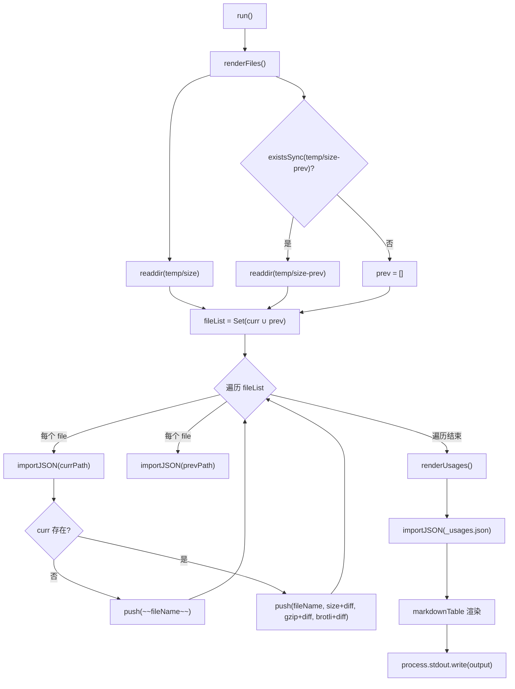
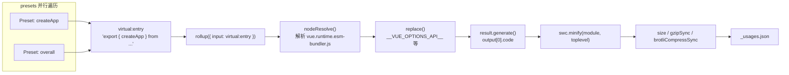

# 第 11 章：平台特定运行时：@vue/runtime-dom 的 DOM 操作与事件绑定

上一章我们看到，Vue 用 GitHub Actions 把 lint、类型检查、测试和体积追踪固化成不可绕过的流水线，其中 size-report.yml 与 size-data.yml 负责在每次改动后留下体积数据。但流水线只负责执行，真正回答「大了多少、大在哪里」的，是本章要拆解的两个脚本。体积预算的核心矛盾在于：包体积是一个只能感知、难以精确归因的指标。用户抱怨「Vue 太大了」时，维护者需要回答三个问题——大了多少？大在哪里？这次改动是否让它更大？scripts/size-report.js 负责对比，scripts/usage-size.js 负责归因，二者共同构成体积预算的度量哲学。

# 11.1 size-report：把体积差异变成可读的 Markdown 表格

## 直觉模型

想象你是一个物流公司的质检员。每个包裹（构建产物）出库前都要称重，而你的工作不是称重本身，而是把「今天的重量」和「昨天的重量」并排放在一张表上，用加粗的 `+2.3 kB` 标出哪些包裹变重了。若没有这张对比表，维护者只能看到一堆孤立的数字，无法判断某次 PR 是否引入了体积回归。

`size-report.js` 就是这个质检员。它不产生体积数据（那是 `usage-size.js` 和构建脚本的事），它只消费两个目录下的 JSON 文件，生成一份 Markdown 报告。

## 数据结构与目录约定

脚本的核心约定藏在两个常量里。当前数据目录是 `temp/size`，历史基线目录是 `temp/size-prev`。

[FACT:scripts/size-report.js:23-24]

这两个目录的命名不是随意的：`temp/size` 由 `size-data.yml` 工作流在每次运行时生成并上传为 artifact [FACT:.github/workflows/size-data.yml:53-57]，而 `temp/size-prev` 则由 `size-report.yml` 在拉取基线 artifact 后解压得到。目录名本身就是数据流的契约。

脚本定义了三个类型别名，它们精确刻画了 JSON 文件的结构：

[FACT:scripts/size-report.js:8-21]

`SizeResult` 有三个数值字段：`size`（未压缩）、`gzip`、`brotli`。`BundleResult` 在此基础上加了 `file` 字段用于显示文件名。`UsageResult` 则是一个 `Record`，键是 preset 名称，值是 `SizeResult & { name: string }`——注意这里多了一个 `name` 字段，因为 JSON 对象的键在 `Object.values` 之后会丢失，必须把名字冗余存进值里。

## Step-by-Step Walkthrough

主流程极简，只有两步加一次输出：

[FACT:scripts/size-report.js:23-38]

`run()` 先调用 `renderFiles()` 渲染产物文件表格，再调用 `renderUsages()` 渲染使用场景表格，最后把累积在模块级变量 `output` 中的字符串一次性写到 stdout [FACT:scripts/size-report.js:25]。这种「累积字符串再一次性输出」的模式避免了多次 `process.stdout.write` 的拼接开销，也让输出顺序完全可控。

**第一步：收集文件列表并求并集。**

[FACT:scripts/size-report.js:44-49]

`filterFiles` 过滤掉两类文件：以 `_` 开头的（如 `_usages.json`）和以 `.txt` 结尾的（如 `number.txt`、`base.txt`）。这两类文件是元数据，不是体积数据。然后取当前目录和历史目录文件名的并集 `fileList`——用 `Set` 去重。为什么要取并集？因为一个文件可能只存在于历史目录（本次构建删除了该产物），也可能只存在于当前目录（本次构建新增了产物）。两种情况都需要在报告中体现。

**第二步：逐文件对比。**

[FACT:scripts/size-report.js:43-75]

对并集中的每个文件，分别从两个目录尝试导入 JSON。`importJSON` 的实现是「文件不存在返回 undefined」：

[FACT:scripts/size-report.js:112-115]

这里用了动态 `import()` 配合 `with: { type: 'json' }` 导入断言，而不是 `fs.readFileSync` + `JSON.parse`。前者由 Node 的模块加载器处理，后者需要手动处理编码和解析错误。选择 `import()` 的代价是它返回 Promise，所以整个 `renderFiles` 是 async 的。

关键分支在 `if (!curr)`：如果当前目录没有这个文件，说明该产物已被删除，用 Markdown 的删除线语法 `~~fileName~~` 标记 [FACT:scripts/size-report.js:60-61]。否则正常渲染一行，每个数值后面拼接 `getDiff` 的结果。

**第三步：计算差异。**

[FACT:scripts/size-report.js:124-130]

`getDiff` 有三个提前返回点：`prev === undefined` 时返回空串（没有基线，无法比较）；`diff === 0` 时返回空串（无变化，不显示噪音）；否则返回加粗的带符号差值。注意 `prettyBytes(diff)` 对负数也能正确处理，会输出 `-1.2 kB` 这样的形式，而 `sign` 变量只在正数时补 `+`。

**第四步：渲染 usage 表格。**

[FACT:scripts/size-report.js:80-103]

`renderUsages` 与 `renderFiles` 的结构差异值得注意：它直接导入 `_usages.json`，因为 usage 数据固定存在这一个文件里。`Object.values(curr)` 把 Record 转成数组后，通过 `prev?.[usage.name]` 用名字查找历史数据——这正是 `name` 字段冗余存储的原因。`.filter(usage => !!usage)` 这一行实际上是冗余的，因为 `map` 总是返回数组元素，不会产生 falsy 值。

最后用 `markdown-table` 库把二维数组渲染成 Markdown 表格 [FACT:scripts/size-report.js:72-74]。

## 设计思考与踩坑

> **〔设计推断与架构权衡〕**
> **为什么用 `import()` 而非 `readFileSync`？**  动态 `import()` 对 JSON 的导入断言是 Node 20+ 的标准做法，它天然处理了 ESM 环境下的 JSON 加载。代价是无法在同步上下文中使用，且每次导入都会被模块缓存——但在这个一次性脚本中，缓存不是问题。

**`filterFiles` 的 `file[0] !== '_'` 判断。** 这个判断假设文件名非空。如果 `readdir` 返回空字符串（理论上不可能），`file[0]` 是 `undefined`，`undefined !== '_'` 为 true，不会误过滤。这是防御性编程的边界。

**删除产物的处理。** 当某个产物被删除时，报告用删除线标记而非直接移除。这是有意的设计：维护者需要看到「这个文件消失了」，而不是让它静默地从表格中消失。若直接过滤掉，读者会误以为该产物从未存在过。

# 11.2 usage-size：模拟真实用户的引入场景

## 直觉模型

`size-report` 告诉你「完整包有多大」，但这回答不了用户真正关心的问题：「我只用 `createApp`，实际要下载多少代码？」完整包体积包含了大量你可能永远用不到的代码（如 `defineCustomElement`、`Transition`、`KeepAlive`）。`usage-size.js` 的角色就是扮演一个「典型用户」：写一个只 import 特定 API 的虚拟入口文件，用 Rollup 打包，看最终产物有多大。

这就像餐厅不告诉你「厨房里所有食材总重 50 公斤」，而是告诉你「点一份宫保鸡丁，实际用到的食材是 300 克」。

## 数据结构：Preset 数组

脚本的核心数据结构是 `presets` 数组，每个元素描述一个使用场景：

[FACT:scripts/usage-size.js:27-55]

`Preset` 类型有三个字段：`name`（显示名）、`imports`（从 Vue 导入的 API 列表）、可选的 `replace`（额外的编译期替换）。五个 preset 覆盖了从最小到最大的使用场景：

- `createApp (CAPI only)`：只导入 `createApp`，并把 `__VUE_OPTIONS_API__` 替换为 `'false'`，模拟纯组合式 API 用户 [FACT:scripts/usage-size.js:35-40]
- `createApp`：只导入 `createApp`，保留 Options API [FACT:scripts/usage-size.js:35-40]
- `createSSRApp`：SSR 场景 [FACT:scripts/usage-size.js:35-40]
- `defineCustomElement`：Web Components 场景 [FACT:scripts/usage-size.js:35-40]
- `overall`：导入六个核心 API，模拟「全功能」用户 [FACT:scripts/usage-size.js:44-54]

入口文件固定为 runtime-only 的 esm-bundler 产物：

[FACT:scripts/usage-size.js:24-28]

选择 `vue.runtime.esm-bundler.js` 而非完整版 `vue.esm-bundler.js`，是因为运行时版本不含模板编译器，更接近现代构建工具用户的实际情况——他们用 SFC 预编译模板，不需要运行时编译器。

## Step-by-Step Walkthrough

**第一步：并行生成所有 preset 的 bundle。**

[FACT:scripts/usage-size.js:62-69]

`main()` 为每个 preset 创建 `generateBundle` 的 Promise，用 `Promise.all` 并行执行。这里并行是安全的，因为每个 `generateBundle` 调用独立的 `rollup()`，互不共享状态。

**第二步：构造虚拟入口。**

[FACT:scripts/usage-size.js:94-96]

这是整个脚本最精巧的部分。它不写临时文件到磁盘，而是构造一个虚拟模块 ID `virtual:entry`，内容是一个 re-export 语句：`export { createApp } from '/absolute/path/to/vue.runtime.esm-bundler.js'`。注意 `entry` 是绝对路径，因为 Rollup 需要能解析它。

**第三步：配置 Rollup 插件链。**

[FACT:scripts/usage-size.js:98-121]

插件数组的顺序至关重要：

1. **自定义 `usage-size-plugin`**：`resolveId` 拦截 `virtual:entry` 返回自身，`load` 返回虚拟内容 [FACT:scripts/usage-size.js:101-110]。这是 Rollup 虚拟模块的标准模式。

2. **`nodeResolve()`**：解析 `vue.runtime.esm-bundler.js` 内部的 import [FACT:scripts/usage-size.js:111]。

3. **`replace`**：注入编译期常量 [FACT:scripts/usage-size.js:112-119]。

`replace` 插件的配置揭示了 esm-bundler 产物的核心机制：它保留了 `__VUE_OPTIONS_API__`、`__VUE_PROD_DEVTOOLS__` 等运行时标志，由使用者的构建工具替换。这里脚本替用户做了替换：

- `process.env.NODE_ENV` → `"production"`：走生产分支
- `__VUE_PROD_DEVTOOLS__` → `'false'`：关闭 devtools 支持
- `__VUE_PROD_HYDRATION_MISMATCH_DETAILS__` → `'false'`：关闭 hydration 详细报错
- `__VUE_OPTIONS_API__` → `'true'`：默认保留 Options API

然后展开 `...preset.replace`，让 preset 可以覆盖默认值。`createApp (CAPI only)` preset 正是用这个机制把 `__VUE_OPTIONS_API__` 改成 `'false'` [FACT:scripts/usage-size.js:35-40]。

`preventAssignment: true` 防止替换 `obj.process.env.NODE_ENV = x` 这类赋值语句 [FACT:scripts/usage-size.js:117]。

**第四步：生成、压缩、度量。**

[FACT:scripts/usage-size.js:123-134]

`result.generate({})` 产出代码，取 `output[0].code`。然后用 SWC 压缩：

[FACT:scripts/usage-size.js:125-130]

`module: true` 表示输入是 ESM，`toplevel: true` 允许压缩顶层作用域变量名。压缩后分别计算三个指标：`minified.length`（字节长度）、`gzipSync(minified).length`、`brotliCompressSync(minified).length`。

注意这里用的是 `node:zlib` 的同步 API，而非异步版本。在一次性脚本中，同步 API 更简洁，且压缩本身是 CPU 密集操作，异步不会带来并行收益。

**第五步：输出与持久化。**

[FACT:scripts/usage-size.js:62-86]

结果先以人类可读格式打印到控制台，用 `pico` 着色 [FACT:scripts/usage-size.js:62-86]。然后写入 `temp/size/_usages.json`，用 `Object.fromEntries` 把数组转回 Record，键是 preset 名 [FACT:scripts/usage-size.js:81-85]。

`--write` 标志控制是否额外写出每个 preset 的未压缩 bundle 到磁盘 [FACT:scripts/usage-size.js:136-138]，用于调试。

## 设计思考与踩坑

> **〔设计推断与架构权衡〕**
> **为什么用虚拟模块而非临时文件？**  临时文件需要处理路径、清理、并发写入冲突。虚拟模块把入口内容保留在内存中，Rollup 的 `resolveId`/`load` 钩子天然支持这种模式。代价是必须精确匹配 ID，任何拼写错误都会导致 Rollup 报「无法解析入口」。

**`replace` 的 `preventAssignment` 陷阱。** 如果不设 `preventAssignment: true`，`replace` 插件会对 `process.env.NODE_ENV = 'x'` 这样的赋值语句也做替换，产生 `"production" = 'x'` 的语法错误。Vue 源码中确实存在对 `process.env.NODE_ENV` 的赋值（在测试工具中），所以这个选项是必需的。

**`__VUE_OPTIONS_API__` 的默认值选择。** 脚本把默认值设为 `'true'` [FACT:scripts/usage-size.js:116]，而非 `'false'`。这是保守选择：如果用户不配置，Vue 会保留 Options API 支持。`createApp (CAPI only)` preset 显式覆盖为 `'false'`，展示关闭后的体积收益。这个对比本身就是给用户的文档：告诉用户「关掉 Options API 能省多少」。

**并行 `Promise.all` 的失败语义。** 如果任何一个 preset 的打包失败，`Promise.all` 会立即 reject，其他正在进行的打包不会被取消（Rollup 没有提供取消机制）。在 CI 中这意味着一次失败会浪费其他 preset 的计算，但脚本本身会以非零退出码结束，CI 能正确捕获。

# 11.3 从数据到门禁：CI 如何消费这些报告

## 数据流全景

理解这两个脚本，必须把它们放回 CI 流水线中。`size-data.yml` 在 push 到 main/minor 或 PR 时运行 `pnpm run size` [FACT:.github/workflows/size-data.yml:45]，产生 `temp/size` 目录，然后上传为 artifact [FACT:.github/workflows/size-data.yml:53-57]。

对于 PR，它还会额外写入两个元数据文件：

[FACT:.github/workflows/size-data.yml:47-51]

`number.txt` 存 PR 编号，`base.txt` 存目标分支名。这两个文件正是 `size-report.js` 中 `filterFiles` 要过滤掉的 `.txt` 文件 [FACT:scripts/size-report.js:44-45]。它们的存在是为了让下游的 `size-report.yml` 知道「该和哪个基线对比」。

## 基线的获取与对比

`size-report.yml`（上一章已详述）的工作流是：下载当前 PR 的 `size-data` artifact，下载目标分支的基线 artifact，把基线解压到 `temp/size-prev`，然后运行 `size-report.js` 生成 Markdown 报告并评论到 PR。

这里有一个关键的设计约束：`size-report.js` 本身不负责获取基线，它假设 `temp/size-prev` 已经存在。如果不存在，`existsSync(prevDir)` 返回 false，`prev` 为空数组 [FACT:scripts/size-report.js:48]，所有 diff 都为空串。这是优雅降级：没有基线时报告仍然生成，只是不显示差异。

## 体积门禁的判定逻辑

> **〔设计推断与架构权衡〕**
> 需要澄清一个常见误解：`size-report.js` 本身不做门禁判定。它只生成报告，不返回退出码，不设置阈值。真正的门禁发生在 `size-report.yml` 工作流层面——它可能包含一个步骤，解析报告中的 diff 值，如果超过阈值则让 job 失败。

这种「度量与判定分离」的设计有深刻理由：度量脚本应该保持纯粹，只负责产生事实；判定逻辑应该在工作流层面，因为阈值可能随版本、分支、发布阶段而变化。把阈值硬编码进 `size-report.js` 会让它难以复用。

# 设计思考

**为什么体积预算需要两套度量？** 完整包体积和 usage 体积回答不同问题。完整包体积是「上限」——它告诉你最坏情况下用户要下载多少。usage 体积是「典型值」——它告诉你大多数用户实际下载多少。两者结合才能给出完整的体积画像。如果只有完整包体积，维护者会倾向于过度优化冷门 API；如果只有 usage 体积，可能忽略某些边缘场景的体积爆炸。

**gzip 与 brotli 双指标的意义。** 现代 CDN 普遍支持 brotli，但并非所有场景都启用。同时报告两者，让维护者能评估「在只支持 gzip 的环境下体积如何」。brotli 通常比 gzip 小 15-20%，这个差距本身就是有价值的信息。

**数据格式的稳定性契约。** `size-report.js` 和 `usage-size.js` 通过 JSON 文件解耦。`usage-size.js` 写 `_usages.json`，`size-report.js` 读它。这个契约的字段名（`name`、`size`、`gzip`、`brotli`）是隐式的，没有 schema 校验。如果 `usage-size.js` 改了字段名而忘记同步 `size-report.js`，报告会静默显示错误数据。这是当前设计的脆弱点。

# 本章小结

# 本章思考与自测

Q1: `size-report.js` 的 `filterFiles` 过滤掉以 `_` 开头的文件。如果 `usage-size.js` 把输出文件从 `_usages.json` 改名为 `usages.json`，会发生什么？

**参考解析**：`filterFiles` 的过滤条件是 `file[0] !== '_' && !file.endsWith('.txt')` [FACT:scripts/size-report.js:44-45]。如果文件改名为 `usages.json`，它不再以 `_` 开头，会被 `filterFiles` 保留，进入 `fileList` 并集。然后 `renderFiles` 会尝试把它当作 bundle 文件处理：`importJSON` 能成功导入（它是合法 JSON），但它的结构是 `Record<string, UsageResult>` 而非 `BundleResult`，所以 `curr?.file` 是 `undefined`，`fileName` 为空串，`curr.size` 也是 `undefined`，`prettyBytes(undefined)` 会抛错或输出异常。这会导致报告生成失败。这个问题的根源是 `filterFiles` 用文件名前缀作为「元数据 vs 数据」的区分依据，而非用目录结构或显式清单。更健壮的做法是把 usage 数据放在子目录中，或维护一个显式的元数据文件列表。

Q2: `usage-size.js` 中 `Promise.all(tasks)` 并行执行所有 preset 的打包。如果某个 preset 的 `replace` 配置遗漏了 `__VUE_OPTIONS_API__`，会发生什么？为什么默认值设为 `'true'` 而非 `'false'`？

**参考解析**：`replace` 插件的配置中，`__VUE_OPTIONS_API__: 'true'` 是默认值，然后展开 `...preset.replace` 允许覆盖 [FACT:scripts/usage-size.js:116-118]。如果某个 preset 遗漏了配置，它会使用默认值 `'true'`，即保留 Options API 支持，体积会偏大。默认值设为 `'true'` 是保守选择：它反映「用户不配置时的实际行为」。Vue 的 esm-bundler 产物中，`__VUE_OPTIONS_API__` 的默认行为就是保留 Options API（除非用户显式关闭）。如果把默认值设为 `'false'`，所有未显式配置的 preset 都会显示偏小的体积，误导用户以为「不配置就能省体积」。`createApp (CAPI only)` preset 显式设为 `'false'` [FACT:scripts/usage-size.js:35-40]，正是为了展示「显式关闭后的收益」，与默认值形成对比。

Q3: `size-report.js` 的 `importJSON` 使用动态 `import()` 而非 `fs.readFileSync`。如果 `temp/size-prev` 目录中的某个 JSON 文件损坏（非法 JSON），两种实现的行为有何不同？

**参考解析**：动态 `import()` 在解析非法 JSON 时会抛出 `SyntaxError`，且这个错误无法被 `importJSON` 内部的 `existsSync` 检查捕获——`existsSync` 只检查文件是否存在，不检查内容合法性 [FACT:scripts/size-report.js:112-115]。错误会向上传播到 `renderFiles`，导致整个报告生成失败。如果用 `fs.readFileSync` + `JSON.parse`，同样会抛错，但可以在 `importJSON` 内部用 try-catch 包裹，返回 `undefined` 实现优雅降级。当前实现选择让错误传播，隐含假设是「artifact 中的 JSON 一定是合法的」——这个假设在 CI 环境中通常成立，因为文件是由 `usage-size.js` 和构建脚本生成的。但在本地调试时，如果手动修改了 JSON 文件导致损坏，报告会直接崩溃而非跳过该文件。这是一个「信任数据源」的设计选择。

---

体积预算机制解决了「度量什么」和「如何对比」的问题，但它依赖一个前提：构建产物本身是可复现的。下一章将进入最小调试沙盒：`vite-debug` 如何用最少的配置启动一个可交互的 Vue 开发环境，以及它如何与本地构建产物联动，形成从源码修改到运行时验证的闭环。

至此，体积预算的度量闭环已经清晰：size-report.js 用目录对比回答「大了多少」，usage-size.js 用虚拟模块模拟真实引入场景回答「大在哪里」，而门禁判定则留给工作流层。这套机制让体积回归从模糊的抱怨变成可追溯的数据。但数据只能告诉你问题存在，要真正定位和修复，还需要一个能快速复现问题的最小环境。下一章将进入 packages-private/vite-debug，看 Vue 如何用 Vite + SFC 搭建一个极简调试沙盒，把「在真实源码上做最小复现」变成可操作的日常实践。
