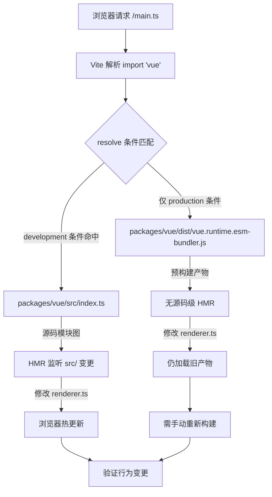

# 第 12 章：开发调试与生态工具链：sfc-playground 与 template-explorer 的工程化支撑

上一章我们完成了体积预算的度量闭环：size-report.js 回答「大了多少」，usage-size.js 回答「大在哪里」，工作流层负责门禁判定。但这套机制有一个隐含前提——构建产物本身是可复现的。当你发现某个包体积异常膨胀，或者某个运行时行为与预期不符时，你需要一个能快速加载本地源码、修改后立即看到效果的最小环境。packages-private/vite-debug 就是这个环境。它只有四个文件、总计不到 40 行代码，却构成了 Vue core 仓库中「在真实源码上做最小复现」的日常实践入口。本章将逐文件拆解这个沙盒的构造逻辑，并解释它为什么被放在 packages-private 而非 packages 目录下。

# 一、沙盒的骨架：`main.ts` 与 `App.vue` 的最小挂载链路

## 直觉模型

如果把整个 Vue 运行时比作一台发动机，那么 `vite-debug` 就是一台「裸机测试台」——没有外壳、没有仪表盘，只有最少的接线让发动机转起来。它的价值不在于功能完整，而在于**排除一切干扰变量**：当你怀疑某个 bug 出在响应式系统或渲染器内部时，你不会希望调试环境本身的复杂度成为噪音源。

## 数据结构与文件布局

先看 `main.ts` 的全部内容：

[FACT:packages-private/vite-debug/main.ts:4-4](https://github.com/vuejs/core/blob/4ab865a848a1da3d10fb674f857e5fff13094644/packages-private/vite-debug/main.ts#L4-L4)

```ts
import { createApp } from 'vue'
import App from './App.vue'

const app = createApp(App)

app.mount('#app')
```

这六行代码是 Vue 应用启动的标准范式，但每一行在调试场景下都有精确的工程含义：

- **L1** 的 `import { createApp } from 'vue'` 中，`'vue'` 这个模块标识符最终解析到什么，完全由 `vite.config.ts` 和 `package.json` 的依赖声明决定。这是整个沙盒最关键的一环——我们稍后会看到它如何被指向本地源码。
- **L2** 的 `import App from './App.vue'` 触发了 `@vitejs/plugin-vue` 的 SFC 编译管线：Vite 在 dev server 启动时注册了这个插件，当浏览器请求 `App.vue` 时，插件将其拆解为 `<script>`、`<template>`、`<style>` 三个虚拟模块分别编译。
- **L4** 的 `createApp(App)` 创建应用实例，此时 Vue 内部会初始化 `app._context`、`app._instance` 等核心字段，但尚未触发任何渲染。
- **L6** 的 `app.mount('#app')` 是真正的启动开关：它会查找 DOM 中 id 为 `app` 的容器元素，创建根组件实例，触发首次渲染。

注意这里没有 `index.html` 的引用——Vite 的约定是项目根目录下的 `index.html` 作为入口 HTML，其中包含 `<div id="app"></div>` 和 `<script type="module" src="/main.ts"></script>`。这个文件虽然不在本章的 keyFiles 中，但它是 `app.mount('#app')` 能成功的前提。

## 场景驱动的 Walkthrough：一次点击的完整链路

现在看 `App.vue`，它是这个沙盒的「实验载体」：

[FACT:packages-private/vite-debug/App.vue:4-8](https://github.com/vuejs/core/blob/4ab865a848a1da3d10fb674f857e5fff13094644/packages-private/vite-debug/App.vue#L4-L8)

```vue

import { ref } from 'vue'

const count = ref(0)

  {{ count }}

button {
  color: red;
}

```

代入一个具象场景：**当用户在浏览器中点击按钮时，发生了什么？**

**第一步：SFC 编译期（dev server 启动时）**

`@vitejs/plugin-vue` 将 `App.vue` 编译为三个部分：

- `<script setup>` 块被编译为组件的 `setup()` 函数，`ref(0)` 调用返回一个 `RefImpl` 对象，其 `.value` 初始为 `0`。
- `<template>` 块被编译为渲染函数，`{{ count }}` 被转换为 `_toDisplayString(count.value)`，`@click="count++"` 被转换为 `onClick: $event => (count.value++)`。
- `<style>` 块被编译为 CSS 模块，通过 `<style>` 标签注入 DOM。

**第二步：首次渲染（`app.mount` 调用时）**

`createApp(App)` 返回的 app 实例在 `mount('#app')` 时，会创建根组件的 `ComponentInternalInstance`，执行 `setup()` 得到 `count` 的 RefImpl，然后调用渲染函数生成 VNode 树。渲染函数中读取 `count.value` 会触发 `track` 收集依赖——当前活跃的渲染副作用（`ReactiveEffect`）被记录到 `count` 的 `dep` 中。

**第三步：点击事件（用户交互时）**

浏览器触发 `click` 事件，Vue 的事件处理器执行 `count.value++`。这是一个 setter 操作，触发 `trigger`：遍历 `count.dep` 中收集的副作用，调度重新渲染。由于是同步更新且不在批量队列中，渲染副作用被立即执行，重新调用渲染函数，生成新的 VNode，与旧 VNode 进行 diff，发现文本内容从 `0` 变为 `1`，更新真实 DOM 的 `textContent`。

整个链路可以用下面的数据流图表示：

```mermaid
flowchart LR
    subgraph compile["编译期 (Vite Dev Server)"]
        sfc["App.vue"] -->|"@vitejs/plugin-vue"| script["setup() 函数"]
        sfc -->|"@vitejs/plugin-vue"| render["渲染函数"]
        sfc -->|"@vitejs/plugin-vue"| style["CSS 模块"]
    end
    subgraph runtime["运行时 (浏览器)"]
        script -->|"ref(0)"| refimpl["RefImpl { value: 0 }"]
        render -->|"读取 count.value"| track["track() 收集依赖"]
        click["用户点击"] -->|"count.value++"| trigger["trigger() 触发更新"]
        trigger -->|"调度渲染副作用"| rerender["重新执行渲染函数"]
        rerender -->|"diff + patch"| dom["更新真实 DOM"]
    end
    track -.->|"dep 记录 ReactiveEffect"| trigger
```

这张图的关键在于：**编译期产物和运行时行为之间的耦合点只有两个**——`ref(0)` 返回的 RefImpl 对象，以及渲染函数中对 `count.value` 的读写。这意味着如果你想调试响应式系统的某个分支（比如 `trigger` 中的调度逻辑），你只需要在这个 `App.vue` 中构造对应的读写模式即可。

## 设计思考：为什么是 `ref` 而不是 `reactive`？

> **〔设计推断与架构权衡〕**
> 选择 `ref(0)` 而非 `reactive({ count: 0 })` 作为默认示例，隐含了一个调试优先的考量：`ref` 的 `.value` 访问路径更短，在调试器中展开 `RefImpl` 对象时能直接看到 `_value`、`dep`、`__v_isRef` 等内部字段，而 `reactive` 返回的 Proxy 对象在控制台中展开会触发 getter，可能干扰对原始状态的观察。对于「最小复现」场景，减少一层 Proxy 间接层意味着更少的变量。

---

# 二、别名解析：`vite.config.ts` 与 `package.json` 如何把 `'vue'` 指向本地源码

## 直觉模型

`vite.config.ts` 只有六行，但它是整个沙盒的「路由中枢」——决定了 `import { createApp } from 'vue'` 中的 `'vue'` 最终加载的是 npm 上的发布版本，还是仓库中正在开发的源码。如果没有正确的别名配置，你在 `App.vue` 中修改的代码可能根本没有触发你正在调试的那份 Vue 源码，调试就变成了「对着错误的靶子开枪」。

## 数据结构与解析链路

先看 `vite.config.ts`：

[FACT:packages-private/vite-debug/vite.config.ts:4-6](https://github.com/vuejs/core/blob/4ab865a848a1da3d10fb674f857e5fff13094644/packages-private/vite-debug/vite.config.ts#L4-L6)

```ts
import { defineConfig } from 'vite'
import vue from '@vitejs/plugin-vue'

export default defineConfig({
  plugins: [vue()],
})
```

这里**没有显式的 `resolve.alias` 配置**。那么 `'vue'` 是如何被解析到本地源码的？答案在 `package.json` 中：

[FACT:packages-private/vite-debug/package.json:1-15](https://github.com/vuejs/core/blob/4ab865a848a1da3d10fb674f857e5fff13094644/packages-private/vite-debug/package.json#L1-L15)

```json
{
  "name": "vite-debug",
  "private": true,
  "type": "module",
  "scripts": {
    "dev": "vite",
    "build": "vite build",
    "serve": "vite preview"
  },
  "devDependencies": {
    "@vitejs/plugin-vue": "catalog:",
    "vite": "catalog:",
    "vue": "workspace:*"
  }
}
```

关键在 **L13**：`"vue": "workspace:*"`。这是 pnpm workspace 协议的声明，表示 `vite-debug` 依赖的是 monorepo 中名为 `vue` 的本地包，而非 npm registry 上的版本。pnpm 会在 `node_modules/vue` 创建符号链接，指向 `packages/vue`（Vue 的主包目录）。

但这还不够——`packages/vue` 的 `package.json` 中 `main`/`module`/`exports` 字段通常指向**构建产物**（如 `dist/vue.runtime.esm-bundler.js`），而不是 `src/` 下的源码。如果你修改了 `packages/runtime-core/src/renderer.ts`，但没有重新构建，Vite 加载的仍然是旧的 `dist` 文件。

> **〔设计推断与架构权衡〕**
> 这就是为什么 Vue core 仓库的 `packages/vue/package.json` 中通常会配置 `"development"` 条件导出或类似的源码入口映射——在 dev 模式下，Vite 的 `resolve.conditions` 会优先匹配 `development` 条件，从而加载 `src/index.ts` 而非 `dist`。这个机制使得 `vite-debug` 无需显式配置 alias，就能在修改源码后通过 HMR 立即看到效果。

## 场景驱动的 Walkthrough：一次 `import 'vue'` 的解析过程

代入场景：**当 Vite dev server 收到浏览器对 `main.ts` 的请求，遇到 `import { createApp } from 'vue'` 时，解析链路是怎样的？**



这个流程图揭示了一个关键分支：**如果 `development` 条件没有正确配置，修改源码后浏览器不会热更新**，你会陷入「改了代码但行为没变」的困惑。排查方法是在浏览器 DevTools 的 Network 面板中查看 `vue` 模块的实际加载路径——如果看到 `dist/` 路径，说明源码入口映射未生效。

## 设计思考：为什么不在 `vite.config.ts` 中显式写 alias？

> **〔设计推断与架构权衡〕**
> 一个自然的疑问是：为什么不直接在 `vite.config.ts` 中写 `resolve: { alias: { vue: '../../packages/vue/src/index.ts' } }`？这样做虽然直观，但有两个问题：

1. **破坏子路径导入**：Vue 的公开 API 包含 `vue/server-renderer`、`vue/compiler-sfc` 等子路径。如果只 alias 了 `'vue'` 本身，子路径导入仍然会走 `dist`，导致部分模块来自源码、部分来自产物，行为不一致。

2. **绕过条件导出机制**：Vue 的 `package.json` 中 `exports` 字段已经定义了完整的条件导出映射（`development`/`production`/`browser`/`node` 等），alias 会覆盖这套机制，使得调试环境与真实用户环境的解析行为产生偏差。

因此，`vite-debug` 选择「信任 workspace 协议 + 条件导出」的组合，让解析链路尽可能接近真实使用场景。这也解释了为什么 `package.json` 中 `"vue": "workspace:*"` 是必需的——它是触发 pnpm 符号链接、进而让 Vite 能通过 `node_modules/vue` 找到 `packages/vue` 的前提。

## 生产踩坑：`catalog:` 协议与版本漂移

注意 `package.json` 中 **L11-L12** 使用了 `"catalog:"` 协议：

```json
"@vitejs/plugin-vue": "catalog:",
"vite": "catalog:",
```

这是 pnpm 的 catalog 特性，表示版本号由 `pnpm-workspace.yaml` 中的 `catalog` 字段统一管理。它的作用是**避免 monorepo 中多个包引用同一依赖时出现版本漂移**。

> **〔设计推断与架构权衡〕**
> 在调试场景下，这带来一个隐蔽的陷阱：如果你在 `vite-debug` 中遇到一个疑似 Vite 或 plugin-vue 的 bug，想临时升级版本验证，直接修改 `package.json` 中的 `catalog:` 是无效的——你需要修改 `pnpm-workspace.yaml` 中的 catalog 定义，这会影响所有使用该 catalog 的包。正确的做法是临时改为显式版本号（如 `"vite": "5.0.0"`），验证完毕后再改回 `catalog:`。

---

# 三、`packages-private` 的隔离设计：为什么调试沙盒不对外发布

## 直觉模型

`packages-private` 目录就像公司的「内部试验室」——里面的样品不对外销售，只用于测试和演示。它与 `packages` 目录物理隔离，避免调试代码被误发布到 npm。

## 隔离机制的三层保障

**第一层：目录隔离**

`packages-private/vite-debug` 不在 `packages/` 下，而 `pnpm-workspace.yaml` 通常会将 `packages/*` 和 `packages-private/*` 都声明为 workspace 成员，但发布脚本（如 `scripts/release.js`）只会遍历 `packages/` 下的包。

**第二层：`private: true`**

[FACT:packages-private/vite-debug/package.json:3](https://github.com/vuejs/core/blob/4ab865a848a1da3d10fb674f857e5fff13094644/packages-private/vite-debug/package.json#L3)

```json
"private": true,
```

这一行是 npm/pnpm 的硬性约束：标记为 `private` 的包**永远无法被 `npm publish` 发布**，即使手动执行也会被拒绝。这是防止误发布的最后一道防线。

**第三层：无 `version` 字段**

注意 `package.json` 中没有 `version` 字段。npm 规范要求可发布的包必须有 `version`，缺少该字段的包在 `npm publish` 时会报错。这是「双重保险」——即使 `private` 被误删，缺少 `version` 仍会阻止发布。

## 设计思考：调试沙盒与 Playground 的分工

Vue core 仓库中已经有一个功能完整的 `SFC Playground`（第 7 章讨论过），为什么还需要 `vite-debug`？

> **〔设计推断与架构权衡〕**
> 两者的定位截然不同：

| 维度 | SFC Playground | vite-debug |
| --- | --- | --- |
| 运行环境 | 浏览器内（编译也在浏览器） | Node.js + 浏览器 |
| 源码加载 | 通过 CDN 或预构建产物 | 直接加载本地源码 |
| 调试能力 | 受限于浏览器沙盒 | 可用 Node.js 调试器、断点 |
| 修改源码 | 不支持 | 支持 HMR |
| 适用场景 | 验证编译输出、分享复现 | 调试运行时内部行为 |

`vite-debug` 的核心价值在于**它运行在真实的 Node.js 环境中**，你可以用 `node --inspect` 附加调试器，在 `packages/reactivity/src/effect.ts` 中打断点，观察 `ReactiveEffect` 的创建和调度过程。这是 Playground 无法提供的。

## 生产踩坑：HMR 边界与状态丢失

> **〔设计推断与架构权衡〕**
> 使用 `vite-debug` 调试时，一个常见的困惑是：修改 `App.vue` 中的 `count` 初始值后，浏览器中的计数没有重置。这是因为 Vite 的 HMR 对 `<script setup>` 块的处理是**保留组件状态、只替换渲染函数**。如果你需要完全重置状态，需要手动刷新页面，或者在 `App.vue` 中添加 `import.meta.hot?.invalidate()` 强制整页刷新。

另一个陷阱是：当你修改 `packages/runtime-core/src/` 下的源码时，HMR 的传播链路可能不会自动触发——因为 `vite-debug` 的 HMR 边界定义在 `App.vue` 层面，而 `packages/` 下的源码变更需要通过 Vite 的模块图传播。如果发现修改源码后浏览器无反应，检查 Vite 终端输出是否有 `hmr update` 日志；如果没有，可能需要重启 dev server。

---

# 本章小结

`packages-private/vite-debug` 用四个文件、不到 40 行代码，构建了一个完整的调试闭环：

1. **`main.ts`** 提供最小挂载链路：`createApp(App).mount('#app')`，排除一切非必要初始化逻辑。

2. **`App.vue`** 作为实验载体：`ref` + 模板插值 + 事件处理，覆盖响应式系统的主路径。

3. **`vite.config.ts` + `package.json`** 通过 `workspace:*` 协议和条件导出，将 `'vue'` 解析到本地源码，实现「改源码即生效」。

4. **`packages-private` + `private: true` + 无 `version`** 三层隔离，确保调试代码不会被误发布。

这个沙盒的工程哲学是：**调试环境本身的复杂度应该趋近于零，把所有的复杂度留给被调试的源码**。当你在 `packages/reactivity` 中遇到一个难以复现的 bug 时，`vite-debug` 提供了一个可以随意修改、立即验证的实验台。

# 本章思考与自测

Q1: 如果将 `package.json` 中的 `"vue": "workspace:*"` 改为 `"vue": "^3.4.0"`，在 `vite-debug` 中修改 `packages/reactivity/src/ref.ts` 后，浏览器中的行为会发生什么变化？为什么？

**参考解析**：改为 `"^3.4.0"` 后，pnpm 会从 npm registry 下载 Vue 3.4.x 的发布版本，而非链接到本地 `packages/vue` [FACT:packages-private/vite-debug/package.json:13](https://github.com/vuejs/core/blob/4ab865a848a1da3d10fb674f857e5fff13094644/packages-private/vite-debug/package.json#L13)。此时 `import { createApp } from 'vue'` 解析到的是 `node_modules/.pnpm/vue@3.4.x/node_modules/vue/dist/vue.runtime.esm-bundler.js`，即预构建产物。修改 `packages/reactivity/src/ref.ts` 不会触发任何 HMR，因为 Vite 的模块图中根本不包含这个文件。浏览器中运行的仍然是 npm 版本的 `ref` 实现。这个实验反向验证了 `workspace:*` 是源码级调试的必要条件。

Q2: `App.vue` 中 `<style>` 块没有加 `scoped`，如果在这个沙盒中同时挂载两个组件实例，样式会发生什么？这与 `vite-debug` 的调试目标有何关系？

**参考解析**：没有 `scoped` 时，`button { color: red }` 是全局样式 [FACT:packages-private/vite-debug/App.vue:4-8](https://github.com/vuejs/core/blob/4ab865a848a1da3d10fb674f857e5fff13094644/packages-private/vite-debug/App.vue#L4-L8)，会作用于页面中所有 `<button>` 元素。如果挂载两个组件实例，两个实例的按钮都会变红。这与调试目标的关系在于：`vite-debug` 的定位是「最小复现」，而非「样式隔离验证」。省略 `scoped` 减少了编译期注入 `data-v-xxx` 属性的变量，使得调试器中的 DOM 结构更干净。如果你需要调试 `scoped` 样式的编译逻辑，应该显式添加 `scoped` 并观察 `@vitejs/plugin-vue` 生成的属性注入代码。

Q3: 假设你在 `packages/runtime-core/src/renderer.ts` 的 `patch` 函数中加了一行 `console.log`，但浏览器控制台没有输出。请列出至少三种可能的原因，并说明如何逐一排查。

**参考解析**：

原因一：**源码入口未生效**。`'vue'` 解析到了 `dist` 产物而非 `src`。排查：在 DevTools Network 面板查看 `vue` 模块的加载路径，如果是 `dist/` 开头，说明条件导出未命中 `development` 条件 [FACT:packages-private/vite-debug/package.json:13](https://github.com/vuejs/core/blob/4ab865a848a1da3d10fb674f857e5fff13094644/packages-private/vite-debug/package.json#L13)。

原因二：**HMR 未传播**。Vite 的模块图没有将 `packages/runtime-core/src/renderer.ts` 的变更传播到 `vite-debug`。排查：查看 Vite 终端是否有 `hmr update` 日志；如果没有，重启 dev server。

原因三：**`patch` 函数未被调用**。如果当前页面没有触发任何 DOM 更新（比如没有点击按钮），`patch` 可能只在首次挂载时执行一次，而首次挂载发生在你添加 `console.log` 之前。排查：刷新页面，或在 `App.vue` 中添加一个触发更新的操作。

原因四（补充）：**构建缓存**。Vite 的依赖预构建缓存（`node_modules/.vite`）可能仍然使用旧版本。排查：删除 `node_modules/.vite` 后重启。

---

体积预算告诉你「问题存在」，`vite-debug` 让你「亲手复现问题」。但当你试图把这个沙盒模式推广到整个 monorepo 时，会遇到一系列边界条件：workspace 协议在 CI 环境下的解析差异、`catalog:` 版本锁定的升级困境、`packages-private` 与 `packages` 之间的依赖方向约束……下一章将进入架构权衡与避坑指南，系统梳理 monorepo 工程化在真实项目中暴露的边界条件。

至此，我们完成了从体积度量到最小复现的工程闭环：vite-debug 用极简的四个文件，把「在真实源码上快速验证」变成了日常可用的实践。但当你真正开始复刻这套体系时，会发现更多隐藏的权衡——为什么 packages-private 必须与 packages 物理隔离？为什么枚举内联必须在 Rollup 之前完成？下一章将汇总前十二章暴露的关键决策点与生产踩坑记录，为你提供一份完整的避坑清单与决策依据。
